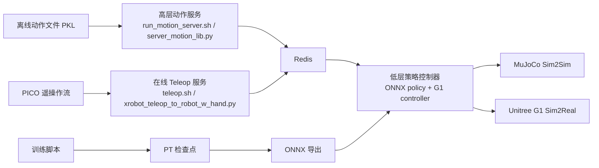

**你当前位于「快速开始」中的起点页面 [概览](1-gai-lan)**。这一页只回答三个最基础的问题：TWIST2 是什么、这个仓库大致由哪些部分组成、第一次阅读时应该先看哪里；它不会展开安装细节、运行命令细节、训练机制细节或部署协议细节，这些内容会分别引导到后续页面。Sources: [README.md](README.md#L1-L31)

TWIST2 在仓库首页被定义为一个**可扩展、可移植、面向人形机器人的整体数据采集与控制系统**；从 README 的安装与使用说明可以直接看到，它同时覆盖了**控制器训练、控制器部署、在线遥操作、动作数据处理**几条链路，而不是单一的训练项目或单一的部署项目。Sources: [README.md](README.md#L1-L31) [README.md](README.md#L31-L184) [README.md](README.md#L186-L303)

## 先用一句话理解这个仓库

对初学者来说，可以把 TWIST2 理解成一条从**动作来源**到**机器人执行**的完整通路：动作既可以来自离线动作文件，也可以来自 PICO 遥操作；这些高层动作会通过服务送入低层控制器；低层控制器再在仿真或实机上执行；与此同时，仓库还提供训练脚本、评测脚本、ONNX 导出和 GUI 控制中心来支撑整个流程。Sources: [README.md](README.md#L186-L303) [deploy_real/server_motion_lib.py](deploy_real/server_motion_lib.py#L101-L200) [deploy_real/server_low_level_g1_sim.py](deploy_real/server_low_level_g1_sim.py#L84-L200) [evaluate_model.py](evaluate_model.py#L1-L16) [gui.py](gui.py#L652-L713)

## 这个仓库解决的不是“一个程序”，而是“一整套工作流”

从安装说明可以确认，项目显式拆成两个 Conda 环境：`twist2` 负责训练、部署和数据采集，`gmr` 负责在线动作重定向；从使用说明又能看到，仓库同时支持训练、导出 ONNX、Sim2Sim 验证、Sim2Real 验证、在线 Teleop 与 GUI 管理。因此，阅读这个仓库时更适合按**工作流**理解，而不是按“某个主入口文件”理解。Sources: [README.md](README.md#L31-L56) [README.md](README.md#L129-L180) [README.md](README.md#L186-L303)

## TWIST2 的最小架构图

下面这张图只保留新手最需要知道的主干：**动作源 → 高层动作服务 → 低层策略控制 → 仿真/实机执行**。图中的 Redis 之所以出现，是因为仿真控制脚本和动作服务脚本都直接创建了 Redis 客户端，用来交换状态与动作。Sources: [deploy_real/server_motion_lib.py](deploy_real/server_motion_lib.py#L101-L200) [deploy_real/server_low_level_g1_sim.py](deploy_real/server_low_level_g1_sim.py#L97-L108) [README.md](README.md#L215-L303)



## 你会在仓库里看到的四类核心能力

| 能力类别 | 你能做什么 | 典型入口 | 适合什么时候看 |
|---|---|---|---|
| 快速验证 | 用官方 ONNX 和示例动作检查系统是否跑通 | `sim2sim.sh`、`run_motion_server.sh` | 第一次接触仓库 |
| 遥操作 | 用 PICO 在线驱动动作流并控制机器人 | `teleop.sh`、`doc/TELEOP.md` | 想理解实际采集链路 |
| 训练与导出 | 训练 student policy，并导出 ONNX | `train.sh`、`to_onnx.sh` | 需要自己训练模型 |
| 统一管理 | 用图形界面启动常用服务 | `gui.sh`、`gui.py` | 不想手动开多个终端 |

Sources: [README.md](README.md#L192-L303) [sim2sim.sh](sim2sim.sh#L1-L15) [teleop.sh](teleop.sh#L1-L21) [train.sh](train.sh#L1-L70) [gui.sh](gui.sh#L1-L5) [doc/TELEOP.md](doc/TELEOP.md#L1-L84)

## 面向新手的仓库地图

如果把这个仓库看成一个“系统工程仓库”，可以先记住下面这几个区域：根目录脚本负责**常用入口**，`deploy_real/` 负责**部署、遥操作与数据服务**，`legged_gym/` 负责**机器人环境与训练入口**，`rsl_rl/` 负责**强化学习算法与模型模块**，`pose/` 负责**动作库与姿态工具**，`assets/` 负责**检查点、示例动作与 G1 资产**。这个划分不是猜测，而是能从各目录下的入口文件与 setup 信息直接验证出来。Sources: [README.md](README.md#L46-L56) [README.md](README.md#L124-L126) [legged_gym/setup.py](legged_gym/setup.py#L1-L15) [rsl_rl/setup.py](rsl_rl/setup.py#L1-L17) [pose/setup.py](pose/setup.py#L1-L11)

```text
TWIST2/
├── assets/                 # 官方 ONNX、示例动作、G1 机器人模型
├── deploy_real/            # 仿真部署、实机部署、Teleop、数据录制
├── legged_gym/             # 机器人环境与训练脚本
├── rsl_rl/                 # RL 算法、策略模块、runner
├── pose/                   # 动作库与姿态/运动学工具
├── doc/                    # 遥操作与机器人补充说明
├── evaluate_model.py       # 统一评测入口
├── train.sh                # 训练入口
├── sim2sim.sh              # 仿真部署入口
├── sim2real.sh             # 实机部署入口
├── teleop.sh               # PICO 遥操作入口
└── gui.sh                  # 图形控制中心入口
```

## 这几个入口脚本分别扮演什么角色

| 入口 | 作用 | 直接指向的能力 |
|---|---|---|
| `train.sh` | 启动学生策略训练，默认任务为 `g1_stu_future` | 训练 |
| `sim2sim.sh` | 加载官方 ONNX，在 MuJoCo 中运行低层控制器 | 最小仿真验证 |
| `sim2real.sh` | 加载官方 ONNX，连接网络接口并下发到 G1 实机控制服务 | 实机部署 |
| `teleop.sh` | 启动在线 Teleop，将 PICO 动作流发送到系统 | 在线遥操作 |
| `gui.sh` | 启动 GUI，集中管理多个服务进程 | 可视化运维 |
| `evaluate_model.py` | 用统一方式评测 PT/ONNX 模型 | 模型评测 |

Sources: [train.sh](train.sh#L24-L69) [sim2sim.sh](sim2sim.sh#L1-L15) [sim2real.sh](sim2real.sh#L3-L21) [teleop.sh](teleop.sh#L3-L21) [gui.sh](gui.sh#L1-L5) [evaluate_model.py](evaluate_model.py#L1-L16)

## 一个最重要的认知：高层动作和低层控制是分开的

README 在 Sim2Sim 说明里明确写到，仓库将**高层控制**与**低层控制**分开：低层控制器先启动，此时机器人默认保持站立；随后再由高层动作流接管，这个动作流既可以来自离线 motion server，也可以来自在线 PICO teleop。对新手来说，这一点非常关键，因为它解释了为什么仓库里会同时存在 `run_motion_server.sh`、`teleop.sh`、`sim2sim.sh`、`sim2real.sh` 这些看起来彼此独立的脚本。Sources: [README.md](README.md#L215-L229) [README.md](README.md#L241-L303)

从代码实现上也能看到这种分层：`server_motion_lib.py` 负责把动作库重建为 mimic 观测并循环发布；`server_low_level_g1_sim.py` 则负责加载 ONNX 策略、建立 MuJoCo 仿真、维护 29 自由度控制配置并消费动作信息；两者都连接 Redis，但职责不同，一个更像“动作参考提供者”，另一个更像“策略执行者”。Sources: [deploy_real/server_motion_lib.py](deploy_real/server_motion_lib.py#L20-L98) [deploy_real/server_motion_lib.py](deploy_real/server_motion_lib.py#L101-L200) [deploy_real/server_low_level_g1_sim.py](deploy_real/server_low_level_g1_sim.py#L21-L60) [deploy_real/server_low_level_g1_sim.py](deploy_real/server_low_level_g1_sim.py#L84-L200)

## 为什么仓库里既有训练框架，又有部署服务

从 `legged_gym/setup.py`、`rsl_rl/setup.py` 和 `pose/setup.py` 可以直接看出，这个仓库不是一个单脚本项目，而是由多个可安装子项目组成：`legged_gym` 提供 Isaac Gym 训练环境，`rsl_rl` 提供 RL 算法与模块，`pose` 提供动作/姿态相关能力；与此同时，根目录和 `deploy_real/` 中又提供了围绕 MuJoCo、Redis、ONNXRuntime、Teleop 的部署脚本。这说明 TWIST2 的仓库目标是把**研究训练**与**部署验证**放在同一个代码基座里。Sources: [legged_gym/setup.py](legged_gym/setup.py#L1-L15) [rsl_rl/setup.py](rsl_rl/setup.py#L1-L17) [pose/setup.py](pose/setup.py#L1-L11) [README.md](README.md#L31-L56) [README.md](README.md#L186-L303)

## 初学者最容易先抓住的三个“实物”

如果你还不熟悉强化学习或机器人控制，先不要急着读环境代码。仓库已经给了三个最容易上手的“实物”：一是官方 ONNX 检查点 `assets/ckpts/twist2_1017_20k.onnx`，二是示例动作 `assets/example_motions`，三是 G1 机器人模型资产 `assets/g1`。这三类资源共同支撑了“先验证、后理解”的阅读方式。Sources: [README.md](README.md#L122-L129) [README.md](README.md#L186-L188) [sim2sim.sh](sim2sim.sh#L1-L15)

| 资源 | 位置 | 用途 |
|---|---|---|
| 官方策略检查点 | `assets/ckpts/` | 直接做部署验证，无需先训练 |
| 示例动作 | `assets/example_motions/` | 做离线动作回放或最小链路验证 |
| G1 机器人模型 | `assets/g1/` | 提供仿真 XML、URDF 与相关模型文件 |

Sources: [README.md](README.md#L122-L129) [sim2sim.sh](sim2sim.sh#L1-L8)

## GUI 为什么值得新手优先知道

对于第一次接触这个仓库的人，`gui.py` 很有代表性，因为它把作者认为最常用的流程都做成了面板：低层部分有 **Sim2Sim Deploy** 和 **Sim2Real Deploy**，高层部分有 **Offline Motion** 和 **Online Teleop**，还有 **Data Recording**。也就是说，GUI 本身已经把这个仓库的主流程暴露出来了：先有低层执行，再配高层动作，再配录制与辅助服务。Sources: [gui.py](gui.py#L619-L713) [README.md](README.md#L290-L303)

## 阅读这份仓库时，建议采用的顺序

如果你的目标是“先知道这仓库能干什么”，建议下一步读 [快速上手](2-kuai-su-shang-shou)；如果你的目标是“先把环境装起来”，从 [双 Conda 环境与核心依赖安装](3-shuang-conda-huan-jing-yu-he-xin-yi-lai-an-zhuang) 开始；如果你的目标是“先做一次最小成功运行”，优先看 [使用示例动作与官方 ONNX 检查点完成最小验证](6-shi-yong-shi-li-dong-zuo-yu-guan-fang-onnx-jian-cha-dian-wan-cheng-zui-xiao-yan-zheng)。这些路径都与 README 中的安装、Sim2Sim、Teleop、GUI 说明一一对应。Sources: [README.md](README.md#L31-L184) [README.md](README.md#L215-L303)

## 按目标选择下一页

| 你的目标 | 下一页 |
|---|---|
| 先建立整体操作感 | [快速上手](2-kuai-su-shang-shou) |
| 先配置依赖环境 | [双 Conda 环境与核心依赖安装](3-shuang-conda-huan-jing-yu-he-xin-yi-lai-an-zhuang) |
| 先把 Redis、MuJoCo、ONNXRuntime 配好 | [Isaac Gym、MuJoCo、Redis 与 ONNXRuntime 配置](4-isaac-gym-mujoco-redis-yu-onnxruntime-pei-zhi) |
| 先跑一个最小可工作的 Demo | [使用示例动作与官方 ONNX 检查点完成最小验证](6-shi-yong-shi-li-dong-zuo-yu-guan-fang-onnx-jian-cha-dian-wan-cheng-zui-xiao-yan-zheng) |
| 先理解 Teleop 链路 | [启动遥操作链路：PICO 串流、姿态校准与控制按键](8-qi-dong-yao-cao-zuo-lian-lu-pico-chuan-liu-zi-tai-xiao-zhun-yu-kong-zhi-an-jian) |
| 先理解训练入口 | [学生策略训练命令与常用脚本入口](10-xue-sheng-ce-lue-xun-lian-ming-ling-yu-chang-yong-jiao-ben-ru-kou) |

Sources: [README.md](README.md#L192-L303) [doc/TELEOP.md](doc/TELEOP.md#L1-L84) [train.sh](train.sh#L1-L70)

## 本页总结

作为总入口页，你现在只需要记住四件事：**TWIST2 是一个覆盖训练、遥操作、部署与数据采集的整体系统；仓库按工作流而不是按单程序组织；高层动作服务与低层控制器是分离的；官方已经提供了可直接验证的 ONNX、示例动作与 GUI。**当你准备动手时，继续前往 [快速上手](2-kuai-su-shang-shou) 即可。Sources: [README.md](README.md#L122-L129) [README.md](README.md#L186-L303) [deploy_real/server_motion_lib.py](deploy_real/server_motion_lib.py#L101-L200) [deploy_real/server_low_level_g1_sim.py](deploy_real/server_low_level_g1_sim.py#L84-L200) [gui.py](gui.py#L652-L713)