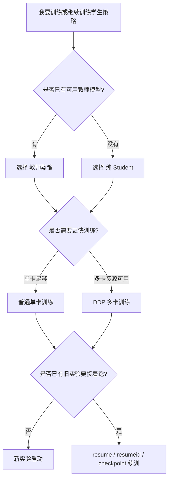
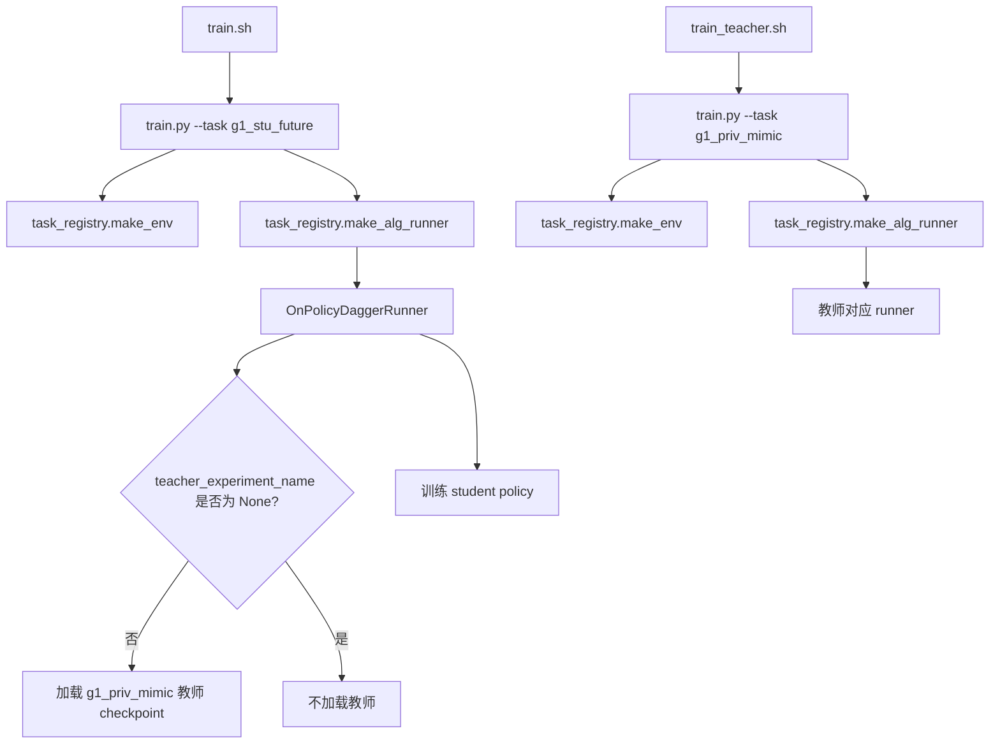
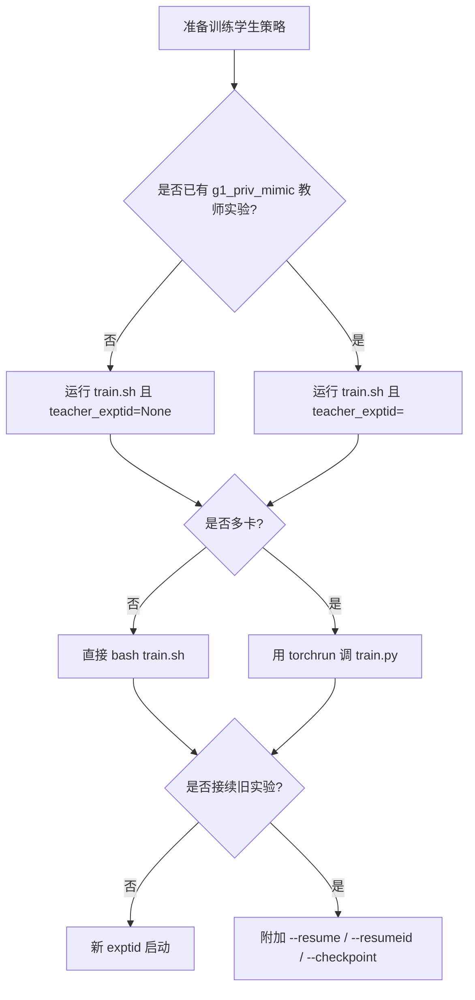

本页只回答一个实际问题：当你准备训练 `g1_stu_future` 系列策略时，应该选择**先训教师再蒸馏**、**直接纯 Student**，还是在已有实验基础上做 **DDP 多卡训练或断点续训**。从仓库实现看，三条路径共享同一个 Python 训练入口 `legged_gym/legged_gym/scripts/train.py`，但在 **task 名称、runner 类型、teacher 是否加载、是否启用 torchrun 环境变量、是否从旧 checkpoint 恢复** 这些关键开关上分流。Sources: [train.sh](train.sh#L24-L69), [train_teacher.sh](train_teacher.sh#L18-L45), [legged_gym/legged_gym/scripts/train.py](legged_gym/legged_gym/scripts/train.py#L41-L153)

## 先建立判断框架

在当前仓库中，教师策略与学生策略不是同一个 task。教师训练脚本 `train_teacher.sh` 固定把任务设为 `g1_priv_mimic`；学生训练脚本 `train.sh` 固定把任务设为 `g1_stu_future`。同时，`g1_stu_future` 的训练配置明确使用 `OnPolicyDaggerRunner + DaggerPPO + ActorCriticFuture`，并带有 `teacher_experiment_name`、`teacher_proj_name='g1_priv_mimic'`、`teacher_checkpoint` 等字段，这说明学生路径天然支持“加载教师做蒸馏”，而不是单独再开一套入口。Sources: [train_teacher.sh](train_teacher.sh#L18-L45), [train.sh](train.sh#L24-L69), [legged_gym/legged_gym/envs/__init__.py](legged_gym/legged_gym/envs/__init__.py#L80-L119), [legged_gym/legged_gym/envs/g1/g1_mimic_future_config.py](legged_gym/legged_gym/envs/g1/g1_mimic_future_config.py#L164-L191)

从实现细节看，`train.sh` 并不区分“学生蒸馏训练”和“纯 Student 训练”两套脚本，而是通过 `--teacher_exptid` / `--teacher_checkpoint` 传给配置覆盖逻辑；`OnPolicyDaggerRunner` 初始化时如果 `teacher_experiment_name` 不在 `["None", "dummy", None]` 且未开启 `eval_student`，就会真的去 `logs/<teacher_proj>/<teacher_exptid>/model_xxx.pt` 加载教师模型，否则打印“只评估 student，不加载 teacher，KL loss disabled”。这意味着**纯 Student 与蒸馏 Student 的本质差异是：是否提供有效的教师实验 ID**。Sources: [legged_gym/legged_gym/gym_utils/helpers.py](legged_gym/legged_gym/gym_utils/helpers.py#L270-L303), [rsl_rl/rsl_rl/runners/on_policy_dagger_runner.py](rsl_rl/rsl_rl/runners/on_policy_dagger_runner.py#L89-L121)


上图对应的是代码中的真实分流点：teacher 是否加载由 `teacher_experiment_name` 决定，DDP 是否开启由 `WORLD_SIZE/RANK/LOCAL_RANK` 是否大于 1 决定，续训是否发生由 `runner.resume` 或 `args.resumeid` 决定。Sources: [rsl_rl/rsl_rl/runners/on_policy_dagger_runner.py](rsl_rl/rsl_rl/runners/on_policy_dagger_runner.py#L111-L121), [legged_gym/legged_gym/scripts/train.py](legged_gym/legged_gym/scripts/train.py#L41-L97), [legged_gym/legged_gym/gym_utils/task_registry.py](legged_gym/legged_gym/gym_utils/task_registry.py#L175-L193)

## 三种选择的本质差异

| 选择 | 入口脚本/命令 | task | runner/algorithm | 是否加载 teacher | 典型用途 |
|---|---|---|---|---|---|
| 教师训练 | `bash train_teacher.sh ...` | `g1_priv_mimic` | 普通 mimic 训练链路 | 否 | 先产出教师模型 |
| 学生蒸馏 | `bash train.sh ... <teacher_exptid> <teacher_checkpoint>` | `g1_stu_future` | `OnPolicyDaggerRunner` + `DaggerPPO` | 是 | 用教师引导学生 |
| 纯 Student | `bash train.sh ... None -1` | `g1_stu_future` | `OnPolicyDaggerRunner` + `DaggerPPO` | 否 | 不依赖教师直接训练 |
| DDP 训练 | `torchrun ... train.py --task g1_stu_future ...` | 与命令一致 | 与所选 task 一致 | 取决于是否传 teacher | 多 GPU 扩展 |
| 断点续训 | 在上述任一路径上增加 `--resume` / `--resumeid` / `--checkpoint` | 不变 | 不变 | 不变 | 接着旧实验继续跑 |

这个表有两个关键结论。第一，**DDP 不是第四种算法路线**，它只是训练执行方式；你仍然是在跑教师训练、学生蒸馏或纯 Student 其中之一。第二，**续训也不是单独算法**，而是对已有 task 与 runner 的 checkpoint 恢复。Sources: [train_teacher.sh](train_teacher.sh#L18-L45), [train.sh](train.sh#L24-L69), [README.md](README.md#L192-L207), [legged_gym/legged_gym/gym_utils/task_registry.py](legged_gym/legged_gym/gym_utils/task_registry.py#L112-L193)

## 仓库中的决策链路

下面这张流程图对应当前仓库里从 shell 到 runner 的真实装配关系，可以帮助你判断“我改哪个参数才会改变训练模式”。Sources: [note/g1_stu_future_training_flow_notes.md](note/g1_stu_future_training_flow_notes.md#L15-L34), [legged_gym/legged_gym/scripts/train.py](legged_gym/legged_gym/scripts/train.py#L98-L153), [legged_gym/legged_gym/envs/__init__.py](legged_gym/legged_gym/envs/__init__.py#L80-L119)



## 什么时候选“教师蒸馏”

如果你已经有一个 `g1_priv_mimic` 教师实验，且希望 `g1_stu_future` 学生策略在训练时显式参考教师，那么应该选教师蒸馏。这条路径最直接的证据是：`G1MimicStuFutureCfgDAgger.runner` 内置了 `teacher_proj_name = 'g1_priv_mimic'`，而 `OnPolicyDaggerRunner` 会按 `logs/g1_priv_mimic/<teacher_exptid>/model_<checkpoint>.pt` 的规则查找教师模型。Sources: [legged_gym/legged_gym/envs/g1/g1_mimic_future_config.py](legged_gym/legged_gym/envs/g1/g1_mimic_future_config.py#L173-L191), [rsl_rl/rsl_rl/runners/on_policy_dagger_runner.py](rsl_rl/rsl_rl/runners/on_policy_dagger_runner.py#L59-L68), [rsl_rl/rsl_rl/runners/on_policy_dagger_runner.py](rsl_rl/rsl_rl/runners/on_policy_dagger_runner.py#L111-L118)

对应的最小操作顺序是先执行教师训练，再执行学生训练并传入教师实验名。例如，`train_teacher.sh` 固定训练 `g1_priv_mimic`，而 `train.sh` 的注释明确写明：如果要做 Teacher -> Student 蒸馏，就把第 7 个参数设成教师实验 ID。Sources: [train_teacher.sh](train_teacher.sh#L3-L45), [train.sh](train.sh#L6-L44)

| 步骤 | 命令模式 | 作用 |
|---|---|---|
| 1 | `bash train_teacher.sh <teacher_exptid> <device> ...` | 生成教师模型 |
| 2 | `bash train.sh <student_exptid> <device> ... <teacher_exptid> <teacher_checkpoint>` | 在 `g1_stu_future` 上加载教师蒸馏 |
| 3 | 若 `teacher_checkpoint=-1` | 自动选择教师目录下最后一个模型文件 |

表中的第 3 行不是口头约定，而是 `get_policy_path()` 的真实行为：当 `checkpoint == -1` 时，会扫描目录里包含 `"model"` 的文件并取排序后的最后一个。Sources: [train.sh](train.sh#L31-L32), [rsl_rl/rsl_rl/runners/on_policy_dagger_runner.py](rsl_rl/rsl_rl/runners/on_policy_dagger_runner.py#L59-L68)

## 什么时候选“纯 Student”

如果你暂时没有教师模型，或者就是想验证学生环境本身能否在不加载教师时独立训练，那么应选纯 Student。`train.sh` 的脚本注释已经把这件事写死：**只训练学生（纯 RL）时，把 `teacher_exptid` 设为 `"None"`**。随后在配置覆盖里，这个值会写入 `cfg_train.runner.teacher_experiment_name`；进入 `OnPolicyDaggerRunner` 后，因为该值属于 `["None", "dummy", None]`，teacher 不会被加载。Sources: [train.sh](train.sh#L38-L44), [legged_gym/legged_gym/gym_utils/helpers.py](legged_gym/legged_gym/gym_utils/helpers.py#L295-L303), [rsl_rl/rsl_rl/runners/on_policy_dagger_runner.py](rsl_rl/rsl_rl/runners/on_policy_dagger_runner.py#L111-L121)

要注意一件很容易误解的事：纯 Student 仍然跑的是 `g1_stu_future`，也仍然使用 `OnPolicyDaggerRunner` 和 `DaggerPPO` 的装配链路；区别只是**teacher 分支不加载权重**。因此它不是切到另一个名叫 `g1_stu_rl` 的脚本入口，而是沿用当前学生未来观测任务。Sources: [train.sh](train.sh#L34-L69), [legged_gym/legged_gym/envs/__init__.py](legged_gym/legged_gym/envs/__init__.py#L80-L119), [legged_gym/legged_gym/envs/g1/g1_mimic_future_config.py](legged_gym/legged_gym/envs/g1/g1_mimic_future_config.py#L173-L191)

## 什么时候选“DDP 多卡”

当单卡训练速度、显存或数据吞吐成为瓶颈时，应该在已有训练模式之上叠加 DDP。仓库的 `README.md` 已经给出了标准 `torchrun` 示例：用 `torchrun --standalone --nproc_per_node=4 legged_gym/legged_gym/scripts/train.py --task g1_stu_future --proj_name g1_stu_future --exptid ...` 启动多卡训练。Sources: [README.md](README.md#L199-L207)

从代码层看，`train.py` 启动时先调用 `_setup_distributed(args)`；它读取 `WORLD_SIZE/RANK/LOCAL_RANK`，当 `WORLD_SIZE > 1` 时把当前进程绑定到 `cuda:<local_rank>`，同时初始化 `torch.distributed.init_process_group(backend="nccl", init_method="env://", ...)`。所以 DDP 是否生效，不是由某个仓库私有参数控制，而是由 `torchrun` 注入的环境变量触发。Sources: [legged_gym/legged_gym/scripts/train.py](legged_gym/legged_gym/scripts/train.py#L41-L97)

DDP 还会影响训练行为的三个关键点。第一，`task_registry.make_env()` 会在已初始化分布式时把 `env_cfg.seed` 加上 `dist.get_rank()`，让不同 rank 的 rollout 不完全相同。第二，学生模型在 `OnPolicyDaggerRunner` 中会经过 `maybe_wrap_ddp()` 包装成自定义 `ForwardingDistributedDataParallel`。第三，日志与 checkpoint 保存都只在 root 进程上执行，因为各 runner 在 learn 循环里都显式用 `root_only = (not enable_mp()) or is_root_proc()` 做了保护。Sources: [legged_gym/legged_gym/gym_utils/task_registry.py](legged_gym/legged_gym/gym_utils/task_registry.py#L93-L110), [rsl_rl/rsl_rl/runners/on_policy_dagger_runner.py](rsl_rl/rsl_rl/runners/on_policy_dagger_runner.py#L160-L162), [rsl_rl/rsl_rl/utils/utils.py](rsl_rl/rsl_rl/utils/utils.py#L152-L190), [rsl_rl/rsl_rl/runners/on_policy_dagger_runner.py](rsl_rl/rsl_rl/runners/on_policy_dagger_runner.py#L405-L513)

## 什么时候选“续训”

当你已经有一个训练目录，希望继续沿用其中的模型参数往后训练，而不是从头开始时，应当使用续训。续训入口不是 shell 脚本专门封装出来的参数，而是 `train.py` 通用参数体系里的 `--resume`、`--load_run`、`--checkpoint`、`--resumeid`。这些参数在 `helpers.py` 中被注册，并在 `update_cfg_from_args()` 里写入 `cfg_train.runner.resume/load_run/checkpoint`。Sources: [legged_gym/legged_gym/gym_utils/helpers.py](legged_gym/legged_gym/gym_utils/helpers.py#L271-L289), [legged_gym/legged_gym/gym_utils/helpers.py](legged_gym/legged_gym/gym_utils/helpers.py#L366-L445)

真正执行恢复的是 `task_registry.make_alg_runner()`。它会先构造 runner，然后检查 `train_cfg.runner.resume`；如果传了 `args.resumeid`，还会把日志根目录直接定向到 `logs/<proj_name>/<resumeid>` 并强制 `resume = True`。随后它调用 `get_load_path(log_root, load_run=..., checkpoint=...)` 找到 checkpoint，并执行 `runner.load(resume_path)`。因此在本仓库里，“续训”的语义就是**先定位已有实验目录，再把该目录中的模型权重载入到当前 runner**。Sources: [legged_gym/legged_gym/gym_utils/task_registry.py](legged_gym/legged_gym/gym_utils/task_registry.py#L143-L193)

## 四种常见场景，如何选

| 场景 | 推荐选择 | 原因 |
|---|---|---|
| 你还没有任何教师模型，但想先把 `g1_stu_future` 跑起来 | 纯 Student | `teacher_exptid="None"` 即可，不需要先准备教师 |
| 你已经训好 `g1_priv_mimic`，希望学生尽量复用教师能力 | 教师蒸馏 | runner 会按教师实验目录自动加载 teacher |
| 你已有训练命令，但单卡速度太慢 | 在原方案上叠加 DDP | DDP 只改变执行方式，不改变 task 语义 |
| 训练中断、机器维护或想从旧模型继续 | 续训 | `resume`/`resumeid`/`checkpoint` 会恢复旧权重 |

这个选择表可以简化成一句话：**先决定有没有 teacher，再决定要不要多卡，最后决定是否从旧 checkpoint 接着跑**。Sources: [train.sh](train.sh#L38-L44), [README.md](README.md#L199-L207), [legged_gym/legged_gym/gym_utils/task_registry.py](legged_gym/legged_gym/gym_utils/task_registry.py#L175-L193)

## 推荐操作流程


这张图的重点是顺序：仓库实现上，**teacher 与否**影响 `OnPolicyDaggerRunner` 是否加载教师；**DDP 与否**影响的是设备绑定、DDP 包装与 rank 行为；**续训与否**则影响 runner 是否在创建后调用 `load()`。Sources: [rsl_rl/rsl_rl/runners/on_policy_dagger_runner.py](rsl_rl/rsl_rl/runners/on_policy_dagger_runner.py#L111-L162), [legged_gym/legged_gym/scripts/train.py](legged_gym/legged_gym/scripts/train.py#L61-L97), [legged_gym/legged_gym/gym_utils/task_registry.py](legged_gym/legged_gym/gym_utils/task_registry.py#L175-L186)

## 命令层面的最小差异

下面这张“前后对照表”只保留真正影响选择方式的部分参数。Sources: [train.sh](train.sh#L6-L69), [train_teacher.sh](train_teacher.sh#L3-L45), [README.md](README.md#L199-L203), [legged_gym/legged_gym/gym_utils/helpers.py](legged_gym/legged_gym/gym_utils/helpers.py#L366-L445)

| 目的 | 命令骨架 | 关键差异 |
|---|---|---|
| 训练教师 | `bash train_teacher.sh <teacher_exptid> cuda:0 ...` | task 固定为 `g1_priv_mimic` |
| 学生蒸馏 | `bash train.sh <student_exptid> cuda:0 ... <teacher_exptid> -1` | 传有效教师实验 ID |
| 纯 Student | `bash train.sh <student_exptid> cuda:0 ... None -1` | 显式禁用教师加载 |
| DDP 学生训练 | `torchrun --standalone --nproc_per_node=4 ... train.py --task g1_stu_future --proj_name g1_stu_future --exptid <id>` | 使用 `torchrun` 注入分布式环境 |
| 续训 | `... train.py ... --resume --resumeid <旧实验ID> --checkpoint <n>` | 强制从旧日志目录恢复 |

## 目录与日志位置怎么对应

你在做选择时，实际上也在决定日志目录结构。教师模型默认放在 `logs/g1_priv_mimic/<exptid>/`，学生模型默认放在 `logs/g1_stu_future/<exptid>/`；教师加载函数 `get_policy_path()` 也是按这个目录组织查找的。续训时 `resumeid` 也是直接拼接到 `logs/<proj_name>/<resumeid>`。因此，**先想清楚 proj_name 与 exptid 的关系**，会直接影响后续能否顺利蒸馏和续训。Sources: [train_teacher.sh](train_teacher.sh#L25-L26), [train.sh](train.sh#L34-L35), [rsl_rl/rsl_rl/runners/on_policy_dagger_runner.py](rsl_rl/rsl_rl/runners/on_policy_dagger_runner.py#L59-L68), [legged_gym/legged_gym/gym_utils/task_registry.py](legged_gym/legged_gym/gym_utils/task_registry.py#L176-L186)

```text
logs/
├── g1_priv_mimic/
│   └── <teacher_exptid>/
│       └── model_*.pt
└── g1_stu_future/
    └── <student_exptid>/
        └── model_*.pt
```
这个结构不是文档约定，而是由 shell 脚本中的 `proj_name`、学生配置中的 `teacher_proj_name='g1_priv_mimic'`、以及 `get_policy_path()` 的路径拼接逻辑共同决定的。Sources: [train_teacher.sh](train_teacher.sh#L25-L26), [train.sh](train.sh#L34-L35), [legged_gym/legged_gym/envs/g1/g1_mimic_future_config.py](legged_gym/legged_gym/envs/g1/g1_mimic_future_config.py#L173-L191), [rsl_rl/rsl_rl/runners/on_policy_dagger_runner.py](rsl_rl/rsl_rl/runners/on_policy_dagger_runner.py#L59-L68)

## 常见误区与排查

| 现象 | 代码层原因 | 应检查什么 |
|---|---|---|
| 明明想蒸馏，却没有加载教师 | `teacher_experiment_name` 被设成了 `"None"`/`None`/`dummy` | 检查 `train.sh` 第 7 个参数 |
| 明明启用了多卡，却还是单卡行为 | 没有通过 `torchrun` 设置 `WORLD_SIZE` 等环境变量 | 检查启动方式是否为 `torchrun ... train.py` |
| 传了 `--resume` 但没接上旧实验 | 未正确指定 `resumeid/load_run/checkpoint` | 检查 `logs/<proj_name>/<resumeid>` 是否存在模型 |
| 多卡下重复写日志或模型 | 代码已限制 root-only；若出现异常通常是调用路径不一致 | 确认使用仓库原生 `train.py` 与 runner |

这些排查项都能在实现中找到直接依据：teacher 加载条件写在 `OnPolicyDaggerRunner.__init__`；DDP 触发条件写在 `_get_distributed_env()` 和 `_setup_distributed()`；续训逻辑写在 `task_registry.make_alg_runner()`；root-only 保存逻辑写在各 runner 的 `learn()` 循环中。Sources: [rsl_rl/rsl_rl/runners/on_policy_dagger_runner.py](rsl_rl/rsl_rl/runners/on_policy_dagger_runner.py#L111-L121), [legged_gym/legged_gym/scripts/train.py](legged_gym/legged_gym/scripts/train.py#L41-L97), [legged_gym/legged_gym/gym_utils/task_registry.py](legged_gym/legged_gym/gym_utils/task_registry.py#L175-L186), [rsl_rl/rsl_rl/runners/on_policy_dagger_runner.py](rsl_rl/rsl_rl/runners/on_policy_dagger_runner.py#L493-L513)

## 最后给出一套实用选择准则

如果你的目标是**稳定复现官方训练范式**，优先顺序应当是：先训练 `g1_priv_mimic` 教师，再用 `train.sh` 给 `g1_stu_future` 传入教师实验 ID 做蒸馏；如果你只是验证学生链路能否独立工作，就把 `teacher_exptid` 设为 `None`；如果单卡慢，再把同样的任务命令改成 `torchrun` 形式；如果中途中断，就在原 task 和原 proj_name 上追加续训参数，而不是新开一个不相关目录。Sources: [train_teacher.sh](train_teacher.sh#L18-L45), [train.sh](train.sh#L38-L69), [README.md](README.md#L199-L207), [legged_gym/legged_gym/gym_utils/task_registry.py](legged_gym/legged_gym/gym_utils/task_registry.py#L175-L193)

阅读完本页后，如果你接下来要真正执行学生训练，请继续看 [学生策略训练命令与常用脚本入口](10-xue-sheng-ce-lue-xun-lian-ming-ling-yu-chang-yong-jiao-ben-ru-kou)；如果你想理解教师与学生环境为何这样分工，请继续看 [教师到学生的蒸馏机制：g1_priv_mimic 与 g1_stu_future 的配合关系](20-jiao-shi-dao-xue-sheng-de-zheng-liu-ji-zhi-g1_priv_mimic-yu-g1_stu_future-de-pei-he-guan-xi)；如果你准备进行训练后的验证、回放与导出，请继续看 [模型评测、回放与 ONNX 导出流程](12-mo-xing-ping-ce-hui-fang-yu-onnx-dao-chu-liu-cheng)。Sources: [train.sh](train.sh#L34-L69), [train_teacher.sh](train_teacher.sh#L25-L45), [legged_gym/legged_gym/envs/__init__.py](legged_gym/legged_gym/envs/__init__.py#L80-L119)