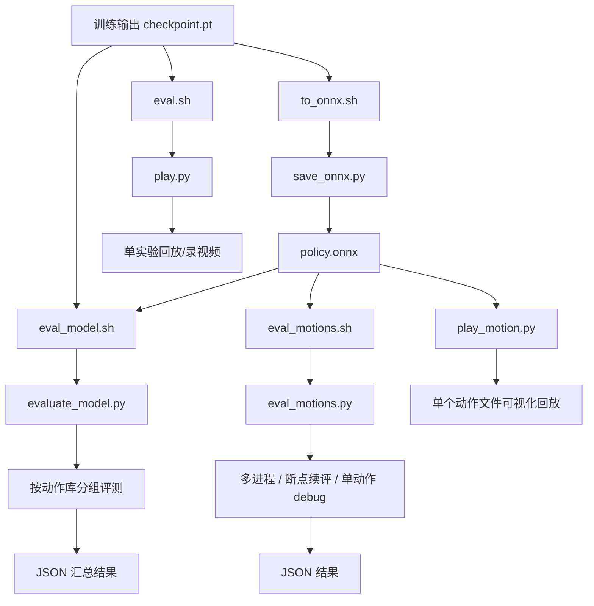
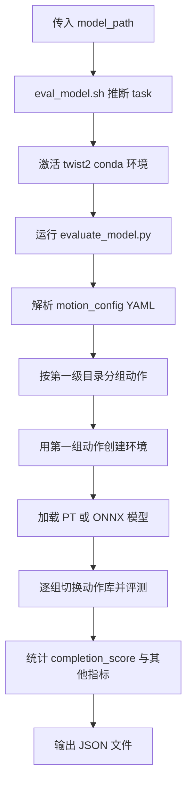
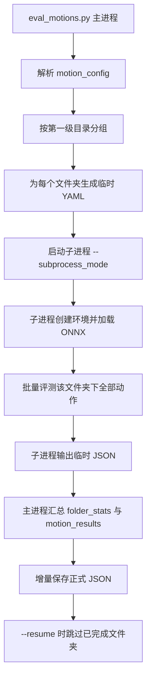
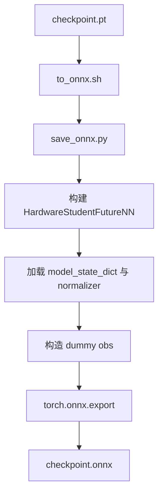

这一页位于“训练与评测入口”中的“模型评测、回放与 ONNX 导出流程”，目标是帮初学者把三件事分清楚：**批量评测**是给很多动作算完成率，**回放**是把某个模型或某段动作在仿真里跑出来看，**ONNX 导出**是把训练得到的 `.pt` 检查点变成部署友好的 `.onnx` 文件。仓库里这三类能力分别落在 `evaluate_model.py`、`legged_gym/legged_gym/scripts/eval_motions.py`、`legged_gym/legged_gym/scripts/play.py`、`legged_gym/legged_gym/scripts/play_motion.py` 和 `legged_gym/legged_gym/scripts/save_onnx.py`，外层再由若干 `.sh` 脚本做快捷封装。Sources: [evaluate_model.py](evaluate_model.py#L1-L16), [eval_model.sh](eval_model.sh#L1-L73), [eval_motions.sh](eval_motions.sh#L1-L61), [eval.sh](eval.sh#L1-L34), [legged_gym/legged_gym/scripts/eval_motions.py](legged_gym/legged_gym/scripts/eval_motions.py#L1-L19), [legged_gym/legged_gym/scripts/play_motion.py](legged_gym/legged_gym/scripts/play_motion.py#L1-L13), [legged_gym/legged_gym/scripts/save_onnx.py](legged_gym/legged_gym/scripts/save_onnx.py#L1-L5)

先给出一句最实用的判断标准：如果你手里是 **`.pt` 或 `.onnx` 模型，想批量跑一个 YAML 动作集并拿 JSON 结果**，优先看 `evaluate_model.py`；如果你手里已经是 **`.onnx` 模型，想按动作文件夹拆进程、支持断点续评**，优先看 `eval_motions.py`；如果你想 **把实验跑出来并录视频**，看 `eval.sh -> play.py` 或 `play_motion.py`；如果你想 **把训练检查点导出成 ONNX**，看 `to_onnx.sh -> save_onnx.py`。Sources: [evaluate_model.py](evaluate_model.py#L906-L1090), [eval_motions.sh](eval_motions.sh#L43-L61), [legged_gym/legged_gym/scripts/eval_motions.py](legged_gym/legged_gym/scripts/eval_motions.py#L800-L1021), [eval.sh](eval.sh#L14-L34), [legged_gym/legged_gym/scripts/play_motion.py](legged_gym/legged_gym/scripts/play_motion.py#L124-L135), [to_onnx.sh](to_onnx.sh#L1-L12), [legged_gym/legged_gym/scripts/save_onnx.py](legged_gym/legged_gym/scripts/save_onnx.py#L188-L192)

## 先建立整体心智模型

为了避免把“评测”“回放”“导出”混成一件事，可以先用下面这张流程图理解仓库中这三条路径如何分工。图里每个节点都对应仓库中的真实脚本，没有额外抽象层。Sources: [evaluate_model.py](evaluate_model.py#L906-L1090), [eval.sh](eval.sh#L14-L34), [eval_motions.sh](eval_motions.sh#L43-L61), [to_onnx.sh](to_onnx.sh#L7-L12)



从仓库文件布局也能看出这种分工：根目录放的是面向使用者的入口脚本，真正的实现主要在 `legged_gym/legged_gym/scripts` 与根目录的 `evaluate_model.py`。对于初学者，最好的阅读顺序通常是先跑脚本，再回头看实现。Sources: [eval_model.sh](eval_model.sh#L29-L70), [eval_motions.sh](eval_motions.sh#L39-L60), [eval.sh](eval.sh#L14-L34), [to_onnx.sh](to_onnx.sh#L7-L12), [evaluate_model.py](evaluate_model.py#L906-L1090)

```text
TWIST2/
├── eval_model.sh                # 统一模型评测入口包装
├── eval_motions.sh              # ONNX 动作集评测入口
├── eval.sh                      # 实验回放入口
├── to_onnx.sh                   # ONNX 导出入口
├── evaluate_model.py            # 统一 PT/ONNX 批量评测实现
└── legged_gym/legged_gym/scripts/
    ├── eval_motions.py          # 多进程 ONNX 评测
    ├── play.py                  # 实验回放与录视频
    ├── play_motion.py           # 单动作 ONNX 回放
    └── save_onnx.py             # PT -> ONNX 导出
```

## 四个入口脚本分别做什么

下面这张表可以把“我现在该用哪个脚本”快速对应起来。表中的“模型格式”和“结果产物”都直接来自脚本参数与实现逻辑。Sources: [eval_model.sh](eval_model.sh#L13-L72), [eval_motions.sh](eval_motions.sh#L16-L61), [eval.sh](eval.sh#L9-L34), [to_onnx.sh](to_onnx.sh#L7-L12), [legged_gym/legged_gym/scripts/play_motion.py](legged_gym/legged_gym/scripts/play_motion.py#L124-L135)

| 场景 | 推荐入口 | 接受模型格式 | 输入动作 | 主要输出 |
|---|---|---|---|---|
| 批量评测一个模型在大量动作上的完成度 | `eval_model.sh` | `.pt` / `.onnx` | YAML motion config | JSON 评测结果 |
| 只评测 ONNX，按文件夹拆分并支持续跑 | `eval_motions.sh` | `.onnx` | YAML motion config | JSON 评测结果 |
| 回放某个训练实验并可录制视频 | `eval.sh` | 实验 ID 对应 checkpoint | 单个 `motion_file` | 仿真可视化 / 视频 |
| 回放一个 ONNX 模型对单条动作的表现 | `play_motion.py` | `.onnx` | 单个 `motion_file` | 仿真可视化 / 可选视频 |
| 把 `.pt` 检查点导出为 `.onnx` | `to_onnx.sh` | `.pt` | 无 | `.onnx` 文件 |

一个容易忽略但很关键的差别是：`eval_model.sh` 最终走的是根目录的 `evaluate_model.py`，它会自动识别模型是 PT 还是 ONNX；而 `eval_motions.sh` 明确把参数名写成 `onnx_policy_path`，并调用 `eval_motions.py --policy`，所以它是 **只面向 ONNX** 的评测入口。Sources: [eval_model.sh](eval_model.sh#L35-L70), [evaluate_model.py](evaluate_model.py#L537-L547), [eval_motions.sh](eval_motions.sh#L4-L8), [legged_gym/legged_gym/scripts/eval_motions.py](legged_gym/legged_gym/scripts/eval_motions.py#L988-L1021)

## 路径一：统一模型评测流程（PT 和 ONNX 都能跑）

`evaluate_model.py` 的核心思路是：先解析动作 YAML，把所有动作按**第一级目录**分组；然后只创建**一个 Isaac Gym 环境**；接着依次切换不同动作组进行评测；最后把所有动作结果汇总成整体统计和分组统计，并保存到 JSON。这个设计的重点不是“一个动作一建环境”，而是“**一个环境反复切动作组**”，这样减少了重复初始化成本。Sources: [evaluate_model.py](evaluate_model.py#L36-L55), [evaluate_model.py](evaluate_model.py#L942-L963), [evaluate_model.py](evaluate_model.py#L1003-L1082)

下面这张流程图适合第一次使用时对照命令理解。它描述的是 `eval_model.sh -> evaluate_model.py` 的真实执行顺序。Sources: [eval_model.sh](eval_model.sh#L29-L70), [evaluate_model.py](evaluate_model.py#L930-L1082)



`eval_model.sh` 自己做的事情很少，但很实用：它检查模型路径是否存在，默认使用 `twist2` conda 环境，固定一个大型 motion config YAML，设置 `NUM_ENVS=256`，并且会从模型路径中的 `logs/<task>/...` 结构自动推断任务名，兼容 `g1_stu_future_moe`、Transformer 等变体，而不是把任务死写成 `g1_stu_future`。Sources: [eval_model.sh](eval_model.sh#L13-L49), [eval_model.sh](eval_model.sh#L51-L72)

`evaluate_model.py` 的参数很直白：必须提供 `--model_path` 和 `--motion_config`，可以指定 `--task`、`--device`、`--num_envs`、`--max_steps`、`--output_dir` 和 `--headless`。如果你是第一次使用，最重要的三个参数通常是模型文件、动作 YAML 和 GPU 设备。Sources: [evaluate_model.py](evaluate_model.py#L906-L916)

## 统一评测器如何同时兼容 PT 和 ONNX

统一评测器真正的关键在 `load_model()`：它先根据扩展名判断模型类型；如果是 `.onnx`，就创建 ONNXRuntime session，并包装成一个可调用对象；如果是 `.pt`，就进入 `load_pt_model()`，从 checkpoint 的 state dict 中推断策略结构，再包装成和环境观测兼容的推理接口。对使用者来说，这意味着**同一个评测命令可以切换 PT 与 ONNX 文件**。Sources: [evaluate_model.py](evaluate_model.py#L126-L157), [evaluate_model.py](evaluate_model.py#L304-L399), [evaluate_model.py](evaluate_model.py#L537-L547)

PT 加载不是简单 `torch.load` 后直接推理。`load_pt_model()` 会从权重名中检测策略属于 `ActorCritic`、`ActorCriticMimic` 还是 `ActorCriticFuture`，还会识别是否包含 Transformer、MoE 或普通 MLP 特征；随后再从权重张量形状推断 motion/history/future steps、隐藏层维度、动作维度等参数，并只加载形状完全匹配的权重，避免 `strict=False` 仍然因为尺寸不匹配报错。Sources: [evaluate_model.py](evaluate_model.py#L246-L280), [evaluate_model.py](evaluate_model.py#L304-L399), [evaluate_model.py](evaluate_model.py#L500-L534)

为了避免“训练时观测维度”和“评测环境观测维度”不完全一致导致崩溃，`PolicyModelWrapper` 在推理前会先检查维度：如果环境观测比模型输入长，就截断；如果比模型输入短，就补零。也就是说，统一评测器不仅兼容不同文件格式，还带了一层**观测适配保护**。Sources: [evaluate_model.py](evaluate_model.py#L159-L185)

## 评测到底算了什么结果

`evaluate_model.py` 在每一批动作评测时，会先取出动作真实时长，然后将多个动作并行塞入多个环境中执行；每走一步就累积 episode 长度，直到所有样本 done 或达到动态上限；最终用 `actual_time / motion_length` 得到 `completion_rate`，再乘以 100 得到 `completion_score`。这说明它的主指标不是奖励，而是**动作完成度**。Sources: [evaluate_model.py](evaluate_model.py#L623-L749)

如果环境在 `infos['episode']` 中返回了额外指标，统一评测器也会一起累计并写入 `metrics` 字段；最后 `aggregate_results()` 会分别对整体和每个动作库计算均值、标准差、最小值、最大值与样本数，`save_results()` 会把模型信息、时间戳、整体统计、动作库统计和逐动作结果一起落盘到 JSON。Sources: [evaluate_model.py](evaluate_model.py#L698-L749), [evaluate_model.py](evaluate_model.py#L771-L899)

下面这张结果表能帮助你读懂最终 JSON 的层次。Sources: [evaluate_model.py](evaluate_model.py#L771-L899)

| 结果层级 | 字段 | 含义 |
|---|---|---|
| 模型级 | `model_info` | 模型路径、名称、类型、训练步数、任务名等 |
| 全局级 | `overall` | 所有动作总体统计 |
| 动作库级 | `motion_groups` | 按第一级目录分组后的统计 |
| 单动作级 | `motion_results` | 每个动作的完成率、完成分数、实际时长等 |
| 可选指标 | `metrics` | 环境 episode 日志中额外提供的指标 |

## 最小可用命令：先做一次统一评测

如果你已经有一个 `.pt` 或 `.onnx` 文件，最省事的入口就是直接用 `eval_model.sh`。它只要求第一个参数是模型路径，第二个参数可选为 CUDA 设备号，例如 `bash eval_model.sh /path/to/model.pt 0` 或 `bash eval_model.sh /path/to/model.onnx 1`。这两个用法都写在脚本头部注释里。Sources: [eval_model.sh](eval_model.sh#L2-L10)

如果你不想用包装脚本，也可以直接运行 `evaluate_model.py`。脚本头部注释给出了三种标准形式：评估 PT、评估 ONNX，以及自己指定输出目录和设备。对初学者来说，直接 Python 调用更容易看清完整参数。Sources: [evaluate_model.py](evaluate_model.py#L7-L16), [evaluate_model.py](evaluate_model.py#L906-L916)

```bash
python evaluate_model.py \
  --model_path model.pt \
  --motion_config motion_config.yaml \
  --task g1_stu_future \
  --device cuda:0 \
  --num_envs 256 \
  --output_dir ./eval_results \
  --headless
```

## 路径二：ONNX 专用动作评测流程

`eval_motions.sh` 走的是另一条更专注的路径：它只接受 ONNX policy，默认使用 `pico_numpy123_w1_total563.yaml`，默认开 `4096` 个并行环境，并进入 `legged_gym/legged_gym/scripts` 目录运行 `eval_motions.py --policy ... --motion_config ... --task g1_stu_future`。所以这条链更像“**ONNX 批量压测器**”。Sources: [eval_motions.sh](eval_motions.sh#L16-L25), [eval_motions.sh](eval_motions.sh#L39-L60)

`eval_motions.py` 的顶层设计在文件开头写得很明确：主进程负责解析配置和调度子进程；子进程一次只评估一个文件夹；支持 `--resume` 断点续评；支持 `--debug` 单动作失败分析。这一版脚本强调的是**稳定跑大规模数据**，不是兼容 PT。Sources: [legged_gym/legged_gym/scripts/eval_motions.py](legged_gym/legged_gym/scripts/eval_motions.py#L3-L19)

下面这张图描述了 `eval_motions.py` 的主进程/子进程关系。对于“动作很多、显存容易积累”的场景，这种设计比长时间复用单进程更稳。Sources: [legged_gym/legged_gym/scripts/eval_motions.py](legged_gym/legged_gym/scripts/eval_motions.py#L76-L113), [legged_gym/legged_gym/scripts/eval_motions.py](legged_gym/legged_gym/scripts/eval_motions.py#L800-L960)



在子进程中，`worker_main()` 会关闭噪声、摩擦随机化、推搡、质量随机化、动作延迟、电机随机化，并关闭 motion curriculum 与 rand reset；然后加载 ONNX policy、创建环境、逐批塞入动作 ID、步进仿真，并用 `(episode_lengths * env.dt) / motion_lengths` 计算 `completion_rate`。所以它和统一评测器一样，核心结果仍然是**完成率**。Sources: [legged_gym/legged_gym/scripts/eval_motions.py](legged_gym/legged_gym/scripts/eval_motions.py#L115-L132), [legged_gym/legged_gym/scripts/eval_motions.py](legged_gym/legged_gym/scripts/eval_motions.py#L175-L265)

主进程的 `coordinator_main()` 还做了两件统一评测器没有强调的事：第一，若未指定 `--output`，会自动生成 `eval_results_<onnx名>_<时间戳>.json`；第二，每完成一个文件夹就会做一次**增量保存**，并在 `--resume` 时读取已有 `folder_stats`，跳过已经完成的文件夹。这对于大动作集尤其重要。Sources: [legged_gym/legged_gym/scripts/eval_motions.py](legged_gym/legged_gym/scripts/eval_motions.py#L808-L830), [legged_gym/legged_gym/scripts/eval_motions.py](legged_gym/legged_gym/scripts/eval_motions.py#L859-L959)

## 单动作 Debug：定位为什么某个动作会失败

如果批量评测发现某个动作表现很差，`eval_motions.py` 还提供了 `--debug` 模式。这个模式要求你传 `--motion_file` 而不是 `--motion_config`，脚本会先为这一个动作临时生成 YAML，再创建单环境评测，并输出更详细的失败分析流程。脚本入口里专门对这种模式做了参数检查。Sources: [legged_gym/legged_gym/scripts/eval_motions.py](legged_gym/legged_gym/scripts/eval_motions.py#L988-L1021), [legged_gym/legged_gym/scripts/eval_motions.py](legged_gym/legged_gym/scripts/eval_motions.py#L336-L347)

在 `debug_main()` 中，环境配置会被进一步调整成更适合排障的状态：`num_envs=1`、`debug_viz=True`、`episode_length_s=120`、关闭各类随机化，并且支持 `--no_pose_term` 用来关闭姿态终止检测。这说明它不是为了高吞吐，而是为了**观察具体失败原因**。Sources: [legged_gym/legged_gym/scripts/eval_motions.py](legged_gym/legged_gym/scripts/eval_motions.py#L350-L372), [legged_gym/legged_gym/scripts/eval_motions.py](legged_gym/legged_gym/scripts/eval_motions.py#L374-L421)

## 路径三：回放与录视频

回放有两种常见入口。第一种是 `eval.sh`，它不是传模型文件路径，而是传一个实验 ID 和设备，然后在 `legged_gym/legged_gym/scripts` 下运行 `play.py`，带上 `--task`、`--proj_name`、`--exptid`、`--num_envs 1`、`--record_video` 以及一个固定的 `motion_file`。这条链更适合“**回放某次训练实验**”。Sources: [eval.sh](eval.sh#L2-L34)

`play.py` 在回放时会开启 `env_cfg.env.record_video = args.record_video`，并且在录视频时默认把环境数降到 1；如果相机传感器不可用，它会给出明确提示：需要有效的图形上下文，或者使用 `xvfb-run`，否则继续运行但不录制。这是一个很典型的“脚本没报错但没录到视频”的原因。Sources: [legged_gym/legged_gym/scripts/play.py](legged_gym/legged_gym/scripts/play.py#L115-L139)

第二种是 `play_motion.py`，它更直接：输入一个 ONNX policy 和一个单独的 `motion_file`，脚本会为这条动作自动生成临时 YAML，加载 ONNXRuntime，创建 `num_envs=1` 的环境，并可选 `--record_video`、`--output_video`、`--headless`、`--no_pose_term`、`--max_steps`。这条链更适合“**我只想看这个 ONNX 模型对这一条动作的表现**”。Sources: [legged_gym/legged_gym/scripts/play_motion.py](legged_gym/legged_gym/scripts/play_motion.py#L39-L60), [legged_gym/legged_gym/scripts/play_motion.py](legged_gym/legged_gym/scripts/play_motion.py#L124-L187)

`play_motion.py` 还实现了一个非常适合初学者观察问题的辅助函数 `check_termination_conditions()`：它会检查高度偏差、Roll/Pitch、速度、姿态偏差和非法接触力，并在接近阈值时打印警告。它不是训练逻辑，而是回放时的**可读性增强层**。Sources: [legged_gym/legged_gym/scripts/play_motion.py](legged_gym/legged_gym/scripts/play_motion.py#L63-L121)

下面这张表可以帮助你在“回放实验”和“回放单动作”之间做选择。Sources: [eval.sh](eval.sh#L14-L34), [legged_gym/legged_gym/scripts/play.py](legged_gym/legged_gym/scripts/play.py#L115-L139), [legged_gym/legged_gym/scripts/play_motion.py](legged_gym/legged_gym/scripts/play_motion.py#L124-L187)

| 回放方式 | 入口 | 模型来源 | 动作来源 | 适合场景 |
|---|---|---|---|---|
| 实验回放 | `eval.sh -> play.py` | 训练实验 ID / checkpoint 体系 | 脚本内指定的 `motion_file` | 复现某次实验表现 |
| 单动作 ONNX 回放 | `play_motion.py` | 明确给出的 `.onnx` 文件 | 命令行指定 `motion_file` | 看单条动作、查失败原因 |
| 批量评测中的单动作排障 | `eval_motions.py --debug` | `.onnx` 文件 | 命令行指定 `motion_file` | 查某个动作为什么完成率低 |

## 路径四：ONNX 导出

导出路径是仓库里最短的一条：根目录 `to_onnx.sh` 只做两件事，先 `cd legged_gym/legged_gym/scripts`，再执行 `python save_onnx.py --ckpt_path ${ckpt_path}`。因此真正的导出逻辑全部在 `save_onnx.py`。Sources: [to_onnx.sh](to_onnx.sh#L1-L12)

`save_onnx.py` 明确把自己描述为 **g1_stu_future 学生策略的 ONNX 转换脚本**。它定义了 `HardwareStudentFutureNN` 包装器，内部使用 `ActorFuture`，并在 `forward()` 中先走 `self.normalizer.normalize(obs)`，再调用 actor。换句话说，导出的不是裸网络，而是**包含 normalizer 的硬件部署包装网络**。Sources: [legged_gym/legged_gym/scripts/save_onnx.py](legged_gym/legged_gym/scripts/save_onnx.py#L16-L73)

导出时脚本会从 checkpoint 中读取 `model_state_dict` 和 `normalizer`，然后构造一个 dummy input 做 `torch.onnx.export()`；导出文件名与原 checkpoint 同名，只是把后缀从 `.pt` 替换成 `.onnx`。输入名固定为 `input`，输出名固定为 `output`，并且只把 batch 维设置成动态轴。Sources: [legged_gym/legged_gym/scripts/save_onnx.py](legged_gym/legged_gym/scripts/save_onnx.py#L150-L186)

这条导出链还有一个对初学者非常重要的硬约束：`forward()` 里有 `assert obs.shape[1] == self.num_observations`。也就是说，导出的 ONNX 模型默认期望固定的观测宽度；如果你后面拿这个 ONNX 去跑的环境观测维度不一致，就会在导出前或推理时暴露问题，而不是静默吞掉。Sources: [legged_gym/legged_gym/scripts/save_onnx.py](legged_gym/legged_gym/scripts/save_onnx.py#L66-L72)

下面这张导出流程图可以作为最简记忆版。Sources: [to_onnx.sh](to_onnx.sh#L7-L12), [legged_gym/legged_gym/scripts/save_onnx.py](legged_gym/legged_gym/scripts/save_onnx.py#L74-L186)



## 一份给初学者的推荐操作顺序

如果你第一次接触这一页的内容，最稳妥的顺序不是上来就导出，而是先**回放能不能跑起来**，再做**批量评测**，最后再做**ONNX 导出**。具体原因很简单：回放能确认模型、图形环境和动作文件都可用；批量评测能确认模型在动作集上的整体表现；ONNX 导出则是把可用的 PT 模型变成部署文件。Sources: [eval.sh](eval.sh#L14-L34), [evaluate_model.py](evaluate_model.py#L906-L1090), [to_onnx.sh](to_onnx.sh#L7-L12)

推荐的最小闭环可以按这个顺序执行：先用 `eval.sh` 或 `play_motion.py` 做一次肉眼可见的回放；接着用 `eval_model.sh` 或 `eval_motions.sh` 跑批量评测拿 JSON；最后用 `to_onnx.sh` 把 PT 导出成 ONNX，再用 ONNX 重新跑一次 `eval_motions.sh` 或 `play_motion.py`，确认导出后的模型行为正常。Sources: [eval.sh](eval.sh#L14-L34), [legged_gym/legged_gym/scripts/play_motion.py](legged_gym/legged_gym/scripts/play_motion.py#L124-L135), [eval_model.sh](eval_model.sh#L56-L70), [eval_motions.sh](eval_motions.sh#L53-L60), [to_onnx.sh](to_onnx.sh#L7-L12)

## 常见问题与定位方法

下面这张表只列仓库代码里**明确能验证**的问题来源，不包含猜测性的经验项。Sources: [eval_model.sh](eval_model.sh#L18-L27), [legged_gym/legged_gym/scripts/eval_motions.py](legged_gym/legged_gym/scripts/eval_motions.py#L295-L328), [legged_gym/legged_gym/scripts/eval_motions.py](legged_gym/legged_gym/scripts/eval_motions.py#L1004-L1019), [legged_gym/legged_gym/scripts/play.py](legged_gym/legged_gym/scripts/play.py#L132-L139), [legged_gym/legged_gym/scripts/save_onnx.py](legged_gym/legged_gym/scripts/save_onnx.py#L79-L82)

| 现象 | 代码中可验证的原因 | 对应入口 |
|---|---|---|
| 脚本直接报“模型文件不存在” | 入口脚本先检查文件路径是否存在 | `eval_model.sh`、`play_motion.py`、`save_onnx.py` |
| 批量评测报缺少 motion config | `eval_motions.py` 在 batch 模式要求 `--motion_config` | `eval_motions.py` |
| debug 模式报缺少 motion file | `eval_motions.py` 在 debug 模式要求 `--motion_file` | `eval_motions.py --debug` |
| 请求录视频但没有生成视频 | `play.py` 检测不到可用 camera sensor，会提示继续运行但不录制 | `play.py` |
| ONNX 相关导入失败 | 代码显式依赖 `onnxruntime` | `evaluate_model.py`、`eval_motions.py`、`play_motion.py` |
| 导出时报 checkpoint 不存在 | `save_onnx.py` 显式检查 `ckpt_path` | `to_onnx.sh -> save_onnx.py` |

对初学者最有帮助的一条经验是：**先确认你在跑哪条链路**。如果你传的是 `.pt` 文件，就别走 `eval_motions.sh`；如果你想看单条动作，就别先上多进程批量评测；如果你只是想录视频，优先用回放脚本，而不是评测脚本。这个判断来自各脚本的参数边界，而不是使用习惯。Sources: [evaluate_model.py](evaluate_model.py#L908-L916), [eval_motions.sh](eval_motions.sh#L4-L8), [legged_gym/legged_gym/scripts/play_motion.py](legged_gym/legged_gym/scripts/play_motion.py#L124-L135)

## 你可以直接复制的命令模板

下面这些模板都对应仓库里已经存在的参数接口，没有扩展假设。Sources: [eval_model.sh](eval_model.sh#L4-L10), [eval_motions.sh](eval_motions.sh#L4-L8), [eval.sh](eval.sh#L2-L3), [to_onnx.sh](to_onnx.sh#L3-L5), [legged_gym/legged_gym/scripts/eval_motions.py](legged_gym/legged_gym/scripts/eval_motions.py#L12-L18), [legged_gym/legged_gym/scripts/play_motion.py](legged_gym/legged_gym/scripts/play_motion.py#L11-L13)

```bash
# 1) 统一评测 PT 或 ONNX
bash eval_model.sh /path/to/model.pt 0
bash eval_model.sh /path/to/model.onnx 0

# 2) ONNX 批量动作评测
bash eval_motions.sh /path/to/policy.onnx

# 3) ONNX 单动作 debug
cd legged_gym/legged_gym/scripts
python eval_motions.py --policy xxx.onnx --motion_file xxx.pkl --debug

# 4) 回放训练实验并录视频
bash eval.sh <experiment_id> cuda:0

# 5) 回放 ONNX + 单动作
cd legged_gym/legged_gym/scripts
python play_motion.py --policy xxx.onnx --motion_file xxx.pkl --record_video

# 6) 导出 ONNX
bash to_onnx.sh /absolute/path/to/checkpoint.pt
```

## 下一步怎么读

如果你看完这一页，下一步最自然的延伸有三条：想理解**统一评测器为什么能兼容 PT、ONNX、MLP、MoE、Transformer**，继续看[统一评测器的设计：兼容 PT 与 ONNX、MLP、MoE、Transformer](23-tong-ping-ce-qi-de-she-ji-jian-rong-pt-yu-onnx-mlp-moe-transformer)；想理解**观测为什么有时能截断、有时能补零**，继续看[观测维度适配与模型包装：训练配置差异下的推理兼容层](24-guan-ce-wei-du-gua-pei-yu-mo-xing-bao-zhuang-xun-lian-pei-zhi-chai-yi-xia-de-tui-li-jian-rong-ceng)；想理解**从 checkpoint 到部署文件的命名与保存约定**，继续看[从训练检查点到部署模型：保存、导出与文件命名约定](25-cong-xun-lian-jian-cha-dian-dao-bu-shu-mo-xing-bao-cun-dao-chu-yu-wen-jian-ming-ming-yue-ding)。Sources: [evaluate_model.py](evaluate_model.py#L57-L120), [evaluate_model.py](evaluate_model.py#L159-L185), [evaluate_model.py](evaluate_model.py#L885-L899), [legged_gym/legged_gym/scripts/save_onnx.py](legged_gym/legged_gym/scripts/save_onnx.py#L160-L186)