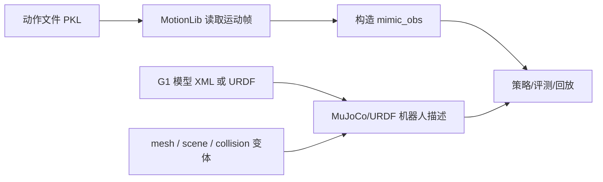
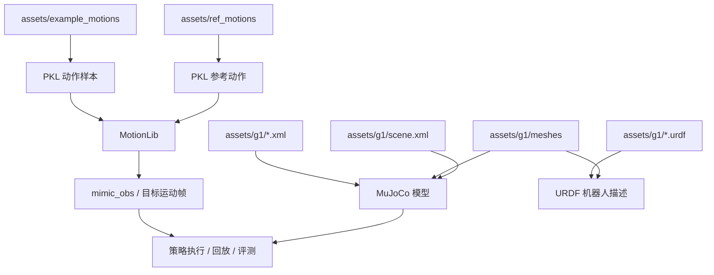

本页只解释仓库中三类“开箱即用”的资产：**示例动作**、**参考动作** 和 **G1 机器人模型资源**。对新手来说，它们的价值非常直接：前两者提供“拿来就能驱动/回放/构造目标观测”的动作输入，后者提供“仿真与模型描述所需的机器人几何与关节定义”。你现在位于“数据与资产认知”部分，这一页的目标不是教你训练或部署，而是帮你先认清这些文件分别是什么、应该在什么场景下选它们。Sources: [README.md](README.md#L122-L126), [assets/g1/README.md](assets/g1/README.md#L3-L18)

## 先建立整体认识：这三类资源在仓库中的位置与关系

从仓库公开说明可以直接确认两件事：其一，仓库在 `assets/example_motions` 中提供了一小组示例动作，明确用于“测试系统”；其二，`assets/g1` 是一套 Unitree G1 的 **URDF + MJCF** 机器人描述资源包。与此同时，仓库中的仿真脚本会把“动作文件”交给 `MotionLib` 读取，再把得到的运动帧转成 mimic 观测；而 Sim2Sim 启动脚本则把 `assets/g1/g1_sim2sim_29dof.xml` 作为默认机器人模型输入。这说明：**动作资产负责提供目标运动，G1 模型资产负责提供机器人本体定义**。Sources: [README.md](README.md#L122-L126), [deploy_real/run_simulation.py](deploy_real/run_simulation.py#L64-L86), [deploy_real/run_simulation.py](deploy_real/run_simulation.py#L149-L159), [sim2sim.sh](sim2sim.sh#L1-L13), [assets/g1/README.md](assets/g1/README.md#L3-L18)



上图可以把本页内容压缩成一句话：**动作文件决定“机器人要模仿什么”，模型文件决定“机器人是什么样子”**。在代码层面，`MotionLib` 从动作文件中抽取 `root_pos`、`root_rot`、`dof_pos` 等运动帧；而 MuJoCo 则从 XML 模型中创建 `MjModel` 与 `MjData`。这两条输入流在“执行、回放、评测”阶段汇合。Sources: [deploy_real/run_simulation.py](deploy_real/run_simulation.py#L64-L86), [deploy_real/run_simulation.py](deploy_real/run_simulation.py#L152-L160), [deploy_real/server_motion_lib.py](deploy_real/server_motion_lib.py#L122-L131)

## 资产目录的最小心智地图

从当前仓库结构可以把本页相关内容抽象成下面这个最小视图。对初学者来说，先记住“动作在 `assets/*motions`，模型在 `assets/g1`，策略检查点在 `assets/ckpts`”即可，不需要一开始就区分所有训练与部署脚本。Sources: [README.md](README.md#L122-L126), [sim2sim.sh](sim2sim.sh#L1-L13), [assets/g1/README.md](assets/g1/README.md#L21-L30)

```text
assets/
├── example_motions/   # 示例动作：仓库自带、用于测试系统
├── ref_motions/       # 参考动作：额外提供的参考运动资产
├── g1/                # G1 机器人模型资源
│   ├── *.xml          # MuJoCo / MJCF 模型
│   ├── *.urdf         # URDF 模型
│   ├── meshes/        # 模型网格
│   ├── images/        # 相关图片
│   └── scene.xml      # 带场景的 MuJoCo 入口
└── ckpts/             # 可直接测试的 ONNX 策略
```

## 三类资源的角色对比

| 资源类别 | 主要目录 | 核心文件形态 | 直接作用 | 已验证的典型用法 |
|---|---|---|---|---|
| 示例动作 | `assets/example_motions` | `.pkl` | 提供可直接测试的动作样本 | README 明确写为“小规模示例动作，可用于测试系统” |
| 参考动作 | `assets/ref_motions` | `.pkl` | 提供额外的参考运动资产 | 与动作类资源同属 `assets`，适合作为参考输入资产认知 |
| G1 模型资源 | `assets/g1` | `.xml`、`.urdf`、`meshes/` | 定义机器人结构、几何、碰撞和场景 | `sim2sim.sh` 默认使用 `g1_sim2sim_29dof.xml`；`assets/g1/README.md` 说明可直接拖入 MuJoCo Viewer |

Sources: [README.md](README.md#L122-L126), [sim2sim.sh](sim2sim.sh#L1-L13), [assets/g1/README.md](assets/g1/README.md#L3-L18), [assets/g1/README.md](assets/g1/README.md#L21-L30)

## 示例动作：给你一个“先跑起来”的最小动作输入

仓库 README 明确说明：`assets/example_motions` 中放的是一小组示例动作，目的就是**测试系统**，并且这些动作由作者自行录制，因此 README 特别强调“没有 license 问题”。这意味着它们不是“大规模训练集”的替代品，而是更适合你在环境刚装好时做最小验证：确认动作文件能被读取、观测能被构造、策略或回放链路能否走通。Sources: [README.md](README.md#L122-L126)

从实现上看，动作文件在运行时不是被当成普通附件读取，而是被 `MotionLib` 作为**运动库**载入。无论是在 `run_simulation.py` 里，还是在 `server_motion_lib.py` 里，代码都会把 `motion_file` 交给 `MotionLib`，随后按时间步抽取 `root_pos`、`root_rot`、`dof_pos`、速度等信息，再拼出 mimic 观测。因此，对初学者最重要的理解不是“示例动作文件长什么样”，而是“**它会被解析成每一帧的目标姿态与运动状态**”。Sources: [deploy_real/run_simulation.py](deploy_real/run_simulation.py#L64-L86), [deploy_real/run_simulation.py](deploy_real/run_simulation.py#L149-L156), [deploy_real/server_motion_lib.py](deploy_real/server_motion_lib.py#L20-L41), [deploy_real/server_motion_lib.py](deploy_real/server_motion_lib.py#L122-L131)

进一步看 mimic 观测的构造，代码并不是简单输出完整世界坐标，而是把动作帧整理为更适合控制与模仿的信号：例如根部局部速度的前两维、根部高度、roll/pitch、局部 yaw 角速度以及全部 `dof_pos`。这说明示例动作对系统的价值不是“播放原始轨迹”那么简单，而是作为**控制器可消费的参考运动输入**。Sources: [deploy_real/run_simulation.py](deploy_real/run_simulation.py#L103-L132), [deploy_real/server_motion_lib.py](deploy_real/server_motion_lib.py#L68-L98)

## 参考动作：它和示例动作的区别，应当这样理解

在当前仓库可见结构中，`assets/ref_motions` 与 `assets/example_motions` 并列放在 `assets/` 下，这说明两者都属于“随仓库分发的动作资产”，只是命名上前者更强调“reference motion”，后者更强调“example motion”。对新手最稳妥的理解是：**示例动作更偏向演示与最小验证，参考动作更偏向作为被模仿或被对照的参考片段来认识**。Sources: [README.md](README.md#L122-L126)

需要注意的是，当前我能从代码中直接验证的是：运行脚本接受“动作文件”并经由 `MotionLib` 处理，而不是对“示例动作”与“参考动作”写出两套不同的数据通路。因此，在仓库实现层面，你首先应把它们都看作**动作输入资产**；真正的区别更多体现在它们作为内容样本的组织方式，而不是底层加载机制不同。Sources: [deploy_real/run_simulation.py](deploy_real/run_simulation.py#L64-L86), [deploy_real/run_simulation.py](deploy_real/run_simulation.py#L149-L156), [deploy_real/server_motion_lib.py](deploy_real/server_motion_lib.py#L122-L131)

## G1 模型资源：为什么一个目录里会同时有 XML、URDF、mesh 和 scene

`assets/g1/README.md` 直接把这个目录定义为 **Unitree G1 Description (URDF & MJCF)**。它还列出了多个 G1 模型族，包括 `g1_29dof_rev_1_0`、`g1_29dof_with_hand_rev_1_0` 等，并给出腿、腰、手臂、手部自由度数量。这说明 `assets/g1` 不是单一模型文件，而是一组**面向不同自由度配置与用途的机器人描述集合**。Sources: [assets/g1/README.md](assets/g1/README.md#L1-L18)

对于初学者，可以把这个目录里的文件类型理解成三层：**URDF/MJCF 负责结构描述，meshes 负责几何外观，scene.xml 负责带地面与光照的场景入口**。`scene.xml` 明确通过 `<include file="g1_12dof.xml"/>` 引入机器人模型，同时再补充地面、光照与视觉设置；这类文件适合“把机器人放进一个完整场景里看”。Sources: [assets/g1/scene.xml](assets/g1/scene.xml#L1-L22)

`assets/g1/README.md` 还给出了最直接的可视化方式：安装 MuJoCo 后，打开 `python -m mujoco.viewer`，再把 `g1_XXX.xml` 或 `g1_XXX.urdf` 拖进 Viewer。也就是说，这个目录本身就是一个**可以直接浏览和检查机器人模型**的资源包，不依赖你先理解训练框架。Sources: [assets/g1/README.md](assets/g1/README.md#L21-L30)

## G1 文件命名可以怎样读

下面这张表只总结当前能被文件内容或脚本直接验证的命名线索，避免把文件名想象成隐含协议。Sources: [assets/g1/README.md](assets/g1/README.md#L7-L18), [sim2sim.sh](sim2sim.sh#L1-L13), [assets/g1/scene.xml](assets/g1/scene.xml#L1-L22)

| 文件/前缀 | 可直接验证的含义 | 证据 |
|---|---|---|
| `g1_29dof_rev_1_0.urdf` | 一个 29 自由度、`rev_1_0` 版本的 URDF 机器人描述 | 文件头 `robot name="g1_29dof_rev_1_0"` |
| `g1_sim2sim_29dof.xml` | 被仓库默认 Sim2Sim 脚本选作 MuJoCo XML 模型 | `sim2sim.sh` 直接传给 `--xml` |
| `g1_mocap_29dof.xml` | 一个 29 自由度的 MuJoCo 模型变体，文件名与模型名都含 `mocap` | XML 文件头可见 |
| `g1_custom_collision_29dof.urdf` | 一个碰撞配置被修改过的 29 自由度 URDF 变体 | 文件中多处 `<collision>` 被注释掉 |
| `scene.xml` | 场景入口文件，不是机器人本体定义本身 | 通过 `<include>` 引入机器人模型，再补充 floor/light |

Sources: [assets/g1/g1_29dof_rev_1_0.urdf](assets/g1/g1_29dof_rev_1_0.urdf#L1-L4), [assets/g1/g1_sim2sim_29dof.xml](assets/g1/g1_sim2sim_29dof.xml#L1-L6), [assets/g1/g1_mocap_29dof.xml](assets/g1/g1_mocap_29dof.xml#L1-L7), [assets/g1/g1_custom_collision_29dof.urdf](assets/g1/g1_custom_collision_29dof.urdf#L1-L5), [assets/g1/g1_custom_collision_29dof.urdf](assets/g1/g1_custom_collision_29dof.urdf#L44-L49), [assets/g1/scene.xml](assets/g1/scene.xml#L1-L22), [sim2sim.sh](sim2sim.sh#L4-L13)

## `mocap`、`sim2sim`、`collision` 三类 G1 变体，最值得新手知道什么

从文件头能看到，`g1_mocap_29dof.xml` 与 `g1_sim2sim_29dof.xml` 都是 MuJoCo XML 模型，并共享同一批 mesh 资源与主体结构；差异在于它们属于**不同用途的模型变体**。其中 `g1_sim2sim_29dof.xml` 被项目的 `sim2sim.sh` 明确选为默认仿真部署模型，所以当你只是想跟仓库默认路径保持一致时，优先认识它即可。Sources: [assets/g1/g1_mocap_29dof.xml](assets/g1/g1_mocap_29dof.xml#L1-L10), [assets/g1/g1_sim2sim_29dof.xml](assets/g1/g1_sim2sim_29dof.xml#L1-L10), [sim2sim.sh](sim2sim.sh#L4-L13)

`custom_collision` 系列的证据更直观：与普通 URDF 相比，`g1_custom_collision_29dof.urdf` 在可见位置把多个 `<collision>` 块注释掉了。这至少能确认一点——它不是单纯重命名，而是**碰撞定义经过专门修改的模型变体**。如果你当前任务只是做最小运行验证，先不用碰它；只有在你需要处理碰撞相关问题时，再回来看这些变体更合适。Sources: [assets/g1/g1_29dof_rev_1_0.urdf](assets/g1/g1_29dof_rev_1_0.urdf#L44-L49), [assets/g1/g1_custom_collision_29dof.urdf](assets/g1/g1_custom_collision_29dof.urdf#L44-L49), [assets/g1/g1_custom_collision_29dof.urdf](assets/g1/g1_custom_collision_29dof.urdf#L72-L77)

## 一个面向新手的选择建议

如果你的目标只是“确认仓库能跑通”，优先组合应当是：**示例动作 + 官方 ONNX + `g1_sim2sim_29dof.xml`**。这个组合不是主观推荐，而是因为 README 明确说示例动作可用于测试系统，README 也明确给出官方 ONNX 检查点用于直接测试，而 `sim2sim.sh` 又明确把 `g1_sim2sim_29dof.xml` 作为默认 XML。换句话说，这三者共同构成了仓库最接近“默认演示路径”的资产组合。Sources: [README.md](README.md#L122-L126), [README.md](README.md#L186-L190), [sim2sim.sh](sim2sim.sh#L1-L13)

如果你的目标是“先看机器人长什么样”，最简单的入口不是读大段控制代码，而是直接使用 MuJoCo Viewer 打开 `assets/g1` 里的 XML 或 URDF 文件；如果你想看带地面与灯光的效果，就优先看 `scene.xml`。如果你的目标是“理解动作文件如何进入控制链路”，则应该把注意力放在 `MotionLib` 被调用的位置，而不是纠结示例动作文件名本身。Sources: [assets/g1/README.md](assets/g1/README.md#L21-L30), [assets/g1/scene.xml](assets/g1/scene.xml#L1-L22), [deploy_real/server_motion_lib.py](deploy_real/server_motion_lib.py#L122-L131)

## 资源关系图：从“文件名”到“用途”的最短路径



这张图的阅读方式很简单：左边是“动作输入”，右边是“机器人实体”，中间的 `MotionLib` 和 MuJoCo/URDF 描述分别把它们变成系统真正能消费的形式。只要你先把这个关系记住，后面去看 [使用示例动作与官方 ONNX 检查点完成最小验证](6-shi-yong-shi-li-dong-zuo-yu-guan-fang-onnx-jian-cha-dian-wan-cheng-zui-xiao-yan-zheng)、[运行仿真部署链路：从策略文件到 Sim2Sim](7-yun-xing-fang-zhen-bu-shu-lian-lu-cong-ce-lue-wen-jian-dao-sim2sim) 或 [动作数据集 YAML、PKL 与 NPZ 的转换与组织方式](14-dong-zuo-shu-ju-ji-yaml-pkl-yu-npz-de-zhuan-huan-yu-zu-zhi-fang-shi) 时，就不会再把“动作文件”“模型文件”“策略文件”混在一起。Sources: [deploy_real/run_simulation.py](deploy_real/run_simulation.py#L64-L86), [deploy_real/server_motion_lib.py](deploy_real/server_motion_lib.py#L122-L131), [assets/g1/README.md](assets/g1/README.md#L21-L30), [sim2sim.sh](sim2sim.sh#L1-L13)

## 读完这一页后，下一步怎么走

如果你已经知道这些资产分别是什么，下一步最自然的顺序是：先去看 [使用示例动作与官方 ONNX 检查点完成最小验证](6-shi-yong-shi-li-dong-zuo-yu-guan-fang-onnx-jian-cha-dian-wan-cheng-zui-xiao-yan-zheng)，把“示例动作 + 官方策略”真正跑起来；接着看 [运行仿真部署链路：从策略文件到 Sim2Sim](7-yun-xing-fang-zhen-bu-shu-lian-lu-cong-ce-lue-wen-jian-dao-sim2sim)，把 `assets/g1/g1_sim2sim_29dof.xml` 放进完整仿真链路；如果你之后开始处理自己的动作资产，再继续读 [动作数据集 YAML、PKL 与 NPZ 的转换与组织方式](14-dong-zuo-shu-ju-ji-yaml-pkl-yu-npz-de-zhuan-huan-yu-zu-zhi-fang-shi)。Sources: [README.md](README.md#L122-L126), [sim2sim.sh](sim2sim.sh#L1-L13), [deploy_real/run_simulation.py](deploy_real/run_simulation.py#L149-L159)