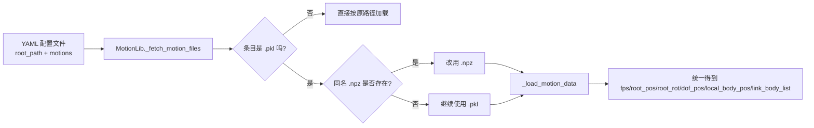
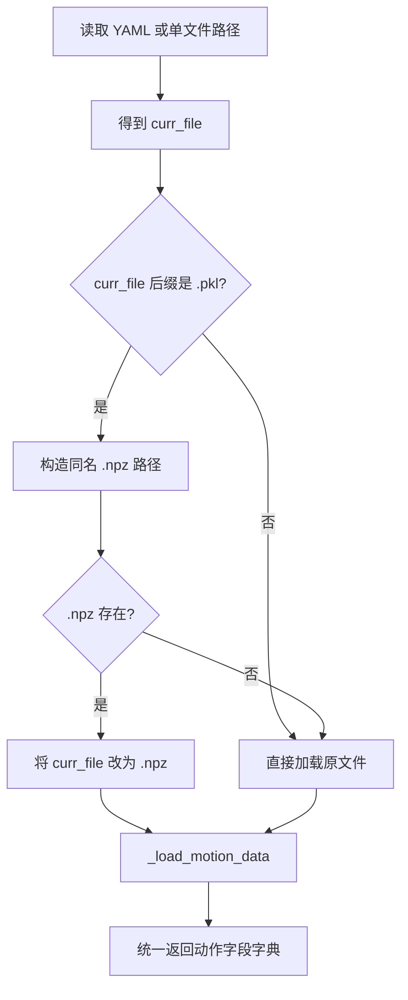

本页只解释 **TWIST2 动作数据集在训练/评测侧的三层组织关系**：**YAML 负责“列清单与采样权重”**，**PKL/NPZ 负责“存单条动作序列数据”**，而 `MotionLib` 在读取时会根据文件后缀和同名文件存在性，决定最终实际加载的是 `.pkl` 还是 `.npz`。对于中级开发者，理解这一层关系后，就能看清楚“数据集怎么被列出来、怎么被转换、怎么在运行时被解析”。Sources: [motion_lib_pkl.py](pose/pose/utils/motion_lib_pkl.py#L1824-L1970) [write_motion_data_config.py](tools/write_motion_data_config.py#L67-L149) [convert_pkl_to_npz.py](convert_pkl_to_npz.py#L24-L123)

## 先抓住核心：三种文件各自扮演什么角色

在这个仓库里，**YAML 不是动作内容本身，而是动作索引配置**；它至少包含 `root_path` 与 `motions` 两部分，其中 `motions` 是一个列表，每项给出相对文件路径 `file`、采样权重 `weight` 以及文本描述 `description`。例如 `test_pico.yaml` 和 `pico_numpy123_w1_total563.yaml` 都采用这种结构：根目录写绝对路径，而每条动作只保存相对路径。Sources: [test_pico.yaml](legged_gym/motion_data_configs/test_pico.yaml#L1-L32) [pico_numpy123_w1_total563.yaml](legged_gym/motion_data_configs/pico_numpy123_w1_total563.yaml#L1-L20) [motion_lib_pkl.py](pose/pose/utils/motion_lib_pkl.py#L1824-L1882)

**PKL/NPZ 才是单条动作的实际承载格式**。无论是根目录下的 `convert_pkl_to_npz.py`，还是 `tools/convert_stageii_pkl_to_npz.py`，都明确要求动作字典至少具备 `fps`、`root_pos`、`root_rot`、`dof_pos`、`local_body_pos`、`link_body_list` 这些字段；转换后的 `.npz` 也正是把这些字段逐项写入归档文件。因此，YAML 决定“加载哪些动作”，而 PKL/NPZ 决定“每条动作里有什么数据”。Sources: [convert_pkl_to_npz.py](convert_pkl_to_npz.py#L41-L63) [convert_stageii_pkl_to_npz.py](tools/convert_stageii_pkl_to_npz.py#L42-L74) [motion_lib_pkl.py](pose/pose/utils/motion_lib_pkl.py#L1279-L1294)

下面这张关系图可以把三者连接起来：YAML 先枚举动作，`MotionLib` 再解析出具体文件路径；如果 YAML 指向 `.pkl`，但同目录存在同名 `.npz`，加载器会优先改用 `.npz`。这意味着 **YAML 可以继续保持 `.pkl` 清单，而运行时实际读取 `.npz`**。Sources: [motion_lib_pkl.py](pose/pose/utils/motion_lib_pkl.py#L1937-L1964)



## YAML：数据集“组织方式”的最外层

`MotionLib._fetch_motion_files()` 明确把 `.yaml` 当作“多动作入口”：先用 `yaml.SafeLoader` 读取配置，再从 `root_path` 拼接每条 `motions[i]["file"]` 形成真实文件路径。如果 YAML 中启用了 `auto_discover`，还可以通过 glob 规则自动发现动作文件；否则就按 `motions` 列表中的显式条目读取。也就是说，**YAML 是一个数据集清单层，而不是数据序列层**。Sources: [motion_lib_pkl.py](pose/pose/utils/motion_lib_pkl.py#L1824-L1882)

`tools/write_motion_data_config.py` 给出了这层清单是如何批量生成的。它先从 `--dataset-root` 下扫描 `.pkl` 文件，再把每个文件的**相对路径**写到 YAML 的 `motions` 里，同时统一写入 `weight` 和 `description`。默认情况下，如果没有指定 `--subdirs`，它会遍历数据集根目录下的所有一级子目录；如果指定了 `--shuffle`、`--seed` 和 `--max-files`，则会先打乱，再截取前 N 条。Sources: [write_motion_data_config.py](tools/write_motion_data_config.py#L52-L65) [write_motion_data_config.py](tools/write_motion_data_config.py#L67-L149)

一个关键细节是：这个 YAML 生成脚本**扫描的是 `.pkl` 文件**，而不是 `.npz` 文件。函数 `_iter_pkl_files()` 只收集 `name.endswith(".pkl")` 的路径，所以它天然更像是“从原始动作库生成配置”。这也解释了为什么仓库中的很多 YAML 条目仍然写着 `.pkl`：YAML 本身没有强制要求条目写成 `.npz`，运行时是否升级到 `.npz` 是后续 `MotionLib` 决定的。Sources: [write_motion_data_config.py](tools/write_motion_data_config.py#L16-L23) [motion_lib_pkl.py](pose/pose/utils/motion_lib_pkl.py#L1937-L1964)

下面这张表可以帮助你快速区分 YAML 中几个最关键的组织字段。Sources: [write_motion_data_config.py](tools/write_motion_data_config.py#L138-L147) [motion_lib_pkl.py](pose/pose/utils/motion_lib_pkl.py#L1831-L1843)

| 字段 | 所在层级 | 作用 | 典型值 |
|---|---|---|---|
| `root_path` | YAML 顶层 | 数据集根目录 | `/home/huanghao/source/datasets/gmr_retarget_x` |
| `motions[].file` | YAML 条目 | 相对动作文件路径 | `pico_numpy123/.../motion_001.pkl` |
| `motions[].weight` | YAML 条目 | 采样权重 | `1`、`20` |
| `motions[].description` | YAML 条目 | 文本标签/描述 | `general movement` |
| `auto_discover` | YAML 顶层可选 | 自动扫描动作文件 | `true/false` |
| `auto_discover_glob` | YAML 顶层可选 | 自动发现模式 | `**/motion.pkl` |

## PKL 与 NPZ：单条动作序列的载体格式

根目录脚本 `convert_pkl_to_npz.py` 展示了最基础的转换约束：输入必须是 pickle 字典，并且包含 `fps`、`root_pos`、`root_rot`、`dof_pos`、`local_body_pos`、`link_body_list`。转换时脚本逐项取出并通过 `np.savez()` 存成同名 `.npz`；如果目标 `.npz` 已存在且未传 `--overwrite`，则会跳过。Sources: [convert_pkl_to_npz.py](convert_pkl_to_npz.py#L24-L67) [convert_pkl_to_npz.py](convert_pkl_to_npz.py#L80-L123)

`tools/convert_stageii_pkl_to_npz.py` 是更面向批量数据集的版本。它支持 `--dataset-root`、`--subdirs`、`--out-root`、`--overwrite`、`--compress`、`--no-float32`、`--max-files` 等参数；还会在需要时把浮点数组转为 `float32`，并允许输出到新的镜像目录树中。和基础脚本相比，这个版本不只是在“换后缀”，而是在做**可控的批量迁移**。Sources: [convert_stageii_pkl_to_npz.py](tools/convert_stageii_pkl_to_npz.py#L42-L75) [convert_stageii_pkl_to_npz.py](tools/convert_stageii_pkl_to_npz.py#L77-L162)

从加载器视角看，`.npz` 与 `.pkl` 最终会被拉平成同一种内存字典结构。`_load_motion_npz()` 用 `np.load(..., allow_pickle=False)` 读取 `.npz` 后，返回的仍然是同样的 6 个核心字段；`_load_motion_data()` 则在路径后缀为 `.npz` 时直接走这个分支，否则尝试用 pickle 反序列化。因此，**NPZ 在这里主要是“兼容性与封装方式”的差异，不是语义结构的差异**。Sources: [motion_lib_pkl.py](pose/pose/utils/motion_lib_pkl.py#L1279-L1294) [motion_lib_pkl.py](pose/pose/utils/motion_lib_pkl.py#L1637-L1652)

下表总结了仓库中对两种动作载体格式的已验证差异。Sources: [convert_pkl_to_npz.py](convert_pkl_to_npz.py#L2-L14) [convert_stageii_pkl_to_npz.py](tools/convert_stageii_pkl_to_npz.py#L77-L84) [motion_lib_pkl.py](pose/pose/utils/motion_lib_pkl.py#L1939-L1964)

| 维度 | PKL | NPZ |
|---|---|---|
| 本质 | pickle 序列化字典 | NumPy 压缩/归档文件 |
| 典型来源 | 原始动作导出结果 | 由转换脚本生成 |
| 加载入口 | `pickle.load()` | `np.load(..., allow_pickle=False)` |
| 字段语义 | `fps/root_pos/...` | 同样的 `fps/root_pos/...` |
| 兼容性动机 | 可能受 NumPy pickle 版本影响 | 用于跨 NumPy 版本加载 |
| 运行时优先级 | 当无同名 `.npz` 时使用 | 若同名存在，会被优先采用 |

## 为什么仓库里要把 PKL 转成 NPZ

两个转换脚本都把同一个问题写得很直接：**某些 `.pkl` 是在 NumPy 2.x 环境中生成的，而 Isaac Gym 所在的 Python 3.8 / NumPy 1.x 环境可能无法正常加载它们**。根目录脚本在文档字符串里明确说“转换后可在 NumPy 1.x 环境中加载”；StageII 版本也在 argparse 描述里说明这是为了解决 NumPy 2.x 生成的 pickle 在 IsaacGym 环境中崩溃或加载失败的问题。Sources: [convert_pkl_to_npz.py](convert_pkl_to_npz.py#L2-L14) [convert_stageii_pkl_to_npz.py](tools/convert_stageii_pkl_to_npz.py#L77-L84)

`MotionLib` 对这个兼容性问题还有一层运行时兜底。它在加载失败时，如果遇到 `ModuleNotFoundError` 且错误信息包含 `numpy._core`，会直接提示“请先把动作转换为 `.npz` 再重试”。这说明在仓库作者的实际使用路径里，**NPZ 不是可有可无的替代格式，而是 NumPy 跨版本场景下的主要兼容解决方案**。Sources: [motion_lib_pkl.py](pose/pose/utils/motion_lib_pkl.py#L273-L284)

值得注意的是，文件顶部还有一段 `sys.modules['numpy._core']` 的兼容补丁代码，试图伪造缺失模块来缓解某些 NumPy 2.x pickle 的加载问题；但加载失败分支仍然建议优先转换为 `.npz`。换言之，仓库既尝试做运行时兼容修补，也保留了**“先转换、再稳定加载”**的更稳妥路径。Sources: [motion_lib_pkl.py](pose/pose/utils/motion_lib_pkl.py#L1-L23) [motion_lib_pkl.py](pose/pose/utils/motion_lib_pkl.py#L273-L284)

## 运行时解析规则：YAML 写 PKL，也可能实际加载 NPZ

最容易被忽略的一点在 `_fetch_motion_files()`。当 YAML 条目中的 `file` 以 `.pkl` 结尾时，加载器会构造同名 `.npz` 路径，并在该文件存在时把 `curr_file` 改成 `.npz`；单文件入口分支也遵守同样规则。这意味着你**不必强制重写 YAML**，只要同目录生成了同名 `.npz`，运行时就会自动优先使用它。Sources: [motion_lib_pkl.py](pose/pose/utils/motion_lib_pkl.py#L1937-L1964)

这条规则与仓库中的真实 YAML 组织方式是吻合的。比如 `pico_numpy123_w1_total563.yaml` 里的条目全部仍写成 `.pkl`；`test_pico.yaml` 也是同样风格。但只要这些动作旁边已经存在 `.npz` 版本，`MotionLib` 就会改用 `.npz`，而不需要你手工维护两套 YAML。Sources: [pico_numpy123_w1_total563.yaml](legged_gym/motion_data_configs/pico_numpy123_w1_total563.yaml#L1-L20) [test_pico.yaml](legged_gym/motion_data_configs/test_pico.yaml#L1-L20) [motion_lib_pkl.py](pose/pose/utils/motion_lib_pkl.py#L1937-L1943)

把这条逻辑写成流程图，就是下面这样。它解释了为什么“配置层”和“存储层”可以松耦合：配置继续面向 `.pkl`，执行时再 opportunistic 地切到 `.npz`。Sources: [motion_lib_pkl.py](pose/pose/utils/motion_lib_pkl.py#L1937-L1964)



## 批量转换是怎样组织目录的

两个转换脚本都采用“**递归扫描目录中的 `.pkl` 文件**”这一基本思路，但组织策略不同。根目录脚本 `find_pkl_files()` 只负责在一个根目录下递归找到所有 `.pkl`，然后把 `.npz` 写回原文件旁边；StageII 版本 `_iter_motion_pkls()` 也是递归扫描，但额外支持 `--subdirs` 限定扫描范围，并支持把输出通过 `--out-root` 写到另一棵目录树下，同时保持相对路径镜像。Sources: [convert_pkl_to_npz.py](convert_pkl_to_npz.py#L70-L77) [convert_pkl_to_npz.py](convert_pkl_to_npz.py#L80-L123) [convert_stageii_pkl_to_npz.py](tools/convert_stageii_pkl_to_npz.py#L13-L20) [convert_stageii_pkl_to_npz.py](tools/convert_stageii_pkl_to_npz.py#L137-L145)

如果你想从“目录组织”角度理解，这两类策略分别对应两种典型用法：**原地生成同名 `.npz`**，或者**把 `.npz` 迁移到新的统一输出根目录**。前者最利于复用现有 YAML，因为路径不变、仅后缀旁路；后者更适合做一份独立的兼容副本。Sources: [convert_pkl_to_npz.py](convert_pkl_to_npz.py#L35-L39) [convert_stageii_pkl_to_npz.py](tools/convert_stageii_pkl_to_npz.py#L99-L105) [convert_stageii_pkl_to_npz.py](tools/convert_stageii_pkl_to_npz.py#L140-L145)

下面这个目录示意图展示了仓库代码中已经出现的组织模式：YAML 指向某个数据集根目录，动作文件在其下再按数据源/子目录继续分层。Sources: [pico_numpy123_w1_total563.yaml](legged_gym/motion_data_configs/pico_numpy123_w1_total563.yaml#L1-L20) [test_pico.yaml](legged_gym/motion_data_configs/test_pico.yaml#L1-L20) [write_motion_data_config.py](tools/write_motion_data_config.py#L120-L147)

```text
<dataset-root>/
├── pico_numpy123/
│   └── pico_raw_clean_retarget_numpy123/
│       └── huanghao/
│           ├── motion_001.pkl
│           ├── motion_001.npz   # 若已转换，可被运行时优先采用
│           ├── motion_002.pkl
│           └── ...
├── v1_v2_v3_g1_numpy123/
│   ├── 0807_yanjie_walk_001.pkl
│   ├── 0807_yanjie_walk_001.npz
│   └── ...
└── ...
```

## 生成 YAML 时，仓库如何表达“采样组织”

`write_motion_data_config.py` 生成的每条 YAML 记录都带有 `weight`，这说明 YAML 不只是“文件列表”，还是**采样分布配置**。脚本为每个动作条目写入同一个命令行参数 `--weight`，并把 `--description` 或顶层子目录名写到 `description` 字段里。因此，同一批文件可以通过多份 YAML 生成不同的采样权重版本，而无需修改动作文件本体。Sources: [write_motion_data_config.py](tools/write_motion_data_config.py#L89-L109) [write_motion_data_config.py](tools/write_motion_data_config.py#L138-L147)

仓库里的真实 YAML 已经体现了这种组织思想。`pico_numpy123_w1_total563.yaml` 中权重是 `1`，而 `test_pico.yaml` 中同类条目的权重是 `20`。这说明 YAML 文件名和内容共同承担了“数据集配方”的作用：相同动作集合，只要换权重配置，就会形成不同的训练/测试清单。Sources: [pico_numpy123_w1_total563.yaml](legged_gym/motion_data_configs/pico_numpy123_w1_total563.yaml#L1-L20) [test_pico.yaml](legged_gym/motion_data_configs/test_pico.yaml#L1-L20)

此外，`write_motion_data_config.py` 还支持 `--exclude-from-jump-config`，会从另一个 YAML 中读取 `root_pos_jump`、`root_rot_jump`、`dof_jump` 等异常样本列表，并把这些相对路径从生成结果里排除。也就是说，YAML 组织层不仅能“列出谁要被采样”，还能“声明谁不要被采样”。Sources: [write_motion_data_config.py](tools/write_motion_data_config.py#L26-L49) [write_motion_data_config.py](tools/write_motion_data_config.py#L105-L109) [write_motion_data_config.py](tools/write_motion_data_config.py#L116-L129)

## 与数据检查工具的关系：哪些脚本默认仍面向 PKL

虽然运行时加载器已经支持 `.npz`，但辅助工具并不完全统一。`tools/dataset_stats_stageii.py` 的 `_iter_pkl_files()` 仍然只扫描 `.pkl` 文件，并通过 `pickle.load()` 读取；它更多是站在“原始 StageII 动作库统计”的角度工作，而不是站在“统一兼容格式”角度工作。对于阅读代码的人来说，这意味着 **仓库的“训练加载格式”与“离线统计工具格式”并非完全同构**。Sources: [dataset_stats_stageii.py](tools/dataset_stats_stageii.py#L19-L31)

这个脚本还进一步说明了动作文件里哪些字段会被用于统计：它会分析 `fps`、`root_pos`、`root_rot`、`dof_pos` 等内容，并在后续逻辑中计算序列长度、速度、角速度以及关节范围相关统计。因此，从“组织方式”角度看，PKL/NPZ 虽然只是存储介质，但其中这几个核心字段已经构成了整个仓库对动作数据的最小公共接口。Sources: [dataset_stats_stageii.py](tools/dataset_stats_stageii.py#L29-L31) [dataset_stats_stageii.py](tools/dataset_stats_stageii.py#L141-L200)

## 推荐的理解顺序与实际操作顺序

如果你现在是第一次接触这部分代码，推荐按 **“先看清单层，再看载体层，再看转换层”** 的顺序理解：先理解 YAML 如何枚举动作与赋权，再理解单条 PKL/NPZ 里必须有哪些字段，最后再看仓库如何通过转换脚本解决 NumPy 版本兼容问题。这样阅读时，`MotionLib` 中“YAML 写的是 `.pkl`，但为什么会加载 `.npz`”这件事会非常自然。Sources: [motion_lib_pkl.py](pose/pose/utils/motion_lib_pkl.py#L1824-L1970) [convert_pkl_to_npz.py](convert_pkl_to_npz.py#L24-L63) [convert_stageii_pkl_to_npz.py](tools/convert_stageii_pkl_to_npz.py#L42-L75)

如果你想继续往后读，最自然的下一步是看 **[示例动作、参考动作与 G1 机器人模型资源说明](13-shi-li-dong-zuo-can-kao-dong-zuo-yu-g1-ji-qi-ren-mo-xing-zi-yuan-shuo-ming)**，了解仓库里已经附带了哪些动作与模型资产；或者进入 **[动作课程学习、难度分数与误差感知采样机制](22-dong-zuo-ke-cheng-xue-xi-nan-du-fen-shu-yu-wu-chai-gan-zhi-cai-yang-ji-zhi)**，继续追踪这些 YAML/动作清单在训练采样阶段如何被使用。Sources: [test_pico.yaml](legged_gym/motion_data_configs/test_pico.yaml#L1-L32) [write_motion_data_config.py](tools/write_motion_data_config.py#L89-L109) [motion_lib_pkl.py](pose/pose/utils/motion_lib_pkl.py#L1937-L1947)