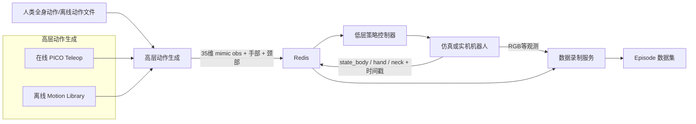
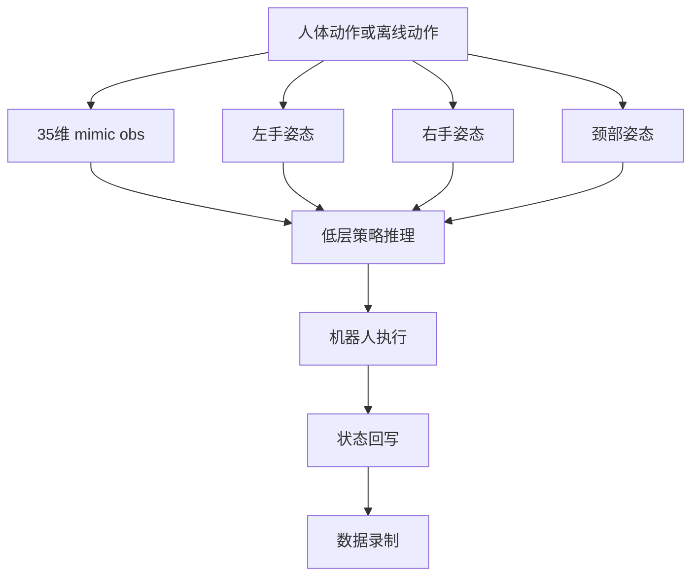

本页只解释 **TWIST2 为什么有价值**，以及这种价值如何由代码中的闭环结构支撑；它不展开训练细节、模型结构细节或某一部署脚本的逐步操作。用仓库首页的话说，TWIST2 被定义为一个 **“Scalable, Portable, and Holistic Humanoid Data Collection System”**，而在实际实现里，这种价值被落到了三件可验证的事情上：**全身输入统一表示、与低层控制解耦、并可把执行结果重新沉淀成数据**。Sources: [README.md](README.md#L1-L18), [README.md](README.md#L215-L229)

## 先看结论：TWIST2 到底解决了什么

TWIST2 的核心不是单一的遥操作脚本，也不是单一的强化学习策略，而是把 **人类全身动作采集 → 动作重定向/参考流 → 机器人低层执行 → 状态与图像回录** 串成一个可以反复运行的系统闭环。仓库明确把高层控制与低层控制分开：高层既可以来自离线动作流，也可以来自在线 PICO 遥操作；低层则统一由策略控制器在仿真或实机上执行。这个分层让同一套低层控制端可以复用不同的上游动作源，从而形成“可扩展”的系统基础。 Sources: [README.md](README.md#L215-L229), [README.md](README.md#L241-L302)

下表用仓库中可直接验证的实现来概括 TWIST2 的核心价值，不讨论论文层面的额外主张，只总结代码已经体现出的模式。 Sources: [README.md](README.md#L186-L302), [deploy_real/xrobot_teleop_to_robot_w_hand.py](deploy_real/xrobot_teleop_to_robot_w_hand.py#L621-L655), [deploy_real/server_data_record.py](deploy_real/server_data_record.py#L133-L194)

| 核心价值 | 代码中的体现 | 直接意义 |
|---|---|---|
| **全身性（Holistic）** | 高层动作同时写入 body、hand、neck 三类 action；数据录制同时保存 RGB、body/hand/neck state 与 action | 不是只做步态或手臂，而是覆盖身体、双手、头颈与视觉上下文 |
| **可扩展（Scalable）** | 高层来源可切换为离线 motion server 或在线 teleop；低层控制接口统一从 Redis 取动作 | 新动作源可接入，而无需重写低层控制器 |
| **可移植（Portable）** | 同样的高层动作格式可驱动 sim2sim 与 sim2real；仓库同时提供仿真与实机控制脚本 | 同一闭环可先在仿真验证，再迁移到实机 |
| **闭环数据生产** | 执行过程中回写 state 与 timestamp，录制服务从 Redis 批量取数并持久化 episode | 执行不仅消费数据，也持续生成可再利用的数据 |

Sources: [README.md](README.md#L247-L302), [deploy_real/server_motion_lib.py](deploy_real/server_motion_lib.py#L122-L200), [deploy_real/server_low_level_g1_real.py](deploy_real/server_low_level_g1_real.py#L184-L239), [deploy_real/server_data_record.py](deploy_real/server_data_record.py#L140-L194)

## 概念图：TWIST2 的价值来自“高层动作源”和“低层控制器”的解耦

先读图方式：这张图不是进程启动教程，而是帮助你把系统抽象成四层——**动作产生、动作交换、低层执行、数据回流**。理解这一点之后，再看具体脚本名会更清楚。 Sources: [README.md](README.md#L217-L229), [README.md](README.md#L241-L302)

这个结构的关键在于：**Redis 不是附属工具，而是闭环中的交换层**。在线遥操作脚本把 `action_body_unitree_g1_with_hands`、双手动作、颈部动作以及 `t_action` 写入 Redis；低层实机控制器则把 `state_body_unitree_g1_with_hands`、双手状态与 `t_state` 回写 Redis；数据录制器再把这些执行侧状态和视觉数据合并保存。也就是说，TWIST2 的“闭环”并不是概念口号，而是实际存在于键值流中的双向数据回路。 Sources: [deploy_real/xrobot_teleop_to_robot_w_hand.py](deploy_real/xrobot_teleop_to_robot_w_hand.py#L621-L655), [deploy_real/server_low_level_g1_real.py](deploy_real/server_low_level_g1_real.py#L184-L239), [deploy_real/server_data_record.py](deploy_real/server_data_record.py#L140-L194)

## Interest：为什么说它是“全身”的，而不是普通 teleop

在在线遥操作端，TWIST2 不是简单地把手柄输入映射成少量关节命令。`xrobot_teleop_to_robot_w_hand.py` 明确包含 **全身 teleop**、**35 维 mimic observation**、**手部开合插值** 和 **头部到颈部的重定向**。其中 body 使用 `extract_mimic_obs_whole_body()` 生成 35 维观测，hand 由 `DEFAULT_HAND_POSE` 中的开/合姿态插值得到，neck 则通过 `human_head_to_robot_neck()` 从人体头部数据提取后再写入 Redis。这个设计说明 TWIST2 的输入面向的是**全身协调动作**，而不是单一肢体控制。 Sources: [deploy_real/xrobot_teleop_to_robot_w_hand.py](deploy_real/xrobot_teleop_to_robot_w_hand.py#L20-L24), [deploy_real/xrobot_teleop_to_robot_w_hand.py](deploy_real/xrobot_teleop_to_robot_w_hand.py#L82-L105), [deploy_real/xrobot_teleop_to_robot_w_hand.py](deploy_real/xrobot_teleop_to_robot_w_hand.py#L277-L306), [deploy_real/xrobot_teleop_to_robot_w_hand.py](deploy_real/xrobot_teleop_to_robot_w_hand.py#L612-L645)

这种“全身性”在默认参数里也被固定了下来。`DEFAULT_MIMIC_OBS_G1` 由 **xy 速度、z 高度、roll/pitch、yaw 角速度、29 个关节位置** 拼接而成；`DEFAULT_HAND_POSE` 进一步为左右手分别定义 open/close 姿态。这里可以直接看到，TWIST2 的统一高层表示不是“任意 JSON”，而是一个稳定的身体基座 + 多肢体扩展的组合格式。 Sources: [deploy_real/data_utils/params.py](deploy_real/data_utils/params.py#L3-L30), [deploy_real/data_utils/params.py](deploy_real/data_utils/params.py#L72-L153)

离线动作流也遵守同一逻辑。`server_motion_lib.py` 从 `MotionLib` 读取动作帧后，不是直接发送原始姿态，而是重建出与在线 teleop 一致的 mimic 表示：**根部局部 xy 速度、根部 z、高姿态 roll/pitch、局部 yaw 角速度、dof_pos**。这意味着 TWIST2 的“全身动作”既可以来源于人实时操控，也可以来源于离线数据片段，但在进入低层控制前会被统一成相同语义的高层接口。 Sources: [deploy_real/server_motion_lib.py](deploy_real/server_motion_lib.py#L20-L27), [deploy_real/server_motion_lib.py](deploy_real/server_motion_lib.py#L41-L98), [deploy_real/server_motion_lib.py](deploy_real/server_motion_lib.py#L122-L150)

## 可扩展性的根：统一高层接口，而不是绑定单一路径

TWIST2 的可扩展性首先体现在 **高层动作源可替换**。README 明确给出两条并列路径：同一低层控制端可以接收 `run_motion_server.sh` 的离线动作流，也可以接收 `teleop.sh` 的在线 PICO 遥操作流；并且仓库特别强调这样设计是因为 **高层控制与低层控制被分离**。这不是文档层面的建议，而是系统边界的正式定义。 Sources: [README.md](README.md#L217-L229), [README.md](README.md#L241-L286)

这种解耦在代码层由 Redis 键约定落实。在线 teleop 写入 `action_body_unitree_g1_with_hands`、`action_hand_left_unitree_g1_with_hands`、`action_hand_right_unitree_g1_with_hands`、`action_neck_unitree_g1_with_hands`；而实机低层控制器并不关心这些动作来自 PICO 还是离线库，只负责从相同键名读取，再生成目标关节动作。高层的演化因此可以围绕“如何产生更好的 mimic obs”进行，而低层的职责保持稳定。 Sources: [deploy_real/xrobot_teleop_to_robot_w_hand.py](deploy_real/xrobot_teleop_to_robot_w_hand.py#L621-L645), [deploy_real/server_low_level_g1_real.py](deploy_real/server_low_level_g1_real.py#L232-L239), [deploy_real/server_motion_lib.py](deploy_real/server_motion_lib.py#L175-L200)

下表对比了 TWIST2 中两类高层动作源的共同点与差异，重点是说明“可扩展”来自 **接口统一**，而不是实现相同。 Sources: [README.md](README.md#L241-L286), [deploy_real/server_motion_lib.py](deploy_real/server_motion_lib.py#L122-L200), [deploy_real/xrobot_teleop_to_robot_w_hand.py](deploy_real/xrobot_teleop_to_robot_w_hand.py#L404-L420), [deploy_real/xrobot_teleop_to_robot_w_hand.py](deploy_real/xrobot_teleop_to_robot_w_hand.py#L621-L645)

| 维度 | 在线 PICO Teleop | 离线 Motion Server | 共同点 |
|---|---|---|---|
| 动作来源 | 实时流式人体数据 | 文件中的动作轨迹 | 都生成高层参考动作 |
| 关键脚本 | `teleop.sh` → `xrobot_teleop_to_robot_w_hand.py` | `run_motion_server.sh` → `server_motion_lib.py` | 都经 Redis 发布 |
| 身体表示 | 从 retarget 后的机器人 qpos 提取 35 维 mimic obs | 从 motion lib 帧重建 35 维 mimic obs | 最终都喂给同类低层控制器 |
| 额外输出 | 手部姿态、颈部姿态、控制器按键 | 默认姿态、远程启动/退出逻辑 | 都能作为高层控制输入 |

Sources: [teleop.sh](teleop.sh#L1-L21), [deploy_real/xrobot_teleop_to_robot_w_hand.py](deploy_real/xrobot_teleop_to_robot_w_hand.py#L82-L105), [deploy_real/xrobot_teleop_to_robot_w_hand.py](deploy_real/xrobot_teleop_to_robot_w_hand.py#L621-L655), [deploy_real/server_motion_lib.py](deploy_real/server_motion_lib.py#L20-L27), [deploy_real/server_motion_lib.py](deploy_real/server_motion_lib.py#L153-L200)

## Desire：为什么这种闭环对控制系统特别重要

TWIST2 的价值不止在于“能遥操作”，而在于它把 **高层动作参考** 与 **低层策略执行** 接成了标准闭环。无论是仿真版还是实机版低层控制器，都会加载 ONNX 策略，并围绕同一观测结构运行：`n_mimic_obs = 35`、`n_proprio = 92`、`n_obs_single = 127`、`history_len = 10`，最终形成 `1402` 维总观测。换句话说，高层输入不是直接覆盖底层电机命令，而是以稳定的参考信号进入策略执行链，这让上游动作源可以多样化，而低层控制仍保持统一的推理接口。 Sources: [deploy_real/server_low_level_g1_sim.py](deploy_real/server_low_level_g1_sim.py#L21-L59), [deploy_real/server_low_level_g1_sim.py](deploy_real/server_low_level_g1_sim.py#L187-L200), [deploy_real/server_low_level_g1_real.py](deploy_real/server_low_level_g1_real.py#L75-L89), [deploy_real/server_low_level_g1_real.py](deploy_real/server_low_level_g1_real.py#L131-L145)

更重要的是，这个闭环是 **双向可观测** 的。实机低层控制器在每个循环里把 `state_body_unitree_g1_with_hands`、手部状态与时间戳回写到 Redis，然后再读取 action 键并执行；数据录制服务则从 Redis 管道一次性抓取 body/hand/neck 的 state 与 action，再配合 VisionClient 取到的 RGB 图像保存 episode。也就是说，TWIST2 不是“命令发出去就结束”的单向系统，而是一个天然支持执行后回溯、分析和再利用的数据回流结构。 Sources: [deploy_real/server_low_level_g1_real.py](deploy_real/server_low_level_g1_real.py#L184-L239), [deploy_real/server_data_record.py](deploy_real/server_data_record.py#L31-L49), [deploy_real/server_data_record.py](deploy_real/server_data_record.py#L62-L84), [deploy_real/server_data_record.py](deploy_real/server_data_record.py#L133-L194)

下面这张关系图用于说明“全身采集”和“策略控制”之间不是替代关系，而是通过统一高层表示形成上下游协作。 Sources: [deploy_real/xrobot_teleop_to_robot_w_hand.py](deploy_real/xrobot_teleop_to_robot_w_hand.py#L82-L105), [deploy_real/server_motion_lib.py](deploy_real/server_motion_lib.py#L68-L98), [deploy_real/server_low_level_g1_real.py](deploy_real/server_low_level_g1_real.py#L131-L145)

## “可移植”不是口号，而是 sim2sim 与 sim2real 的接口复用

README 把 sim2sim 和 sim2real 并列呈现，而且都要求先启动低层控制，再接入高层动作流。这说明 TWIST2 的系统设计并没有把仿真验证和真实部署割裂开：上游动作流与中间交换机制保持一致，下游只是在仿真 MuJoCo 控制器与实机 G1 控制器之间切换。对开发者而言，这种一致性带来的直接收益是：**先在仿真上验证高层动作源是否合理，再逐步迁移到实机执行**。 Sources: [README.md](README.md#L215-L286)

这种“可移植”在两个控制器实现中也很直接。仿真控制器 `server_low_level_g1_sim.py` 和实机控制器 `server_low_level_g1_real.py` 都采用 ONNX policy wrapper，且都围绕相同的 mimic/proprio/history 观测定义工作；它们的差异主要体现在执行后端：一个创建 MuJoCo 模型与 viewer，另一个通过 `G1RealWorldEnv` 与 Unitree SDK 通信。也就是说，系统迁移时优先变化的是执行媒介，而不是上游动作格式。 Sources: [deploy_real/server_low_level_g1_sim.py](deploy_real/server_low_level_g1_sim.py#L21-L59), [deploy_real/server_low_level_g1_sim.py](deploy_real/server_low_level_g1_sim.py#L84-L121), [deploy_real/server_low_level_g1_real.py](deploy_real/server_low_level_g1_real.py#L92-L120), [deploy_real/robot_control/g1_wrapper.py](deploy_real/robot_control/g1_wrapper.py#L25-L39), [deploy_real/robot_control/g1_wrapper.py](deploy_real/robot_control/g1_wrapper.py#L71-L149)

## 闭环的最终价值：执行过程本身就是数据生产过程

TWIST2 之所以适合作为“数据采集与控制闭环”，关键在于数据录制不是后处理附加脚本，而是系统主链路的一部分。`server_data_record.py` 在录制时同时保存 RGB、state_body、双手状态、neck 状态、body/hand/neck action 以及时间戳，并且以 episode 形式组织输出。录制的开关直接来自控制器按键事件，退出也通过同一遥操作控制流管理。这样的实现说明：**控制系统一边运行，一边就能把高层意图、低层执行状态与视觉上下文沉淀成结构化样本**。 Sources: [deploy_real/server_data_record.py](deploy_real/server_data_record.py#L3-L12), [deploy_real/server_data_record.py](deploy_real/server_data_record.py#L75-L90), [deploy_real/server_data_record.py](deploy_real/server_data_record.py#L103-L130), [deploy_real/server_data_record.py](deploy_real/server_data_record.py#L133-L194)

从仓库使用入口看，GUI 也围绕这一闭环来组织能力：它把仿真低层、实机低层、离线高层、在线 teleop、数据录制、颈部控制和视觉串流集中到一个控制面板中。这里不必把 GUI 理解为“另一个功能模块”，更准确地说，它是对 TWIST2 闭环能力的操作化呈现：同一界面上可以调度采集、执行与录制环节。 Sources: [README.md](README.md#L290-L302), [gui.py](gui.py#L132-L165), [gui.py](gui.py#L185-L200)

## 一个更准确的理解框架：TWIST2 不只是 teleop，也不只是 policy deploy

如果只把 TWIST2 看成 “PICO 控制 G1”，会低估它的系统价值；如果只把它看成 “ONNX 策略部署”，也同样不准确。代码显示，TWIST2 的真正价值在于：**它把人体全身动作、离线动作数据、低层策略执行、视觉观测和 episode 录制放进了同一个统一接口体系中**。高层动作可以替换，低层执行后端可以替换，但交换语义与录制逻辑保持稳定，这正是“可扩展的人形全身数据采集与控制闭环”的工程含义。 Sources: [README.md](README.md#L1-L18), [README.md](README.md#L217-L229), [deploy_real/xrobot_teleop_to_robot_w_hand.py](deploy_real/xrobot_teleop_to_robot_w_hand.py#L621-L645), [deploy_real/server_low_level_g1_real.py](deploy_real/server_low_level_g1_real.py#L184-L239), [deploy_real/server_data_record.py](deploy_real/server_data_record.py#L133-L194)

## 你接下来应该读什么

如果你想继续理解这个判断背后的结构化细节，建议按下面顺序继续阅读：先看 [仓库总体分层：训练框架、动作表示、部署服务与工具链](16-cang-ku-zong-ti-fen-ceng-xun-lian-kuang-jia-dong-zuo-biao-shi-bu-shu-fu-wu-yu-gong-ju-lian) 建立全仓库地图；再看 [Redis 在系统中的作用：跨进程通信、观测交换与服务解耦](28-redis-zai-xi-tong-zhong-de-zuo-yong-kua-jin-cheng-tong-xin-guan-ce-jiao-huan-yu-fu-wu-jie-ou) 理解交换层；如果你更关心实操链路，再继续到 [从 Teleop 到 Sim2Real：在线重定向、低层执行与数据录制协同](29-cong-teleop-dao-sim2real-zai-xian-zhong-ding-xiang-di-ceng-zhi-xing-yu-shu-ju-lu-zhi-xie-tong) 和 [PICO 遥操作流程的阶段划分：设备启动、标定、控制与录制](31-pico-yao-cao-zuo-liu-cheng-de-jie-duan-hua-fen-she-bei-qi-dong-biao-ding-kong-zhi-yu-lu-zhi)。 Sources: [README.md](README.md#L241-L302)