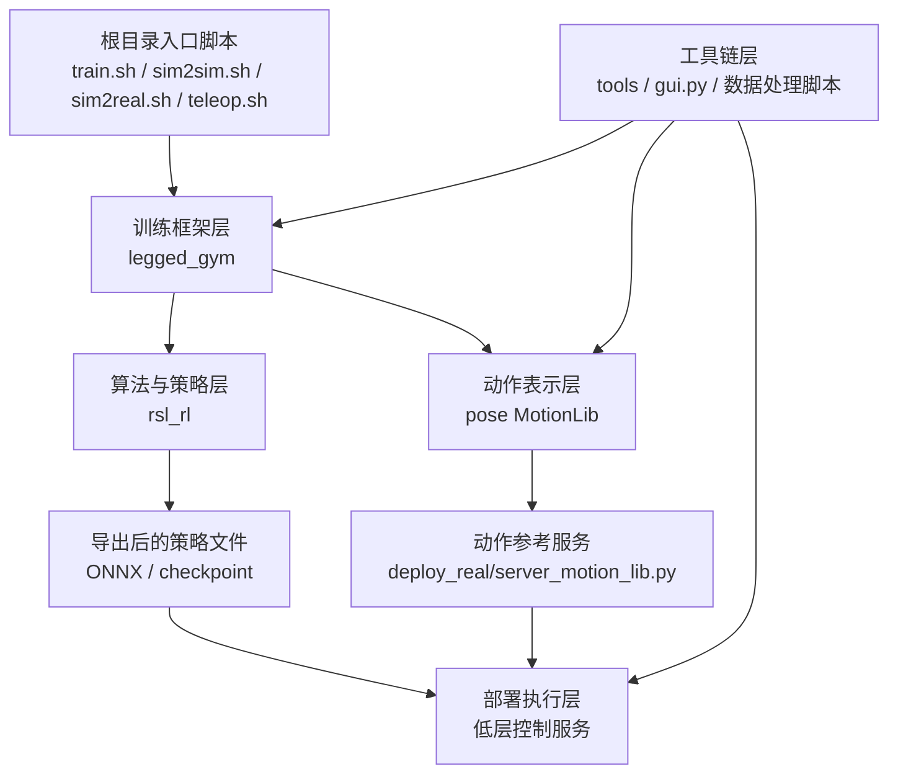
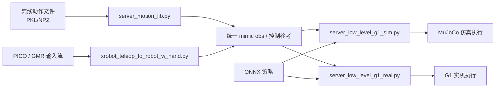

本页位于“深入解析 / 系统目标与整体架构”中的当前节点，目标不是讲某一条训练命令或某一个部署细节，而是回答一个更基础的问题：**TWIST2 仓库如何在代码组织上，把训练、动作表示、在线/离线部署服务以及外围工具链拆成相互配合的层次**。从仓库自述可以直接验证，这个项目同时覆盖了控制器训练、控制器部署、遥操作数据采集、在线重定向，以及多个独立安装的子项目，因此它天然不是单体脚本，而是一个由若干职责分区组成的系统。Sources: [README.md](README.md#L31-L56) [README.md](README.md#L129-L184)

## 一眼看懂：仓库分层的核心判断

从第一性原理看，TWIST2 至少要解决四类不同问题：**策略如何训练、动作如何表示、策略如何执行、流程如何被评测与运维**。仓库中的实际代码也正好沿这四个问题分层：`legged_gym` 负责环境与任务注册，`rsl_rl` 负责算法与策略网络，`pose` 负责动作库与运动数据读取，`deploy_real` 负责实时服务与机器人/仿真接入，而根目录脚本与 `tools` 则承担入口编排、导出、评测和数据处理。这种分层不是抽象命名，而是被安装方式、调用方式和运行脚本直接固定下来的。Sources: [README.md](README.md#L46-L56) [train.sh](train.sh#L46-L69) [sim2sim.sh](sim2sim.sh#L4-L14) [run_motion_server.sh](run_motion_server.sh#L8-L22)

下面这张图可以把仓库理解成一个“**训练产出策略，动作服务产出参考观测，部署服务消费两者，工具链围绕全生命周期提供支持**”的分层结构。Sources: [legged_gym/legged_gym/scripts/train.py](legged_gym/legged_gym/scripts/train.py#L144-L153) [deploy_real/server_motion_lib.py](deploy_real/server_motion_lib.py#L122-L149) [deploy_real/server_low_level_g1_sim.py](deploy_real/server_low_level_g1_sim.py#L106-L114)



## 仓库的四层结构与职责边界

如果把仓库按“谁生成什么、谁消费什么”来拆分，可以得到一个稳定的四层模型。训练框架层生成可学习环境与任务；动作表示层生成可索引的动作帧和 mimic 观测；部署服务层把参考动作与策略推理接成实时闭环；工具链层则把训练、评测、导出、GUI 运维、数据转换这些横切需求收拢在一起。这个划分与目录结构、脚本入口和类之间的调用路径是一致的。Sources: [legged_gym/legged_gym/envs/__init__.py](legged_gym/legged_gym/envs/__init__.py#L80-L118) [pose/pose/utils/motion_lib_pkl.py](pose/pose/utils/motion_lib_pkl.py#L41-L60) [deploy_real/server_low_level_g1_real.py](deploy_real/server_low_level_g1_real.py#L92-L120) [tools/gym_exec_eval.py](tools/gym_exec_eval.py#L3-L16)

| 分层 | 主要目录/文件 | 直接职责 | 产出/消费对象 |
|---|---|---|---|
| 训练框架层 | `legged_gym`、`rsl_rl` | 注册任务、创建环境、实例化 runner 与策略、执行 RL/DAgger 类训练 | 产出 checkpoint、训练日志；消费环境观测与配置 |
| 动作表示层 | `pose`、`deploy_real/server_motion_lib.py` | 加载 PKL/NPZ/YAML 动作，按时间步重建 motion frame，拼装 mimic obs | 产出 35 维 mimic 观测；消费动作文件 |
| 部署服务层 | `deploy_real/server_low_level_g1_sim.py`、`deploy_real/server_low_level_g1_real.py`、`xrobot_teleop_to_robot_w_hand.py` | 策略推理、仿真/实机低层执行、遥操作流接入 | 消费 ONNX 策略与 mimic obs；产出关节动作与实时服务状态 |
| 工具链层 | 根目录 `.sh`、`tools/`、`gui.py` | 启动编排、评测、导出、数据清洗与图形管理 | 消费训练结果/动作数据；产出报表、模型、进程控制入口 |

表中的每一项都能在代码中找到明确锚点：训练入口由 `train.sh` 跳转到 `legged_gym/legged_gym/scripts/train.py`；评测器支持通过 runner 或 ONNX 两类策略来源；部署入口分别对应 sim2sim、sim2real 和 teleop 三套脚本；而 `gui.py` 则提供统一控制中心。Sources: [train.sh](train.sh#L46-L69) [legged_gym/legged_gym/scripts/train.py](legged_gym/legged_gym/scripts/train.py#L98-L153) [tools/gym_exec_eval.py](tools/gym_exec_eval.py#L13-L20) [sim2real.sh](sim2real.sh#L12-L19) [teleop.sh](teleop.sh#L5-L19) [gui.py](gui.py#L1-L16)

## 训练框架层：`legged_gym` 负责任务，`rsl_rl` 负责学习

训练相关代码不是散落在根目录脚本里，而是清晰地下沉到两个子项目中：`legged_gym` 被声明为 “Isaac Gym environments for Legged Robots”，并依赖 `rsl-rl`；`rsl_rl` 则被声明为 “Fast and simple RL algorithms implemented in pytorch”。这说明仓库在包级别就已经把“环境/任务”和“算法/网络”分成两层。Sources: [legged_gym/setup.py](legged_gym/setup.py#L4-L15) [rsl_rl/setup.py](rsl_rl/setup.py#L3-L16)

在运行时，这种分层进一步体现在 `train.py` 的装配逻辑上：脚本先导入 `legged_gym.envs` 触发任务注册，再通过 `task_registry.make_env()` 创建环境，通过 `task_registry.make_alg_runner()` 创建训练器，最后调用 `learn()` 启动训练。也就是说，**训练框架层的中轴不是某个单独环境类，而是 task registry 这套“任务名 → 环境配置/训练配置/runner”的映射机制**。Sources: [legged_gym/legged_gym/scripts/train.py](legged_gym/legged_gym/scripts/train.py#L34-L37) [legged_gym/legged_gym/scripts/train.py](legged_gym/legged_gym/scripts/train.py#L144-L147) [legged_gym/legged_gym/gym_utils/task_registry.py](legged_gym/legged_gym/gym_utils/task_registry.py#L45-L66) [legged_gym/legged_gym/gym_utils/task_registry.py](legged_gym/legged_gym/gym_utils/task_registry.py#L112-L163)

`legged_gym/envs/__init__.py` 则揭示了训练框架层的第二个特点：**同一套底层环境框架承载多个 G1 任务变体**。文件中注册了 `g1_mimic`、`g1_priv_mimic`、`g1_stu_future`，以及 diffusion、MoE、Transformer、HyFeat 等变体。这证明仓库总体分层不是“每个研究方向一套独立仓库”，而是“共享环境骨架 + 多任务名扩展”的组织方式。Sources: [legged_gym/legged_gym/envs/__init__.py](legged_gym/legged_gym/envs/__init__.py#L80-L118)

`rsl_rl` 在这之下承担的是算法与模型执行层。`OnPolicyRunner` 从环境读取观测维度与历史长度，根据 `policy_class_name` 选择策略类，并在需要时做 DDP 包装、观测归一化与 rollout storage 初始化。这里可以看出，**`rsl_rl` 不定义具体机器人任务，它接收一个通用 VecEnv，并把策略网络、优化器、存储和训练循环组织起来**。Sources: [rsl_rl/rsl_rl/runners/on_policy_runner.py](rsl_rl/rsl_rl/runners/on_policy_runner.py#L56-L86) [rsl_rl/rsl_rl/runners/on_policy_runner.py](rsl_rl/rsl_rl/runners/on_policy_runner.py#L89-L134) [rsl_rl/rsl_rl/runners/on_policy_runner.py](rsl_rl/rsl_rl/runners/on_policy_runner.py#L159-L200)

从策略模块本身看，`actor_critic_future.py` 中的 `MotionEncoder` 和 `HistoryEncoder` 都是围绕时序输入设计的编码器，说明在仓库分层里，**策略网络层感知的是“历史/未来窗口化观测”这种抽象输入，而不是具体的数据文件格式或 Redis 通信细节**。这也强化了分层边界：动作文件怎么存、部署服务怎么传，不应该侵入策略模块内部。Sources: [rsl_rl/rsl_rl/modules/actor_critic_future.py](rsl_rl/rsl_rl/modules/actor_critic_future.py#L71-L85) [rsl_rl/rsl_rl/modules/actor_critic_future.py](rsl_rl/rsl_rl/modules/actor_critic_future.py#L109-L166) [rsl_rl/rsl_rl/modules/actor_critic_future.py](rsl_rl/rsl_rl/modules/actor_critic_future.py#L169-L199)

## 动作表示层：`pose` 提供动作库，`server_motion_lib.py` 提供统一参考观测

`pose` 子项目在包级别被定义为 “Advanced motion retargeter”，其目录下的 `utils/motion_lib.py`、`motion_lib_pkl.py`、`util_funcs/kinematics_model.py` 等文件名，也显示它承担的是运动数据与运动学相关能力，而不是训练调度或机器人控制。Sources: [pose/setup.py](pose/setup.py#L1-L11)

真正体现这个层次核心价值的是 `pose/pose/utils/motion_lib_pkl.py`。`MotionLib` 的初始化参数覆盖了 `motion_file`、懒加载、CPU/GPU 缓存、采样比例、motion id 选择、是否打乱、存储精度，以及 DDP 分片控制等选项。换句话说，这一层解决的是：**如何把大量动作文件稳定地组织成一个可抽样、可缓存、可按设备迁移的统一动作库**。Sources: [pose/pose/utils/motion_lib_pkl.py](pose/pose/utils/motion_lib_pkl.py#L41-L60) [pose/pose/utils/motion_lib_pkl.py](pose/pose/utils/motion_lib_pkl.py#L61-L90) [pose/pose/utils/motion_lib_pkl.py](pose/pose/utils/motion_lib_pkl.py#L148-L175)

在仓库总体分层中，更关键的是动作库并不直接服务于训练脚本或遥操作脚本，而是通过一个**中间标准表示**向上下游供给数据。`deploy_real/server_motion_lib.py` 中的 `build_mimic_obs()` 明确把 motion frame 重组成一个 35 维向量，其构成为局部 xy 速度、root z、高度姿态中的 roll/pitch、局部 yaw 角速度以及 dof_pos；函数最后输出 mimic obs、root pose、dof_pos、速度等多个结果。于是动作表示层的边界就很清晰：它不做策略推理，但它负责把原始运动序列翻译成部署层和训练层都能理解的观测形式。Sources: [deploy_real/server_motion_lib.py](deploy_real/server_motion_lib.py#L20-L41) [deploy_real/server_motion_lib.py](deploy_real/server_motion_lib.py#L68-L98)

这个层次关系还体现在依赖方向上：`server_motion_lib.py` 从 `pose.utils.motion_lib_pkl` 导入 `MotionLib`，并在主循环中按控制周期计算 motion length、构建 step 列表、持续向外发布动作观测。因此，**`pose` 是数据模型层，`server_motion_lib.py` 是服务化适配层**；前者关注“动作怎么存和怎么取”，后者关注“动作怎么按时间流式提供”。Sources: [deploy_real/server_motion_lib.py](deploy_real/server_motion_lib.py#L14-L18) [deploy_real/server_motion_lib.py](deploy_real/server_motion_lib.py#L122-L149) [deploy_real/server_motion_lib.py](deploy_real/server_motion_lib.py#L175-L199)

## 部署服务层：低层控制、动作流与遥操作输入被拆成独立进程

README 对 sim2sim 和 sim2real 的使用说明已经直接写出一个关键架构事实：**高层控制与低层控制是分开的**。在仿真验证时，先运行高层 motion server 预热 Redis，再运行低层控制器；之后可以再开启离线动作流或在线 PICO teleop 来接管高层输入。这个顺序本身就是部署服务分层的外部表现。Sources: [README.md](README.md#L215-L229) [README.md](README.md#L241-L256) [README.md](README.md#L264-L287)

从脚本入口看，这一层至少分为三类服务。`sim2sim.sh` 启动 `server_low_level_g1_sim.py`，绑定 MuJoCo XML、ONNX 策略和执行频率；`sim2real.sh` 启动 `server_low_level_g1_real.py`，绑定策略、网卡和手部选项；`run_motion_server.sh` 启动 `server_motion_lib.py`，提供离线动作流；`teleop.sh` 则启动 `xrobot_teleop_to_robot_w_hand.py`，接入在线遥操作。根目录脚本因此更像是“服务装配器”，而不是业务逻辑本体。Sources: [sim2sim.sh](sim2sim.sh#L1-L14) [sim2real.sh](sim2real.sh#L3-L19) [run_motion_server.sh](run_motion_server.sh#L17-L23) [teleop.sh](teleop.sh#L12-L19)

`server_low_level_g1_sim.py` 和 `server_low_level_g1_real.py` 共享同一种部署核心：都把 ONNX 模型包装成 `OnnxPolicyWrapper`，都在控制器初始化时连接 Redis，都显式定义 `num_actions = 29` 与总观测维度 `1402`。这说明在仓库层次上，**仿真低层执行和实机低层执行是两种 backend，但共享同一份策略输入输出契约**。Sources: [deploy_real/server_low_level_g1_sim.py](deploy_real/server_low_level_g1_sim.py#L21-L39) [deploy_real/server_low_level_g1_sim.py](deploy_real/server_low_level_g1_sim.py#L97-L108) [deploy_real/server_low_level_g1_sim.py](deploy_real/server_low_level_g1_sim.py#L187-L199) [deploy_real/server_low_level_g1_real.py](deploy_real/server_low_level_g1_real.py#L25-L42) [deploy_real/server_low_level_g1_real.py](deploy_real/server_low_level_g1_real.py#L105-L120) [deploy_real/server_low_level_g1_real.py](deploy_real/server_low_level_g1_real.py#L131-L138)

而 `xrobot_teleop_to_robot_w_hand.py` 则代表了部署层中的另一类组件：它不是直接跑策略，而是把外部输入源转成 whole-body mimic 观测，并通过状态机管理 idle、teleop、pause、exit 等运行状态。文件头注释和 `extract_mimic_obs_whole_body()` 都表明，这一层的职责是**把人类遥操作流翻译成系统内部可消费的 35 维动作参考**。Sources: [deploy_real/xrobot_teleop_to_robot_w_hand.py](deploy_real/xrobot_teleop_to_robot_w_hand.py#L1-L24) [deploy_real/xrobot_teleop_to_robot_w_hand.py](deploy_real/xrobot_teleop_to_robot_w_hand.py#L82-L105) [deploy_real/xrobot_teleop_to_robot_w_hand.py](deploy_real/xrobot_teleop_to_robot_w_hand.py#L109-L120)

下面这个关系图可以帮助理解部署层内部的拆分：低层控制器不负责产生参考动作，motion server/teleop server 不负责执行策略，它们通过统一观测约定和 Redis 风格的跨进程通信形成闭环。Sources: [README.md](README.md#L223-L229) [deploy_real/server_motion_lib.py](deploy_real/server_motion_lib.py#L113-L120) [deploy_real/server_low_level_g1_sim.py](deploy_real/server_low_level_g1_sim.py#L99-L107)



## 工具链层：不是核心算法，却决定仓库可用性

TWIST2 的最后一层不是“可有可无的辅助脚本”，而是一组围绕主链路运转的工具链。README 给出的安装与使用路径显示，除了训练与部署本体，还存在 ONNX 导出、GUI 启动、teacher/student 评测、数据处理与记录等多个独立入口；这意味着仓库的整体架构从一开始就把“实验与工程操作”纳入了代码组织。Sources: [README.md](README.md#L184-L187) [README.md](README.md#L208-L213) [README.md](README.md#L290-L302)

`tools/gym_exec_eval.py` 是这一层的典型代表。文件说明它是面向 TWIST2 policy 的 IsaacGym/legged_gym evaluator，可从 runner checkpoint 或 standalone ONNX 两种来源加载策略，并按 MotionLib 风格 YAML 批量评测动作。也就是说，**工具链层不会重新实现训练或部署逻辑，而是复用主系统的数据结构与加载约定，完成横向的评测与分析工作**。Sources: [tools/gym_exec_eval.py](tools/gym_exec_eval.py#L3-L16) [tools/gym_exec_eval.py](tools/gym_exec_eval.py#L18-L25)

GUI 也属于工具链层而非部署核心层。`gui.sh` 只负责激活环境后启动 `gui.py`，而 README 明确列出 GUI 可以统一管理仿真控制器、实机控制器、高层动作流、PICO teleop、数据采集、neck controller、ZED streaming 等服务。因此它在总体分层中的意义是**统一入口与进程编排面板**，不是策略算法的一部分。Sources: [gui.sh](gui.sh#L2-L4) [README.md](README.md#L290-L302) [gui.py](gui.py#L1-L16)

## 视觉化项目结构：按职责而不是按文件数理解目录

如果只看目录名，仓库会显得很大；但按职责聚合后，顶层结构其实很稳定：三个可安装子项目负责核心能力，一个 `deploy_real` 目录负责实时服务，一组根目录脚本负责编排，一组 `tools` 文件负责外围处理。下面这个结构图适合在阅读代码前先建立心理地图。Sources: [README.md](README.md#L46-L56) [train.sh](train.sh#L24-L35) [run_motion_server.sh](run_motion_server.sh#L17-L23) [tools/gym_exec_eval.py](tools/gym_exec_eval.py#L3-L16)

```text
TWIST2/
├── legged_gym/         # 环境、任务注册、训练脚本
├── rsl_rl/             # RL 算法、runner、策略模块、存储
├── pose/               # MotionLib、运动学与动作数据读取
├── deploy_real/        # 低层控制服务、动作流服务、teleop 与数据处理
├── tools/              # 评测、数据统计、转换、辅助脚本
├── assets/             # 模型权重、示例动作、机器人 XML/URDF 资产
├── *.sh                # 顶层编排脚本：train / sim2sim / sim2real / teleop / gui
└── README.md           # 安装、运行与高层使用路径
```

## 模块交互：谁依赖谁，谁不该跨层

从代码依赖关系看，这个仓库的合理阅读顺序应遵循“上层装配、下层提供能力”的方向。`train.sh` 调 `legged_gym/scripts/train.py`，而后者再调 task registry 和 `rsl_rl` runner；`server_motion_lib.py` 依赖 `pose.MotionLib` 来取动作帧；低层控制服务只依赖 ONNX 策略和实时观测，不直接读取训练器实现。这个方向说明仓库总体分层遵守了一个重要原则：**越靠近实时部署，越依赖稳定的数据契约；越靠近训练研究，越依赖可替换的任务和策略实现**。Sources: [train.sh](train.sh#L46-L69) [legged_gym/legged_gym/scripts/train.py](legged_gym/legged_gym/scripts/train.py#L144-L147) [deploy_real/server_motion_lib.py](deploy_real/server_motion_lib.py#L14-L18) [deploy_real/server_low_level_g1_real.py](deploy_real/server_low_level_g1_real.py#L119-L138)

| 交互方向 | 上游模块 | 下游模块 | 体现的分层原则 |
|---|---|---|---|
| 训练装配 | 根目录脚本 | `legged_gym` / `rsl_rl` | 顶层只负责编排，不承载训练实现 |
| 动作服务 | `pose.MotionLib` | `server_motion_lib.py` | 原始动作与流式服务分离 |
| 部署推理 | ONNX policy | 低层控制服务 | 训练产物与执行 backend 解耦 |
| 运维评测 | `tools` / `gui.py` | 主系统各层 | 复用主系统约定，不重写主逻辑 |

这张表背后的实际价值是：阅读或改造仓库时，应优先在所属层内定位问题，而不是跨层追代码。例如环境问题先看 `legged_gym`，策略形状问题看 `rsl_rl`，动作重建问题看 `pose` 与 `server_motion_lib.py`，服务启动与流程管理问题则看 `deploy_real` 与顶层脚本。Sources: [legged_gym/legged_gym/envs/__init__.py](legged_gym/legged_gym/envs/__init__.py#L80-L118) [rsl_rl/rsl_rl/runners/on_policy_runner.py](rsl_rl/rsl_rl/runners/on_policy_runner.py#L64-L86) [pose/pose/utils/motion_lib_pkl.py](pose/pose/utils/motion_lib_pkl.py#L154-L175) [sim2sim.sh](sim2sim.sh#L4-L14)

## 这页之后应该怎么继续读

如果你已经理解本页的总体分层，下一步最自然的阅读路径有三条。想继续顺着训练框架深入，建议读 [任务注册体系与 G1 系列环境族谱](18-ren-wu-zhu-ce-ti-xi-yu-g1-xi-lie-huan-jing-zu-pu)；想继续顺着部署服务理解进程协作，建议读 [低层控制服务：MuJoCo 仿真、PD 参数与 29 自由度动作接口](26-di-ceng-kong-zhi-fu-wu-mujoco-fang-zhen-pd-can-shu-yu-29-zi-you-du-dong-zuo-jie-kou) 与 [动作参考服务：将数据集片段重建为 35 维 mimic 观测](27-dong-zuo-can-kao-fu-wu-jiang-shu-ju-ji-pian-duan-zhong-jian-wei-35-wei-mimic-guan-ce)；如果你更关心三个子项目的边界，则可以继续看 [legged_gym、rsl_rl 与 pose 三个子项目各自承担的职责](34-legged_gym-rsl_rl-yu-pose-san-ge-zi-xiang-mu-ge-zi-cheng-dan-de-zhi-ze)。Sources: [legged_gym/legged_gym/envs/__init__.py](legged_gym/legged_gym/envs/__init__.py#L77-L119) [deploy_real/server_low_level_g1_sim.py](deploy_real/server_low_level_g1_sim.py#L187-L199) [deploy_real/server_motion_lib.py](deploy_real/server_motion_lib.py#L68-L98) [README.md](README.md#L46-L56)