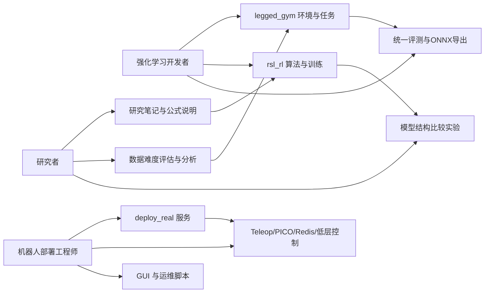
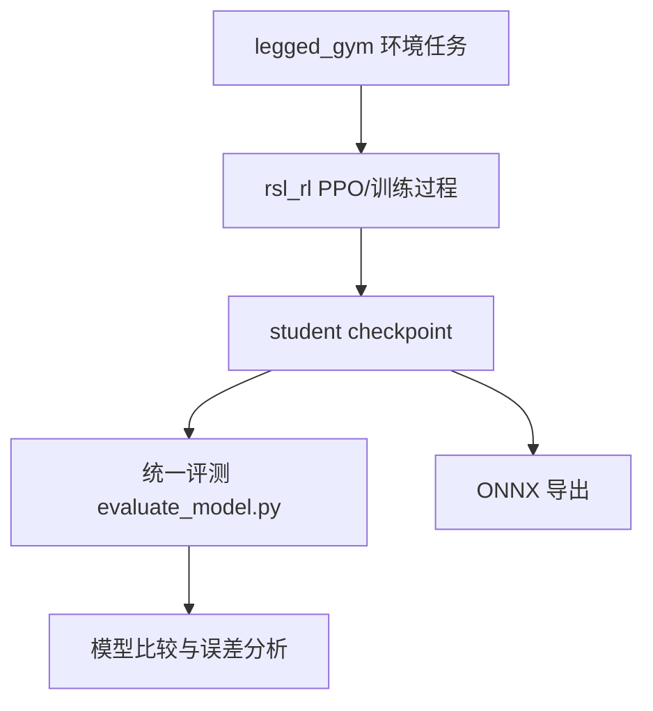
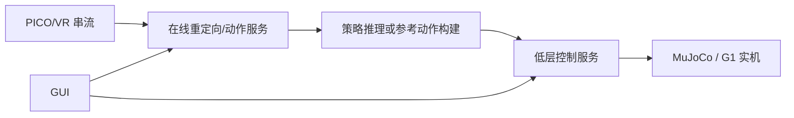

本页的目的不是解释某一条训练命令、某一个部署服务，或某一篇研究笔记的细节，而是先回答一个更基础的问题：**TWIST2 这套仓库到底分别适合哪三类读者进入，且他们进入后应该优先关注什么**。从仓库首页、训练说明、遥操作文档、实物部署文档，以及研究笔记目录可以验证，这个仓库并不是单一用途代码，而是同时覆盖了**策略训练、统一评测、在线遥操作、仿真/实机执行，以及研究分析沉淀**几个层面，因此天然服务于三类不同但相互关联的读者。Sources: [README.md](README.md#L31-L56) [README.md](README.md#L186-L200) [train_eval_student.md](train_eval_student.md#L1-L18) [doc/TELEOP.md](doc/TELEOP.md#L1-L37) [doc/unitree_g1.zh.md](doc/unitree_g1.zh.md#L1-L18)

## 仓库首先是一条“训练—评测—部署—数据回流”的复合链路

在阅读受众之前，先建立一个必要前提：TWIST2 并不是只为“训练模型的人”准备的。README 明确把 `twist2` 环境用于控制器训练、控制器部署和 teleop 数据采集，同时单独引入 `gmr` 环境负责在线动作重定向；而根目录又同时存在 `evaluate_model.py`、`deploy_real/`、`gui.py`、`note/` 等入口。这说明仓库的组织方式本身就在提示三种阅读姿态：有人会从强化学习训练进入，有人会从机器人执行链路进入，也有人会从实验解释与方法复用进入。Sources: [README.md](README.md#L31-L33) [README.md](README.md#L46-L56) [README.md](README.md#L129-L181) [EVAL_README.md](EVAL_README.md#L1-L6) [gui.py](gui.py#L1-L4)

为了帮助你快速判断自己的位置，下面这个关系图把三类读者和仓库中的主通道对应起来。图中的连线只表达“高频关注关系”，不表示严格边界，因为这三个角色在真实工作中经常交叉。Sources: [README.md](README.md#L186-L200) [train_eval_student.md](train_eval_student.md#L47-L88) [doc/TELEOP.md](doc/TELEOP.md#L11-L37) [note/ddp_tutorial.md](note/ddp_tutorial.md#L85-L107)

## 三类核心读者的判别标准

如果你打开仓库后的第一反应是“我想训练或改进一个模仿/跟踪策略”，那你更接近**强化学习开发者**。因为仓库中明确给出了 `g1_stu_future` 的训练入口、teacher checkpoint 约定、anti-shuffle 参数、DDP 训练方法，以及 `legged_gym/legged_gym/envs/g1/` 下面一组围绕 G1 的环境配置文件，这些都是典型的训练系统阅读入口，而不是部署人员会首先关注的内容。Sources: [train_eval_student.md](train_eval_student.md#L1-L18) [train_eval_student.md](train_eval_student.md#L47-L120) [note/ddp_tutorial.md](note/ddp_tutorial.md#L85-L107)

如果你打开仓库后的第一反应是“我怎样让机器人或仿真先跑起来，怎么接 VR、怎么接低层控制、怎么启动数据录制”，那你更接近**机器人部署工程师**。因为文档里已经把 teleop 管线拆成设备准备、VR 连接、whole-body 数据串流、sim2sim、data record、sim2real 等阶段；同时 `deploy_real/` 目录也集中放置了低层服务、数据录制、动作库服务、在线重定向与仿真运行器，这些都指向一条以系统接线、进程编排和执行稳定性为中心的阅读路径。Sources: [doc/TELEOP.md](doc/TELEOP.md#L4-L37) [doc/TELEOP.md](doc/TELEOP.md#L38-L84) [README.md](README.md#L87-L119) [README.md](README.md#L146-L181)

如果你打开仓库后的第一反应是“这个系统的建模假设是什么、指标怎么解释、难度如何定义、不同结构怎么比较”，那你更接近**研究者**。仓库中不仅有通用评测说明，还保留了关于 actor-critic 前向数学、DAgger/PPO、动作难度评估、训练指标、缓存系统、DDP 实现解析等笔记。这类内容的目标不是让你最快跑通系统，而是让你能复现、分析、比较和扩展方法。Sources: [EVAL_README.md](EVAL_README.md#L3-L30) [note/actor_critic_forward_math_notes.md](note/actor_critic_forward_math_notes.md#L1-L8) [note/dataset_difficulty_evaluation_guide.md](note/dataset_difficulty_evaluation_guide.md#L1-L15) [note/training_metrics_guide.md](note/training_metrics_guide.md#L1-L18)

## 三类读者分别会从哪些证据判断“这是给我看的”

下表不是主观分类，而是直接依据仓库中已经存在的入口文件与目录职责做出的受众映射。你可以把它当成“读者—目标—仓库区域”的对照表。Sources: [README.md](README.md#L31-L56) [train_eval_student.md](train_eval_student.md#L47-L88) [EVAL_README.md](EVAL_README.md#L32-L83) [doc/TELEOP.md](doc/TELEOP.md#L11-L37) [doc/unitree_g1.zh.md](doc/unitree_g1.zh.md#L9-L18)

| 读者类型 | 主要目标 | 首要关注区域 | 典型入口文件 |
|---|---|---|---|
| 强化学习开发者 | 训练、蒸馏、续训、评测、导出模型 | `legged_gym/`、`rsl_rl/`、评测脚本、训练说明 | `train_eval_student.md`、`EVAL_README.md`、`README.md` |
| 机器人部署工程师 | 打通 teleop、sim2sim、sim2real、录制与服务协同 | `deploy_real/`、`doc/TELEOP.md`、GUI 与脚本 | `doc/TELEOP.md`、`doc/unitree_g1.zh.md`、`deploy_real/run_simulation.py`、`gui.py` |
| 研究者 | 理解方法、分析指标、比较结构、整理实验依据 | `note/`、评测说明、环境与模型配置 | `note/*.md`、`EVAL_README.md`、`train_eval_student.md` |

表中的三种读者之所以能被清晰区分，是因为仓库本身就呈现出三种不同的信息密度：训练入口强调**任务名、checkpoint 约定与参数控制**；部署入口强调**设备、网络接口、按键、服务时序**；研究入口强调**定义、公式、指标和分析方法**。这三种文档语气并不相同，因此读者也能据此快速定位自己的主阅读路线。Sources: [train_eval_student.md](train_eval_student.md#L7-L18) [train_eval_student.md](train_eval_student.md#L47-L107) [doc/TELEOP.md](doc/TELEOP.md#L38-L84) [doc/unitree_g1.zh.md](doc/unitree_g1.zh.md#L20-L72) [note/training_metrics_guide.md](note/training_metrics_guide.md#L23-L39)

## 面向强化学习开发者：这是一个以 G1 模仿/未来观测训练为中心的工作台

对强化学习开发者而言，这个仓库最直接的价值在于：它已经把**任务环境、算法实现、训练脚本、评测脚本、导出路径**拼成了一条可执行链。`train_eval_student.md` 明确指出 student 任务是 `g1_stu_future`，对应 `legged_gym/legged_gym/envs/g1/g1_mimic_future_config.py`；同时它还给出 teacher 路径约定、单卡/多卡训练、续训、评测和 ONNX 导出方式。也就是说，这类读者不需要先理解 teleop 全链路，也能从“任务—checkpoint—评测”的角度直接进入仓库主干。Sources: [train_eval_student.md](train_eval_student.md#L1-L18) [train_eval_student.md](train_eval_student.md#L47-L68) [train_eval_student.md](train_eval_student.md#L90-L168)

更重要的是，这个仓库对强化学习开发者并不只是“一个训练脚本集合”，而是一个带有任务家族演化痕迹的实验平台。`legged_gym/legged_gym/envs/g1/` 下不仅有 `g1_mimic.py`，还有 `g1_mimic_distill.py`、`g1_mimic_future.py`、`g1_mimic_hyfeat.py`，以及 MoE、Transformer、Diffusion 对应配置文件，这意味着代码组织天然支持“同一机器人平台上的多变体比较”，非常适合需要切换建模假设、结构开关与训练策略的开发者。Sources: [legged_gym/setup.py](legged_gym/setup.py#L4-L15) [EVAL_README.md](EVAL_README.md#L163-L168)

下面这个模块关系图展示了强化学习开发者通常会穿过的核心通道：从环境定义进入训练，再进入评测与导出，而不是先去理解低层实机服务。Sources: [train_eval_student.md](train_eval_student.md#L47-L88) [EVAL_README.md](EVAL_README.md#L32-L83) [rsl_rl/README.md](rsl_rl/README.md#L1-L6)

如果你属于这一类读者，最适合继续阅读的是先建立系统视图，再进入训练细节：先读 [仓库总体分层：训练框架、动作表示、部署服务与工具链](16-cang-ku-zong-ti-fen-ceng-xun-lian-kuang-jia-dong-zuo-biao-shi-bu-shu-fu-wu-yu-gong-ju-lian)，再读 [任务注册体系与 G1 系列环境族谱](18-ren-wu-zhu-ce-ti-xi-yu-g1-xi-lie-huan-jing-zu-pu)、[学生环境的核心思想：未来动作观测、特权信息与课程遮罩](19-xue-sheng-huan-jing-de-he-xin-si-xiang-wei-lai-dong-zuo-guan-ce-te-quan-xin-xi-yu-ke-cheng-zhe-zhao)，最后进入 [教师到学生的蒸馏机制：g1_priv_mimic 与 g1_stu_future 的配合关系](20-jiao-shi-dao-xue-sheng-de-zheng-liu-ji-zhi-g1_priv_mimic-yu-g1_stu_future-de-pei-he-guan-xi) 与 [统一评测器的设计：兼容 PT 与 ONNX、MLP、MoE、Transformer](23-tong-ping-ce-qi-de-she-ji-jian-rong-pt-yu-onnx-mlp-moe-transformer)。Sources: [train_eval_student.md](train_eval_student.md#L1-L4) [EVAL_README.md](EVAL_README.md#L1-L6) [EVAL_README.md](EVAL_README.md#L163-L168)

## 面向机器人部署工程师：这是一个围绕多进程服务与设备链路组织的执行系统

对机器人部署工程师来说，TWIST2 最鲜明的特征不是 PPO，而是**系统编排复杂度**。README 一方面要求 Redis、ONNXRuntime、Unitree SDK、PICO SDK、GMR 等组件，另一方面又把 teleop、sim2sim、sim2real 放在同一条使用链上；这意味着部署工程师面对的核心任务是“让服务协同工作”，而不是“调一个 loss”。Sources: [README.md](README.md#L46-L56) [README.md](README.md#L58-L84) [README.md](README.md#L87-L119) [README.md](README.md#L146-L181)

`doc/TELEOP.md` 把这条链路拆得非常清楚：先启动 G1、neck server、ZED 相关服务，再完成 VR 校准和 whole-body 数据串流，然后先走 teleop in mujoco 与 sim2sim，最后进入 data recording 和 sim2real。这个顺序本身就说明，部署工程师的阅读优先级是**阶段依赖关系**，不是算法模块抽象。Sources: [doc/TELEOP.md](doc/TELEOP.md#L4-L37)

`deploy_real/run_simulation.py` 则进一步提供了部署工程师关心的技术证据：它同时加载 ONNX policy、动作库 `MotionLib`、MuJoCo 模型，并在一个运行器里组织策略推理、mimic observation 构建、29 维动作接口、仿真时间步与 PD 参数。这表明对部署读者而言，仓库提供的是一个可连接“模型文件—动作参考—执行器”的运行骨架。Sources: [deploy_real/run_simulation.py](deploy_real/run_simulation.py#L22-L61) [deploy_real/run_simulation.py](deploy_real/run_simulation.py#L64-L132) [deploy_real/run_simulation.py](deploy_real/run_simulation.py#L135-L200)

为了让这类读者快速把握职责边界，可以把部署链路理解成下面这个模块交互图：PICO/VR 提供输入，重定向与动作服务提供参考，低层控制与仿真/实机服务负责执行，GUI 则承担进程管理和运维入口。Sources: [doc/TELEOP.md](doc/TELEOP.md#L11-L37) [deploy_real/run_simulation.py](deploy_real/run_simulation.py#L149-L173) [gui.py](gui.py#L132-L199)

如果你属于这一类读者，建议不要从训练任务页面开始，而是优先阅读 [仓库总体分层：训练框架、动作表示、部署服务与工具链](16-cang-ku-zong-ti-fen-ceng-xun-lian-kuang-jia-dong-zuo-biao-shi-bu-shu-fu-wu-yu-gong-ju-lian)、[低层控制服务：MuJoCo 仿真、PD 参数与 29 自由度动作接口](26-di-ceng-kong-zhi-fu-wu-mujoco-fang-zhen-pd-can-shu-yu-29-zi-you-du-dong-zuo-jie-kou)、[Redis 在系统中的作用：跨进程通信、观测交换与服务解耦](28-redis-zai-xi-tong-zhong-de-zuo-yong-kua-jin-cheng-tong-xin-guan-ce-jiao-huan-yu-fu-wu-jie-ou)，随后再进入 [从 Teleop 到 Sim2Real：在线重定向、低层执行与数据录制协同](29-cong-teleop-dao-sim2real-zai-xian-zhong-ding-xiang-di-ceng-zhi-xing-yu-shu-ju-lu-zhi-xie-tong) 与 [PICO 遥操作流程的阶段划分：设备启动、标定、控制与录制](31-pico-yao-cao-zuo-liu-cheng-de-jie-duan-hua-fen-she-bei-qi-dong-biao-ding-kong-zhi-yu-lu-zhi)。Sources: [doc/TELEOP.md](doc/TELEOP.md#L4-L37) [gui.py](gui.py#L132-L199) [README.md](README.md#L146-L181)

## 面向研究者：这是一个保留了“方法解释层”的实验仓库

对研究者而言，TWIST2 的吸引力在于它没有把自己收缩成一个只有脚本、没有解释的工程仓库。`note/` 目录中系统保留了 actor-critic 前向数学、DAgger/PPO 教程、训练指标解释、动作难度评估、缓存系统与 DDP 解析等材料；这些内容说明仓库作者不仅关心“代码能跑”，也关心“方法如何被解释、比较与复用”。Sources: [note/actor_critic_forward_math_notes.md](note/actor_critic_forward_math_notes.md#L1-L8) [note/training_metrics_guide.md](note/training_metrics_guide.md#L1-L18) [note/dataset_difficulty_evaluation_guide.md](note/dataset_difficulty_evaluation_guide.md#L1-L15) [note/ddp_tutorial.md](note/ddp_tutorial.md#L85-L107)

此外，研究者会特别受益于统一评测与数据难度分析这两块内容。`EVAL_README.md` 明确说明 `evaluate_model.py` 兼容多种架构与格式，支持 completion score、mjpe/mpjpe、tracking error、keypoint error 等指标，并能按动作库分组统计；而难度评估指南则给出基于教师模型遍历动作、生成 difficulty score 并筛选数据集的工作流程。这意味着研究者可以直接把仓库当成一个**方法比较与数据诊断平台**使用，而不是仅仅把它当作某个单一模型的实现。Sources: [EVAL_README.md](EVAL_README.md#L3-L30) [EVAL_README.md](EVAL_README.md#L150-L168) [note/dataset_difficulty_evaluation_guide.md](note/dataset_difficulty_evaluation_guide.md#L18-L47)

如果你是研究者，更适合的阅读顺序是先抓住解释框架，再挑实现对象：先读 [TWIST2 的核心价值：可扩展的人形全身数据采集与控制闭环](15-twist2-de-he-xin-jie-zhi-ke-kuo-zhan-de-ren-xing-quan-shen-shu-ju-cai-ji-yu-kong-zhi-bi-huan) 和 [仓库总体分层：训练框架、动作表示、部署服务与工具链](16-cang-ku-zong-ti-fen-ceng-xun-lian-kuang-jia-dong-zuo-biao-shi-bu-shu-fu-wu-yu-gong-ju-lian)，然后进入 [奖励设计与训练技巧：跟踪项、稳定性项与 anti-shuffle 抑制机制](21-jiang-li-she-ji-yu-xun-lian-ji-qiao-gen-zong-xiang-wen-ding-xing-xiang-yu-anti-shuffle-yi-zhi-ji-zhi)、[动作课程学习、难度分数与误差感知采样机制](22-dong-zuo-ke-cheng-xue-xi-nan-du-fen-shu-yu-wu-chai-gan-zhi-cai-yang-ji-zhi)，最后再看 [比较实验入口：MoE、Transformer、Diffusion 与 HyFeat 变体](35-bi-jiao-shi-yan-ru-kou-moe-transformer-diffusion-yu-hyfeat-bian-ti) 与 [研究笔记与经验文档索引：DDP、训练指标、奖励分析与缓存系统](36-yan-jiu-bi-ji-yu-jing-yan-wen-dang-suo-yin-ddp-xun-lian-zhi-biao-jiang-li-fen-xi-yu-huan-cun-xi-tong)。Sources: [EVAL_README.md](EVAL_README.md#L163-L168) [note/training_metrics_guide.md](note/training_metrics_guide.md#L92-L120) [note/dataset_difficulty_evaluation_guide.md](note/dataset_difficulty_evaluation_guide.md#L49-L79)

## 三类读者的差异，不在“会不会写代码”，而在最先关心哪种稳定性

这三类读者最本质的差异，不是技术强弱，而是他们优先维护的“稳定性”不同。强化学习开发者优先维护的是**训练稳定性与模型表现**，因此会关注 reward、error、teacher/student 关系、DDP 与 checkpoint；部署工程师优先维护的是**运行稳定性与系统时序**，因此会关注 SDK、服务启动顺序、按键控制与执行接口；研究者优先维护的是**解释稳定性与实验可比较性**，因此会关注公式、指标定义、评测协议与数据筛选方法。Sources: [train_eval_student.md](train_eval_student.md#L18-L44) [note/training_metrics_guide.md](note/training_metrics_guide.md#L23-L39) [doc/TELEOP.md](doc/TELEOP.md#L38-L68) [EVAL_README.md](EVAL_README.md#L7-L30)

这种差异也解释了为什么 TWIST2 会同时包含脚本、文档、GUI 和研究笔记：它不是把所有人都拉进同一入口，而是为不同读者准备了不同的切入面。仓库首页提供系统安装与总体使用；训练文档提供明确任务入口；部署文档提供操作阶段；研究笔记提供解释与延展。**你不需要一次看完全部仓库，只需要先认清自己属于哪条主线。** Sources: [README.md](README.md#L24-L28) [README.md](README.md#L31-L56) [train_eval_student.md](train_eval_student.md#L47-L88) [doc/TELEOP.md](doc/TELEOP.md#L4-L37) [note/ddp_tutorial.md](note/ddp_tutorial.md#L1-L16)

## 你现在应该怎么选读

如果你的目标是“尽快改训练配置并开始做实验”，请从 [任务注册体系与 G1 系列环境族谱](18-ren-wu-zhu-ce-ti-xi-yu-g1-xi-lie-huan-jing-zu-pu) 继续；如果你的目标是“尽快让 teleop 或 sim2real 服务链跑通”，请从 [低层控制服务：MuJoCo 仿真、PD 参数与 29 自由度动作接口](26-di-ceng-kong-zhi-fu-wu-mujoco-fang-zhen-pd-can-shu-yu-29-zi-you-du-dong-zuo-jie-kou) 和 [从 Teleop 到 Sim2Real：在线重定向、低层执行与数据录制协同](29-cong-teleop-dao-sim2real-zai-xian-zhong-ding-xiang-di-ceng-zhi-xing-yu-shu-ju-lu-zhi-xie-tong) 继续；如果你的目标是“判断这个仓库是否适合承载你的研究问题”，请从 [奖励设计与训练技巧：跟踪项、稳定性项与 anti-shuffle 抑制机制](21-jiang-li-she-ji-yu-xun-lian-ji-qiao-gen-zong-xiang-wen-ding-xing-xiang-yu-anti-shuffle-yi-zhi-ji-zhi) 和 [比较实验入口：MoE、Transformer、Diffusion 与 HyFeat 变体](35-bi-jiao-shi-yan-ru-kou-moe-transformer-diffusion-yu-hyfeat-bian-ti) 继续。Sources: [train_eval_student.md](train_eval_student.md#L47-L88) [doc/TELEOP.md](doc/TELEOP.md#L17-L37) [EVAL_README.md](EVAL_README.md#L163-L168)