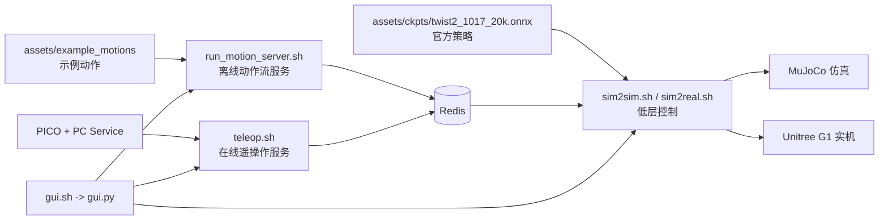
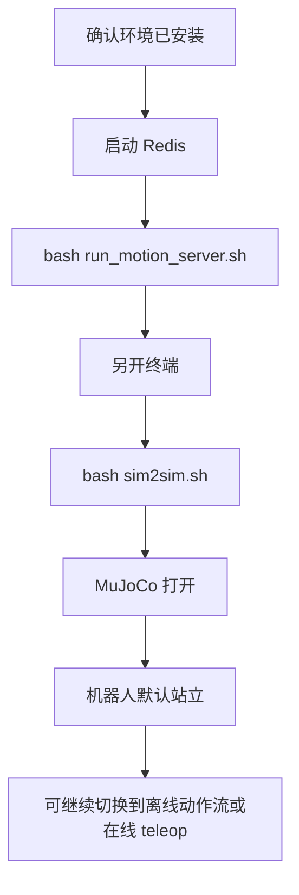
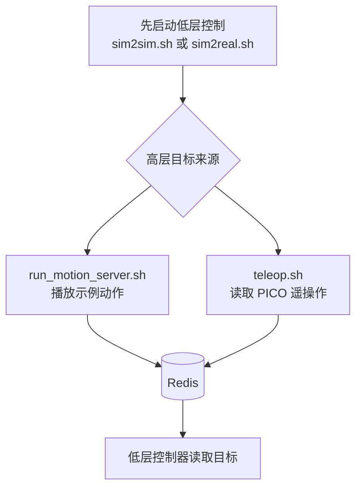

本页是你在“快速开始”阶段的**操作入口页**：它不展开讲每个依赖怎么安装，也不深入解释训练架构，而是帮你先建立一条可执行的最短路径——先知道仓库里哪些东西能直接跑，再按“环境准备 → 最小验证 → 仿真部署 → 遥操作 → 图形界面 → 训练评测入口”的顺序进入后续页面。你当前所在位置是 [快速上手](2-kuai-su-shang-shou)。Sources: [README.md](README.md#L31-L56), [README.md](README.md#L186-L303)

对初学者来说，TWIST2 这个仓库最重要的事实有三个：第一，仓库已经自带**示例动作**和**官方 ONNX 检查点**，因此你不必先训练模型才能验证链路；第二，系统把**高层动作来源**和**低层控制执行**分成了两个进程，通过 Redis 解耦；第三，仓库提供了 shell 脚本和 GUI 两种入口，适合先跑通再深入。Sources: [README.md](README.md#L122-L129), [README.md](README.md#L215-L303), [run_motion_server.sh](run_motion_server.sh#L1-L25), [sim2sim.sh](sim2sim.sh#L1-L15), [gui.sh](gui.sh#L1-L5)

## 你应该先形成的整体认识

如果只看“快速上手”，可以把 TWIST2 理解成一个由**资源、服务、控制器、界面**四部分组成的系统：`assets/` 提供动作和模型文件，`deploy_real/` 里放运行期服务，根目录脚本负责拼装常见流程，`gui.py` 则把这些流程包装成控制面板。Sources: [README.md](README.md#L124-L126), [run_motion_server.sh](run_motion_server.sh#L3-L22), [teleop.sh](teleop.sh#L3-L17), [sim2sim.sh](sim2sim.sh#L1-L15), [gui.py](gui.py#L652-L687)

下面这张图只展示**快速上手阶段真正会碰到的链路**。阅读它时可以先记住一句话：**低层控制器消费 Redis 中的目标动作，高层服务负责往 Redis 写入目标动作**。Sources: [README.md](README.md#L217-L229), [README.md](README.md#L241-L299), [deploy_real/server_low_level_g1_sim.py](deploy_real/server_low_level_g1_sim.py#L97-L107)



Sources: [README.md](README.md#L215-L303), [run_motion_server.sh](run_motion_server.sh#L1-L25), [teleop.sh](teleop.sh#L1-L21), [sim2sim.sh](sim2sim.sh#L1-L15), [sim2real.sh](sim2real.sh#L3-L19), [gui.py](gui.py#L652-L696)

## 仓库里和“首次上手”最相关的内容

对于第一次进入仓库的人，不需要一开始就理解全部子项目。先把下面这些路径认熟，就足够完成最小验证和常见启动操作。Sources: [get_dir_structure](.) , [README.md](README.md#L186-L303)

```text
TWIST2/
├── README.md                   # 官方安装与使用说明
├── assets/
│   ├── ckpts/                  # 已提供的 ONNX 策略
│   ├── example_motions/        # 可直接播放的示例动作
│   └── g1/                     # G1 机器人 XML / URDF 资源
├── deploy_real/
│   ├── server_low_level_g1_sim.py   # 仿真低层控制服务
│   ├── server_low_level_g1_real.py  # 实机低层控制服务
│   ├── server_motion_lib.py         # 离线动作流服务
│   └── xrobot_teleop_to_robot_w_hand.py # 在线遥操作服务
├── run_motion_server.sh        # 启动离线动作流
├── teleop.sh                   # 启动 PICO 在线遥操作
├── sim2sim.sh                  # 启动仿真低层控制
├── sim2real.sh                 # 启动实机低层控制
├── gui.sh                      # 启动图形控制中心
├── train.sh                    # 训练入口
└── eval.sh                     # 评测入口
```

Sources: [run_motion_server.sh](run_motion_server.sh#L1-L25), [teleop.sh](teleop.sh#L1-L21), [sim2sim.sh](sim2sim.sh#L1-L15), [sim2real.sh](sim2real.sh#L1-L21), [gui.sh](gui.sh#L1-L5), [train.sh](train.sh#L1-L70), [eval.sh](eval.sh#L1-L34)

## 先别急着装全部东西：按目标选择入口

TWIST2 实际上支持几种完全不同的起步方式。对新手来说，最推荐的是先走“最小验证”，因为它复用仓库自带 ONNX 和示例动作，排除了训练和外设接入的复杂性。Sources: [README.md](README.md#L124-L129), [README.md](README.md#L215-L255)

| 目标 | 你需要的最少条件 | 推荐入口 | 是否依赖外设 |
|---|---|---|---|
| 先确认仓库能跑起来 | 完成基础环境、Redis、MuJoCo/ONNXRuntime | `bash run_motion_server.sh` + `bash sim2sim.sh` | 否 |
| 想体验在线遥操作 | 额外准备 GMR、PICO SDK、PC Service | `bash teleop.sh` | 是 |
| 想直接管理常见服务 | 完成 `twist2` 环境和 GUI 依赖 | `bash gui.sh` | 否 |
| 想训练自己的策略 | 完成训练环境和数据准备 | `bash train.sh ...` | 否 |
| 想评测已有实验 | 已有实验 ID 或模型 | `bash eval.sh ...` | 否 |

Sources: [README.md](README.md#L31-L84), [README.md](README.md#L129-L181), [README.md](README.md#L192-L303), [gui.sh](gui.sh#L1-L5), [train.sh](train.sh#L1-L70), [eval.sh](eval.sh#L1-L34)

## 推荐阅读顺序

如果你现在还没装环境，下一步应该先看 [双 Conda 环境与核心依赖安装](3-shuang-conda-huan-jing-yu-he-xin-yi-lai-an-zhuang)，再看 [Isaac Gym、MuJoCo、Redis 与 ONNXRuntime 配置](4-isaac-gym-mujoco-redis-yu-onnxruntime-pei-zhi)。如果你计划做 PICO 遥操作，再继续看 [GMR、PICO SDK 与 Unitree SDK 的外部组件接入](5-gmr-pico-sdk-yu-pico-sdk-yu-unitree-sdk-de-wai-bu-zu-jian-jie-ru)。Sources: [README.md](README.md#L31-L84), [README.md](README.md#L87-L119), [README.md](README.md#L129-L181)

如果你已经把环境准备好了，建议按下面的顺序往下读：先看 [使用示例动作与官方 ONNX 检查点完成最小验证](6-shi-yong-shi-li-dong-zuo-yu-guan-fang-onnx-jian-cha-dian-wan-cheng-zui-xiao-yan-zheng)，确认基础链路可跑；再看 [运行仿真部署链路：从策略文件到 Sim2Sim](7-yun-xing-fang-zhen-bu-shu-lian-lu-cong-ce-lue-wen-jian-dao-sim2sim)；如果要接 PICO，则看 [启动遥操作链路：PICO 串流、姿态校准与控制按键](8-qi-dong-yao-cao-zuo-lian-lu-pico-chuan-liu-zi-tai-xiao-zhun-yu-kong-zhi-an-jian)；如果更喜欢图形化操作，则看 [通过图形控制中心管理常用服务与进程](9-tong-guo-tu-xing-kong-zhi-zhong-xin-guan-li-chang-yong-fu-wu-yu-jin-cheng)。Sources: [README.md](README.md#L215-L303), [gui.py](gui.py#L652-L696)

## 最短可执行路径：从零到“看到机器人站起来”

对于多数初学者，**最小成功标准**不是“已经学会训练”，而是“已经在仿真里成功启动低层控制，并能从高层服务接收到动作目标”。仓库 README 明确给出了一条两步路径：先启动高层 motion server 预热 Redis，再启动仿真低层控制器。Sources: [README.md](README.md#L215-L229), [run_motion_server.sh](run_motion_server.sh#L17-L22), [sim2sim.sh](sim2sim.sh#L4-L14)



Sources: [README.md](README.md#L58-L84), [README.md](README.md#L215-L255), [run_motion_server.sh](run_motion_server.sh#L1-L25), [sim2sim.sh](sim2sim.sh#L1-L15)

这条路径之所以适合作为第一步，是因为 `sim2sim.sh` 已经把策略路径默认指向 `assets/ckpts/twist2_1017_20k.onnx`，而 `run_motion_server.sh` 也默认选择了 `assets/example_motions/0807_yanjie_walk_001.pkl`。换句话说，仓库已经替你准备好了“一个动作源 + 一个策略文件 + 一个仿真执行器”的最小闭环。Sources: [sim2sim.sh](sim2sim.sh#L1-L15), [run_motion_server.sh](run_motion_server.sh#L3-L22), [README.md](README.md#L124-L129), [README.md](README.md#L186-L187)

## 这些脚本分别做什么

虽然根目录脚本名字很多，但“快速上手”阶段你只需要先理解 6 个。它们并不是独立系统，而是对常见运行方式的薄包装。Sources: [run_motion_server.sh](run_motion_server.sh#L1-L25), [teleop.sh](teleop.sh#L1-L21), [sim2sim.sh](sim2sim.sh#L1-L15), [sim2real.sh](sim2real.sh#L1-L21), [gui.sh](gui.sh#L1-L5), [train.sh](train.sh#L1-L70), [eval.sh](eval.sh#L1-L34)

| 脚本 | 作用 | 默认关键输入 | 适合什么时候用 |
|---|---|---|---|
| `run_motion_server.sh` | 启动离线动作流服务，向 Redis 推送动作目标 | 示例 `pkl` 动作、`localhost` Redis | 做最小验证、离线播放 |
| `teleop.sh` | 启动在线 PICO 遥操作服务 | `gmr` 环境、`actual_human_height=1.6`、`localhost` Redis | 有 PICO 设备时 |
| `sim2sim.sh` | 启动 MuJoCo 仿真低层控制 | 官方 ONNX、G1 sim2sim XML、CUDA | 验证策略执行 |
| `sim2real.sh` | 启动实机低层控制 | 官方 ONNX、网卡名、CUDA | 接 Unitree G1 时 |
| `gui.sh` | 启动图形控制中心 | `twist2` 环境、`gui.py` | 不想手敲命令时 |
| `train.sh` / `eval.sh` | 分别作为训练和评测入口 | 实验 ID、设备、可选数据配置 | 验证完成后继续深入 |

Sources: [run_motion_server.sh](run_motion_server.sh#L1-L25), [teleop.sh](teleop.sh#L1-L21), [sim2sim.sh](sim2sim.sh#L1-L15), [sim2real.sh](sim2real.sh#L1-L21), [gui.sh](gui.sh#L1-L5), [train.sh](train.sh#L24-L69), [eval.sh](eval.sh#L9-L30)

## 从脚本默认值理解“首次运行”设计

`sim2sim.sh` 的默认行为非常适合新手：它自动定位仓库里的 ONNX 检查点，进入 `deploy_real/`，再调用仿真低层控制服务，并显式设置 `--policy_frequency 100`、`--measure_fps 1`、`--viewer_decimation 100` 和 `--limit_fps 1`。这说明作者希望你第一次运行时，先看到稳定执行，再观察推理速度。Sources: [sim2sim.sh](sim2sim.sh#L1-L15)

对应的仿真服务 `server_low_level_g1_sim.py` 会连接本地 Redis、加载 ONNXRuntime、读取 MuJoCo XML，并构造 29 自由度动作接口；代码里还能看到它打印控制器配置，包括 `n_mimic_obs=35`、`history_len=10` 和总观测维度 `1402`。这些数字本身你现在不必深究，但它们说明这不是一个单帧姿态播放器，而是一个带历史观测的策略控制器。Sources: [deploy_real/server_low_level_g1_sim.py](deploy_real/server_low_level_g1_sim.py#L97-L127), [deploy_real/server_low_level_g1_sim.py](deploy_real/server_low_level_g1_sim.py#L187-L200)

`run_motion_server.sh` 的默认行为则展示了另一半链路：它从 `assets/example_motions` 选择一个示例动作文件，进入 `deploy_real/` 后调用 `server_motion_lib.py`，并把目标机器人设为 `unitree_g1_with_hands`，同时启用可视化和本地 Redis。对第一次验证来说，这意味着你不用自己准备动作数据，也不用手工指定复杂参数。Sources: [run_motion_server.sh](run_motion_server.sh#L3-L22)

`teleop.sh` 则明确要求切换到 `gmr` 环境，并把遥操作输入转换后发到 Redis。脚本里把 `actual_human_height` 设成了 `1.6`，并注释说明这个值通常需要比真实身高略小；这已经暗示出：在线遥操作属于更高阶的起步路径，需要你先具备设备、标定和参数调节能力。Sources: [teleop.sh](teleop.sh#L1-L21)

## 操作顺序图：离线动作流 vs 在线遥操作

当你已经成功跑起低层仿真后，可以把高层来源替换成两种模式：一种是离线动作流，一种是在线 PICO 遥操作。两者的共同点是都写 Redis，不同点只是动作目标从哪里来。Sources: [README.md](README.md#L241-L287), [run_motion_server.sh](run_motion_server.sh#L17-L22), [teleop.sh](teleop.sh#L14-L19)



Sources: [README.md](README.md#L223-L287), [run_motion_server.sh](run_motion_server.sh#L17-L22), [teleop.sh](teleop.sh#L14-L19), [sim2sim.sh](sim2sim.sh#L6-L14), [sim2real.sh](sim2real.sh#L14-L19)

## 命令行方式与 GUI 方式的差别

如果你喜欢完全理解每一步发生了什么，推荐先用命令行方式，因为根目录脚本都很短，能直接看出默认策略、默认动作文件和默认 Redis 地址。Sources: [run_motion_server.sh](run_motion_server.sh#L1-L25), [teleop.sh](teleop.sh#L1-L21), [sim2sim.sh](sim2sim.sh#L1-L15), [sim2real.sh](sim2real.sh#L1-L21)

如果你更关心“先跑起来”，GUI 是更直接的入口。`gui.sh` 只做一件事：激活 `twist2` 环境并运行 `gui.py`。而 `gui.py` 中已经注册了 “Sim2Sim Deploy”、“Sim2Real Deploy”、“Offline Motion”、“Online Teleop”、“Data Recording” 等面板，因此它本质上是把常见脚本做成了一个集中控制台。Sources: [gui.sh](gui.sh#L1-L5), [gui.py](gui.py#L652-L696)

| 方式 | 优点 | 代价 | 适合人群 |
|---|---|---|---|
| 命令行脚本 | 透明、好排错、容易理解参数来源 | 需要自己开多个终端 | 想真正理解链路的人 |
| GUI | 启动集中、适合频繁切换服务 | 对底层参数感知较弱 | 想先体验全流程的人 |

Sources: [gui.sh](gui.sh#L1-L5), [gui.py](gui.py#L652-L696), [README.md](README.md#L290-L303)

## 一个初学者可直接照做的启动清单

如果你只想知道“第一天到底该做什么”，下面这个顺序最稳妥：先安装环境，再启动 Redis，再跑离线 motion server，再开第二个终端跑 sim2sim，确认 MuJoCo 正常显示且机器人保持默认站立，之后再决定是否切换到 teleop 或 GUI。Sources: [README.md](README.md#L58-L84), [README.md](README.md#L215-L255), [run_motion_server.sh](run_motion_server.sh#L1-L25), [sim2sim.sh](sim2sim.sh#L1-L15)

```bash
# 终端 1：高层离线动作流
bash run_motion_server.sh

# 终端 2：低层仿真控制
bash sim2sim.sh
```

Sources: [README.md](README.md#L217-L225), [run_motion_server.sh](run_motion_server.sh#L18-L22), [sim2sim.sh](sim2sim.sh#L6-L14)

如果你想把命令行和 GUI 两种体验都试一下，可以在确认命令行链路成功后，再运行 `bash gui.sh`。这样你对 GUI 里每个按钮背后的脚本就会有概念，不容易把“高层动作源”和“低层控制器”混为一谈。Sources: [gui.sh](gui.sh#L1-L5), [gui.py](gui.py#L652-L696), [README.md](README.md#L290-L303)

## 首次运行时最常见的“现象—原因—下一步”

快速上手阶段最怕的不是报错，而是**不知道当前看到的现象是否正常**。下面这个表只覆盖 README 和脚本里能直接验证的现象。Sources: [README.md](README.md#L217-L243), [README.md](README.md#L231-L239), [teleop.sh](teleop.sh#L7-L17), [sim2real.sh](sim2real.sh#L8-L18)

| 现象 | 是否正常 | 已知原因 | 你该去看哪一页 |
|---|---|---|---|
| MuJoCo 打开后机器人只是站着不动 | 正常 | 默认 Redis 发送 stand pose | [使用示例动作与官方 ONNX 检查点完成最小验证](6-shi-yong-shi-li-dong-zuo-yu-guan-fang-onnx-jian-cha-dian-wan-cheng-zui-xiao-yan-zheng) |
| policy FPS 低于预期 | 可能正常 | README 明确说 GPU/CPU 不够强会影响执行 | [运行仿真部署链路：从策略文件到 Sim2Sim](7-yun-xing-fang-zhen-bu-shu-lian-lu-cong-ce-lue-wen-jian-dao-sim2sim) |
| `teleop.sh` 无法直接使用 | 正常 | 它要求 `gmr` 环境和 PICO 相关组件 | [GMR、PICO SDK 与 Unitree SDK 的外部组件接入](5-gmr-pico-sdk-yu-pico-sdk-yu-unitree-sdk-de-wai-bu-zu-jian-jie-ru) |
| `sim2real.sh` 不工作 | 常见 | 需要改成正确网卡名，并满足实机网络连接 | [启动遥操作链路：PICO 串流、姿态校准与控制按键](8-qi-dong-yao-cao-zuo-lian-lu-pico-chuan-liu-zi-tai-xiao-zhun-yu-kong-zhi-an-jian) |
| 不想开多个终端 | 正常需求 | 仓库已提供 GUI 集中管理 | [通过图形控制中心管理常用服务与进程](9-tong-guo-tu-xing-kong-zhi-zhong-xin-guan-li-chang-yong-fu-wu-yu-jin-cheng) |

Sources: [README.md](README.md#L217-L303), [teleop.sh](teleop.sh#L1-L21), [sim2real.sh](sim2real.sh#L1-L21)

## 训练与评测入口只需要先知道什么

“快速上手”页只需要你知道：训练入口是 `train.sh`，评测入口是 `eval.sh`，两者都要求你提供实验 ID 和设备信息，但它们不属于第一次跑通链路的必经步骤。`train.sh` 会激活 `twist2` 环境并调用 `legged_gym/legged_gym/scripts/train.py`；`eval.sh` 则调用 `play.py` 评测 student policy。Sources: [train.sh](train.sh#L14-L19), [train.sh](train.sh#L24-L69), [eval.sh](eval.sh#L9-L30)

| 入口 | 最少要知道的参数 | 当前页的定位 |
|---|---|---|
| `bash train.sh <experiment_id> <device>` | 实验名、CUDA 设备，可选 anti-shuffle 与 motion yaml | 只做认知，不展开教学 |
| `bash eval.sh <experiment_id> <device>` | 实验名、CUDA 设备 | 只说明存在该入口 |

Sources: [README.md](README.md#L192-L213), [train.sh](train.sh#L6-L10), [eval.sh](eval.sh#L2-L12)

如果你已经完成最小验证并确定想继续做训练，请下一步阅读 [学生策略训练命令与常用脚本入口](10-xue-sheng-ce-lue-xun-lian-ming-ling-yu-chang-yong-jiao-ben-ru-kou)。如果你更关心训练策略之间如何选择，再读 [教师蒸馏、纯 Student、DDP 续训的选择方法](11-jiao-shi-zheng-liu-chun-student-ddp-xu-xun-de-xuan-ze-fang-fa)。如果你已经有模型并想回放或导出，再去 [模型评测、回放与 ONNX 导出流程](12-mo-xing-ping-ce-hui-fang-yu-onnx-dao-chu-liu-cheng)。Sources: [README.md](README.md#L192-L213), [train.sh](train.sh#L38-L69), [eval.sh](eval.sh#L22-L30)

## 现在就可以执行的建议

如果你希望今天之内获得一个明确成果，最值得完成的目标是：**在本地成功启动 `run_motion_server.sh` 和 `sim2sim.sh`，并确认官方 ONNX 能驱动 MuJoCo 中的 G1 低层控制链路**。做到这一步，你就已经真正跨过了 TWIST2 的入门门槛。Sources: [README.md](README.md#L215-L255), [run_motion_server.sh](run_motion_server.sh#L18-L22), [sim2sim.sh](sim2sim.sh#L6-L14)

完成后，请按你的目标选择下一页：缺环境就去 [双 Conda 环境与核心依赖安装](3-shuang-conda-huan-jing-yu-he-xin-yi-lai-an-zhuang) 和 [Isaac Gym、MuJoCo、Redis 与 ONNXRuntime 配置](4-isaac-gym-mujoco-redis-yu-onnxruntime-pei-zhi)；想验证最小链路就去 [使用示例动作与官方 ONNX 检查点完成最小验证](6-shi-yong-shi-li-dong-zuo-yu-guan-fang-onnx-jian-cha-dian-wan-cheng-zui-xiao-yan-zheng)；想直接使用图形界面就去 [通过图形控制中心管理常用服务与进程](9-tong-guo-tu-xing-kong-zhi-zhong-xin-guan-li-chang-yong-fu-wu-yu-jin-cheng)。Sources: [README.md](README.md#L31-L84), [README.md](README.md#L215-L303), [gui.sh](gui.sh#L1-L5)