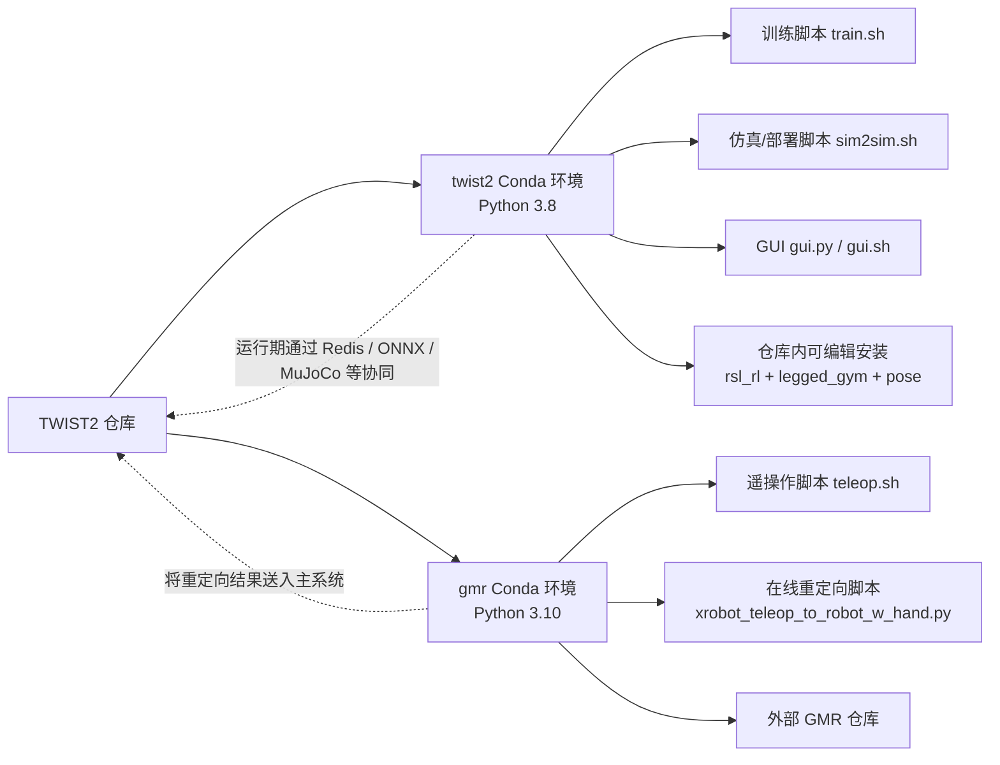
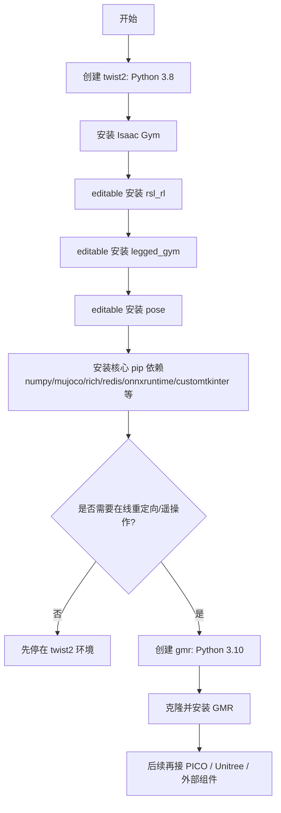

本页只回答一个问题：**为什么 TWIST2 需要两个 Conda 环境，以及初学者应如何先把仓库内的核心 Python 包安装到位**。仓库明确把 `twist2` 环境用于控制器训练、控制器部署与遥操作数据采集，把 `gmr` 环境用于在线动作重定向；根因是安装说明直接指出 Isaac Gym 受 Python 3.8 约束，而 GMR 侧需要 Python 3.10+。Sources: [README.md](README.md#L31-L39), [README.md](README.md#L129-L144)

如果你是第一次阅读本仓库，推荐阅读顺序是：先完成本页，再继续看 [Isaac Gym、MuJoCo、Redis 与 ONNXRuntime 配置](4-isaac-gym-mujoco-redis-yu-onnxruntime-pei-zhi)；如果你要做在线重定向或 PICO 遥操作，再接着看 [GMR、PICO SDK 与 Unitree SDK 的外部组件接入](5-gmr-pico-sdk-yu-unitree-sdk-de-wai-bu-zu-jian-jie-ru)；环境准备好之后，再去 [使用示例动作与官方 ONNX 检查点完成最小验证](6-shi-yong-shi-li-dong-zuo-yu-guan-fang-onnx-jian-cha-dian-wan-cheng-zui-xiao-yan-zheng)。Sources: [README.md](README.md#L31-L84), [README.md](README.md#L122-L150)

## 先建立正确心智模型：为什么是“双环境”

TWIST2 的安装说明不是“可选地多开一个环境”，而是**从一开始就按双环境设计**：`twist2` 负责仓库主线能力，`gmr` 负责在线动作重定向。这个划分不仅写在 README 中，也能从脚本侧得到印证：训练脚本显式激活 `twist2`，遥操作脚本显式激活 `gmr`。换句话说，双环境不是使用习惯，而是仓库工作流的一部分。Sources: [README.md](README.md#L31-L39), [train.sh](train.sh#L12-L20), [teleop.sh](teleop.sh#L1-L4)

下面这张图可以帮助你先从架构层面理解“为什么要分开装”。Sources: [README.md](README.md#L31-L56), [train.sh](train.sh#L12-L20), [teleop.sh](teleop.sh#L1-L4)



## 两个环境分别承担什么职责

对于初学者，最容易踩坑的地方不是命令本身，而是**在错误环境里运行了正确脚本**。训练脚本 `train.sh` 先 `conda activate twist2`，说明训练入口默认属于 `twist2`；GUI 启动脚本 `gui.sh` 也使用 `twist2`；而 `teleop.sh` 则明确使用 `gmr`，其核心入口还直接导入 `general_motion_retargeting`，说明它依赖的是 GMR 生态而不是仓库主训练栈。Sources: [train.sh](train.sh#L12-L20), [gui.sh](gui.sh#L1-L5), [teleop.sh](teleop.sh#L1-L4), [deploy_real/xrobot_teleop_to_robot_w_hand.py](deploy_real/xrobot_teleop_to_robot_w_hand.py#L33-L48)

| 环境名 | Python 版本 | 主要用途 | 直接证据 |
|---|---:|---|---|
| `twist2` | 3.8 | 控制器训练、控制器部署、遥操作数据采集 | README 安装说明 + `train.sh` + `gui.sh` |
| `gmr` | 3.10 | 在线动作重定向、遥操作链路 | README 安装说明 + `teleop.sh` |

Sources: [README.md](README.md#L31-L39), [README.md](README.md#L129-L144), [train.sh](train.sh#L12-L20), [gui.sh](gui.sh#L1-L5), [teleop.sh](teleop.sh#L1-L4)

## 与本页直接相关的仓库结构

从依赖安装角度看，你不需要一次性理解整个仓库，但至少要认出三个本地 Python 子项目：`rsl_rl`、`legged_gym`、`pose`。README 要求在 `twist2` 环境里对这三个目录执行 `pip install -e .`，而它们各自也都包含 `setup.py`，说明它们是以**本地可编辑包**方式被接入主仓库工作流的。Sources: [README.md](README.md#L46-L56), [rsl_rl/setup.py](rsl_rl/setup.py#L1-L16), [legged_gym/setup.py](legged_gym/setup.py#L1-L15), [pose/setup.py](pose/setup.py#L1-L11)

```text
TWIST2/
├── rsl_rl/       # 本地可编辑安装：强化学习算法包
├── legged_gym/   # 本地可编辑安装：环境与训练基础设施
├── pose/         # 本地可编辑安装：动作/姿态相关代码
├── deploy_real/  # 部署与遥操作脚本
├── train.sh      # 明确使用 twist2 环境
├── teleop.sh     # 明确使用 gmr 环境
└── gui.sh        # 明确使用 twist2 环境
```

Sources: [README.md](README.md#L46-L56), [train.sh](train.sh#L12-L20), [teleop.sh](teleop.sh#L1-L4), [gui.sh](gui.sh#L1-L5)

## 第 1 步：创建 `twist2` 环境

README 给出的第一步是先创建 `twist2`，并固定为 Python 3.8。这里的关键不是“Python 越新越好”，而是**先遵从仓库已经写死的兼容边界**。如果你准备先做训练、评测、GUI、Sim2Sim 或直接加载官方 ONNX 检查点，这都是起点环境。Sources: [README.md](README.md#L31-L39), [README.md](README.md#L124-L126)

```bash
conda env remove -n twist2
conda create -n twist2 python=3.8
conda activate twist2
```

创建完成后，可以用下面这条命令做最小确认：Sources: [README.md](README.md#L34-L39)

```bash
python -V
```

你预期应看到 `Python 3.8.x`，因为后续训练脚本依赖的 `twist2` 环境就是围绕这个版本组织的。`train.sh` 还额外设置了 `LD_LIBRARY_PATH=$CONDA_PREFIX/lib` 来处理 `libpython3.8.so.1.0` 找不到的问题，这进一步说明 Python 3.8 在当前仓库里不是偶然选择。Sources: [train.sh](train.sh#L14-L20)

## 第 2 步：在 `twist2` 中安装仓库核心包

README 在 `twist2` 环境中的核心安装顺序非常清楚：先装 Isaac Gym，再把 `rsl_rl`、`legged_gym`、`pose` 以 editable 方式装入当前环境，然后再补齐一组通用 Python 依赖。对于初学者，**最值得记住的是 editable 安装这一步不能省**，因为后续脚本会直接依赖这些本地包。Sources: [README.md](README.md#L41-L56)

```bash
# 先在已激活的 twist2 环境中操作
cd isaacgym/python && pip install -e .

cd /home/huanghao/source/code/TWIST2
cd rsl_rl && pip install -e . && cd ..
cd legged_gym && pip install -e . && cd ..
cd pose && pip install -e . && cd ..

pip install "numpy==1.23.0" \
  pydelatin wandb tqdm opencv-python ipdb pyfqmr flask dill gdown \
  hydra-core imageio[ffmpeg] mujoco mujoco-python-viewer isaacgym-stubs \
  pytorch-kinematics rich termcolor zmq

pip install redis[hiredis]
pip install pyttsx3
pip install onnx onnxruntime-gpu
pip install customtkinter
```

这一步里的本地包关系可以从各自 `setup.py` 看得更具体：`rsl_rl` 声明依赖 `torch`、`torchvision`、`numpy`；`legged_gym` 声明依赖 `isaacgym`、`rsl-rl`、`matplotlib`；`pose` 也是标准 Python 包。README 又把 `numpy` 明确固定到 `1.23.0`，因此实际执行时应以 README 的版本约束为准。Sources: [rsl_rl/setup.py](rsl_rl/setup.py#L1-L16), [legged_gym/setup.py](legged_gym/setup.py#L1-L15), [pose/setup.py](pose/setup.py#L1-L11), [README.md](README.md#L46-L56)

## 第 3 步：理解“核心依赖”分别服务谁

虽然 README 把很多依赖一次性装进去了，但它们在仓库里的用途并不一样。比如 `customtkinter` 明确对应 `gui.py`，`pyttsx3` 明确对应语音播报模块，`onnxruntime-gpu` 则被多个部署/评测入口按需导入，`redis[hiredis]` 则是部署与遥操作链路中的通信基础。这里先建立映射关系即可，更细的配置细节请继续看 [Isaac Gym、MuJoCo、Redis 与 ONNXRuntime 配置](4-isaac-gym-mujoco-redis-yu-onnxruntime-pei-zhi)。Sources: [README.md](README.md#L51-L55), [gui.py](gui.py#L1-L8), [deploy_real/robot_control/speaker.py](deploy_real/robot_control/speaker.py#L1-L10), [deploy_real/server_low_level_g1_sim.py](deploy_real/server_low_level_g1_sim.py#L15-L18), [deploy_real/run_simulation.py](deploy_real/run_simulation.py#L22-L25)

| 依赖 | 本页关心的角色 | 仓库内直接证据 |
|---|---|---|
| `customtkinter` | GUI 所需 | `gui.py` 顶部直接导入 |
| `pyttsx3` | 语音播报所需 | `speaker.py` 顶部直接导入并初始化 |
| `onnxruntime-gpu` | ONNX 推理所需 | `run_simulation.py`、`server_low_level_g1_sim.py` 按需导入 |
| `redis[hiredis]` | 部署/遥操作进程通信 | 多个 `deploy_real` 服务直接导入 `redis` |
| `numpy==1.23.0` | README 明确固定版本 | 安装命令直接写死 |

Sources: [README.md](README.md#L46-L56), [gui.py](gui.py#L1-L8), [deploy_real/robot_control/speaker.py](deploy_real/robot_control/speaker.py#L1-L10), [deploy_real/run_simulation.py](deploy_real/run_simulation.py#L22-L25), [deploy_real/server_low_level_g1_sim.py](deploy_real/server_low_level_g1_sim.py#L15-L18)

## 第 4 步：创建 `gmr` 环境

当你准备做**在线动作重定向**或后续的遥操作链路时，再创建第二个环境 `gmr`。README 明确要求它使用 Python 3.10，并且这一环境主要围绕外部 GMR 仓库展开，而不是围绕本仓库内的训练包展开。Sources: [README.md](README.md#L129-L144)

```bash
conda create -n gmr python=3.10 -y
conda activate gmr
```

这一选择也能从 `teleop.sh` 与遥操作主程序得到佐证：`teleop.sh` 在启动时就激活 `gmr`，而 `xrobot_teleop_to_robot_w_hand.py` 直接导入 `general_motion_retargeting` 与 `XRobotStreamer`，说明其运行前提就是 GMR 侧依赖已经独立安装好。Sources: [teleop.sh](teleop.sh#L1-L4), [deploy_real/xrobot_teleop_to_robot_w_hand.py](deploy_real/xrobot_teleop_to_robot_w_hand.py#L33-L48)

## 第 5 步：在 `gmr` 中安装 GMR

README 给出的 `gmr` 环境安装流程非常直白：克隆外部 GMR 仓库，在该目录执行 `pip install -e .`，最后补装 `libstdcxx-ng`。这意味着 `gmr` 不是在当前 TWIST2 仓库内部完成，而是以**外部仓库 + 独立环境**的方式接入。Sources: [README.md](README.md#L129-L144)

```bash
conda activate gmr

git clone https://github.com/YanjieZe/GMR.git
cd GMR
pip install -e .
cd ..

conda install -c conda-forge libstdcxx-ng -y
```

对于本页来说，你只需要把这一步理解成：`gmr` 是“在线重定向运行环境”，而不是“训练环境”。更进一步的 GMR、PICO SDK、Unitree SDK 接入流程不在本页展开，请继续看 [GMR、PICO SDK 与 Unitree SDK 的外部组件接入](5-gmr-pico-sdk-yu-unitree-sdk-de-wai-bu-zu-jian-jie-ru)。Sources: [README.md](README.md#L129-L150)

## 一张流程图看完整安装顺序

如果你更适合按步骤执行，可以直接照着下面这张流程图走。Sources: [README.md](README.md#L31-L56), [README.md](README.md#L129-L144), [train.sh](train.sh#L12-L20), [teleop.sh](teleop.sh#L1-L4)



## 建议你照抄的最小命令版本

如果你只想先把“能装的核心部分”尽快装起来，可以直接采用下表里的“推荐做法”。这里把 README 的安装内容按环境拆开，避免把 `gmr` 相关操作误装到 `twist2`。Sources: [README.md](README.md#L34-L56), [README.md](README.md#L129-L144)

| 目标 | 进入哪个环境 | 最小必要动作 |
|---|---|---|
| 训练/评测/GUI/主仓库开发 | `twist2` | 创建 Python 3.8 环境，安装 Isaac Gym，editable 安装 `rsl_rl`/`legged_gym`/`pose`，再安装 README 中列出的通用依赖 |
| 在线重定向/遥操作前置准备 | `gmr` | 创建 Python 3.10 环境，克隆并 editable 安装 GMR，再安装 `libstdcxx-ng` |

Sources: [README.md](README.md#L34-L56), [README.md](README.md#L129-L144), [train.sh](train.sh#L12-L20), [teleop.sh](teleop.sh#L1-L4)

## 安装前后对照：不要把脚本跑错环境

下面这个“前后对照表”适合初学者快速自检。真正的区别不在于命令长短，而在于你是否让不同脚本落在了它们各自预期的 Conda 环境里。Sources: [train.sh](train.sh#L12-L20), [teleop.sh](teleop.sh#L1-L4), [gui.sh](gui.sh#L1-L5)

| 场景 | 错误做法 | 正确做法 |
|---|---|---|
| 跑训练 | 在 `gmr` 中执行 `bash train.sh ...` | 先进入 `twist2`，或直接使用脚本内自带的 `conda activate twist2` |
| 开 GUI | 在 `gmr` 中直接 `python gui.py` | 通过 `gui.sh` 或先进入 `twist2` 再运行 |
| 跑遥操作 | 在 `twist2` 中执行 `teleop.sh` | 使用 `teleop.sh`，它会切到 `gmr` |
| 装仓库子包 | 只安装 pip 通用依赖，不执行 `pip install -e .` | 在 `twist2` 中分别 editable 安装 `rsl_rl`、`legged_gym`、`pose` |

Sources: [train.sh](train.sh#L12-L20), [teleop.sh](teleop.sh#L1-L4), [gui.sh](gui.sh#L1-L5), [README.md](README.md#L46-L56)

## 安装完成后的最小验收

本页只做“环境与核心依赖安装”，因此验收标准也应保持最小化。你至少应确认三件事：一，`twist2` 与 `gmr` 两个环境都能激活；二，在 `twist2` 中本地包已可导入；三，GUI 与训练脚本所依赖的基础包没有缺失。更完整的运行验收请转到 [使用示例动作与官方 ONNX 检查点完成最小验证](6-shi-yong-shi-li-dong-zuo-yu-guan-fang-onnx-jian-cha-dian-wan-cheng-zui-xiao-yan-zheng)。Sources: [README.md](README.md#L122-L126), [train.sh](train.sh#L12-L20), [gui.sh](gui.sh#L1-L5)

```bash
# 1) 检查 twist2
conda activate twist2
python -c "import rsl_rl, legged_gym, pose; print('twist2 ok')"

# 2) 检查 GUI 依赖
python -c "import customtkinter; print('gui dep ok')"

# 3) 检查 gmr
conda activate gmr
python -V
```

这些检查之所以合理，是因为它们分别对应了本页已经验证过的三类事实：`twist2` 负责本仓库主线流程，`customtkinter` 是 GUI 直接依赖，`gmr` 则是单独的 Python 3.10 环境入口。Sources: [gui.py](gui.py#L1-L8), [README.md](README.md#L31-L56), [README.md](README.md#L129-L144)

## 常见问题速查

如果你已经按 README 安装，但仍然遇到问题，优先先排查“环境是否正确”和“本地包是否 editable 安装”。这是因为仓库脚本已经把环境职责分得很清楚，大多数初学者问题都来自**装对了包，但装在了不该运行该脚本的环境里**。Sources: [README.md](README.md#L31-L56), [README.md](README.md#L129-L144), [train.sh](train.sh#L12-L20), [teleop.sh](teleop.sh#L1-L4)

| 现象 | 优先检查项 | 依据 |
|---|---|---|
| `ModuleNotFoundError: legged_gym` | 是否在 `twist2` 中执行过 `cd legged_gym && pip install -e .` | README 明确要求 editable 安装 |
| `ModuleNotFoundError: customtkinter` | 是否在 `twist2` 中安装过 `customtkinter` | GUI 直接导入该库 |
| 遥操作脚本找不到 `general_motion_retargeting` | 是否进入了 `gmr`，且 GMR 已安装 | `teleop.sh` 使用 `gmr`，遥操作主程序直接导入该模块 |
| 训练脚本报 `libpython3.8.so.1.0` 相关问题 | 是否遵循 `train.sh` 中的 `LD_LIBRARY_PATH` 设置 | 训练脚本显式处理此问题 |

Sources: [README.md](README.md#L46-L56), [gui.py](gui.py#L1-L8), [teleop.sh](teleop.sh#L1-L4), [deploy_real/xrobot_teleop_to_robot_w_hand.py](deploy_real/xrobot_teleop_to_robot_w_hand.py#L33-L48), [train.sh](train.sh#L14-L20)

## 本页结论

你现在应该记住的只有一句话：**`twist2` 是主仓库环境，`gmr` 是在线重定向环境；先把前者装完整，再按需要补后者。** 这是 README、训练脚本、GUI 启动脚本和遥操作脚本共同呈现出的稳定结构，不是临时约定。完成本页后，建议下一步进入 [Isaac Gym、MuJoCo、Redis 与 ONNXRuntime 配置](4-isaac-gym-mujoco-redis-yu-onnxruntime-pei-zhi)。Sources: [README.md](README.md#L31-L56), [README.md](README.md#L129-L144), [train.sh](train.sh#L12-L20), [gui.sh](gui.sh#L1-L5), [teleop.sh](teleop.sh#L1-L4)