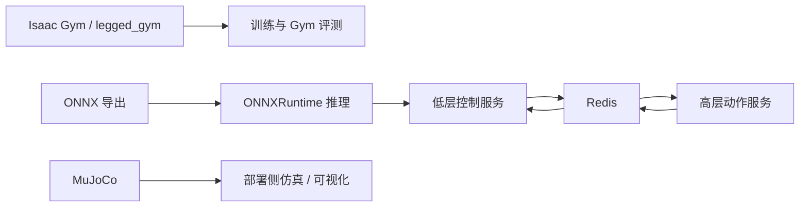
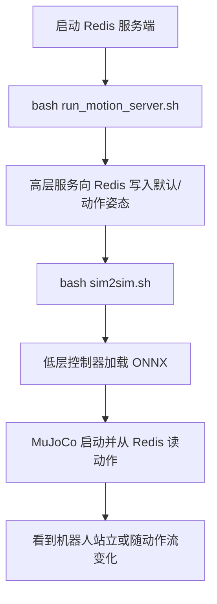

本页位于“环境与依赖准备”阶段，目标是把 **TWIST2 在训练、仿真验证、跨进程通信与 ONNX 推理** 所依赖的四类关键组件一次性配置清楚：**Isaac Gym** 用于 Isaac/legged_gym 路径，**MuJoCo** 用于部署侧仿真与可视化，**Redis** 用于高低层服务之间的数据交换，**ONNXRuntime** 用于部署脚本直接加载 `.onnx` 策略。这里不展开 GMR、PICO SDK、Unitree SDK 的外部接入细节；这些内容属于下一页 [GMR、PICO SDK 与 Unitree SDK 的外部组件接入](5-gmr-pico-sdk-yu-unitree-sdk-de-wai-bu-zu-jian-jie-ru)。Sources: [README.md](README.md#L31-L58) [README.md](README.md#L129-L181)

## 先建立正确心智模型：四个组件分别解决什么问题

TWIST2 明确把训练/评测与部署/遥操作链路拆成了不同技术路径：README 说明仓库建议使用两个 Conda 环境，其中 `twist2` 面向控制器训练、部署和 teleop 数据采集，`gmr` 面向在线重定向；拆分原因是 **Isaac Gym 依赖 Python 3.8，而较新的 MuJoCo 依赖 Python 3.10+**。同时，`tools/gym_exec_eval.py` 又表明 IsaacGym 路径是 “fully gym version”，**不走 MuJoCo 仿真**，而部署目录中的低层服务则直接导入 `mujoco`、`redis` 与 `onnxruntime`。这意味着四个组件不是并列冗余，而是分属不同运行面。Sources: [README.md](README.md#L31-L38) [tools/gym_exec_eval.py](tools/gym_exec_eval.py#L1-L16) [deploy_real/server_low_level_g1_sim.py](deploy_real/server_low_level_g1_sim.py#L1-L18) [deploy_real/server_low_level_g1_real.py](deploy_real/server_low_level_g1_real.py#L1-L22)



上图对应仓库中的真实分层：**Isaac Gym** 主要出现在 `legged_gym` 与 `tools/gym_exec_eval.py` 这类训练/评测路径；**MuJoCo** 主要出现在 `deploy_real/server_low_level_g1_sim.py`、`deploy_real/run_simulation.py`、`deploy_real/server_motion_lib.py`；**Redis** 是这些部署服务共享的消息总线；**ONNXRuntime** 则在低层控制器中把导出的 `.onnx` 策略作为推理后端加载。Sources: [tools/gym_exec_eval.py](tools/gym_exec_eval.py#L1-L26) [deploy_real/server_low_level_g1_sim.py](deploy_real/server_low_level_g1_sim.py#L41-L59) [deploy_real/run_simulation.py](deploy_real/run_simulation.py#L48-L61) [deploy_real/server_motion_lib.py](deploy_real/server_motion_lib.py#L101-L120)

## 与本页直接相关的仓库位置

下面这些文件基本构成了本页配置工作的“落点”，你安装完组件后，是否可用会首先体现在这些脚本上。Sources: [run_motion_server.sh](run_motion_server.sh#L1-L25) [sim2sim.sh](sim2sim.sh#L1-L15) [to_onnx.sh](to_onnx.sh#L1-L12) [tools/gym_exec_eval.py](tools/gym_exec_eval.py#L1-L26)

```text
TWIST2/
├── README.md                         # 官方安装说明与 Redis 配置步骤
├── sim2sim.sh                        # 启动 MuJoCo + ONNX + Redis 的低层仿真入口
├── run_motion_server.sh              # 启动高层动作流服务，向 Redis 发布 mimic obs
├── to_onnx.sh                        # 将训练检查点导出为 ONNX
├── deploy_real/
│   ├── server_low_level_g1_sim.py    # MuJoCo 仿真低层控制器
│   ├── server_low_level_g1_real.py   # 实机低层控制器
│   ├── server_motion_lib.py          # 高层动作参考服务
│   └── run_simulation.py             # 本地仿真与 ONNX 推理实验脚本
├── tools/
│   └── gym_exec_eval.py              # Isaac Gym 评测入口，可选 ONNXRuntime 推理
└── legged_gym/legged_gym/scripts/
    └── save_onnx.py                  # ONNX 导出实现
```

## 组件与用途速查表

| 组件 | 在仓库中的主要职责 | 典型入口 | 是否直接参与部署链路 |
|---|---|---|---|
| Isaac Gym | legged_gym 训练与 Gym 评测环境 | `tools/gym_exec_eval.py` | 间接，主要在训练/评测侧 |
| MuJoCo | 低层仿真、动作可视化、部署前验证 | `deploy_real/server_low_level_g1_sim.py` | 是 |
| Redis | 高层服务与低层控制器之间的键值交换 | `deploy_real/server_motion_lib.py`、`server_low_level_g1_*` | 是 |
| ONNXRuntime | 直接加载 `.onnx` 控制策略做推理 | `deploy_real/server_low_level_g1_sim.py`、`server_low_level_g1_real.py` | 是 |

这个划分和源码完全一致：Gym 评测文件明确声明自己 **不使用 MuJoCo**；低层控制器在启动时会建立 Redis 连接并加载 ONNX 会话；高层动作服务把动作写入 Redis；`to_onnx.sh` 则把训练侧 `.pt` 检查点交给 `save_onnx.py` 转换为部署可用的 `.onnx` 文件。Sources: [tools/gym_exec_eval.py](tools/gym_exec_eval.py#L3-L16) [deploy_real/server_low_level_g1_sim.py](deploy_real/server_low_level_g1_sim.py#L99-L118) [deploy_real/server_low_level_g1_real.py](deploy_real/server_low_level_g1_real.py#L105-L120) [deploy_real/server_motion_lib.py](deploy_real/server_motion_lib.py#L113-L120) [to_onnx.sh](to_onnx.sh#L1-L12)

## 步骤 1：在 `twist2` 环境安装 Isaac Gym、MuJoCo、Redis Python 客户端与 ONNXRuntime

README 给出的基础安装路径很直接：先创建 `python=3.8` 的 `twist2` 环境，再安装 Isaac Gym，然后安装仓库内三个可编辑包 `rsl_rl`、`legged_gym`、`pose`，最后通过 `pip` 安装 MuJoCo、Redis 客户端、ONNXRuntime 等运行时依赖。对本页最关键的几行是：`mujoco`、`mujoco-python-viewer`、`redis[hiredis]`、`onnx`、`onnxruntime-gpu`。Sources: [README.md](README.md#L34-L56)

建议按仓库原始顺序执行，避免后续脚本出现“模块存在但子项目未安装”的半配置状态。Sources: [README.md](README.md#L41-L56)

```bash
conda create -n twist2 python=3.8
conda activate twist2

# 先手动下载 Isaac Gym 后安装
cd isaacgym/python && pip install -e .

# 安装仓库内子项目
cd /home/huanghao/source/code/TWIST2
cd rsl_rl && pip install -e . && cd ..
cd legged_gym && pip install -e . && cd ..
cd pose && pip install -e . && cd ..

# 安装本页相关运行时依赖
pip install "numpy==1.23.0" mujoco mujoco-python-viewer isaacgym-stubs
pip install redis[hiredis]
pip install onnx onnxruntime-gpu
```
Sources: [README.md](README.md#L41-L56)

## 步骤 2：理解为什么 Isaac Gym 与 MuJoCo 会被放在不同运行面

如果你只从“都叫仿真”来理解 Isaac Gym 和 MuJoCo，很容易误配环境。源码显示 `tools/gym_exec_eval.py` 是 IsaacGym/legged_gym 评测器，并明确写明 **“NO MuJoCo simulation”**；而 `deploy_real/server_low_level_g1_sim.py`、`deploy_real/run_simulation.py` 则直接构造 `mujoco.MjModel`、`mujoco.MjData` 并启动 `mujoco.viewer`。因此，本仓库不是“二选一仿真器”，而是 **训练/评测主要走 Isaac Gym，部署验证主要走 MuJoCo**。Sources: [tools/gym_exec_eval.py](tools/gym_exec_eval.py#L3-L16) [deploy_real/server_low_level_g1_sim.py](deploy_real/server_low_level_g1_sim.py#L107-L118) [deploy_real/run_simulation.py](deploy_real/run_simulation.py#L48-L61)

这也是 README 为什么在安装阶段同时要求 Isaac Gym 和 MuJoCo：前者保障 legged_gym 路径可运行，后者保障 `sim2sim.sh` 和部署目录脚本可运行。Sources: [README.md](README.md#L41-L56) [README.md](README.md#L215-L229) [sim2sim.sh](sim2sim.sh#L1-L15)

## 步骤 3：安装并启动 Redis 服务端

Redis 在 TWIST2 中不是可选辅助件，而是部署链路中的基础设施。README 要求首次使用时安装并启动 `redis-server`，然后修改 `/etc/redis/redis.conf` 中的 `bind 0.0.0.0` 与 `protected-mode no`，最后重启服务。这个配置说明仓库默认考虑了 **本机访问与局域网访问** 两类情况。Sources: [README.md](README.md#L58-L83)

```bash
sudo apt update
sudo apt install -y redis-server
sudo systemctl enable redis-server
sudo systemctl start redis-server

sudo nano /etc/redis/redis.conf
# 修改为：
# bind 0.0.0.0
# protected-mode no

sudo systemctl restart redis-server
```
Sources: [README.md](README.md#L63-L83)

之所以说 Redis 必需，是因为低层控制器启动时就会尝试连接 `localhost:6379`，高层动作服务也会在启动时执行 `redis_client.ping()`；如果 Redis 不通，`server_motion_lib.py` 和 `server_low_level_g1_*` 这类脚本都无法形成完整链路。Sources: [deploy_real/server_low_level_g1_sim.py](deploy_real/server_low_level_g1_sim.py#L99-L108) [deploy_real/server_low_level_g1_real.py](deploy_real/server_low_level_g1_real.py#L105-L111) [deploy_real/server_motion_lib.py](deploy_real/server_motion_lib.py#L113-L120)

## 步骤 4：确认 Redis 在仓库中的真实作用

从源码看，Redis 负责交换的不是抽象信号，而是非常具体的键值：低层服务会发布 `state_body_unitree_g1_with_hands`、手部状态、时间戳等状态键；同时读取 `action_body_*`、`action_hand_*`、`action_neck_*` 等动作键。高层动作服务则负责把 mimic 观测与默认站立姿态写回这些键。也就是说，**Redis 是高层参考动作与低层策略控制之间的解耦边界**。Sources: [deploy_real/server_low_level_g1_sim.py](deploy_real/server_low_level_g1_sim.py#L258-L316) [deploy_real/server_low_level_g1_real.py](deploy_real/server_low_level_g1_real.py#L185-L239) [deploy_real/server_motion_lib.py](deploy_real/server_motion_lib.py#L159-L220)

| 方向 | 代表键 | 生产者 | 消费者 |
|---|---|---|---|
| 高层 → 低层 | `action_body_unitree_g1_with_hands` | `server_motion_lib.py` / teleop 服务 | `server_low_level_g1_sim.py` / `server_low_level_g1_real.py` |
| 低层 → 外部 | `state_body_unitree_g1_with_hands` | 低层控制器 | 录制/监控/上层工具 |
| 控制信号 | `motion_start_signal` / `motion_exit_signal` | 低层控制器或遥控数据 | 高层动作服务 |

Sources: [deploy_real/server_low_level_g1_sim.py](deploy_real/server_low_level_g1_sim.py#L258-L316) [deploy_real/server_low_level_g1_real.py](deploy_real/server_low_level_g1_real.py#L185-L239) [deploy_real/server_motion_lib.py](deploy_real/server_motion_lib.py#L159-L220)

## 步骤 5：配置并验证 ONNXRuntime

仓库把部署推理明确落在 ONNXRuntime 上。`deploy_real/server_low_level_g1_sim.py` 和 `server_low_level_g1_real.py` 都定义了 `load_onnx_policy()`：如果未安装 `onnxruntime` 会直接抛出 `ImportError`；如果请求 `cuda` 但当前 ONNXRuntime 没有 `CUDAExecutionProvider`，脚本会打印回退提示并转向 `CPUExecutionProvider`。因此，这里的关键不是“装上 onnxruntime 就行”，而是要确认 **provider 是否符合你的设备预期**。Sources: [deploy_real/server_low_level_g1_sim.py](deploy_real/server_low_level_g1_sim.py#L41-L59) [deploy_real/server_low_level_g1_real.py](deploy_real/server_low_level_g1_real.py#L75-L89)

`tools/gym_exec_eval.py` 的 ONNX 加载逻辑更进一步：它会根据 `--device cuda:N` 选择 `CUDAExecutionProvider`，并在创建会话后检查输入张量的期望观测维度。因此，ONNXRuntime 在仓库中既用于部署，也用于 Gym 评测中的 ONNX 后端。Sources: [tools/gym_exec_eval.py](tools/gym_exec_eval.py#L544-L585)

一个可验证的事实是：README 已经提供现成部署模型 `assets/ckpts/twist2_1017_20k.onnx`，而 `sim2sim.sh` 默认就把这个文件作为 `--policy` 传给 `server_low_level_g1_sim.py`。这意味着 **只要 ONNXRuntime、MuJoCo、Redis 就绪，不需要先训练模型也能完成基础验证**。Sources: [README.md](README.md#L124-L126) [README.md](README.md#L215-L229) [sim2sim.sh](sim2sim.sh#L1-L15)

## 步骤 6：理解 ONNX 文件是怎样从训练检查点导出的

仓库的导出入口非常薄：`to_onnx.sh` 只是进入 `legged_gym/legged_gym/scripts` 后执行 `python save_onnx.py --ckpt_path ...`。真正的导出逻辑位于 `save_onnx.py`，其中 `HardwareStudentFutureNN` 把训练时的 actor 包装成部署前向接口，并在 `forward()` 中先执行 normalizer 再执行 actor。也就是说，这个导出不是裸导出，而是 **按部署所需输入维度和归一化路径包装后的导出**。Sources: [to_onnx.sh](to_onnx.sh#L1-L12) [legged_gym/legged_gym/scripts/save_onnx.py](legged_gym/legged_gym/scripts/save_onnx.py#L16-L73)

`save_onnx.py` 还把学生策略的关键结构直接写死在导出配置里，例如 `num_actions = 29`、`history_len = 10`、`num_motion_observations = 35`、`num_priop_observations = 92`，并据此计算总观测维度。对配置本页来说，这里的意义是：**ONNXRuntime 不只是“跑模型文件”，它依赖与训练侧一致的观测定义**；如果你的模型不是同一结构，不能假定所有 `.onnx` 都能互换。Sources: [legged_gym/legged_gym/scripts/save_onnx.py](legged_gym/legged_gym/scripts/save_onnx.py#L84-L120)

## 步骤 7：按最小路径做一次联调验证

最小验证路径并不复杂：先启动高层动作服务给 Redis 预热，再启动低层 MuJoCo 控制器读取 Redis 动作并通过 ONNXRuntime 执行策略。README 明确指出，首次运行 `sim2sim` 前需要先 “warm up the redis server by running the high-level motion server”。Sources: [README.md](README.md#L215-L229)



脚本级别的证据也很清楚：`run_motion_server.sh` 默认把 `assets/example_motions/0807_yanjie_walk_001.pkl` 交给 `server_motion_lib.py`，并把 `redis_ip` 设为 `localhost`；`sim2sim.sh` 默认把 `assets/ckpts/twist2_1017_20k.onnx` 与 `assets/g1/g1_sim2sim_29dof.xml` 交给 `server_low_level_g1_sim.py`。Sources: [run_motion_server.sh](run_motion_server.sh#L1-L25) [sim2sim.sh](sim2sim.sh#L1-L15)

## 常用命令清单

| 目的 | 命令 | 说明 |
|---|---|---|
| 启动高层动作服务 | `bash run_motion_server.sh` | 向 Redis 发布默认站立/示例动作 |
| 启动低层 MuJoCo 仿真 | `bash sim2sim.sh` | 加载默认 ONNX 策略并在 MuJoCo 中运行 |
| 导出训练检查点到 ONNX | `bash to_onnx.sh <ckpt_path>` | 调用 `save_onnx.py` 完成导出 |
| 使用 Isaac Gym 评测 | `python tools/gym_exec_eval.py ...` | 走 Gym 路径，不依赖 MuJoCo |

Sources: [README.md](README.md#L208-L229) [run_motion_server.sh](run_motion_server.sh#L1-L25) [sim2sim.sh](sim2sim.sh#L1-L15) [to_onnx.sh](to_onnx.sh#L1-L12) [tools/gym_exec_eval.py](tools/gym_exec_eval.py#L18-L25)

## 常见配置差异与判定方式

| 现象 | 更可能缺的是谁 | 源码层面的判定依据 |
|---|---|---|
| `ImportError: onnxruntime is required...` | ONNXRuntime | 低层控制器在 `load_onnx_policy()` 中显式检查 `ort is None` |
| 能跑 Gym 评测，但 `sim2sim` 起不来 | MuJoCo 或 Redis | Gym 评测声明不使用 MuJoCo；部署脚本依赖 MuJoCo 和 Redis |
| 能启动低层脚本，但没有高层动作输入 | Redis / 高层服务未启动 | README 要求先运行 `run_motion_server.sh` 预热 |
| 指定 `--device cuda` 但推理仍落到 CPU | ONNXRuntime GPU provider 不可用 | 低层控制器会检测 `CUDAExecutionProvider` 是否存在并回退到 CPU |

Sources: [deploy_real/server_low_level_g1_sim.py](deploy_real/server_low_level_g1_sim.py#L41-L59) [deploy_real/server_low_level_g1_sim.py](deploy_real/server_low_level_g1_sim.py#L99-L108) [README.md](README.md#L215-L229) [tools/gym_exec_eval.py](tools/gym_exec_eval.py#L3-L16)

## 一个务实的配置顺序建议

对于中级开发者，最稳妥的顺序是：**先在 `twist2` 环境装 Isaac Gym + MuJoCo + Redis Python 客户端 + ONNXRuntime，再确保系统 Redis 服务可用，然后直接用仓库自带的 `.onnx` 与示例动作做 `run_motion_server.sh + sim2sim.sh` 联调**。这样可以最早区分“环境没配好”与“模型/数据/外部设备没接好”两类问题。Sources: [README.md](README.md#L41-L56) [README.md](README.md#L124-L126) [README.md](README.md#L215-L229) [sim2sim.sh](sim2sim.sh#L1-L15) [run_motion_server.sh](run_motion_server.sh#L1-L25)

如果你下一步要继续补齐外部重定向或设备接入，请阅读 [GMR、PICO SDK 与 Unitree SDK 的外部组件接入](5-gmr-pico-sdk-yu-pico-sdk-yu-unitree-sdk-de-wai-bu-zu-jian-jie-ru)；如果你想在当前配置完成后立刻验证链路，下一页应进入 [使用示例动作与官方 ONNX 检查点完成最小验证](6-shi-yong-shi-li-dong-zuo-yu-guan-fang-onnx-jian-cha-dian-wan-cheng-zui-xiao-yan-zheng)。Sources: [README.md](README.md#L124-L126) [README.md](README.md#L215-L229)