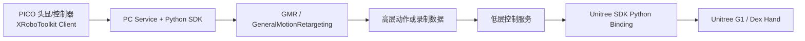
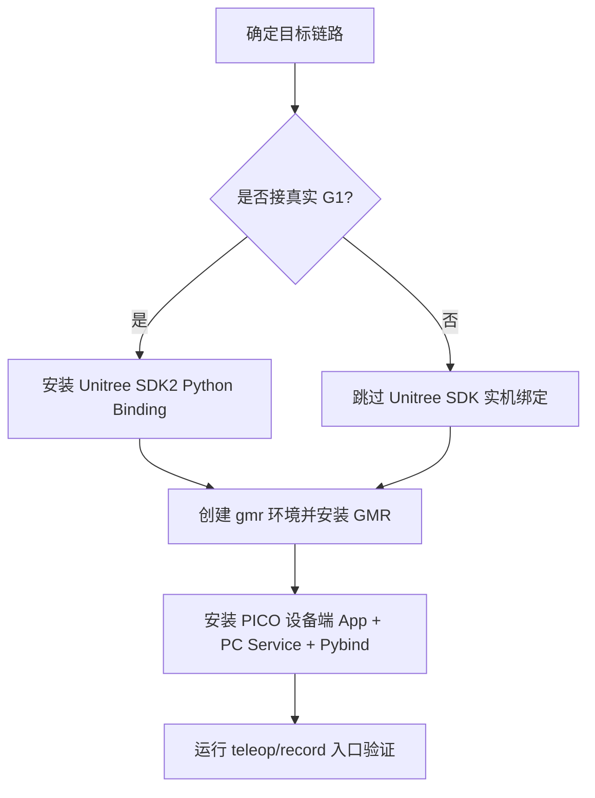

本页只回答一个问题：**在 TWIST2 中，GMR、PICO SDK 与 Unitree SDK 分别接到哪里、为什么要分开安装、以及怎样确认它们已经真正可用**。从仓库证据看，这三类外部组件分别承担 **在线人体动作重定向**、**PICO 端到 PC 的 VR 数据串流**、以及 **Unitree G1 实机/灵巧手的底层通信绑定** 三个职责；它们不是可互换依赖，而是按链路位置串接起来的外部能力层。Sources: [README.md](README.md#L87-L181), [CLAUDE.md](CLAUDE.md#L7-L10)

对于当前目录导航位置，你现在处于“环境与依赖准备”中的 **[GMR、PICO SDK 与 Unitree SDK 的外部组件接入](5-gmr-pico-sdk-yu-unitree-sdk-de-wai-bu-zu-jian-jie-ru)**。读完本页后，最自然的下一步不是直接进入训练，而是继续看 **[使用示例动作与官方 ONNX 检查点完成最小验证](6-shi-yong-shi-li-dong-zuo-yu-guan-fang-onnx-jian-cha-dian-wan-cheng-zui-xiao-yan-zheng)**，如果你的目标是在线遥操作，则进一步进入 **[启动遥操作链路：PICO 串流、姿态校准与控制按键](8-qi-dong-yao-cao-zuo-lian-lu-pico-chuan-liu-zi-tai-xiao-zhun-yu-kong-zhi-an-jian)**；如果你的目标是实机，则继续到 **[运行仿真部署链路：从策略文件到 Sim2Sim](7-yun-xing-fang-zhen-bu-shu-lian-lu-cong-ce-lue-wen-jian-dao-sim2sim)** 和 **[G1 实机控制包装层与机器人配置文件结构](30-g1-shi-ji-kong-zhi-bao-zhuang-ceng-yu-ji-qi-ren-pei-zhi-wen-jian-jie-gou)**。Sources: [README.md](README.md#L245-L299), [teleop.sh](teleop.sh#L1-L21), [sim2real.sh](sim2real.sh#L1-L21)

## 先建立正确心智模型：三类外部组件分别处在链路的哪一层

TWIST2 的证据很清楚：**PICO SDK 负责把 XRoboToolkit 的 VR 数据送到 PC；GMR 负责把这些人体数据重定向成 Unitree G1 可消费的机器人位姿；Unitree SDK 负责把机器人指令真正送入 G1 机体与手部接口**。这一职责分层既体现在 README 的安装顺序里，也直接体现在 `xrobot_teleop_to_robot_w_hand.py`、`vr_motion_recorder.py`、`g1_wrapper.py`、`dex_hand_wrapper.py` 的 import 关系里。Sources: [README.md](README.md#L129-L181), [deploy_real/xrobot_teleop_to_robot_w_hand.py](deploy_real/xrobot_teleop_to_robot_w_hand.py#L38-L49), [deploy_real/vr_motion_recorder.py](deploy_real/vr_motion_recorder.py#L44-L48), [deploy_real/robot_control/g1_wrapper.py](deploy_real/robot_control/g1_wrapper.py#L1-L4), [deploy_real/robot_control/dex_hand_wrapper.py](deploy_real/robot_control/dex_hand_wrapper.py#L1-L14)

在环境隔离上，仓库明确采用 **双 Conda 环境**：`twist2` 用于训练、部署和低层控制，`gmr` 用于在线重定向与 PICO 遥操作。这不是偏好问题，而是仓库作者对 Python 版本冲突的直接规避：README 明确说明 Isaac Gym 绑定了 Python 3.8，而最新运动重定向栈需要 Python 3.10+，因此 GMR/PICO 相关组件被放入独立环境。Sources: [README.md](README.md#L31-L56), [README.md](README.md#L129-L144), [CLAUDE.md](CLAUDE.md#L24-L24)

上图描述的是“外部组件接入”这一页真正关心的依赖流向，而不是完整系统架构。这里最关键的判断标准是：**只要你的目标链路包含 PICO 在线输入，就必须同时具备 PICO SDK 与 GMR；只要你的目标链路触达真实 G1 机器人，就必须保证 Unitree SDK Python 绑定可导入**。Sources: [README.md](README.md#L87-L181), [README.md](README.md#L253-L287), [deploy_real/xrobot_teleop_to_robot_w_hand.py](deploy_real/xrobot_teleop_to_robot_w_hand.py#L20-L24), [deploy_real/robot_control/g1_wrapper.py](deploy_real/robot_control/g1_wrapper.py#L25-L30)

## 三类组件的接入定位对照表

| 外部组件 | 主要用途 | 运行环境 | 代码接入点 | 成功标志 |
|---|---|---|---|---|
| GMR | 将 `xrobot`/人体数据重定向为 `unitree_g1` 关节与位姿 | `gmr` | `GeneralMotionRetargeting as GMR` | 能初始化 `GMR(src_human="xrobot", tgt_robot="unitree_g1", ...)` |
| PICO SDK / XRoboToolkit | 从 PICO 向 PC 推送控制器与骨架/流数据 | `gmr` | `XRobotStreamer()` | VR 数据流连接成功，能读取 current frame |
| Unitree SDK2 Python Binding | 真实 G1 与手部硬件接口控制 | `twist2` 为主，实机链路必须可导入 | `import unitree_interface` | `import unitree_interface` 成功，且能创建 G1 机器人对象 |

Sources: [README.md](README.md#L87-L181), [deploy_real/vr_motion_recorder.py](deploy_real/vr_motion_recorder.py#L310-L324), [deploy_real/xrobot_teleop_to_robot_w_hand.py](deploy_real/xrobot_teleop_to_robot_w_hand.py#L38-L49), [deploy_real/robot_control/g1_wrapper.py](deploy_real/robot_control/g1_wrapper.py#L25-L30)

这个表的实际意义在于帮助你避免一个常见误区：**“PICO 能连上”不代表“遥操作能跑起来”，因为遥操作脚本还要继续依赖 GMR 完成在线重定向；同样，“策略能在仿真里跑”也不代表“实机接好了”，因为实机低层链路还要依赖 `unitree_interface`。** 仓库里的脚本入口正是沿着这个分层展开：`teleop.sh` 激活 `gmr` 环境跑高层遥操作，而 `sim2real.sh` 激活 `twist2` 环境跑低层实机控制。Sources: [teleop.sh](teleop.sh#L1-L21), [sim2real.sh](sim2real.sh#L1-L21), [README.md](README.md#L253-L287)

## 接入相关代码在仓库中的落点

从仓库组织看，外部组件接入主要集中在 `deploy_real/`。其中，`xrobot_teleop_to_robot_w_hand.py` 是 **PICO 在线遥操作入口**，`vr_motion_recorder.py` 是 **VR 动捕录制入口**，`batch_retarget_raw.py` 是 **离线 raw 数据重定向工具**，`robot_control/g1_wrapper.py` 与 `robot_control/dex_hand_wrapper.py` 是 **Unitree G1 机体和灵巧手的 Python 包装层**。这说明外部组件并不是散落依赖，而是基本都围绕部署与采集链路汇聚。Sources: [deploy_real/xrobot_teleop_to_robot_w_hand.py](deploy_real/xrobot_teleop_to_robot_w_hand.py#L1-L24), [deploy_real/vr_motion_recorder.py](deploy_real/vr_motion_recorder.py#L1-L30), [deploy_real/batch_retarget_raw.py](deploy_real/batch_retarget_raw.py#L339-L346), [deploy_real/robot_control/g1_wrapper.py](deploy_real/robot_control/g1_wrapper.py#L25-L30), [deploy_real/robot_control/dex_hand_wrapper.py](deploy_real/robot_control/dex_hand_wrapper.py#L36-L63)

你可以把这部分代码理解为下面这棵“接入结构树”：高层 VR 输入由 `xrobot_teleop_to_robot_w_hand.py` 与 `vr_motion_recorder.py` 消费，中间重定向由 GMR 完成，底层硬件执行由 `robot_control/` 内的 Unitree 包装层承接。这样的组织方式也解释了为什么 README 会把 GMR、PICO SDK 与 Unitree SDK 放在同一安装章节里：它们共同服务于部署/遥操作入口，而不是训练主干。Sources: [README.md](README.md#L87-L181), [deploy_real/xrobot_teleop_to_robot_w_hand.py](deploy_real/xrobot_teleop_to_robot_w_hand.py#L406-L421), [deploy_real/vr_motion_recorder.py](deploy_real/vr_motion_recorder.py#L314-L324), [deploy_real/robot_control/g1_wrapper.py](deploy_real/robot_control/g1_wrapper.py#L25-L30)

## Unitree SDK：实机通信绑定如何接入

README 给出的 Unitree 部分不是“安装某个 pip 包”，而是**从修改版 `unitree_sdk2` 仓库编译 Python binding，再把编译产物 `unitree_interface.so` 放进当前 Conda 环境的 site-packages**。文中还明确给出 `UNITREE_SDK2_PATH`、`build.sh --sdk-path`、以及安装后的 Python 导入验证命令，因此这部分接入的关键不是源码 clone 本身，而是 **Python 绑定模块 `unitree_interface` 必须能被最终环境直接 import**。Sources: [README.md](README.md#L87-L116)

在代码层，`g1_wrapper.py` 直接 `import unitree_interface`，然后通过 `unitree_interface.create_robot(net, RobotType.G1, MessageType.HG)` 构造真实机器人对象，并设置控制模式为 `ControlMode.PR`。这意味着只要 `unitree_interface` 无法导入，或导入后缺少这些 API，实机 G1 低层链路就不可能工作。Sources: [deploy_real/robot_control/g1_wrapper.py](deploy_real/robot_control/g1_wrapper.py#L1-L4), [deploy_real/robot_control/g1_wrapper.py](deploy_real/robot_control/g1_wrapper.py#L25-L30), [deploy_real/robot_control/g1_wrapper.py](deploy_real/robot_control/g1_wrapper.py#L57-L66)

灵巧手侧同样依赖这个统一绑定。`dex_hand_wrapper.py` 使用 `import unitree_interface as ui`，再通过 `ui.HandInterface.create_left_hand(net, re_init)` 与 `create_right_hand` 建立左右手接口。值得注意的是，这个文件还包含一个作者本地的 `unitree_sdk2_path` 注入逻辑，说明在某些开发环境里曾通过手动 `sys.path.insert` 来指向编译库目录；但仓库 README 的标准接入方式仍然是把 `.so` 装入环境，使 `import unitree_interface` 直接成立。Sources: [deploy_real/robot_control/dex_hand_wrapper.py](deploy_real/robot_control/dex_hand_wrapper.py#L5-L10), [deploy_real/robot_control/dex_hand_wrapper.py](deploy_real/robot_control/dex_hand_wrapper.py#L36-L63), [README.md](README.md#L106-L116)

如果你要判断 Unitree SDK 接入是否完成，仓库提供了两个最可靠的证据路径：第一，执行 README 中的 `python -c "import unitree_interface; ..."` 检查导入与枚举；第二，检查实机脚本 `sim2real.sh` 是否能够在 `twist2` 环境下启动 `server_low_level_g1_real.py`，并且其中指定了与你机器人直连的网卡名 `--net`。这两个条件缺一不可：前者证明绑定可用，后者证明通信路径配置正确。Sources: [README.md](README.md#L114-L116), [sim2real.sh](sim2real.sh#L3-L18), [README.md](README.md#L264-L275)

## GMR：在线重定向如何接入

GMR 在 README 中被明确要求安装到独立的 `gmr` Conda 环境，而且安装方式非常直接：创建 Python 3.10 环境、clone `GMR` 仓库、执行 `pip install -e .`，之后再补装 `libstdcxx-ng`。这段说明的核心结论是：**TWIST2 并没有把 GMR 内嵌进当前仓库，而是把它当成外部库进行可编辑安装**。Sources: [README.md](README.md#L129-L144)

代码中对 GMR 的使用是高度一致的。无论是在线遥操作脚本 `xrobot_teleop_to_robot_w_hand.py`、VR 录制脚本 `vr_motion_recorder.py`，还是离线批处理工具 `batch_retarget_raw.py`，都通过 `from general_motion_retargeting import GeneralMotionRetargeting as GMR` 导入同一个类，再用 `src_human="xrobot"`、`tgt_robot="unitree_g1"` 或相关机器人名初始化。也就是说，**GMR 的接入成功与否，可以直接用这些脚本是否能完成 GMR 初始化来判断**。Sources: [deploy_real/xrobot_teleop_to_robot_w_hand.py](deploy_real/xrobot_teleop_to_robot_w_hand.py#L38-L41), [deploy_real/vr_motion_recorder.py](deploy_real/vr_motion_recorder.py#L318-L324), [deploy_real/batch_retarget_raw.py](deploy_real/batch_retarget_raw.py#L339-L346)

更具体地说，`vr_motion_recorder.py` 在 `setup()` 中先连接 `XRobotStreamer()`，然后立即初始化 `GMR(src_human="xrobot", tgt_robot="unitree_g1", actual_human_height=...)`；`batch_retarget_raw.py` 也在批处理开始前执行同样的 GMR 初始化。这说明 GMR 不是后处理可选项，而是仓库定义的 **标准重定向核心**。没有 GMR，PICO 的人体/控制器数据无法被转换为后续机器人表示。Sources: [deploy_real/vr_motion_recorder.py](deploy_real/vr_motion_recorder.py#L314-L324), [deploy_real/batch_retarget_raw.py](deploy_real/batch_retarget_raw.py#L339-L353)

另外，`teleop.sh` 明确在启动在线遥操作前激活 `gmr` 环境，并传入 `actual_human_height`。这与 README 中“PICO 估计身高不够精确，因此经验上配置值应略小于真实身高”的注释相呼应，说明 GMR 接入不仅是包安装问题，还包含**运行时参数校准**。Sources: [teleop.sh](teleop.sh#L1-L17)

## PICO SDK：PICO 到 PC 的串流如何接入

README 对 PICO 的定义并不是单一 SDK，而是一整套 **XRoboToolkit 客户端 + PC Service + Python 绑定**。其中，PICO 设备侧需要安装 XRoboToolkit Unity Client；PC 侧需要安装 `XRoboToolkit_PC_Service` 的 Ubuntu deb 包，并在桌面应用中启动 `xrobotoolkit-pc-service`；如果要让 Python 脚本消费这些数据，还要继续构建 `XRoboToolkit-PC-Service-Pybind`。因此，这一层接入实际上分为 **设备端、PC 服务端、Python 调用端** 三段。Sources: [README.md](README.md#L146-L181)

从脚本使用方式看，TWIST2 并不直接在仓库中显式 import 一个名为 `xrobotoolkit_sdk` 的模块；相反，运行时入口统一通过 `general_motion_retargeting` 提供的 `XRobotStreamer` 来消费 VR 流。这意味着对于仓库使用者来说，PICO SDK 的“接入成功”并不是看某个包名能不能 import，而是看 `XRobotStreamer()` 是否能在脚本里成功建立数据流，并让后续 `get_current_frame()` 返回数据。Sources: [deploy_real/xrobot_teleop_to_robot_w_hand.py](deploy_real/xrobot_teleop_to_robot_w_hand.py#L47-L49), [deploy_real/vr_motion_recorder.py](deploy_real/vr_motion_recorder.py#L315-L316), [deploy_real/vr_motion_recorder.py](deploy_real/vr_motion_recorder.py#L350-L354)

`doc/TELEOP.md` 还给出了一条很实用的旁证：PICO 端应用配置文件 `video_source.yml` 可以通过 `adb pull` / `adb push` 在设备与 PC 间同步。这说明仓库默认假设 PICO 端应用已经在运行，并且你可能需要手工调整其配置。换句话说，PICO 接入既包括 SDK 安装，也包括设备侧 App 配置管理。Sources: [doc/TELEOP.md](doc/TELEOP.md#L72-L82)

## 三类组件的最小接入顺序

如果按“最小可验证路径”来接，推荐顺序是：**先接 Unitree SDK 或先跳过实机，再接 GMR，最后接 PICO SDK**。原因很简单：GMR 与 PICO 共同服务于在线遥操作入口，而 Unitree SDK 只在触达真实机器人时才是硬要求；README 甚至明确说明，如果是在机器人板载电脑上做 sim2real，笔记本不一定需要安装 Unitree SDK。Sources: [README.md](README.md#L87-L87), [README.md](README.md#L129-L181)

这个顺序的价值在于把问题拆开定位：如果你只做离线重定向或 VR 录制，优先保证 `gmr` 环境、GMR 与 PICO 串流打通；如果你还要实机，则在此基础上继续验证 `sim2real.sh` 的 `twist2` 环境与 `unitree_interface`。Sources: [README.md](README.md#L87-L181), [teleop.sh](teleop.sh#L1-L21), [sim2real.sh](sim2real.sh#L1-L21)

## 接入成功的验证清单

下面这张表不是推测，而是直接对应仓库中已有的安装命令、启动脚本与代码入口，可以作为接入完成的验收单。

| 验证项 | 检查方式 | 对应证据 |
|---|---|---|
| Unitree Python 绑定已安装 | `python -c "import unitree_interface"` 成功 | README 给出显式验证命令 |
| GMR 已安装到 `gmr` 环境 | 在 `gmr` 环境运行脚本时，`GeneralMotionRetargeting` 可导入并初始化 | 多个脚本统一依赖该类 |
| PICO PC Service 已启动 | README 要求在 teleop 前启动 `xrobotoolkit-pc-service` | PICO SDK 安装段落 |
| PICO 数据流已可读 | `XRobotStreamer()` 能连接，脚本可调用 `get_current_frame()` | `vr_motion_recorder.py` / `xrobot_teleop_to_robot_w_hand.py` |
| 实机网卡已配置 | `sim2real.sh` 中 `--net` 指向真实连接机器人网口 | 实机脚本与 README 流程说明 |

Sources: [README.md](README.md#L114-L116), [README.md](README.md#L154-L181), [deploy_real/vr_motion_recorder.py](deploy_real/vr_motion_recorder.py#L314-L324), [deploy_real/vr_motion_recorder.py](deploy_real/vr_motion_recorder.py#L350-L354), [sim2real.sh](sim2real.sh#L8-L18), [README.md](README.md#L264-L275)

## 常见接入边界与排错提示

最容易混淆的边界是 **“高层遥操作环境”和“低层实机控制环境”**。`teleop.sh` 清楚地在 `gmr` 环境中启动 `xrobot_teleop_to_robot_w_hand.py`，而 `sim2real.sh` 则在 `twist2` 环境中启动 `server_low_level_g1_real.py`。因此，如果你在 `twist2` 环境里直接跑 teleop 脚本失败，或在 `gmr` 环境里跑低层实机脚本失败，这更可能是环境分层不符，而不是单一依赖缺失。Sources: [teleop.sh](teleop.sh#L1-L17), [sim2real.sh](sim2real.sh#L3-L18), [README.md](README.md#L31-L56)

第二个高频问题是 **把 PICO 串流可用误判为整条遥操作链路可用**。从代码看，PICO 数据流只是 `XRobotStreamer()` 提供的人体输入源；真正把它变成机器人 `qpos` 的步骤还要经过 `GMR.retarget(...)`。所以如果你的现象是“VR 能连、按钮有数据，但机器人动作不出”，就应优先回到 GMR 初始化与 `actual_human_height` 配置，而不是只盯着 PICO 服务本身。Sources: [deploy_real/vr_motion_recorder.py](deploy_real/vr_motion_recorder.py#L315-L324), [deploy_real/vr_motion_recorder.py](deploy_real/vr_motion_recorder.py#L356-L363), [teleop.sh](teleop.sh#L12-L17)

第三个边界是 **Unitree SDK 的目标是硬件通信，不是高层策略逻辑**。`g1_wrapper.py` 与 `dex_hand_wrapper.py` 只负责创建机器人/手接口、读取状态、写入命令；它们不承担 PICO 解析，也不承担 GMR 重定向。因此，实机故障若表现为 `unitree_interface` 导入失败、机器人对象无法创建、或网卡通信不通，就应按 Unitree 绑定与网络配置排查，而不是修改遥操作脚本。Sources: [deploy_real/robot_control/g1_wrapper.py](deploy_real/robot_control/g1_wrapper.py#L25-L30), [deploy_real/robot_control/g1_wrapper.py](deploy_real/robot_control/g1_wrapper.py#L71-L81), [deploy_real/robot_control/dex_hand_wrapper.py](deploy_real/robot_control/dex_hand_wrapper.py#L58-L63), [README.md](README.md#L264-L275)

## 一页总结：你到底应该装什么

如果你的目标只是 **在线 PICO 遥操作或 VR 数据录制**，仓库证据表明你至少需要：`gmr` 环境、GMR、PICO 设备端 App、PC Service、以及对应 Python 绑定。此时核心入口是 `teleop.sh`、`vr_motion_recorder.py`、`batch_retarget_raw.py`。Sources: [README.md](README.md#L129-L181), [teleop.sh](teleop.sh#L1-L21), [deploy_real/vr_motion_recorder.py](deploy_real/vr_motion_recorder.py#L7-L15), [deploy_real/batch_retarget_raw.py](deploy_real/batch_retarget_raw.py#L339-L346)

如果你的目标还包括 **真实 Unitree G1 实机控制**，则要在上述基础上额外完成 Unitree SDK2 Python binding 接入，并确保 `sim2real.sh` 中网卡名正确、机器人侧进入 dev mode。对于更细的实机启动步骤，应该继续阅读 **[运行仿真部署链路：从策略文件到 Sim2Sim](7-yun-xing-fang-zhen-bu-shu-lian-lu-cong-ce-lue-wen-jian-dao-sim2sim)**、**[启动遥操作链路：PICO 串流、姿态校准与控制按键](8-qi-dong-yao-cao-zuo-lian-lu-pico-chuan-liu-zi-tai-xiao-zhun-yu-kong-zhi-an-jian)** 和 **[G1 实机控制包装层与机器人配置文件结构](30-g1-shi-ji-kong-zhi-bao-zhuang-ceng-yu-ji-qi-ren-pei-zhi-wen-jian-jie-gou)**。Sources: [README.md](README.md#L87-L116), [README.md](README.md#L262-L287), [doc/unitree_g1.zh.md](doc/unitree_g1.zh.md#L18-L67)