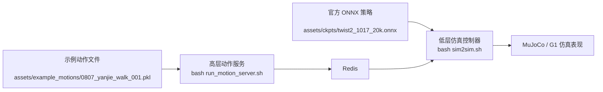
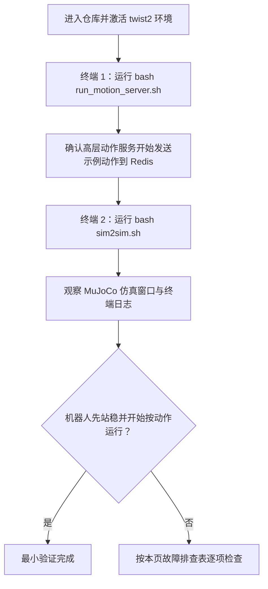

这是一条**初次运行 TWIST2 时最短、最保守的验证路径**：不从训练开始，不接入 PICO，也不直接上实机，而是直接使用仓库内已经提供的**官方 ONNX 策略** `assets/ckpts/twist2_1017_20k.onnx`，配合脚本默认选中的**示例动作文件** `assets/example_motions/0807_yanjie_walk_001.pkl`，先把“高层动作流 → Redis → 低层策略 → MuJoCo 仿真”这条最小闭环跑通。你当前位于快速开始中的“首次运行路径”部分，完成本页后，最自然的下一步是阅读[运行仿真部署链路：从策略文件到 Sim2Sim](7-yun-xing-fang-zhen-bu-shu-lian-lu-cong-ce-lue-wen-jian-dao-sim2sim)或[通过图形控制中心管理常用服务与进程](9-tong-guo-tu-xing-kong-zhi-zhong-xin-guan-li-chang-yong-fu-wu-yu-jin-cheng)。  
Sources: [README.md](README.md#L124-L127), [README.md](README.md#L215-L255), [run_motion_server.sh](run_motion_server.sh#L1-L25), [sim2sim.sh](sim2sim.sh#L1-L15)

## 你现在要验证的到底是什么

本页验证的不是“模型训练是否成功”，也不是“遥操作设备是否正常”，而是更基础的三件事：**示例动作是否能被高层服务读取并持续发送**、**Redis 通信是否打通**、以及**官方 ONNX 策略是否能在仿真低层控制器中稳定执行**。README 明确给出的首次仿真验证流程，就是先启动高层 motion server 预热 Redis，再启动低层仿真控制器；如果一切正常，机器人会先站住，随后在高层动作流驱动下执行动作，并且终端会显示策略执行 FPS。  
Sources: [README.md](README.md#L215-L255), [README.md](README.md#L229-L239)

## 最小验证架构总览

在这条最小路径中，仓库已经帮你把关键输入都固定好了：`run_motion_server.sh` 默认读取 `assets/example_motions/0807_yanjie_walk_001.pkl`，而 `sim2sim.sh` 默认读取 `assets/ckpts/twist2_1017_20k.onnx`。两者之间通过 Redis 解耦，因此你需要分别开两个终端，各跑一个脚本。  
Sources: [run_motion_server.sh](run_motion_server.sh#L3-L22), [sim2sim.sh](sim2sim.sh#L1-L15)

在理解下面的流程图之前，可以先把它想成两层：**高层动作流服务**只负责不断发送目标动作，**低层控制服务**只负责读取这些目标并用 ONNX 策略驱动 G1 仿真机体。Redis 位于两者中间，负责跨进程交换数据。  
Sources: [README.md](README.md#L223-L229), [README.md](README.md#L241-L255), [run_motion_server.sh](run_motion_server.sh#L17-L22), [sim2sim.sh](sim2sim.sh#L6-L13)



Sources: [run_motion_server.sh](run_motion_server.sh#L3-L22), [sim2sim.sh](sim2sim.sh#L1-L15), [README.md](README.md#L215-L255)

## 这条路径会用到哪些现成资源

从仓库现状来看，你不需要自己准备最小验证所需的动作和模型文件，因为二者都已经内置在 `assets` 目录中。下面这个结构就是本页真正会碰到的核心资源集合。  
Sources: [README.md](README.md#L124-L127), [run_motion_server.sh](run_motion_server.sh#L3-L5), [sim2sim.sh](sim2sim.sh#L1-L8)

```text
assets/
├── ckpts/
│   ├── twist2_1017_20k.onnx
│   └── twist2_1017_25k.onnx
├── example_motions/
│   ├── 0807_yanjie_walk_001.pkl
│   ├── 0807_yanjie_walk_002.pkl
│   ├── ...
│   └── 0807_yanjie_walk_010.pkl
└── g1/
    └── g1_sim2sim_29dof.xml
```

Sources: [run_motion_server.sh](run_motion_server.sh#L3-L5), [sim2sim.sh](sim2sim.sh#L1-L8)

## 运行前检查清单

虽然本页不重复环境安装细节，但最小验证路径本身仍然依赖几个前置条件：你需要在 `twist2` 环境中运行，且已经安装 Isaac Gym、Redis、ONNXRuntime；README 还特别说明，如果是第一次使用 Redis，需要先安装并启动 Redis 服务。这里不展开安装过程，安装方法请回到[Isaac Gym、MuJoCo、Redis 与 ONNXRuntime 配置](4-isaac-gym-mujoco-redis-yu-onnxruntime-pei-zhi)。  
Sources: [README.md](README.md#L31-L84), [README.md](README.md#L186-L188), [EVAL_README.md](EVAL_README.md#L198-L203)

下面这张表只保留和“能否跑起最小验证”直接相关的检查项。  
Sources: [README.md](README.md#L31-L84), [README.md](README.md#L215-L255), [sim2sim.sh](sim2sim.sh#L1-L15), [run_motion_server.sh](run_motion_server.sh#L1-L25)

| 检查项 | 为什么需要 | 你应该看到什么 |
|---|---|---|
| `conda activate twist2` | 仿真与低层控制脚本按该环境组织 | 相关 Python 依赖可导入 |
| Redis 已启动 | 高层动作服务与低层控制器通过 Redis 解耦 | 两个脚本都能正常连通，不会立即报通信错误 |
| `assets/ckpts/twist2_1017_20k.onnx` 存在 | 这是 `sim2sim.sh` 默认使用的官方策略 | 低层脚本能成功加载策略 |
| `assets/example_motions/0807_yanjie_walk_001.pkl` 存在 | 这是 `run_motion_server.sh` 默认使用的示例动作 | 高层动作服务能成功开始流式发送 |
| `assets/g1/g1_sim2sim_29dof.xml` 存在 | MuJoCo 仿真模型文件 | 仿真控制器能成功创建机器人模型 |

Sources: [README.md](README.md#L51-L55), [README.md](README.md#L58-L84), [run_motion_server.sh](run_motion_server.sh#L3-L22), [sim2sim.sh](sim2sim.sh#L1-L15)

## 一图看懂操作顺序

这个顺序很重要：**先开高层动作服务，再开低层仿真控制器**。README 对首次仿真验证的描述也是这样安排的，因为第一次运行时需要先把 Redis 中的动作流“热起来”。  
Sources: [README.md](README.md#L215-L255)



Sources: [README.md](README.md#L215-L255), [run_motion_server.sh](run_motion_server.sh#L17-L22), [sim2sim.sh](sim2sim.sh#L6-L13)

## 步骤 1：激活环境并确认当前目录

建议你从仓库根目录直接执行脚本，因为 `run_motion_server.sh` 和 `sim2sim.sh` 都会先根据自身位置计算 `SCRIPT_DIR`，再切换到各自需要的工作路径；这意味着从仓库根启动是最自然、也最不容易出错的方式。  
Sources: [run_motion_server.sh](run_motion_server.sh#L1-L9), [sim2sim.sh](sim2sim.sh#L1-L4)

```bash
cd /home/huanghao/source/code/TWIST2
conda activate twist2
```

Sources: [README.md](README.md#L34-L39), [eval_model.sh](eval_model.sh#L29-L32)

## 步骤 2：在终端 1 启动示例动作流服务

`run_motion_server.sh` 已经把默认动作写死为 `0807_yanjie_walk_001.pkl`，同时默认把 Redis 地址设为 `localhost`。它随后进入 `deploy_real` 目录，启动 `server_motion_lib.py`，并带上 `--vis`，也就是会以可视化方式运行该动作流服务。  
Sources: [run_motion_server.sh](run_motion_server.sh#L3-L22)

```bash
bash run_motion_server.sh
```

Sources: [run_motion_server.sh](run_motion_server.sh#L1-L25)

如果你想确认脚本“运行的到底是不是示例动作”，可以直接对照脚本内容：当前默认并不是随机读取，而是明确指定了 `assets/example_motions/0807_yanjie_walk_001.pkl`。这也是为什么这条路径适合作为入门验证——输入数据是固定的，复现成本最低。  
Sources: [run_motion_server.sh](run_motion_server.sh#L3-L6)

## 步骤 3：在终端 2 启动官方 ONNX 策略的仿真控制器

`sim2sim.sh` 同样是预配置好的：它把 `ckpt_path` 指向 `assets/ckpts/twist2_1017_20k.onnx`，进入 `deploy_real` 后启动 `server_low_level_g1_sim.py`，并指定 G1 的 MuJoCo XML 为 `../assets/g1/g1_sim2sim_29dof.xml`。也就是说，这一步无需你额外填模型路径。  
Sources: [sim2sim.sh](sim2sim.sh#L1-L15)

```bash
bash sim2sim.sh
```

Sources: [sim2sim.sh](sim2sim.sh#L1-L15)

README 对这一阶段的预期结果讲得很清楚：低层控制器先启动后，你应该能看到机器人先站立不动；这是因为系统默认会让 Redis 发送 stand pose。随后当高层 motion server 持续推送动作时，机器人才会被高层动作流驱动。  
Sources: [README.md](README.md#L223-L229), [README.md](README.md#L241-L250)

## 你应该观察到的“成功信号”

最小验证成功时，至少应当同时满足三个外部现象：第一，两个脚本都没有在启动阶段直接报错退出；第二，仿真已经起来，机器人能够先稳定站住；第三，终端能打印策略执行 FPS，README 给出的预期目标是接近 50 Hz，如果机器性能不足则会更低，并且会影响执行效果。  
Sources: [README.md](README.md#L223-L239)

下面这张表可以当作你的“验收标准”。  
Sources: [README.md](README.md#L223-L239), [run_motion_server.sh](run_motion_server.sh#L17-L22), [sim2sim.sh](sim2sim.sh#L6-L13)

| 观察点 | 成功时的表现 | 含义 |
|---|---|---|
| 高层动作服务终端 | 进程持续运行，没有立即退出 | 示例动作已被读取并持续发送 |
| 低层仿真终端 | 能正常启动仿真与策略，不报模型路径错误 | 官方 ONNX 已成功加载 |
| 仿真中的机器人初始状态 | 先稳定站立 | Redis 默认 stand pose 生效 |
| 仿真持续表现 | 能跟随高层动作流运动 | 高层与低层链路已打通 |
| FPS 输出 | 终端出现策略执行 FPS 信息 | 低层策略正在持续推理 |

Sources: [README.md](README.md#L223-L239), [run_motion_server.sh](run_motion_server.sh#L17-L22), [sim2sim.sh](sim2sim.sh#L6-L13)

## 关键脚本与默认值速查

对初学者来说，最容易出错的不是“不会执行命令”，而是不知道脚本里已经内置了哪些默认值。下面这张表把最小验证真正用到的默认参数抽出来，方便你对照。  
Sources: [run_motion_server.sh](run_motion_server.sh#L3-L22), [sim2sim.sh](sim2sim.sh#L1-L15)

| 脚本 | 默认输入 | 默认目标 | 备注 |
|---|---|---|---|
| `run_motion_server.sh` | `assets/example_motions/0807_yanjie_walk_001.pkl` | `redis_ip=localhost` | 启动高层动作服务，并开启 `--vis` |
| `sim2sim.sh` | `assets/ckpts/twist2_1017_20k.onnx` | `assets/g1/g1_sim2sim_29dof.xml` | 启动低层 MuJoCo 仿真控制器 |
| `sim2sim.sh` | `--device cuda` | `--policy_frequency 100` | 还启用了 `--measure_fps 1`，因此会打印 FPS |

Sources: [run_motion_server.sh](run_motion_server.sh#L3-L22), [sim2sim.sh](sim2sim.sh#L1-L15)

## 修改前 / 修改后：最常见的两个入门自定义

如果你已经跑通默认流程，下一步最常见的需求只有两个：**切换示例动作**，或者**切换官方 ONNX 检查点**。这两个修改都不需要改 Python，只需要改 shell 脚本中的固定路径。  
Sources: [run_motion_server.sh](run_motion_server.sh#L3-L6), [sim2sim.sh](sim2sim.sh#L1-L2)

| 目标 | 修改前 | 修改后 |
|---|---|---|
| 切换示例动作 | `motion_file="${script_dir}/assets/example_motions/0807_yanjie_walk_001.pkl"` | `motion_file="${script_dir}/assets/example_motions/0807_yanjie_walk_005.pkl"` |
| 切换 ONNX 检查点 | `ckpt_path=${SCRIPT_DIR}/assets/ckpts/twist2_1017_20k.onnx` | `ckpt_path=${SCRIPT_DIR}/assets/ckpts/twist2_1017_25k.onnx` |

Sources: [run_motion_server.sh](run_motion_server.sh#L3-L6), [sim2sim.sh](sim2sim.sh#L1-L2)

这里有一个边界要明确：本页讲的是**最小验证**，所以只建议你在官方已提供的示例动作与官方已提供的 ONNX 之间切换。涉及自定义数据集 YAML、大规模评测、模型导出或架构兼容问题的内容，应该转到[模型评测、回放与 ONNX 导出流程](12-mo-xing-ping-ce-hui-fang-yu-onnx-dao-chu-liu-cheng)。  
Sources: [README.md](README.md#L124-L127), [README.md](README.md#L186-L188), [EVAL_README.md](EVAL_README.md#L32-L83)

## 故障排查：最小验证为什么会失败

最小验证失败时，优先不要怀疑“模型坏了”，而应该先检查**路径、Redis、GPU/依赖、以及两终端启动顺序**。因为根据仓库脚本设计，示例动作路径和 ONNX 路径本身都是已经写好的，真正更常见的问题是前置服务或运行环境没有准备好。  
Sources: [README.md](README.md#L58-L84), [README.md](README.md#L215-L255), [run_motion_server.sh](run_motion_server.sh#L3-L22), [sim2sim.sh](sim2sim.sh#L1-L15)

| 现象 | 优先检查项 | 依据 |
|---|---|---|
| `run_motion_server.sh` 启动就退出 | Redis 是否已安装并启动；示例动作文件路径是否存在 | 高层服务默认连 `localhost` Redis，并依赖固定动作文件 |
| `sim2sim.sh` 报模型找不到 | `assets/ckpts/twist2_1017_20k.onnx` 是否存在 | 低层脚本直接硬编码该路径 |
| 仿真能起但机器人不动 | 是否先启动了高层 motion server；Redis 是否连通 | README 要求首次先预热 high-level motion server |
| 机器人站不稳或动作卡顿 | 查看 FPS；机器性能不足会影响执行 | README 明确说明 FPS 低会伤害策略执行 |
| Python 导入失败 | `twist2` 环境、Isaac Gym、ONNXRuntime 是否安装 | README 与 `evaluate_model.py` 都声明了这些依赖 |

Sources: [README.md](README.md#L51-L55), [README.md](README.md#L58-L84), [README.md](README.md#L215-L255), [run_motion_server.sh](run_motion_server.sh#L3-L22), [sim2sim.sh](sim2sim.sh#L1-L15), [evaluate_model.py](evaluate_model.py#L141-L156), [evaluate_model.py](evaluate_model.py#L918-L928)

## 本页不做什么

为了保持这条路径对初学者足够清晰，本页**不覆盖**以下内容：不讲如何训练策略，不讲如何把 PT 导成 ONNX，不讲如何用 YAML 对整套动作库做量化评测，也不讲 PICO 遥操作或实机部署。README 虽然同时提供了这些入口，但它们属于后续页面的主题。  
Sources: [README.md](README.md#L192-L214), [README.md](README.md#L253-L303), [EVAL_README.md](EVAL_README.md#L32-L83)

如果你已经完成本页的最小闭环，接下来的推荐顺序是：先看[运行仿真部署链路：从策略文件到 Sim2Sim](7-yun-xing-fang-zhen-bu-shu-lian-lu-cong-ce-lue-wen-jian-dao-sim2sim)理解仿真链路细节；如果你更喜欢图形入口，再看[通过图形控制中心管理常用服务与进程](9-tong-guo-tu-xing-kong-zhi-zhong-xin-guan-li-chang-yong-fu-wu-yu-jin-cheng)；如果你想进入遥操作，则继续阅读[启动遥操作链路：PICO 串流、姿态校准与控制按键](8-qi-dong-yao-cao-zuo-lian-lu-pico-chuan-liu-zi-tai-xiao-zhun-yu-kong-zhi-an-jian)。  
Sources: [README.md](README.md#L241-L255), [README.md](README.md#L290-L303)

## 最短可复制命令区

如果你只想按最短路径直接验证，请使用下面这组命令，并确保在**两个终端**中分别执行后两条。  
Sources: [run_motion_server.sh](run_motion_server.sh#L1-L25), [sim2sim.sh](sim2sim.sh#L1-L15)

```bash
cd /home/huanghao/source/code/TWIST2
conda activate twist2

# 终端 1
bash run_motion_server.sh

# 终端 2
bash sim2sim.sh
```