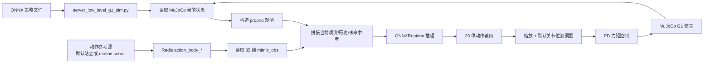
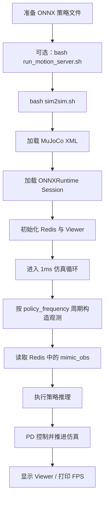
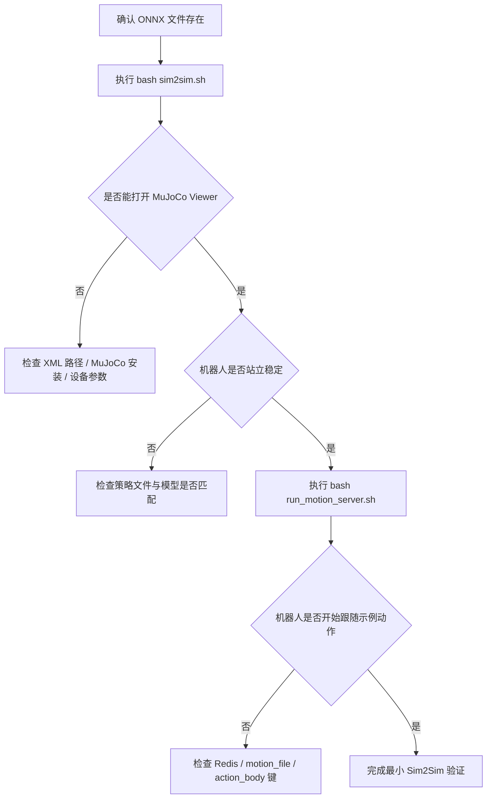

这一页只回答一个初学者最常见的问题：**当你手里已经有一个可推理的 ONNX 策略文件时，仓库是如何把它接到 MuJoCo 里的 G1 模型上，并跑成一个可观察、可调参、可测 FPS 的 Sim2Sim 闭环的**。这里不展开训练原理，也不展开 Teleop 采集，只聚焦于“策略文件 → Redis 中间层 → 低层控制器 → MuJoCo 仿真”这条最小部署路径。Sources: [README.md](README.md#L215-L239) [sim2sim.sh](sim2sim.sh#L1-L15) [deploy_real/server_low_level_g1_sim.py](deploy_real/server_low_level_g1_sim.py#L444-L508)

## 先建立正确心智模型

**Sim2Sim 在这个仓库里不是“直接把策略喂给动作文件”**，而是沿用了与真实部署一致的解耦思路：高层参考动作通过 Redis 提供 `action_body_*`，低层控制器再读取这些参考目标、拼接本体观测与历史缓存，送入 ONNX 策略推理，最后用 PD 控制把策略输出变成 MuJoCo 的关节力矩。这样做的好处是：高层动作源可以是默认站立、动作库回放，甚至将来替换成别的在线输入，而低层控制器不需要改接口。Sources: [README.md](README.md#L223-L229) [deploy_real/server_low_level_g1_sim.py](deploy_real/server_low_level_g1_sim.py#L277-L405) [deploy_real/server_motion_lib.py](deploy_real/server_motion_lib.py#L206-L246)

下面这张图先给出全链路总览。阅读它时，你只需要抓住三件事：**策略文件负责“怎么动”**，**Redis 负责“怎么传”**，**MuJoCo+PD 负责“怎么执行”**。Sources: [sim2sim.sh](sim2sim.sh#L1-L15) [deploy_real/server_low_level_g1_sim.py](deploy_real/server_low_level_g1_sim.py#L258-L337) [deploy_real/server_motion_lib.py](deploy_real/server_motion_lib.py#L206-L246)



## 你现在真正会用到的文件

对于“从策略文件到 Sim2Sim”这条链路，核心文件其实很少。`sim2sim.sh` 是启动入口；`server_low_level_g1_sim.py` 是真正跑闭环的低层仿真控制器；`server_motion_lib.py` 是可选的高层参考动作发布器；`params.py` 给出了默认站立时发送的 35 维 mimic 目标；`assets/g1/g1_sim2sim_29dof.xml` 则是 Sim2Sim 用的 G1 MuJoCo 模型。Sources: [sim2sim.sh](sim2sim.sh#L1-L15) [deploy_real/server_low_level_g1_sim.py](deploy_real/server_low_level_g1_sim.py#L444-L508) [deploy_real/server_motion_lib.py](deploy_real/server_motion_lib.py#L280-L312) [deploy_real/data_utils/params.py](deploy_real/data_utils/params.py#L3-L69)

```text
TWIST2/
├── sim2sim.sh                         # 一键启动 Sim2Sim
├── run_motion_server.sh               # 可选：先启动动作参考 server
├── assets/
│   ├── ckpts/twist2_1017_20k.onnx     # 默认 ONNX 策略
│   └── g1/g1_sim2sim_29dof.xml        # MuJoCo G1 模型
└── deploy_real/
    ├── server_low_level_g1_sim.py     # 低层控制器 + ONNX 推理 + PD
    ├── server_motion_lib.py           # 动作库回放到 Redis
    └── data_utils/params.py           # 默认 mimic 站立目标
```

这个结构里最容易混淆的一点是：**`sim2sim.sh` 默认只启动低层控制器，不会自动帮你启动动作参考服务**。所以 README 才会特别提醒，第一次运行时可以先用 `run_motion_server.sh` “预热” Redis；否则低层控制器看到的通常只是 Redis 里已有的默认或残留值。Sources: [README.md](README.md#L215-L229) [run_motion_server.sh](run_motion_server.sh#L1-L25) [sim2sim.sh](sim2sim.sh#L4-L15)

## 第 1 步：确认你的输入是什么

这一链路的直接输入不是 `.pt`，而是 **ONNX 文件**。`sim2sim.sh` 默认把策略路径指向 `assets/ckpts/twist2_1017_20k.onnx`，然后把这个路径传给 `server_low_level_g1_sim.py --policy`。控制器内部使用 `onnxruntime.InferenceSession` 加载模型，并按 `--device` 优先选择 CUDA，否则退回 CPU。Sources: [sim2sim.sh](sim2sim.sh#L1-L15) [deploy_real/server_low_level_g1_sim.py](deploy_real/server_low_level_g1_sim.py#L21-L59)

如果你还只有训练检查点，README 给出的推荐路径是先通过 `to_onnx.sh` 导出 ONNX，再进入 Sim2Sim。也就是说，**这页的起点可以理解成“你已经有一个可推理的 ONNX 策略”**。Sources: [README.md](README.md#L210-L225)

## 第 2 步：理解一键脚本到底做了什么

`sim2sim.sh` 的逻辑非常直接：先定位仓库根目录，再把默认策略设为 `assets/ckpts/twist2_1017_20k.onnx`，切换到 `deploy_real/`，最后运行 `python server_low_level_g1_sim.py`，同时传入 XML、策略路径、设备、FPS 测量、策略频率、viewer 刷新间隔和是否限速等参数。对初学者来说，这意味着你只改两类东西就够了：**模型文件** 和 **启动参数**。Sources: [sim2sim.sh](sim2sim.sh#L1-L15)

下面这张流程图展示的是“一次标准启动”里发生的事情。Sources: [sim2sim.sh](sim2sim.sh#L1-L15) [deploy_real/server_low_level_g1_sim.py](deploy_real/server_low_level_g1_sim.py#L444-L508)



为了把脚本封装与实际命令对齐，可以把它理解成下面这张“前后对照表”。Sources: [sim2sim.sh](sim2sim.sh#L1-L15) [deploy_real/server_low_level_g1_sim.py](deploy_real/server_low_level_g1_sim.py#L444-L508)

| 你执行的命令 | 实际效果 |
|---|---|
| `bash sim2sim.sh` | 进入 `deploy_real/` 目录，启动低层仿真控制器 |
| 默认策略 | `assets/ckpts/twist2_1017_20k.onnx` |
| 默认机器人模型 | `../assets/g1/g1_sim2sim_29dof.xml` |
| 默认推理设备 | `cuda` |
| 默认策略频率 | `100 Hz` |
| 默认 Viewer 刷新 | 每 `100` 个仿真 step 同步一次 |
| 默认限速 | 开启，尽量按真实时间推进 |

## 第 3 步：为什么第一次常常要先跑 motion server

README 里那句“先 warm up the redis server”本质上是在提醒你：**低层控制器依赖 Redis 里的高层参考输入**。在仿真循环里，控制器会主动写入 `state_body_unitree_g1_with_hands` 等状态键，然后读取 `action_body_unitree_g1_with_hands`、手部和颈部动作键；如果这些动作键没有被一个上游进程持续更新，那么机器人就只会停在默认参考附近，通常表现为站立不动。Sources: [README.md](README.md#L217-L231) [deploy_real/server_low_level_g1_sim.py](deploy_real/server_low_level_g1_sim.py#L258-L337)

`run_motion_server.sh` 正是那个最简单的上游：它选一个示例动作文件，进入 `deploy_real/` 后启动 `server_motion_lib.py`，把动作库中的参考帧实时编码为 35 维 mimic 观测，并发布到 Redis 的 `action_body_unitree_g1_with_hands`。Sources: [run_motion_server.sh](run_motion_server.sh#L1-L25) [deploy_real/server_motion_lib.py](deploy_real/server_motion_lib.py#L122-L148) [deploy_real/server_motion_lib.py](deploy_real/server_motion_lib.py#L206-L221)

这也解释了 README 中的现象描述：**只跑 `sim2sim.sh` 时，你很可能看到的是机器人稳稳站着**，因为默认参考目标就是站立姿态，而不是某段持续变化的动作轨迹。这个默认值来自 `DEFAULT_MIMIC_OBS["unitree_g1_with_hands"]`。Sources: [README.md](README.md#L227-L229) [deploy_real/data_utils/params.py](deploy_real/data_utils/params.py#L3-L16) [deploy_real/data_utils/params.py](deploy_real/data_utils/params.py#L63-L69)

## 第 4 步：搞清楚 35 维 mimic_obs 是什么

Sim2Sim 里，高层参考不是“直接给 29 个关节角”，而是一个 **35 维 mimic 观测**。它由 `server_motion_lib.py` 和 `run_simulation.py` 中相同的 `build_mimic_obs()` 逻辑构造：前 6 维是根部相关信息，具体是局部坐标下的 `xy` 速度、根部 `z` 高度、`roll/pitch`，以及局部 `yaw` 角速度；后 29 维才是 G1 的关节位置。Sources: [deploy_real/server_motion_lib.py](deploy_real/server_motion_lib.py#L20-L98) [deploy_real/run_simulation.py](deploy_real/run_simulation.py#L64-L132)

这 35 维的设计很关键，因为低层控制器并不是被动接“目标关节角”，而是在策略输入里同时看到**参考运动语义**和**当前机器人本体状态**。默认站立 mimic 观测里也遵守同一结构：前面是零速度与约 0.8 米根部高度，后面是 29 自由度的默认站立关节位姿。Sources: [deploy_real/data_utils/params.py](deploy_real/data_utils/params.py#L3-L16) [deploy_real/server_low_level_g1_sim.py](deploy_real/server_low_level_g1_sim.py#L187-L199)

下面这张表把 35 维结构拆开，便于你对日志、断点和 Redis 内容建立直觉。Sources: [deploy_real/server_motion_lib.py](deploy_real/server_motion_lib.py#L68-L98) [deploy_real/server_low_level_g1_sim.py](deploy_real/server_low_level_g1_sim.py#L187-L199)

| 区段 | 维度数 | 内容 |
|---|---:|---|
| 根部局部线速度 | 2 | `root_vel_local[..., :2]` |
| 根部高度 | 1 | `root_pos[..., 2:3]` |
| 根部姿态 | 2 | `roll`, `pitch` |
| 根部局部角速度 | 1 | `yaw angular velocity` |
| 关节目标 | 29 | `dof_pos` |
| 合计 | 35 | `n_mimic_obs = 35` |

## 第 5 步：低层控制器实际如何拼出策略输入

`server_low_level_g1_sim.py` 里，策略输入总维度被明确写成 `1402`。它的组成不是一段平坦魔法数组，而是三块：**当前帧**、**过去 10 帧历史**、**一个未来参考帧**。其中当前帧又等于 `35 维 mimic_obs + 92 维 proprio = 127 维`；所以总输入是 `127 × 11 + 35 = 1402`。Sources: [deploy_real/server_low_level_g1_sim.py](deploy_real/server_low_level_g1_sim.py#L187-L205) [deploy_real/server_low_level_g1_sim.py](deploy_real/server_low_level_g1_sim.py#L323-L339)

这里的 proprio 由当前仿真状态计算而来，具体包括：缩放后的机体角速度、`roll/pitch`、相对默认位姿的关节偏移、缩放后的关节速度，以及上一时刻动作 `last_action`。这说明策略不是只跟着高层动作走，而是在用**参考目标 + 当前身体反馈 + 历史上下文**共同决定下一步控制输出。Sources: [deploy_real/server_low_level_g1_sim.py](deploy_real/server_low_level_g1_sim.py#L281-L337)

把这部分想清楚之后，你就会知道为什么 Redis 只需要传 35 维高层参考，而不需要传完整 1402 维输入：**剩下的 1367 维里，大部分都来自低层控制器本地维护的状态与历史缓存**。Sources: [deploy_real/server_low_level_g1_sim.py](deploy_real/server_low_level_g1_sim.py#L202-L205) [deploy_real/server_low_level_g1_sim.py](deploy_real/server_low_level_g1_sim.py#L323-L339)

下面这张表可以直接当作调试输入维度时的速查表。Sources: [deploy_real/server_low_level_g1_sim.py](deploy_real/server_low_level_g1_sim.py#L187-L199) [deploy_real/server_low_level_g1_sim.py](deploy_real/server_low_level_g1_sim.py#L323-L334)

| 输入块 | 计算方式 | 维度 |
|---|---|---:|
| mimic_obs | 来自 Redis 的高层参考 | 35 |
| proprio | 当前姿态/速度/上一步动作 | 92 |
| 当前帧 obs_full | `35 + 92` | 127 |
| 历史帧 | `127 × 10` | 1270 |
| future_obs | 当前读取的 mimic 参考副本 | 35 |
| 总输入 obs_buf | `127 + 1270 + 35` | 1402 |

## 第 6 步：策略输出如何落到 MuJoCo 关节上

ONNX 推理的输出是 29 维动作向量。控制器会先把它裁剪到 `[-10, 10]`，再乘以逐关节的 `action_scale`，然后加上 `default_dof_pos` 得到 PD 目标位姿 `pd_target`。Sources: [deploy_real/server_low_level_g1_sim.py](deploy_real/server_low_level_g1_sim.py#L177-L183) [deploy_real/server_low_level_g1_sim.py](deploy_real/server_low_level_g1_sim.py#L380-L384)

真正送进 MuJoCo 的不是位置命令，而是根据目标位姿和当前状态计算出的 PD 力矩：`torque = (pd_target - dof_pos) * stiffness - dof_vel * damping`，然后再按 `torque_limits` 截断。也就是说，**策略负责给出“该往哪里去”，PD 控制负责“怎么稳定地去”**。Sources: [deploy_real/server_low_level_g1_sim.py](deploy_real/server_low_level_g1_sim.py#L153-L175) [deploy_real/server_low_level_g1_sim.py](deploy_real/server_low_level_g1_sim.py#L400-L405)

这也是为什么你在调试 Sim2Sim 时，除了策略文件本身，还要关注 XML 模型、默认站立位姿、刚度阻尼和动作缩放：它们共同决定了“同一个策略输出”在 MuJoCo 中看起来是柔和、僵硬，还是直接发散。Sources: [deploy_real/server_low_level_g1_sim.py](deploy_real/server_low_level_g1_sim.py#L133-L183) [assets/g1/README.md](assets/g1/README.md#L7-L18)

## 第 7 步：频率与时间尺度是怎么对齐的

低层仿真把 MuJoCo 步长固定成 `0.001s`，也就是 **1ms 一个仿真 step**。`policy_frequency` 则控制“每隔多少仿真 step 执行一次策略推理”，其换算是 `sim_decimation = 1 / (policy_frequency * sim_dt)`。在 `sim2sim.sh` 里默认传的是 `100 Hz`，所以会每 10 个仿真 step 执行一次策略。Sources: [sim2sim.sh](sim2sim.sh#L6-L13) [deploy_real/server_low_level_g1_sim.py](deploy_real/server_low_level_g1_sim.py#L121-L129)

README 中举例看到 “50 Hz 左右” 的 FPS 输出，说明**预期策略执行频率和实际机器算力之间可能不完全一致**。代码里既可以周期性打印最近若干步的执行频率，也可以在 `measure_fps` 打开时统计平均值、最大值、最小值和标准差。Sources: [README.md](README.md#L231-L239) [deploy_real/server_low_level_g1_sim.py](deploy_real/server_low_level_g1_sim.py#L341-L378)

如果你只想先验证链路跑通，默认参数足够；如果你想看得更顺畅，`viewer_decimation` 可以降低 Viewer 更新频率，减少可视化开销；`limit_fps` 则决定是否用 `sleep` 尽量维持真实时间推进。Sources: [sim2sim.sh](sim2sim.sh#L10-L13) [deploy_real/server_low_level_g1_sim.py](deploy_real/server_low_level_g1_sim.py#L126-L129) [deploy_real/server_low_level_g1_sim.py](deploy_real/server_low_level_g1_sim.py#L407-L420)

## 推荐操作顺序：从“能站住”到“能跟动作”

对于第一次上手，我建议你按下面顺序跑，而不是一开始就改很多参数。第一阶段先只验证：**ONNX 能加载、MuJoCo 能启动、Viewer 能显示、策略循环没有报错**；第二阶段再验证：**高层 motion server 发布的 mimic 目标能驱动机器人产生连续动作**。Sources: [README.md](README.md#L215-L229) [run_motion_server.sh](run_motion_server.sh#L1-L25) [sim2sim.sh](sim2sim.sh#L1-L15)



对应的最小命令集就是下面两条。第一条是可选但强烈推荐，第二条是真正的 Sim2Sim 启动命令。Sources: [README.md](README.md#L217-L225) [run_motion_server.sh](run_motion_server.sh#L17-L22) [sim2sim.sh](sim2sim.sh#L4-L13)

```bash
bash run_motion_server.sh
bash sim2sim.sh
```

## 启动参数速查表

对初学者最重要的不是记住所有参数，而是知道每个参数控制哪一层行为。`--xml` 决定 MuJoCo 机器人模型，`--policy` 决定推理模型，`--device` 决定 ONNXRuntime 的执行设备，`--policy_frequency` 决定策略更新频率，`--viewer_decimation` 决定可视化刷新频率，`--smooth_body` 则会对从 Redis 读到的高层 mimic 目标做 EMA 平滑。Sources: [deploy_real/server_low_level_g1_sim.py](deploy_real/server_low_level_g1_sim.py#L444-L503) [sim2sim.sh](sim2sim.sh#L6-L13)

| 参数 | 默认值 | 作用 | 你什么时候该改 |
|---|---:|---|---|
| `--xml` | `../assets/g1/g1_sim2sim_29dof.xml` | 选择 G1 MuJoCo 模型 | 切换模型版本时 |
| `--policy` | 必填 | 指定 ONNX 策略文件 | 切换你的导出模型时 |
| `--device` | `cuda` | ONNX 推理设备 | GPU 不可用时改 `cpu` |
| `--policy_frequency` | `100` | 策略执行频率 | 想降负载或匹配训练设置时 |
| `--viewer_decimation` | `0` | Viewer 刷新步长；0 表示跟随策略 decimation | Viewer 卡顿时 |
| `--measure_fps` | `0/1` | 统计策略执行 FPS | 性能诊断时 |
| `--limit_fps` | `1` | 是否按真实时间限速 | 想尽快离线跑完时可关闭 |
| `--record_proprio` | 关闭 | 记录本体观测 | 想离线分析时 |
| `--smooth_body` | `0.0` | 对 Redis 高层目标做 EMA 平滑 | 目标抖动时 |

## 常见现象与定位方法

**现象 1：机器人只站着不动。** 这通常不是低层控制器坏了，而是高层参考没有持续更新。README 已经明确说明，只启动低层控制器时，默认就是分离式架构下的“站立待命”；若要看到动作跟随，需要再启动 motion server 持续向 Redis 发布 mimic 目标。Sources: [README.md](README.md#L223-L231) [deploy_real/server_motion_lib.py](deploy_real/server_motion_lib.py#L206-L221) [deploy_real/data_utils/params.py](deploy_real/data_utils/params.py#L63-L69)

**现象 2：终端提示找不到策略文件或 XML 文件。** 这是最直接的一类错误，`main()` 在正式启动前就会检查 `args.policy` 和 `args.xml` 是否存在，不存在会直接打印错误并返回。Sources: [deploy_real/server_low_level_g1_sim.py](deploy_real/server_low_level_g1_sim.py#L474-L482)

**现象 3：FPS 明显低于预期。** 代码会打印预期频率 `1 / (sim_decimation * sim_dt)`，也会统计实际策略执行频率；当 Viewer 刷新过于频繁、设备落到 CPU、或机器算力不足时，实际值会低于设定值。优先检查 `device`、`viewer_decimation` 和系统负载。Sources: [deploy_real/server_low_level_g1_sim.py](deploy_real/server_low_level_g1_sim.py#L45-L59) [deploy_real/server_low_level_g1_sim.py](deploy_real/server_low_level_g1_sim.py#L341-L378) [deploy_real/server_low_level_g1_sim.py](deploy_real/server_low_level_g1_sim.py#L407-L420)

**现象 4：动作有点抖。** 在这个控制器里，唯一直接针对 Redis 高层目标的平滑措施是 `--smooth_body`，它会对读到的 `action_mimic` 做 EMA 平滑，再送入策略输入。这个参数不改变策略本身，只改变高层参考的时间平滑性。Sources: [deploy_real/server_low_level_g1_sim.py](deploy_real/server_low_level_g1_sim.py#L62-L82) [deploy_real/server_low_level_g1_sim.py](deploy_real/server_low_level_g1_sim.py#L211-L217) [deploy_real/server_low_level_g1_sim.py](deploy_real/server_low_level_g1_sim.py#L318-L321)

下面这张排障表可以直接照着查。Sources: [README.md](README.md#L215-L239) [deploy_real/server_low_level_g1_sim.py](deploy_real/server_low_level_g1_sim.py#L474-L482) [deploy_real/server_motion_lib.py](deploy_real/server_motion_lib.py#L206-L221)

| 现象 | 最可能原因 | 优先检查 |
|---|---|---|
| Viewer 打不开 | MuJoCo/路径问题 | `--xml` 路径、MuJoCo 安装 |
| 一直站立不动 | 没有高层参考输入 | 先跑 `bash run_motion_server.sh` |
| 启动即报策略文件不存在 | 路径错误 | `--policy` 是否指向真实 ONNX |
| FPS 很低 | 设备或渲染负载过高 | `--device`、`viewer_decimation` |
| 动作抖动 | 上游参考变化过快 | 尝试 `--smooth_body` |

## 用于理解链路的“单进程版本”

仓库里还有一个 `deploy_real/run_simulation.py`，它不是 `sim2sim.sh` 默认调用的入口，但很适合你理解这条链路的本质。它不经过 Redis，而是直接在同一个进程里：从动作库构造 mimic 观测、读取 MuJoCo 本体状态、拼完整观测、执行 ONNX 策略、再做 PD 控制。因此它可以被看作是一个**“把分布式 Sim2Sim 压平成单进程”**的理解版或诊断版。Sources: [deploy_real/run_simulation.py](deploy_real/run_simulation.py#L64-L132) [deploy_real/run_simulation.py](deploy_real/run_simulation.py#L249-L320)

这两个入口的区别，对初学者来说可以这样记：**`server_low_level_g1_sim.py` 更接近真实部署结构，`run_simulation.py` 更接近教学与调试结构**。如果你想先理解“观测到底怎么拼的”，后者更直观；如果你想验证“仓库默认 Sim2Sim 流程到底怎么跑”，前者才是标准路径。Sources: [deploy_real/server_low_level_g1_sim.py](deploy_real/server_low_level_g1_sim.py#L241-L405) [deploy_real/run_simulation.py](deploy_real/run_simulation.py#L249-L320)

下面给出一个“脚本封装前后”的对照，帮助你区分这两个入口的职责。Sources: [sim2sim.sh](sim2sim.sh#L1-L15) [deploy_real/server_low_level_g1_sim.py](deploy_real/server_low_level_g1_sim.py#L444-L508) [deploy_real/run_simulation.py](deploy_real/run_simulation.py#L135-L156)

| 场景 | 默认入口 | 特点 |
|---|---|---|
| 仓库标准 Sim2Sim | `bash sim2sim.sh` → `server_low_level_g1_sim.py` | 走 Redis，结构与部署一致 |
| 单进程理解/诊断 | `python deploy_real/run_simulation.py ...` | 不依赖 Redis，便于读懂观测拼接 |

## 一次成功运行后，你应该看到什么

如果链路正常，至少会出现三类反馈：第一，终端打印出控制器配置，如 `n_mimic_obs=35`、`history_len=10`、`total_obs_size=1402`；第二，MuJoCo Viewer 会打开并跟随 pelvis；第三，在开启 `measure_fps` 时，你会看到策略执行 FPS 的统计输出。Sources: [deploy_real/server_low_level_g1_sim.py](deploy_real/server_low_level_g1_sim.py#L187-L199) [deploy_real/server_low_level_g1_sim.py](deploy_real/server_low_level_g1_sim.py#L243-L257) [deploy_real/server_low_level_g1_sim.py](deploy_real/server_low_level_g1_sim.py#L341-L378)

如果同时运行了 `run_motion_server.sh`，那么你看到的不应只是静止站立，而应该是机器人根据动作库发布的 mimic 目标做出连续动作；如果没有运行它，则站立待命反而是符合设计的结果。Sources: [README.md](README.md#L217-L229) [run_motion_server.sh](run_motion_server.sh#L17-L22) [deploy_real/server_motion_lib.py](deploy_real/server_motion_lib.py#L216-L224)

## 本页结论

把这一页压缩成一句话，就是：**TWIST2 的 Sim2Sim 不是“直接播放动作”，而是让一个 ONNX 低层策略在 MuJoCo 中实时读取高层 mimic 参考与本体状态，再通过 PD 控制闭环执行**。你真正要掌握的只有四个锚点：`sim2sim.sh` 是入口，`server_low_level_g1_sim.py` 是主控制器，`server_motion_lib.py` 是高层参考来源，`DEFAULT_MIMIC_OBS` 是没有动作源时的默认站立目标。Sources: [sim2sim.sh](sim2sim.sh#L1-L15) [deploy_real/server_low_level_g1_sim.py](deploy_real/server_low_level_g1_sim.py#L241-L405) [deploy_real/server_motion_lib.py](deploy_real/server_motion_lib.py#L206-L246) [deploy_real/data_utils/params.py](deploy_real/data_utils/params.py#L63-L69)

读完本页后，下一步最合理的阅读顺序是：如果你想开始接入 VR 输入，看 [启动遥操作链路：PICO 串流、姿态校准与控制按键](8-qi-dong-yao-cao-zuo-lian-lu-pico-chuan-liu-zi-tai-xiao-zhun-yu-kong-zhi-an-jian)；如果你想理解这里频繁出现的低层控制器、动作参考服务和 Redis 接口分别承担什么职责，看 [低层控制服务：MuJoCo 仿真、PD 参数与 29 自由度动作接口](26-di-ceng-kong-zhi-fu-wu-mujoco-fang-zhen-pd-can-shu-yu-29-zi-you-du-dong-zuo-jie-kou)、[动作参考服务：将数据集片段重建为 35 维 mimic 观测](27-dong-zuo-can-kao-fu-wu-jiang-shu-ju-ji-pian-duan-zhong-jian-wei-35-wei-mimic-guan-ce) 和 [Redis 在系统中的作用：跨进程通信、观测交换与服务解耦](28-redis-zai-xi-tong-zhong-de-zuo-yong-kua-jin-cheng-tong-xin-guan-ce-jiao-huan-yu-fu-wu-jie-ou)。Sources: [README.md](README.md#L215-L239) [deploy_real/server_low_level_g1_sim.py](deploy_real/server_low_level_g1_sim.py#L258-L337) [deploy_real/server_motion_lib.py](deploy_real/server_motion_lib.py#L206-L221)