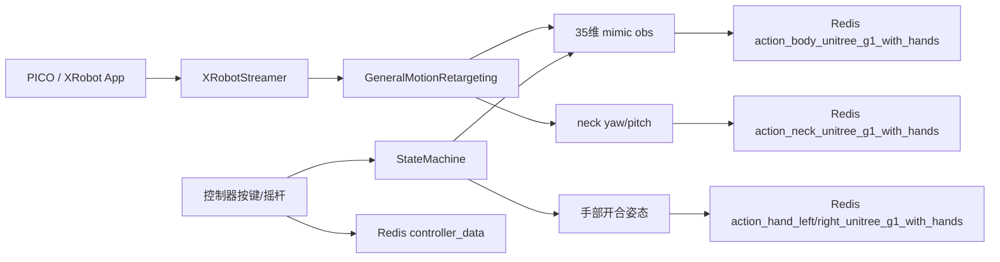
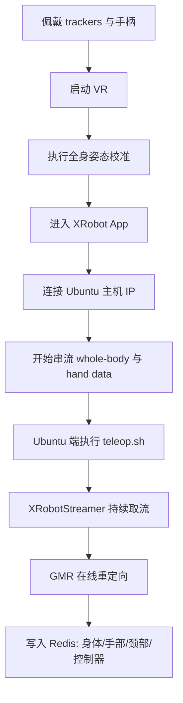

本页只覆盖 **TWIST2 遥操作链路的启动阶段**：PICO/XRobot 端开始推送全身与手部数据、Ubuntu 端启动接收与重定向程序、姿态校准对接到 G1 机器人观测、以及控制器按键在 teleop 与录制场景中的实际作用。它不展开 Sim2Sim、Sim2Real、低层控制服务或数据清洗，这些属于后续页面。若你还没有完成依赖与外部组件接入，建议先阅读 [GMR、PICO SDK 与 Unitree SDK 的外部组件接入](5-gmr-pico-sdk-yu-pico-sdk-yu-unitree-sdk-de-wai-bu-zu-jian-jie-ru)；启动后若要继续验证执行链路，请转到 [运行仿真部署链路：从策略文件到 Sim2Sim](7-yun-xing-fang-zhen-bu-shu-lian-lu-cong-ce-lue-wen-jian-dao-sim2sim) 或 [通过图形控制中心管理常用服务与进程](9-tong-guo-tu-xing-kong-zhi-zhong-xin-guan-li-chang-yong-fu-wu-yu-jin-cheng)。Sources: [doc/TELEOP.md](doc/TELEOP.md#L4-L17) [teleop.sh](teleop.sh#L3-L18) [deploy_real/xrobot_teleop_to_robot_w_hand.py](deploy_real/xrobot_teleop_to_robot_w_hand.py#L720-L841)

## 你当前所处的位置与本页目标

在整个“首次运行路径”中，你当前位于 **[启动遥操作链路：PICO 串流、姿态校准与控制按键](8-qi-dong-yao-cao-zuo-lian-lu-pico-chuan-liu-zi-tai-xiao-zhun-yu-kong-zhi-an-jian)**。这一页的目标不是解释训练，也不是解释机器人底层控制，而是让你完成一件更具体的事：**让 PICO 的人体/手部/控制器数据持续进入 Ubuntu 端，经过在线重定向后，稳定写入 Redis，供后续控制链路消费**。Sources: [doc/TELEOP.md](doc/TELEOP.md#L11-L17) [deploy_real/xrobot_teleop_to_robot_w_hand.py](deploy_real/xrobot_teleop_to_robot_w_hand.py#L404-L415) [deploy_real/xrobot_teleop_to_robot_w_hand.py](deploy_real/xrobot_teleop_to_robot_w_hand.py#L621-L645)

## 遥操作链路的最小组成

从代码的一阶结构看，启动遥操作并不只是一条命令，而是四个环节串起来：**PICO/XRobot App 提供实时帧流**、`XRobotStreamer` 在 Ubuntu 侧取当前帧、`GeneralMotionRetargeting` 将人体数据变成 G1 可用的 `qpos` 与 35 维 mimic 观测、最后通过 Redis 写出身体、手部、颈部和控制器数据。`teleop.sh` 则是这个接收与重定向程序的最小启动入口。Sources: [teleop.sh](teleop.sh#L3-L18) [deploy_real/xrobot_teleop_to_robot_w_hand.py](deploy_real/xrobot_teleop_to_robot_w_hand.py#L404-L424) [deploy_real/xrobot_teleop_to_robot_w_hand.py](deploy_real/xrobot_teleop_to_robot_w_hand.py#L452-L478) [deploy_real/xrobot_teleop_to_robot_w_hand.py](deploy_real/xrobot_teleop_to_robot_w_hand.py#L621-L654)


Sources: [deploy_real/xrobot_teleop_to_robot_w_hand.py](deploy_real/xrobot_teleop_to_robot_w_hand.py#L404-L456) [deploy_real/xrobot_teleop_to_robot_w_hand.py](deploy_real/xrobot_teleop_to_robot_w_hand.py#L458-L478) [deploy_real/xrobot_teleop_to_robot_w_hand.py](deploy_real/xrobot_teleop_to_robot_w_hand.py#L146-L232) [deploy_real/xrobot_teleop_to_robot_w_hand.py](deploy_real/xrobot_teleop_to_robot_w_hand.py#L595-L645) [deploy_real/xrobot_teleop_to_robot_w_hand.py](deploy_real/xrobot_teleop_to_robot_w_hand.py#L648-L654)

## 启动前的人机侧准备顺序

仓库现有说明给出的操作顺序非常明确：先穿戴 motion trackers 与控制器，再启动 VR，随后进行 **全身姿态校准**，然后进入 XRobot App，连接到 Ubuntu 主机 IP，最后开始串流 whole-body data 和 hand data。也就是说，**校准发生在 App 开始串流之前**，而 Ubuntu 侧的 teleop 程序则是在数据进入后持续接收。Sources: [doc/TELEOP.md](doc/TELEOP.md#L11-L20)

## 启动流程图

下面这张流程图只描述“启动遥操作链路”本身，不包含后续 sim2sim 或 sim2real 执行。它对应仓库中已有文档步骤和 `teleop.sh` 的实际入口。Sources: [doc/TELEOP.md](doc/TELEOP.md#L11-L24) [teleop.sh](teleop.sh#L3-L18)


Sources: [doc/TELEOP.md](doc/TELEOP.md#L11-L24) [teleop.sh](teleop.sh#L3-L18) [deploy_real/xrobot_teleop_to_robot_w_hand.py](deploy_real/xrobot_teleop_to_robot_w_hand.py#L404-L424) [deploy_real/xrobot_teleop_to_robot_w_hand.py](deploy_real/xrobot_teleop_to_robot_w_hand.py#L621-L654)

## 关键入口文件与职责

从仓库结构看，当前页面相关的关键文件集中在 `doc/`、根目录 shell 脚本以及 `deploy_real/` 下。真正接收 PICO/XRobot 数据并进行在线遥操作重定向的是 `deploy_real/xrobot_teleop_to_robot_w_hand.py`；若你要做 VR 动作采集而不是机器人 teleop，入口则是 `deploy_real/vr_motion_recorder.py`。Sources: [doc/TELEOP.md](doc/TELEOP.md#L17-L35) [teleop.sh](teleop.sh#L3-L18) [deploy_real/xrobot_teleop_to_robot_w_hand.py](deploy_real/xrobot_teleop_to_robot_w_hand.py#L720-L841) [deploy_real/vr_motion_recorder.py](deploy_real/vr_motion_recorder.py#L1-L21)

```text
TWIST2/
├── doc/
│   └── TELEOP.md                         # 人工步骤与按键说明
├── teleop.sh                            # Ubuntu 端最小 teleop 启动脚本
└── deploy_real/
    ├── xrobot_teleop_to_robot_w_hand.py # 实时接流、状态机、重定向、Redis 发布
    └── vr_motion_recorder.py            # VR 录制入口，使用另一套按键
```
Sources: [doc/TELEOP.md](doc/TELEOP.md#L1-L84) [teleop.sh](teleop.sh#L1-L21) [deploy_real/xrobot_teleop_to_robot_w_hand.py](deploy_real/xrobot_teleop_to_robot_w_hand.py#L1-L24) [deploy_real/vr_motion_recorder.py](deploy_real/vr_motion_recorder.py#L1-L30)

## Ubuntu 侧如何启动 teleop 接收程序

仓库根目录的 `teleop.sh` 会先激活 `gmr` conda 环境，再切到 `deploy_real`，然后以 `python xrobot_teleop_to_robot_w_hand.py` 启动遥操作主程序。这个脚本默认把 `redis_ip` 设为 `localhost`，并显式传入 `--actual_human_height 1.6`、`--target_fps 100`、`--measure_fps 1`。脚本中还预留了 `--smooth` 和 `--pinch_mode`，但在当前默认内容里是注释掉的。Sources: [teleop.sh](teleop.sh#L1-L21)

## 启动参数的实际含义

这些参数都不是抽象配置，而是直接进入 teleop 主循环：`--redis_ip` 决定 Redis 连接地址，`--actual_human_height` 传给 GMR 做人体到机器人重定向，`--neck_retarget_scale` 控制头部映射到机器人颈部时的比例，`--target_fps` 用来构造 RateLimiter，`--smooth` 与 `--smooth_window_size` 会影响 teleop 态下 mimic 观测的滑动平均平滑，`--pinch_mode` 会切换手部开合姿态插值基准。Sources: [deploy_real/xrobot_teleop_to_robot_w_hand.py](deploy_real/xrobot_teleop_to_robot_w_hand.py#L383-L401) [deploy_real/xrobot_teleop_to_robot_w_hand.py](deploy_real/xrobot_teleop_to_robot_w_hand.py#L417-L424) [deploy_real/xrobot_teleop_to_robot_w_hand.py](deploy_real/xrobot_teleop_to_robot_w_hand.py#L614-L616) [deploy_real/xrobot_teleop_to_robot_w_hand.py](deploy_real/xrobot_teleop_to_robot_w_hand.py#L776-L836)

| 参数 | 默认/示例值 | 作用位置 | 作用说明 |
|---|---:|---|---|
| `--redis_ip` | `localhost` | Redis 初始化 | 决定遥操作数据发往哪个 Redis 实例 |
| `--actual_human_height` | 脚本示例 `1.6` | GMR 初始化 | 参与人体尺度到机器人尺度的重定向 |
| `--neck_retarget_scale` | `1.5` | 颈部数据生成 | 对 `human_head_to_robot_neck` 的输出做缩放 |
| `--target_fps` | `100` | RateLimiter / FPSMonitor | 控制 teleop 主循环目标频率 |
| `--smooth` | 关闭 | StateMachine | 对 teleop 状态的 mimic obs 做滑窗平均 |
| `--smooth_window_size` | `5` | StateMachine | 平滑窗口长度 |
| `--pinch_mode` | 关闭 | 手部姿态插值 | 改变 open/close pose 的插值方式 |
| `--measure_fps` | `1` 或 `0` | FPSMonitor | 是否输出更详细的 FPS 统计 |
Sources: [teleop.sh](teleop.sh#L10-L20) [deploy_real/xrobot_teleop_to_robot_w_hand.py](deploy_real/xrobot_teleop_to_robot_w_hand.py#L383-L401) [deploy_real/xrobot_teleop_to_robot_w_hand.py](deploy_real/xrobot_teleop_to_robot_w_hand.py#L614-L616) [deploy_real/xrobot_teleop_to_robot_w_hand.py](deploy_real/xrobot_teleop_to_robot_w_hand.py#L776-L836)

## 姿态校准为什么会直接影响遥操作质量

仓库中对校准的表述虽然简短，但代码能补足它的影响路径：Ubuntu 侧接收到的 `smplx_data` 会直接送入 `self.retarget.retarget(smplx_data, offset_to_ground=True)`，随后从 `qpos` 提取 35 维 mimic 观测；头部姿态则通过 `human_head_to_robot_neck(smplx_data)` 计算出机器人颈部 yaw/pitch。换句话说，**校准后的全身数据就是后续全身 mimic 与 neck 控制的原始输入**。Sources: [doc/TELEOP.md](doc/TELEOP.md#L11-L17) [deploy_real/xrobot_teleop_to_robot_w_hand.py](deploy_real/xrobot_teleop_to_robot_w_hand.py#L458-L478) [deploy_real/xrobot_teleop_to_robot_w_hand.py](deploy_real/xrobot_teleop_to_robot_w_hand.py#L595-L619)

## 串流后系统到底发送了什么

一旦串流正常，主循环每帧会读取 `smplx_data, left_hand_data, right_hand_data, controller_data, headset_data`，更新状态机，再决定发送哪份身体 mimic、颈部数据和手部姿态。发送到 Redis 的键是固定的：身体写到 `action_body_unitree_g1_with_hands`，左右手分别写到 `action_hand_left_unitree_g1_with_hands` 与 `action_hand_right_unitree_g1_with_hands`，颈部写到 `action_neck_unitree_g1_with_hands`，控制器原始数据写到 `controller_data`。Sources: [deploy_real/xrobot_teleop_to_robot_w_hand.py](deploy_real/xrobot_teleop_to_robot_w_hand.py#L733-L765) [deploy_real/xrobot_teleop_to_robot_w_hand.py](deploy_real/xrobot_teleop_to_robot_w_hand.py#L621-L654)

## teleop 状态机：为什么按一下不是“立刻生效”

teleop 入口内部带有一个小型状态机，状态只有 `idle`、`teleop`、`pause`、`exit`。当你按右手 `key_one` 时，不是简单开关，而是在 `idle -> teleop -> pause -> teleop` 之间循环；按左手 `key_one` 会直接进入 `exit`。此外，从 `idle` 或 `pause` 重新进入 `teleop` 时，程序会把默认姿态或上一次姿态 **插值过渡** 到当前重定向姿态，因此体验上不是硬切。Sources: [deploy_real/xrobot_teleop_to_robot_w_hand.py](deploy_real/xrobot_teleop_to_robot_w_hand.py#L109-L145) [deploy_real/xrobot_teleop_to_robot_w_hand.py](deploy_real/xrobot_teleop_to_robot_w_hand.py#L146-L185) [deploy_real/xrobot_teleop_to_robot_w_hand.py](deploy_real/xrobot_teleop_to_robot_w_hand.py#L520-L550) [deploy_real/xrobot_teleop_to_robot_w_hand.py](deploy_real/xrobot_teleop_to_robot_w_hand.py#L669-L685)

| 状态 | 系统行为 | 身体数据来源 | 颈部数据来源 |
|---|---|---|---|
| `idle` | 等待输入，不处理 teleop 动作 | 默认 mimic obs | `[0.0, 0.0]` |
| `teleop` | 正常处理重定向与控制 | 当前重定向结果或插值结果 | 由 `human_head_to_robot_neck` 计算并缩放 |
| `pause` | 冻结在上次姿态 | 上一次 `last_mimic_obs` | 上一次 `last_neck_data` |
| `exit` | 退出前插值回默认姿态 | 当前 obs 逐步回到默认 | 退出期间使用默认颈部姿态 |
Sources: [deploy_real/xrobot_teleop_to_robot_w_hand.py](deploy_real/xrobot_teleop_to_robot_w_hand.py#L262-L273) [deploy_real/xrobot_teleop_to_robot_w_hand.py](deploy_real/xrobot_teleop_to_robot_w_hand.py#L560-L619) [deploy_real/xrobot_teleop_to_robot_w_hand.py](deploy_real/xrobot_teleop_to_robot_w_hand.py#L669-L685)

## 控制按键：文档说明与代码定义的对应关系

仓库中的 `doc/TELEOP.md` 给出了面向操作者的按键说明，而 `xrobot_teleop_to_robot_w_hand.py` 则给出了代码中的按键字段。二者可一一对上：文档中的“右手 A”在代码中是 `RightController.key_one`，文档中的“左手 X”对应 `LeftController.key_one`，左手摇杆按下急停对应 `LeftController.axis_click`，左右手食指/握把控制手部开合对应 `index_trig` 与 `grip`。Sources: [doc/TELEOP.md](doc/TELEOP.md#L38-L67) [deploy_real/xrobot_teleop_to_robot_w_hand.py](deploy_real/xrobot_teleop_to_robot_w_hand.py#L151-L217) [deploy_real/xrobot_teleop_to_robot_w_hand.py](deploy_real/xrobot_teleop_to_robot_w_hand.py#L699-L706)

| 操作场景 | 人类可读按键说明 | 代码字段 | 实际效果 |
|---|---|---|---|
| Teleop 开始/暂停 | 右手 A | `RightController.key_one` | 在 `idle/teleop/pause` 间切换 |
| Teleop 退出 | 左手 X | `LeftController.key_one` | 进入 `exit`，并回插到默认姿态 |
| 急停 | 左手 axis click | `LeftController.axis_click` | 调用 `_emergency_stop()`，执行 `pkill -f sim2real.sh` |
| 右手合拢 | 右手 index grip | `RightController.index_trig` | 提高右手闭合值 |
| 右手张开 | 右手 grip | `RightController.grip` | 降低右手闭合值 |
| 左手合拢 | 左手 index grip | `LeftController.index_trig` | 提高左手闭合值 |
| 左手张开 | 左手 grip | `LeftController.grip` | 降低左手闭合值 |
| 平移速度 | 左手方向盘 | `LeftController.axis` | 生成 `vx, vy` |
| 转向速度 | 右手方向盘 | `RightController.axis` | 生成 `vyaw` |
Sources: [doc/TELEOP.md](doc/TELEOP.md#L40-L67) [deploy_real/xrobot_teleop_to_robot_w_hand.py](deploy_real/xrobot_teleop_to_robot_w_hand.py#L151-L232) [deploy_real/xrobot_teleop_to_robot_w_hand.py](deploy_real/xrobot_teleop_to_robot_w_hand.py#L338-L345)

## 摇杆如何映射为机器人速度命令

代码中，左摇杆负责平面速度，右摇杆负责偏航速度。缩放系数是写死的：`xy_scale = 2.0 m/s`，`yaw_scale = 3.0 rad/s`。左手 `axis[1]` 映射为前后速度 `vx`，左手 `axis[0]` 映射为左右速度 `vy`，右手 `axis[0]` 映射为转向速度 `vyaw`。因此如果你在串流后发现机器人“身体姿态在动但底盘速度不跟手柄”，应首先确认控制器轴值是否已进入 `controller_data`。Sources: [deploy_real/xrobot_teleop_to_robot_w_hand.py](deploy_real/xrobot_teleop_to_robot_w_hand.py#L219-L232) [deploy_real/xrobot_teleop_to_robot_w_hand.py](deploy_real/xrobot_teleop_to_robot_w_hand.py#L648-L654)

## 手部控制不是二值开关，而是渐进插值

虽然文档里写的是“close/open hand”，但实际实现不是按一下立即全开或全闭。状态机会维护 `hand_left_position` 和 `hand_right_position` 两个连续值，每次按住触发键时按 `0.05` 的步长递增或递减，再根据 `DEFAULT_HAND_POSE` 在 open/close 之间做线性插值。这意味着手部控制更接近 **渐进式抓握**，而不是瞬时跳变。Sources: [doc/TELEOP.md](doc/TELEOP.md#L45-L49) [deploy_real/xrobot_teleop_to_robot_w_hand.py](deploy_real/xrobot_teleop_to_robot_w_hand.py#L131-L137) [deploy_real/xrobot_teleop_to_robot_w_hand.py](deploy_real/xrobot_teleop_to_robot_w_hand.py#L186-L209) [deploy_real/xrobot_teleop_to_robot_w_hand.py](deploy_real/xrobot_teleop_to_robot_w_hand.py#L277-L306)

## PICO App 侧唯一被仓库明确记录的配置入口

当前仓库对 PICO App 的配置修改，唯一明确给出的是 `video_source.yml` 的拉取与推送方法：通过 `adb pull` 从 `/sdcard/Android/data/com.xrobotoolkit.client/files/video_source.yml` 导出，再通过 `adb push` 写回同一路径。仓库没有在这份文档里解释该 YAML 的字段语义，因此在本页范围内，只能确认 **App 存在一个可通过 ADB 管理的视频源配置文件**。Sources: [doc/TELEOP.md](doc/TELEOP.md#L72-L82)

## Teleop 按键与录制按键不要混用

当前仓库里，**机器人 teleop** 与 **VR 动作录制** 使用的是两套不同入口，也因此有不同的按键语义。teleop 程序中，开始/暂停使用右手 `key_one`；而 `vr_motion_recorder.py` 中，开始/停止录制使用右手 `key_two`，停止后会立即保存 PKL。阅读和操作时要避免把这两套按键混为一谈。Sources: [doc/TELEOP.md](doc/TELEOP.md#L40-L67) [deploy_real/vr_motion_recorder.py](deploy_real/vr_motion_recorder.py#L17-L29) [deploy_real/vr_motion_recorder.py](deploy_real/vr_motion_recorder.py#L102-L129) [deploy_real/vr_motion_recorder.py](deploy_real/vr_motion_recorder.py#L440-L468)

| 入口程序 | 主要用途 | 开始/暂停按键 | 退出按键 | 保存行为 |
|---|---|---|---|---|
| `xrobot_teleop_to_robot_w_hand.py` | 实时机器人遥操作 | 右手 `key_one` | 左手 `key_one` | 不负责录制 PKL |
| `vr_motion_recorder.py` | VR 动作采集 | 右手 `key_two` | 源码中 `exit` 分支未启用 | 停止录制后立即保存 PKL |
Sources: [deploy_real/xrobot_teleop_to_robot_w_hand.py](deploy_real/xrobot_teleop_to_robot_w_hand.py#L146-L185) [deploy_real/xrobot_teleop_to_robot_w_hand.py](deploy_real/xrobot_teleop_to_robot_w_hand.py#L720-L765) [deploy_real/vr_motion_recorder.py](deploy_real/vr_motion_recorder.py#L102-L129) [deploy_real/vr_motion_recorder.py](deploy_real/vr_motion_recorder.py#L430-L468)

## 一个可执行的最小启动清单

如果你只想把链路跑起来，按下面顺序即可：在 PICO 侧完成穿戴、启动 VR、做全身校准、进入 XRobot App、连接 Ubuntu IP 并开启 whole-body 与 hand data 串流；随后在 Ubuntu 侧运行 `bash teleop.sh`；看到程序打印 `Teleop data streamer initialized`、`Redis connected successfully`、`Retargeting system initialized` 和 `Ready to receive teleop data.` 后，再用右手 `A/key_one` 进入 teleop。Sources: [doc/TELEOP.md](doc/TELEOP.md#L11-L20) [teleop.sh](teleop.sh#L3-L18) [deploy_real/xrobot_teleop_to_robot_w_hand.py](deploy_real/xrobot_teleop_to_robot_w_hand.py#L689-L719)

## 常见现象与定位表

下面这个表只基于仓库内可验证行为整理，用来帮助你判断当前卡在哪个环节。Sources: [doc/TELEOP.md](doc/TELEOP.md#L11-L20) [teleop.sh](teleop.sh#L10-L20) [deploy_real/xrobot_teleop_to_robot_w_hand.py](deploy_real/xrobot_teleop_to_robot_w_hand.py#L409-L415) [deploy_real/xrobot_teleop_to_robot_w_hand.py](deploy_real/xrobot_teleop_to_robot_w_hand.py#L733-L765)

| 现象 | 优先检查点 | 仓库内依据 |
|---|---|---|
| 程序启动后没有 teleop 数据 | 是否已在 XRobot App 连接 Ubuntu IP 并开始串流 whole-body/hand data | `TELEOP.md` 明确先连接 IP 再开始 streaming |
| 机器人不进入 teleop | 是否按了右手 `key_one`；当前是否仍在 `idle` | 状态机由 `RightController.key_one` 切换 |
| 退出时不是立刻停住 | 这是预期行为，程序会插值回默认姿态 | `handle_exit_sequence()` 中显式做回插 |
| 颈部不动 | 当前是否处于 `teleop`；是否有 `smplx_data`；`neck_retarget_scale` 是否异常 | `determine_neck_data_to_send()` 只在 teleop 态提取头部数据 |
| 手部开合很慢 | 这是预期行为，每次步长是 `0.05` | `hand_movement_step = 0.05` |
| 需要急停 sim2real | 按左手 `axis_click` | `_emergency_stop()` 会 `pkill -f sim2real.sh` |
Sources: [doc/TELEOP.md](doc/TELEOP.md#L38-L67) [deploy_real/xrobot_teleop_to_robot_w_hand.py](deploy_real/xrobot_teleop_to_robot_w_hand.py#L131-L137) [deploy_real/xrobot_teleop_to_robot_w_hand.py](deploy_real/xrobot_teleop_to_robot_w_hand.py#L169-L185) [deploy_real/xrobot_teleop_to_robot_w_hand.py](deploy_real/xrobot_teleop_to_robot_w_hand.py#L338-L345) [deploy_real/xrobot_teleop_to_robot_w_hand.py](deploy_real/xrobot_teleop_to_robot_w_hand.py#L595-L619) [deploy_real/xrobot_teleop_to_robot_w_hand.py](deploy_real/xrobot_teleop_to_robot_w_hand.py#L669-L685)

## 建议的后续阅读

当你已经确认 PICO 串流、姿态校准和按键控制工作正常，下一步通常有三条路径：如果你要先验证控制闭环，读 [运行仿真部署链路：从策略文件到 Sim2Sim](7-yun-xing-fang-zhen-bu-shu-lian-lu-cong-ce-lue-wen-jian-dao-sim2sim)；如果你想理解这条链路在系统中的职责边界，读 [从 Teleop 到 Sim2Real：在线重定向、低层执行与数据录制协同](29-cong-teleop-dao-sim2real-zai-xian-zhong-ding-xiang-di-ceng-zhi-xing-yu-shu-ju-lu-zhi-xie-tong)；如果你准备录制动作数据，读 [PICO 遥操作流程的阶段划分：设备启动、标定、控制与录制](31-pico-yao-cao-zuo-liu-cheng-de-jie-duan-hua-fen)。Sources: [doc/TELEOP.md](doc/TELEOP.md#L17-L35) [deploy_real/vr_motion_recorder.py](deploy_real/vr_motion_recorder.py#L1-L21)