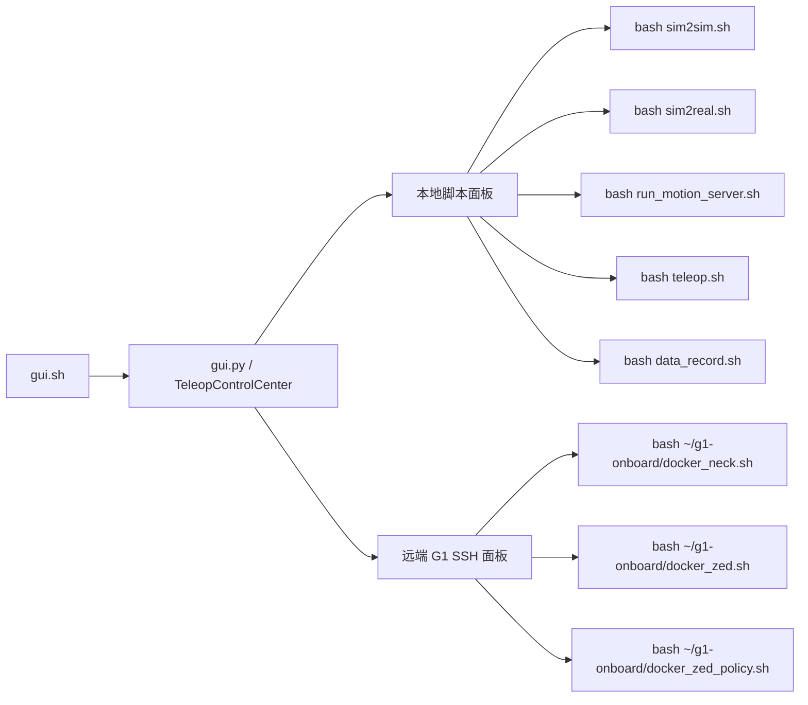
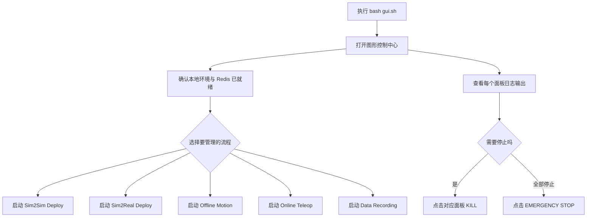

这一页只聚焦 **TWIST2 的图形控制中心**：它如何把仓库里常见的本地服务、远端 G1 进程与数据录制入口集中到一个窗口里，帮助你减少手动开多个终端的成本。它不展开讲 Sim2Sim、Teleop 或 Sim2Real 的内部控制原理，只说明 GUI 能管理什么、怎么启动、按钮背后对应哪些脚本，以及使用时应注意的前提条件。Sources: [README.md](README.md#L290-L303) [gui.py](gui.py#L406-L437)

在当前目录导航中，你正位于“快速开始 → 首次运行路径”下的 **[通过图形控制中心管理常用服务与进程](9-tong-guo-tu-xing-kong-zhi-zhong-xin-guan-li-chang-yong-fu-wu-yu-jin-cheng)**。如果你还没有先跑通过命令行最小链路，建议先完成 [使用示例动作与官方 ONNX 检查点完成最小验证](6-shi-yong-shi-li-dong-zuo-yu-guan-fang-onnx-jian-cha-dian-wan-cheng-zui-xiao-yan-zheng) 或 [运行仿真部署链路：从策略文件到 Sim2Sim](7-yun-xing-fang-zhen-bu-shu-lian-lu-cong-ce-lue-wen-jian-dao-sim2sim)，这样更容易理解 GUI 中每个面板到底在启动哪一段流程。Sources: [README.md](README.md#L215-L303) [gui.py](gui.py#L652-L713)

## 先建立正确心智模型：GUI 不是新系统，而是脚本控制台

从实现上看，`gui.sh` 只做两件事：激活 `twist2` Conda 环境，然后运行 `python gui.py`。这意味着 GUI 本身不是一个额外部署层，而是一个 **对已有脚本的可视化封装入口**。只要命令行脚本能跑，GUI 理论上就能调起对应流程；反过来，若底层脚本或环境本身不可用，GUI 也不会替你修复这些问题。Sources: [gui.sh](gui.sh#L1-L5)

README 对 GUI 的定位也非常直接：它被描述为 “GUI interface for everything”，并明确列出可在界面中启动的事项，包括仿真低层控制、实机低层控制、离线高层动作流、在线 PICO teleop、数据采集、颈部控制与 ZED 串流。GUI 的价值因此不在“增加新能力”，而在 **把分散的常用入口收拢到单窗口运维界面中**。Sources: [README.md](README.md#L290-L303)

下面这张图适合先用来理解 GUI 在仓库中的位置。阅读它时请记住一个前提：图中的每个节点都对应仓库里已经存在的脚本或 SSH 远端命令，GUI 只是把它们做成了可点击面板。Sources: [gui.py](gui.py#L246-L257) [gui.py](gui.py#L273-L315) [gui.py](gui.py#L619-L713)



## 启动前提：GUI 依赖哪些环境与组件

GUI 运行在 `twist2` 环境中，因为 `gui.sh` 显式激活的是 `twist2`，而不是 `gmr`。与此同时，`gui.py` 顶部直接导入了 `customtkinter` 与 `tkinter`。因此，最小前提至少包括：**`twist2` 环境可用，且已经安装 `customtkinter`**。README 也把 `pip install customtkinter` 单独标注为 “for gui”。Sources: [gui.py](gui.py#L1-L15) [gui.sh](gui.sh#L1-L5) [README.md](README.md#L46-L56)

但 GUI 能否“把按钮按起来”，取决于每个按钮背后的目标脚本是否已经满足各自前提。例如，`sim2sim.sh` 依赖 MuJoCo、ONNXRuntime 与默认 ONNX 文件；`teleop.sh` 会切换到 `gmr` 环境并启动在线遥操作程序；`sim2real.sh` 则依赖 `twist2` 环境中的实机低层控制脚本。换句话说，**GUI 统一了入口，没有统一掉依赖差异**。Sources: [sim2sim.sh](sim2sim.sh#L1-L14) [teleop.sh](teleop.sh#L1-L19) [sim2real.sh](sim2real.sh#L3-L19)

如果你打算通过 GUI 运行本地高层/低层链路，还应提前确认 Redis 已按 README 说明安装并启动，因为高层 motion server、在线 teleop 与低层控制链路都围绕 Redis 工作；GUI 不包含 Redis 自检或自动拉起逻辑。Sources: [README.md](README.md#L58-L84) [run_motion_server.sh](run_motion_server.sh#L11-L22) [teleop.sh](teleop.sh#L7-L18)

## 界面结构总览

`TeleopControlCenter` 在初始化时创建了一个双列主界面：左侧是 **Remote G1 Robot (SSH)**，右侧是 **Local Servers**。窗口还会在启动时自动触发一次 SSH 连通性测试，以更新 G1 在线状态标签。这个布局说明作者把 GUI 明确分成两类职责：**远端机器人侧运维** 与 **本地工作站侧服务管理**。Sources: [gui.py](gui.py#L406-L425) [gui.py](gui.py#L500-L600) [gui.py](gui.py#L721-L744)

为了帮助你快速建立界面地图，可以先看下面这个结构化视图。它不是目录树，而是 GUI 运行时的功能树。Sources: [gui.py](gui.py#L439-L499) [gui.py](gui.py#L500-L600) [gui.py](gui.py#L602-L713)

```text
gui.sh
└── gui.py
    └── TeleopControlCenter
        ├── 顶部栏
        │   ├── Theme 主题切换
        │   ├── Disable Firewall
        │   └── EMERGENCY STOP
        ├── 左侧：Remote G1 Robot (SSH)
        │   ├── G1 Neck Control
        │   ├── G1 ZED Teleop
        │   ├── G1 ZED Policy
        │   ├── Kill Port
        │   ├── Test ZED
        │   └── Test SSH / G1 ONLINE-OFFLINE
        └── 右侧：Local Servers
            ├── Low Level
            │   ├── Sim2Sim Deploy
            │   └── Sim2Real Deploy
            ├── High Level
            │   ├── Offline Motion
            │   ├── Online Teleop
            │   └── Visuomotor Policy Deploy
            └── Record
                └── Data Recording
```

## 各面板分别管理什么

右侧本地服务区被分成三列：**Low Level、High Level、Record**。其中 Low Level 包含 `Sim2Sim Deploy` 与 `Sim2Real Deploy`；High Level 包含 `Offline Motion`、`Online Teleop` 与 `Visuomotor Policy Deploy`；Record 区只有 `Data Recording`。这一划分与仓库工作流相吻合：低层负责执行，高层负责动作来源，录制负责采集。Sources: [gui.py](gui.py#L619-L713)

左侧远端区则全部通过 SSH 运行到主机别名 `g1` 上，包含 `G1 Neck Control`、`G1 ZED Teleop` 与 `G1 ZED Policy` 三个面板，以及 `Kill Port`、`Test ZED`、`Test SSH` 这些远端辅助操作。这表明 GUI 不仅面向本地仿真/部署，也承担了 **远端机载或板载服务运维面板** 的角色。Sources: [gui.py](gui.py#L246-L257) [gui.py](gui.py#L521-L600) [gui.py](gui.py#L745-L788)

下表把 GUI 中当前可见的主要面板与其实际命令做了逐项对应，适合在使用前先对齐“按钮背后到底启动了什么”。Sources: [gui.py](gui.py#L521-L538) [gui.py](gui.py#L652-L690)

| 区域 | 面板名称 | 实际命令 | 执行位置 |
|---|---|---|---|
| Remote G1 | G1 Neck Control | `bash ~/g1-onboard/docker_neck.sh` | 通过 SSH 到 `g1` |
| Remote G1 | G1 ZED Teleop | `bash ~/g1-onboard/docker_zed.sh` | 通过 SSH 到 `g1` |
| Remote G1 | G1 ZED Policy | `bash ~/g1-onboard/docker_zed_policy.sh` | 通过 SSH 到 `g1` |
| Local / Low Level | Sim2Sim Deploy | `bash sim2sim.sh` | 本地 |
| Local / Low Level | Sim2Real Deploy | `bash sim2real.sh` | 本地 |
| Local / High Level | Offline Motion | `bash run_motion_server.sh` | 本地 |
| Local / High Level | Online Teleop | `bash teleop.sh` | 本地 |
| Local / High Level | Visuomotor Policy Deploy | `bash /home/ANT.AMAZON.COM/yanjieze/lab42/src/Improved-3D-Diffusion-Policy/deploy_policy.sh` | 本地 |
| Local / Record | Data Recording | `bash data_record.sh` | 本地 |

另一个值得注意的事实是，GUI 面板显示的命令文本就是传给 `TerminalPanel` 的原始命令；`TerminalPanel` 会把它显示在每个卡片上方，并在点击 START 后用 `subprocess.Popen` 实际执行。因此，界面上的 “Command: …” 不是说明文字，而是实际运行内容的直接反映。Sources: [gui.py](gui.py#L135-L143) [gui.py](gui.py#L206-L210) [gui.py](gui.py#L287-L299)

## GUI 如何启动与停止进程

每个面板都是一个 `TerminalPanel` 实例，内含 `START`、`KILL`、`CLEAR` 三个按钮，以及一个输出文本框和状态标签。状态标签使用 `OFFLINE / STARTING / ONLINE / ERROR` 四种文字，分别由 `_update_status()` 统一更新。对使用者来说，这意味着 GUI 的最基本交互模型就是：**点击启动、观察日志、点击终止、必要时清屏重新试**。Sources: [gui.py](gui.py#L132-L143) [gui.py](gui.py#L174-L204) [gui.py](gui.py#L231-L245)

本地命令启动时，GUI 会把工作目录设置为 `gui.py` 所在目录，并使用 `self.command.split()` 启动子进程，同时通过 `os.setsid` 为其建立独立进程组。这样做的结果是，像 `bash sim2sim.sh`、`bash teleop.sh`、`bash run_motion_server.sh` 这类从仓库根目录可直接运行的脚本，都能以统一方式被拉起。Sources: [gui.py](gui.py#L287-L299)

远端命令则不会直接执行字符串，而是先构造 `ssh` 命令，默认主机为 `g1`，并附带 `StrictHostKeyChecking=no` 与 `LogLevel=ERROR` 等参数；如果远端命令里包含 `sudo`，则还会自动加上 `-t`。因此，左侧面板的成功前提不是仓库依赖，而是 **本机到 SSH 别名 `g1` 的免交互或可接受交互连接已准备好**。Sources: [gui.py](gui.py#L246-L257) [gui.py](gui.py#L310-L329)

日志读取也是异步的：每个面板会启动一个后台线程持续从子进程标准输出读取内容，并写入界面文本框；进程结束后，界面会自动追加 `Process finished (code: X)`。这意味着 GUI 不只是“点按钮”，它本质上还是一个轻量日志终端。Sources: [gui.py](gui.py#L221-L223) [gui.py](gui.py#L259-L271) [gui.py](gui.py#L335-L349)

停止时，GUI 优先对整个进程组发送 `SIGTERM`，等待 1 秒后若仍未退出，再发送 `SIGKILL`。如果该面板还配置了 `custom_kill_cmd`，GUI 会在主进程结束后继续执行额外清理命令。这一点很关键，因为仓库里有些服务不是单一前台 Python 进程，作者显式为其补充了额外清理逻辑。Sources: [gui.py](gui.py#L355-L399)

下表总结了几个已配置额外清理动作的面板，这些行为都是真实写在 GUI 代码里的，而不是使用建议。Sources: [gui.py](gui.py#L521-L531) [gui.py](gui.py#L656-L690)

| 面板 | 自定义清理命令 |
|---|---|
| G1 Neck Control | `pkill -f neck_teleop.py` |
| G1 ZED Teleop | `pkill -9 OrinVideoSender` |
| Sim2Real Deploy | `pkill -f server_low_level_g1_real_future.py` |
| Data Recording | `pkill -f server_data_record.py` |

## 推荐使用流程：用 GUI 管理常见进程

如果你的目标是 **集中管理本地常用服务**，最直接的起点仍然是从仓库根目录执行 `bash gui.sh`。这一步只负责打开 GUI，不会自动启动 Redis、不会自动检查模型文件、也不会自动补依赖。也正因为它足够薄，所以当 GUI 能正常打开时，你就已经验证了 `twist2` 环境与 `customtkinter` 的最低要求。Sources: [gui.sh](gui.sh#L1-L5) [README.md](README.md#L290-L303) [README.md](README.md#L46-L56)

对于第一次实际使用 GUI 的开发者，更稳妥的方式不是一上来同时点很多服务，而是按“单条链路逐步启动”的方式操作：先开某个本地低层或高层面板，看日志是否正常，再决定是否补开配套进程。这个建议不是额外规则，而是由 GUI 的实现方式决定的——每个面板本质上都是独立子进程，没有统一依赖解析器。Sources: [gui.py](gui.py#L273-L299) [gui.py](gui.py#L335-L349)

下面这张流程图描述的是一个基于 GUI 的典型使用路径。你可以把它视为“图形版的多终端运维顺序”。Sources: [gui.sh](gui.sh#L1-L5) [gui.py](gui.py#L652-L713) [README.md](README.md#L290-L303)



## 一键按钮能帮你做什么，不能帮你做什么

GUI 内置了两个“批量启动”入口。第一个是左侧的 `🚀 Start Neck & ZED Teleop`，它会按顺序尝试启动 `G1 Neck Control` 和 `G1 ZED Teleop`；第二个是右侧底部的 `🚀 Start Sim2Real Deploy & Teleop & Record`，它会按顺序尝试启动 `Sim2Real Deploy`、`Online Teleop` 和 `Data Recording`。这两个按钮都只是顺序调用现有面板的 `start()`，中间插入了短暂 `sleep`，并没有做更深的依赖检查。Sources: [gui.py](gui.py#L566-L572) [gui.py](gui.py#L696-L702) [gui.py](gui.py#L815-L852)

这意味着“一键启动”更像 **批量触发器**，不是编排系统。比如它不会确认 Redis 是否可连，不会检查 `gmr` 环境是否完整，不会验证 PICO PC Service 是否已启动，也不会确认实机网络参数是否正确。这些前提仍需你在链路级页面中单独确认：若要理解在线遥操作，请继续看 [启动遥操作链路：PICO 串流、姿态校准与控制按键](8-qi-dong-yao-cao-zuo-lian-lu-pico-chuan-liu-zi-tai-xiao-zhun-yu-kong-zhi-an-jian)；若要理解低层仿真，请看 [运行仿真部署链路：从策略文件到 Sim2Sim](7-yun-xing-fang-zhen-bu-shu-lian-lu-cong-ce-lue-wen-jian-dao-sim2sim)。Sources: [gui.py](gui.py#L832-L852) [teleop.sh](teleop.sh#L1-L19) [sim2sim.sh](sim2sim.sh#L1-L14) [sim2real.sh](sim2real.sh#L3-L19)

## 面板与根脚本之间的对应关系

GUI 最适合做的事情，是把那些你本来就会在多个终端中运行的根脚本集中管理起来。特别是 `run_motion_server.sh`、`teleop.sh`、`sim2sim.sh`、`sim2real.sh` 和 `data_record.sh` 这些已经存在明确启动入口的脚本，在 GUI 中都有对应面板。Sources: [gui.py](gui.py#L652-L690) [run_motion_server.sh](run_motion_server.sh#L1-L22) [teleop.sh](teleop.sh#L1-L19) [sim2sim.sh](sim2sim.sh#L1-L14) [sim2real.sh](sim2real.sh#L3-L19) [data_record.sh](data_record.sh#L1-L12)

下表给出这些根脚本的关键默认行为。理解这一点很有价值，因为 GUI 并没有额外改写它们的参数；你在 GUI 中启动它们时，实际继承的就是这些默认值。Sources: [run_motion_server.sh](run_motion_server.sh#L3-L22) [teleop.sh](teleop.sh#L7-L19) [sim2sim.sh](sim2sim.sh#L1-L14) [sim2real.sh](sim2real.sh#L5-L19) [data_record.sh](data_record.sh#L5-L12)

| GUI 面板 | 对应脚本 | 关键默认行为 |
|---|---|---|
| Offline Motion | `run_motion_server.sh` | 默认播放 `assets/example_motions/0807_yanjie_walk_001.pkl`，Redis 指向 `localhost` |
| Online Teleop | `teleop.sh` | 切换到 `gmr` 环境，`actual_human_height=1.6`，Redis 指向 `localhost` |
| Sim2Sim Deploy | `sim2sim.sh` | 默认 ONNX 为 `assets/ckpts/twist2_1017_20k.onnx`，加载 `g1_sim2sim_29dof.xml` |
| Sim2Real Deploy | `sim2real.sh` | 切换到 `twist2` 环境，默认网卡为 `eno1`，使用官方 ONNX |
| Data Recording | `data_record.sh` | 切换到 `twist2` 环境，默认 `robot_ip=192.168.123.164`，采样频率 `30` |

## 连接状态与远端辅助操作

GUI 启动后会自动进行一次 SSH 测试，逻辑是执行 `ssh g1 "echo 'SSH test successful'"`，并根据返回码把界面状态更新为 `G1 ONLINE` 或 `G1 OFFLINE`。对远端运维来说，这个设计的价值在于：你不需要先手动开终端确认 SSH 是否通，再决定是否启动左侧面板。Sources: [gui.py](gui.py#L721-L744)

左侧还有两个专用辅助按钮。`Kill Port` 会通过 SSH 以 `sudo` 执行 `~/g1-onboard/kill_port.sh`；`Test ZED` 会执行 `~/g1-onboard/test_zed.sh` 并把结果弹窗显示出来。这两者说明 GUI 并不只覆盖“主服务启动”，还集成了部分与机器人侧调试相关的运维动作。Sources: [gui.py](gui.py#L745-L788)

这里有一个必须如实记录的实现细节：`Kill Port` 与 `Disable Firewall` 相关逻辑都在代码里直接写入了通过 `echo ... | sudo -S` 方式传递的明文密码字符串。这是当前实现的客观行为，不是文档推测；从代码考古角度看，它意味着 GUI 的某些系统级操作依赖本地或远端环境中的特定 sudo 配置。Sources: [gui.py](gui.py#L745-L752) [gui.py](gui.py#L790-L813)

## 顶部全局控制：主题、紧急停止与防火墙

顶部栏提供主题切换、`Disable Firewall` 与 `EMERGENCY STOP`。主题切换不会即时重建整个界面，而是弹窗提示“重启应用后生效”；因此它本质上是一个配置选择器，而不是热切换皮肤系统。Sources: [gui.py](gui.py#L439-L476) [gui.py](gui.py#L715-L719)

`EMERGENCY STOP` 的行为相对明确：遍历 `all_panels`，凡是 `is_running` 为真的面板都会执行 `kill()`。因此它的作用范围是 **GUI 当前登记的所有面板**，不是系统级“杀掉一切相关进程”的泛化操作。Sources: [gui.py](gui.py#L704-L713) [gui.py](gui.py#L854-L860)

`Disable Firewall` 则会在后台线程里执行 `sudo ufw disable`。由于这一操作属于系统级改动，而且 GUI 本身没有展示当前防火墙状态或恢复动作，所以它更适合被理解为一个 **开发期便捷开关**，而不是常规服务编排的一部分。Sources: [gui.py](gui.py#L482-L489) [gui.py](gui.py#L790-L813)

## 使用 GUI 时的常见判断方式

如果某个面板点击 `START` 后很快变成 `ONLINE`，并持续有日志滚动，说明 GUI 至少已经成功创建了子进程，并接收到了标准输出；如果随后出现 `Process finished (code: X)`，则说明进程已经退出，此时应优先把问题定位到该脚本本身，而不是 GUI 壳层。这个判断标准直接来自 `TerminalPanel` 的状态与日志实现。Sources: [gui.py](gui.py#L273-L308) [gui.py](gui.py#L335-L349)

若一个面板点了 `KILL` 但后台资源似乎没有完全释放，应检查该面板是否配置了 `custom_kill_cmd`，以及那个清理命令是否真能匹配你当前运行的目标进程。因为 GUI 只会执行代码里写死的附加清理逻辑，不会自动发现所有派生进程。Sources: [gui.py](gui.py#L355-L399) [gui.py](gui.py#L521-L531) [gui.py](gui.py#L656-L690)

对于左侧远端区，最先看的不是业务日志，而是 `G1 ONLINE/OFFLINE` 状态。如果这里始终是 `OFFLINE`，说明 SSH 级连通就没有通过，此时继续尝试启动 `G1 Neck Control`、`G1 ZED Teleop` 或 `G1 ZED Policy` 的成功率本来就很低。Sources: [gui.py](gui.py#L577-L600) [gui.py](gui.py#L721-L744)

下面这张表把 GUI 使用中最常见的表象与应优先检查的位置做了对照，全部基于当前代码与脚本可直接验证的行为。Sources: [gui.py](gui.py#L287-L299) [gui.py](gui.py#L310-L329) [gui.py](gui.py#L335-L399) [README.md](README.md#L58-L84) [teleop.sh](teleop.sh#L1-L19)

| 现象 | 先检查什么 | 依据 |
|---|---|---|
| `bash gui.sh` 打不开窗口 | `twist2` 环境与 `customtkinter` 是否已安装 | GUI 启动依赖 `twist2` 与 `customtkinter` |
| 面板能启动但很快退出 | 对应脚本在命令行是否能单独运行 | GUI 只是脚本壳层 |
| `Online Teleop` 启动失败 | `gmr` 环境、PICO/GMR 依赖是否完整 | `teleop.sh` 会切换到 `gmr` 并运行 teleop 主程序 |
| 本地高层/低层链路没反应 | Redis 服务是否已启动 | README 要求先安装并启动 `redis-server` |
| 左侧 G1 面板无效 | `ssh g1` 是否通、远端脚本是否存在 | 远端区全部依赖 SSH 到 `g1` |
| 点 KILL 后仍有残留 | 该面板是否有合适的 `custom_kill_cmd` | GUI 只执行已配置的清理命令 |

## 这页之后应该读什么

如果你已经能打开 GUI，并且想弄清 **某个按钮背后的链路细节**，最自然的后续阅读不是继续停留在 GUI 页，而是顺着按钮对应的工作流往下钻：想理解 `Sim2Sim Deploy`，去看 [运行仿真部署链路：从策略文件到 Sim2Sim](7-yun-xing-fang-zhen-bu-shu-lian-lu-cong-ce-lue-wen-jian-dao-sim2sim)；想理解 `Online Teleop`，去看 [启动遥操作链路：PICO 串流、姿态校准与控制按键](8-qi-dong-yao-cao-zuo-lian-lu-pico-chuan-liu-zi-tai-xiao-zhun-yu-kong-zhi-an-jian)；想先保证环境无误，则回到 [双 Conda 环境与核心依赖安装](3-shuang-conda-huan-jing-yu-he-xin-yi-lai-an-zhuang) 和 [Isaac Gym、MuJoCo、Redis 与 ONNXRuntime 配置](4-isaac-gym-mujoco-redis-yu-onnxruntime-pei-zhi)。Sources: [gui.py](gui.py#L652-L713) [gui.sh](gui.sh#L1-L5) [README.md](README.md#L290-L303)

如果你的目标只是提高日常运维效率，那么这页最重要的结论只有一句：**TWIST2 的图形控制中心是一个对现有脚本与 SSH 运维动作的集中封装层，适合“统一启动、统一看日志、统一停止”，但不替代对底层脚本、环境和设备前提的理解。** 先用它减少终端切换，再按需回到对应专题页理解链路，是这套仓库最符合实际的使用方式。Sources: [gui.py](gui.py#L132-L143) [gui.py](gui.py#L273-L399) [gui.py](gui.py#L521-L713) [README.md](README.md#L290-L303)