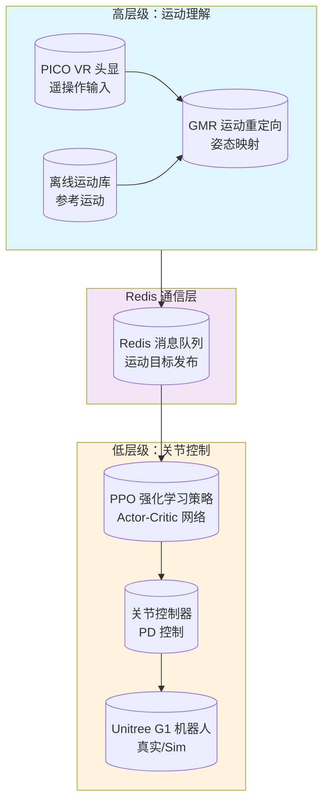
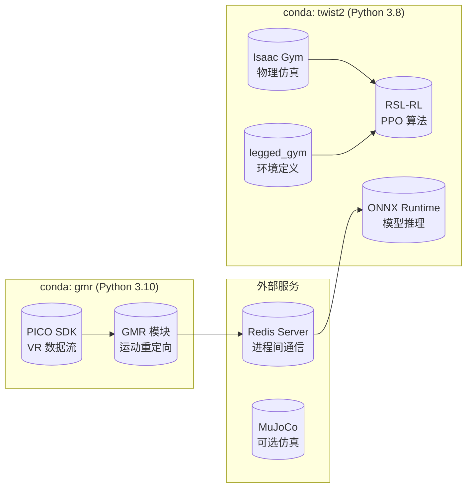
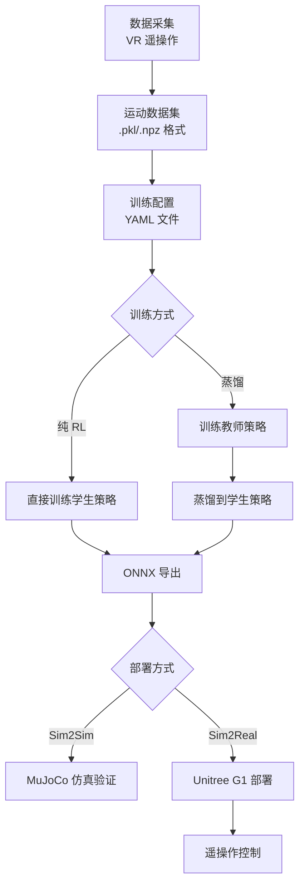

TWIST2 是一个**可扩展、可移植的人形机器人全身遥操作与运动数据采集系统**，由 NVIDIA Isaac Gym 驱动，支持使用 PICO VR 头显进行实时遥操作与运动重定向。该系统可同时在仿真环境（Isaac Gym/MuJoCo）和真实机器人（Unitree G1）上运行，为双足人形机器人的运动控制研究提供了完整的开发与部署工具链。

## 核心设计理念

TWIST2 的设计目标是通过**两层级控制架构**和**师生蒸馏训练范式**，解决人形机器人运动控制中的三个核心挑战：如何在有限观测条件下实现稳定跟踪、如何高效利用遥操作数据、以及如何将仿真中训练的策略迁移到真实机器人。

该项目基于强化学习中的模仿学习框架，通过收集高质量的专家运动数据（由人类操作员使用 VR 设备实时生成），训练能够跟踪任意指定运动序列的通用运动控制器。该控制器最终可导出为 ONNX 格式，直接部署在机器人上执行运动任务。

Sources: [README.md](README.md#L1-L30), [CLAUDE.md](CLAUDE.md#L1-L30)

## 系统架构总览

TWIST2 采用**双层级的分层控制架构**，上层负责运动理解和意图识别，下层负责精确的关节控制。这种设计借鉴了人类运动控制的基本原理——大脑负责规划运动轨迹（高层），脊髓负责执行具体的肌肉收缩（低层）。



**高层级**通过 PICO VR 设备或离线运动库获取目标运动姿态，经 GMR（高斯混合回归）模块将人体运动映射为机器人可执行的目标姿态。**Redis 通信层**作为解耦层，允许高层级和低层级独立运行在不同进程中。**低层级**的 PPO 策略网络接收目标姿态和当前状态观测，输出关节控制指令，最终通过 PD 控制器执行。

Sources: [CLAUDE.md](CLAUDE.md#L10-L25), [deploy_real/server_low_level_g1_real.py](deploy_real/server_low_level_g1_real.py#L1-L60)

## 师生蒸馏训练范式

TWIST2 采用**师生蒸馏（Teacher-Student Distillation）**的范式进行策略训练。这一范式的核心思想是：首先训练一个"全知全能"的教师策略（使用特权信息），然后将教师的知识"蒸馏"到一个只能使用受限观测的学生策略中。

| 策略类型 | 观测空间 | 可用信息 | 训练方式 | 部署场景 |
|---------|---------|---------|---------|---------|
| **教师策略** (`g1_priv_mimic`) | 完整特权信息 | 目标姿态、关节角度、末端执行器位置、身体速度 | 纯模仿学习 | 仅用于知识蒸馏 |
| **学生策略** (`g1_stu_future`) | 有限可部署信息 | 目标姿态历史、当前关节状态 | RL + BC 蒸馏 | 真实机器人部署 |

教师策略在训练时可以访问完整的运动信息（如目标姿态的完整序列、机器人各部件的精确位置），这些信息在真实部署时往往无法直接获取。学生策略则仅能观察到当前状态和有限的历史信息（`history_len` 默认值为 10 帧）。

蒸馏训练过程中，学生策略同时进行两个任务：一是通过强化学习最大化累积奖励，二是通过行为克隆（Behavioral Cloning）最小化与教师策略输出的 KL 散度。这种双重监督确保学生策略既能学习到高层次的运动模式，又能适应有限观测条件下的精确控制。

Sources: [legged_gym/legged_gym/envs/__init__.py](legged_gym/legged_gym/envs/__init__.py#L35-L50), [train.sh](train.sh#L1-L35)

## 技术栈与依赖环境

TWIST2 的正常运行需要配置两个独立的 conda 环境，这是因为系统中不同组件对 Python 版本有不同的要求。

**`twist2` 环境（Python 3.8）**承载主要的训练和部署功能：Isaac Gym 要求 Python 3.8，同时该环境包含强化学习训练框架（RSL-RL）、仿真环境定义（legged_gym）、运动库（pose）、模型导出工具等核心组件。

**`gmr` 环境（Python 3.10+）**专门用于在线运动重定向：GMR 算法依赖较新的 NumPy 和 MuJoCo 版本，这些版本与 Isaac Gym 的兼容性存在冲突，因此被隔离到独立环境中运行。



关键技术依赖包括：**NVIDIA Isaac Gym** 作为主要仿真引擎，**PyTorch** 作为深度学习框架，**Redis** 作为高层级与低层级之间的消息队列，**ONNX Runtime** 用于模型导出后的推理加速，**PICO SDK** 用于 VR 遥操作数据采集。

Sources: [README.md](README.md#L32-L80), [CLAUDE.md](CLAUDE.md#L35-L55)

## 核心目录结构

TWIST2 的代码组织遵循功能模块化的设计原则，主要目录及其功能定位如下：

| 目录 | 功能说明 | 关键文件 |
|------|---------|---------|
| `legged_gym/` | 仿真环境定义、训练脚本、任务配置 | `envs/g1/`: G1 机器人环境；`scripts/train.py`: 训练入口 |
| `rsl_rl/` | PPO 算法实现、Actor-Critic 网络、记忆存储 | `modules/actor_critic_future.py`: 学生策略网络 |
| `pose/` | 运动重定向（GMR）、运动库加载、姿态工具 | `utils/motion_lib_pkl.py`: 运动数据加载器 |
| `deploy_real/` | 真实机器人部署、遥操作客户端、运动服务器 | `server_low_level_g1_real.py`: 实时控制器 |
| `assets/` | 预训练模型、示例运动数据、机器人 URDF | `ckpts/twist2_1017_20k.onnx`: 可直接部署的模型 |

`legged_gym/envs/` 目录下按照机器人型号（`g1/`）和问题类型（如 `g1_mimic_future.py`）组织环境定义。`rsl_rl/modules/` 下实现了不同的策略网络架构，包括标准 MLP、MoE（混合专家）、Transformer 等变体，可通过配置切换。

Sources: [AGENTS.md](AGENTS.md#L1-L20), [CLAUDE.md](CLAUDE.md#L70-L90)

## 关键配置系统

TWIST2 使用配置类层次化地管理系统参数，主要分为三类配置：

**环境配置**（位于 `legged_gym/envs/g1/`）：定义仿真环境的物理参数、奖励函数、观测空间、终止条件等。例如 `g1_mimic_future_config.py` 定义学生策略环境的各项参数。

**运动数据配置**（位于 `legged_gym/motion_data_configs/`）：YAML 格式的配置文件，指定训练所用的运动数据集路径、权重分配、采样策略等。通过 `--motion.motion_file` 参数指定。

**训练配置**（通过命令行参数）：学习率、批量大小、训练迭代数、设备分配等运行时参数。

```python
# 环境配置示例：观测历史长度
cfg.env.history_len = 10  # 观测历史帧数

# 运动配置示例：目标姿态预测步数
cfg.env.tar_motion_steps = [0, 1, 2, 3, 4, 5, 10, 15, 20, 25, 30, 40, 50]

# 训练配置示例：启用蒸馏模式
--teacher_exptid <teacher_id> --teacher_checkpoint -1
```

Sources: [legged_gym/legged_gym/envs/g1/g1_mimic_future_config.py](legged_gym/legged_gym/envs/g1/g1_mimic_future_config.py#L1-L50), [CLAUDE.md](CLAUDE.md#L110-L130)

## 工作流程概览

TWIST2 的完整使用流程包含**数据采集**、**策略训练**、**模型导出**、**部署验证**四个阶段：



对于只是想快速体验系统的用户，可以直接使用 `assets/ckpts/twist2_1017_20k.onnx` 中预训练的模型，跳过训练阶段。对于需要自定义运动风格或适应新任务的用户，则需要按照上述流程进行完整的数据采集和训练过程。

Sources: [train.sh](train.sh#L1-L70), [to_onnx.sh](to_onnx.sh#L1-L12)

## 下一步阅读路径

完成本概述后，建议按以下顺序深入学习项目各模块：

对于想要**快速启动运行**的用户，推荐阅读 [快速启动](2-kuai-su-qi-dong)，了解如何在本地完成环境配置并运行第一个演示。

对于想要**理解核心技术原理**的用户，推荐从 [两层级控制架构](5-liang-ceng-ji-kong-zhi-jia-gou) 开始，了解高层级运动理解与低层级关节控制如何协同工作。

对于想要**进行自定义训练**的用户，推荐阅读 [师生蒸馏训练](6-shi-sheng-zheng-liu-xun-lian) 和 [训练脚本详解](12-xun-lian-jiao-ben-xiang-jie)，深入理解训练流程的参数配置。

对于想要**部署到真实机器人**的用户，推荐阅读 [Sim2Real实物部署](15-sim2realshi-wu-bu-shu) 和 [VR遥操作](16-vryao-cao-zuo)，了解部署的具体硬件需求和操作步骤。