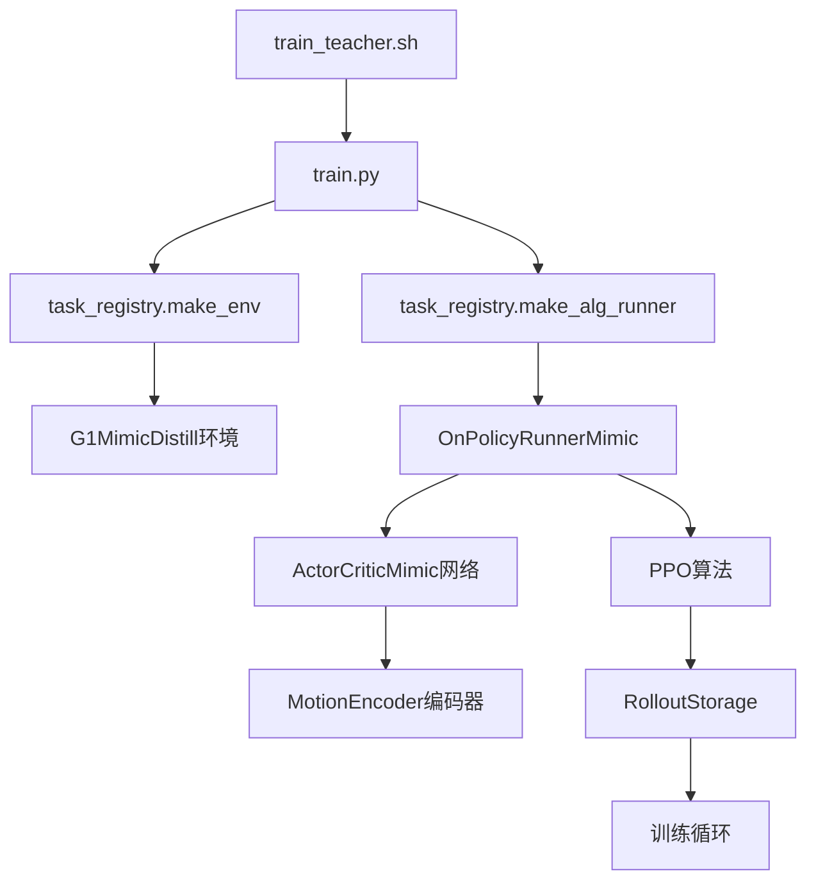
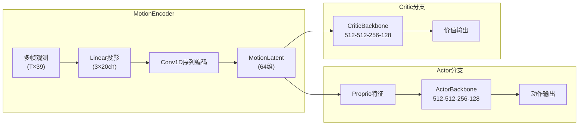

教师策略训练是 TWIST2 两层级架构中的核心环节，用于训练具有特权信息访问能力的教师策略。教师策略拥有对参考动作完整且延迟的观测能力，能够学习到高质量的运动策略，其输出的动作轨迹将作为学生策略蒸馏的知识来源。

## 训练入口与执行流程

教师策略训练通过 `train_teacher.sh` 脚本启动，该脚本配置了完整的环境变量和训练参数。训练任务名称为 `g1_priv_mimic`，在任务注册表中映射到 `G1MimicDistill` 环境类和 `G1MimicPrivCfg` 配置。

执行流程遵循以下主线：



Sources: [train_teacher.sh](train_teacher.sh#L1-L46), [legged_gym/legged_gym/envs/__init__.py](legged_gym/legged_gym/envs/__init__.py#L1-L30)

## 特权观察空间设计

教师策略的核心优势在于其特权观察空间，包含对未来多帧参考动作的直接访问。观察空间通过 `tar_motion_steps_priv` 参数定义，包含从当前时刻到未来 95 帧的参考动作采样点：

```python
tar_motion_steps_priv = [1, 5, 10, 15, 20, 25, 30, 35, 40, 45,
                         50, 55, 60, 65, 70, 75, 80, 85, 90, 95,]
```

观察空间构成如下表所示：

| 观察组件 | 维度 | 说明 |
|---------|------|------|
| 私有模仿观测 | 780 维 | 20 帧 × 39 维/帧 (root_pos/rot/vel + dof_pos) |
| 本体感知 | 134 维 | IMU + DOF 位置/速度 + 动作历史 |
| 私有隐变量 | 65 维 | 质量参数、摩擦系数、电机强度等 |
| 历史编码 | 1734 维 | 10 帧历史观察的展平 |

观察空间的构建在 `G1Mimic._get_mimic_obs()` 方法中完成，通过 `MotionLib.calc_motion_frame()` 查询参考动作库获取指定时刻的根位置、根旋转、根速度、根角速度、关节位置等数据。

Sources: [g1_mimic_distill_config.py](legged_gym/legged_gym/envs/g1/g1_mimic_distill_config.py#L10-L28), [g1_mimic.py](legged_gym/legged_gym/envs/g1/g1_mimic.py#L52-L90)

## 网络架构：MotionEncoder + Actor-Critic

教师网络采用双分支结构，分别处理动作和价值估计。核心组件为 `MotionEncoder`，负责将多帧动作序列编码为固定维度的潜在表示。



`MotionEncoder` 的 Conv1D 层配置根据时序长度自适应调整：

| 时序长度 | Conv1d 配置 |
|---------|------------|
| 50 帧 | (3ch→2ch, k=8, s=4) → (2ch→1ch, k=5) → (1ch→1ch, k=5) |
| 20 帧 | (3ch→2ch, k=6, s=2) → (2ch→1ch, k=4, s=2) |
| 10 帧 | (3ch→2ch, k=4, s=2) → (2ch→1ch, k=2) |
| 1 帧 | Flatten |

Sources: [actor_critic_mimic.py](rsl_rl/rsl_rl/modules/actor_critic_mimic.py#L20-L70)

## 奖励函数设计

教师策略的奖励函数以跟踪精度为核心，辅以正则化项防止异常行为。关键奖励项包括：

| 奖励项 | 权重 | 作用 |
|-------|------|------|
| tracking_joint_dof | 0.6 | 关节位置跟踪精度 |
| tracking_keybody_pos | 2.0 | 关键身体部位位置跟踪 |
| tracking_root_translation | 0.6 | 根部平移跟踪 |
| tracking_root_rotation | 0.6 | 根部旋转跟踪 |
| tracking_root_vel | 1.0 | 根部速度跟踪 |
| feet_slip | -0.1 | 抑制脚部滑动 |
| dof_pos_limits | -5.0 | 关节限位惩罚 |
| action_rate | -0.01 | 动作平滑正则化 |

每个关节位置跟踪具有独立权重配置：

```python
dof_err_w = [1.0, 1.0, 1.0, 1.0, 0.1, 0.1,  # 左腿
             1.0, 1.0, 1.0, 1.0, 0.1, 0.1,  # 右腿
             1.0, 1.0, 1.0,                  # 腰部
             1.0, 1.0, 1.0, 1.0, 1.0, 1.0, 1.0,  # 左臂
             1.0, 1.0, 1.0, 1.0, 1.0, 1.0, 1.0,]  # 右臂
```

Sources: [g1_mimic_config.py](legged_gym/legged_gym/envs/g1/g1_mimic_config.py#L95-L130), [g1_mimic_config.py](legged_gym/legged_gym/envs/g1/g1_mimic_config.py#L200-L220)

## 训练配置参数

教师策略使用 PPO 算法训练，主要超参数配置如下：

| 参数 | 默认值 | 说明 |
|-----|-------|------|
| num_learning_epochs | 5 | 每次更新的 epoch 数 |
| num_mini_batches | 4 | Mini-batch 数量 |
| learning_rate | 2e-4 | 学习率 |
| gamma | 0.99 | 折扣因子 |
| lam | 0.95 | GAE 折扣因子 |
| clip_param | 0.2 | PPO 裁剪参数 |
| entropy_coef | 0.005 | 熵正则化系数 |
| max_grad_norm | 1.0 | 梯度裁剪阈值 |

动作标准差采用课程学习策略：

```python
std_schedule = [1.0, 0.4, 4000, 1500]  # 从1.0线性衰减到0.4
```

Sources: [humanoid_mimic_config.py](legged_gym/legged_gym/envs/base/humanoid_mimic_config.py#L35-L55), [g1_mimic_config.py](legged_gym/legged_gym/envs/g1/g1_mimic_config.py#L290-L300)

## 域随机化

教师训练采用全面的域随机化以增强策略的鲁棒性：

| 随机化类型 | 参数范围 | 间隔 |
|-----------|---------|------|
| 重力随机化 | ±0.1 | 4 秒 |
| 摩擦系数 | [0.1, 2.0] | 持续 |
| 基座质量 | [-3, +3] kg | 持续 |
| 基座重心 | [-0.05, +0.05] m | 持续 |
| 推力干扰 | 1.0 m/s 最大速度 | 4 秒 |
| 电机强度 | [0.8, 1.2] | 持续 |
| 动作延迟 | 8 帧缓冲区 | 持续 |

Sources: [g1_mimic_config.py](legged_gym/legged_gym/envs/g1/g1_mimic_config.py#L225-L270)

## 启动命令与参数

标准教师训练命令：

```bash
bash train_teacher.sh <experiment_id> <device> [enable_anti_shuffle] [step_switch_scale] [stance_foot_speed_scale]

# 示例：基础训练
bash train_teacher.sh 0201_teacher cuda:0

# 示例：启用 Anti-Shuffle 抑制小碎步
bash train_teacher.sh 0201_teacher cuda:0 true -0.20 -0.05
```

关键参数说明：
- `<experiment_id>`: 实验唯一标识符，用于日志保存路径
- `<device>`: CUDA 设备，如 `cuda:0`、`cuda:1`
- `enable_anti_shuffle`: 是否启用 Anti-Shuffle 奖励抑制小碎步
- `step_switch_scale`: 步态切换缩放因子
- `stance_foot_speed_scale`: 支撑脚速度缩放因子

Sources: [train_teacher.sh](train_teacher.sh#L1-L46)

## 模型评估与导出

教师模型评估使用专门的评估工具 `mujoco_exec_eval_teacher.py`，支持 ONNX 导出和 MuJoCo 仿真验证：

```bash
python tools/mujoco_exec_eval_teacher.py \
    --motion_yaml legged_gym/motion_data_configs/humanoid_wbc_gmr_30fps_mix.yaml \
    --out_csv ./outputs/teacher_metrics.csv \
    --policy_path legged_gym/logs/g1_priv_mimic/0106_teacher/model_85000.pt \
    --xml_path assets/g1/g1_sim2sim_29dof.xml \
    --disable_termination \
    --workers 128
```

评估指标包括关节跟踪误差、关键身体部位跟踪误差、根部轨迹跟踪精度等。

Sources: [mujoco_exec_eval_teacher.py](tools/mujoco_exec_eval_teacher.py#L1-L80)

## 下一步：学生策略蒸馏

教师策略训练完成后，需要将知识蒸馏到学生策略中。学生策略仅能访问当前时刻的观测（无未来帧），通过知识蒸馏学习教师策略的行为模式。详见 [学生策略蒸馏](11-xue-sheng-ce-lue-zheng-liu)。