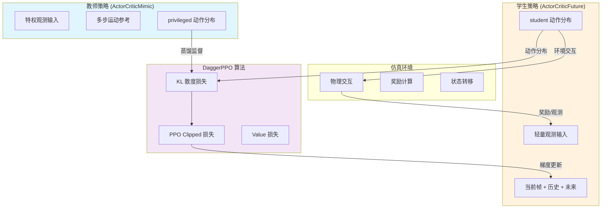
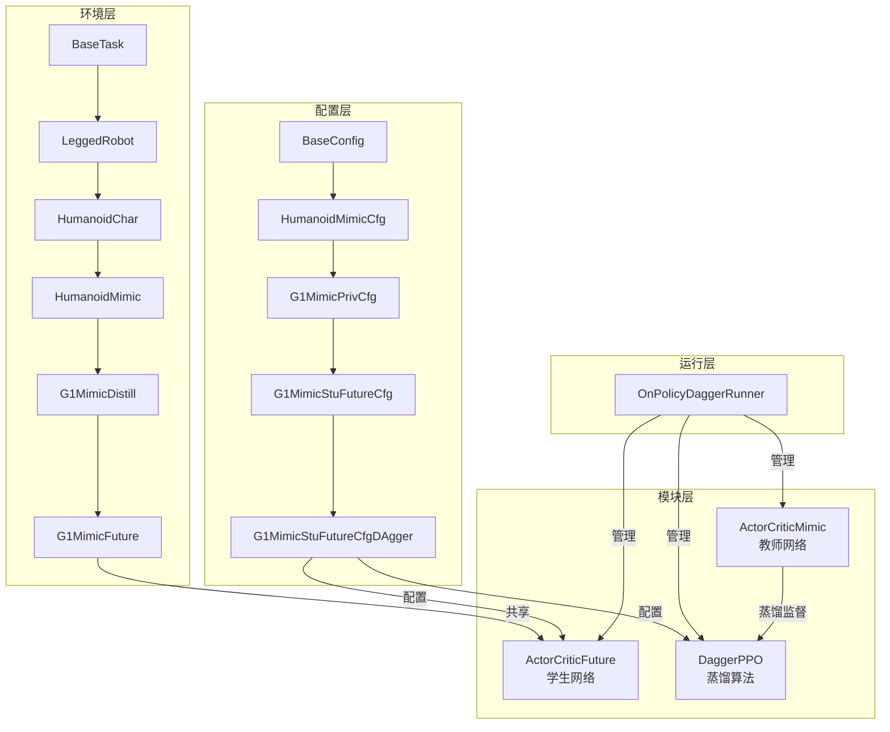

学生策略蒸馏是 TWIST2 双层级控制架构的核心环节，它将教师策略（Teacher Policy）中学到的丰富运动知识迁移到更轻量、更适合部署的学生策略（Student Policy）中。本文档详细介绍蒸馏训练的完整流程、核心算法机制、配置参数以及最佳实践。

## 1. 蒸馏训练概述

TWIST2 的蒸馏训练采用 **DAgger（Dataset Aggregation）风格的策略蒸馏**方法，结合了强化学习（PPO）和模仿学习（KL 正则化）的优势。学生策略不仅通过环境交互学习，还能从教师策略的动作分布中获取监督信号，从而更快收敛到高质量的运动策略。

蒸馏训练的核心思想是在学生策略的优化目标中引入 KL 散度损失项，约束学生策略的动作分布尽可能接近教师策略。这种设计使得学生策略能够在教师策略的引导下学习复杂运动，同时保持一定的探索自由度，最终发展出独立的运动能力。



Sources: [dagger_ppo.py](rsl_rl/rsl_rl/algorithms/dagger_ppo.py#L49-L55), [on_policy_dagger_runner.py](rsl_rl/rsl_rl/runners/on_policy_dagger_runner.py#L78-L92)

## 2. 核心配置参数

学生策略蒸馏的任务配置位于 `legged_gym/legged_gym/envs/g1/g1_mimic_future_config.py`，其中 `G1MimicStuFutureCfgDAgger` 是核心训练配置类。理解这些参数的含义对于调优蒸馏训练至关重要。

### 2.1 任务与算法选择

```python
class G1MimicStuFutureCfgDAgger(G1MimicStuFutureCfg):
    class runner:
        policy_class_name = 'ActorCriticFuture'
        algorithm_class_name = 'DaggerPPO'
        runner_class_name = 'OnPolicyDaggerRunner'
```

这些配置项指定了学生策略使用 `ActorCriticFuture` 网络架构，训练算法为 `DaggerPPO`，训练循环由 `OnPolicyDaggerRunner` 管理。这种组合是蒸馏训练的标准配置，其中 `OnPolicyDaggerRunner` 负责加载教师策略并在训练过程中提供蒸馏监督信号。

Sources: [g1_mimic_future_config.py](legged_gym/legged_gym/envs/g1/g1_mimic_future_config.py#L120-L135)

### 2.2 教师策略加载配置

```python
class teachercfg(G1MimicPrivCfgPPO):
    pass

class runner:
    teacher_experiment_name = 'test'
    teacher_proj_name = 'g1_priv_mimic'
    teacher_checkpoint = -1
```

教师策略的加载路径遵循以下约定格式：`legged_gym/logs/<teacher_proj_name>/<teacher_experiment_name>/model_<teacher_checkpoint>.pt`。其中 `teacher_checkpoint=-1` 表示自动选择最新的模型检查点。加载过程在 `OnPolicyDaggerRunner` 初始化时完成，教师策略被冻结（不参与梯度更新），仅用于提供蒸馏监督信号。

Sources: [on_policy_dagger_runner.py](rsl_rl/rsl_rl/runners/on_policy_dagger_runner.py#L90-L95)

### 2.3 DAgger 算法参数

```python
class algorithm:
    dagger_coef = 0.1                    # KL 蒸馏损失权重
    dagger_coef_anneal_steps = 30000    # 蒸馏系数退火步数
    dagger_coef_min = 0.0               # 蒸馏系数最小值
```

`dagger_coef` 是控制蒸馏强度的重要参数。较大的值会强制学生策略更紧密地跟随教师策略，但可能限制探索；较小的值则让学生策略有更多自由度发展独特行为。退火机制（`dagger_coef_anneal_steps`）使得蒸馏强度随训练进度逐渐降低，让学生策略逐渐独立。

Sources: [dagger_ppo.py](rsl_rl/rsl_rl/algorithms/dagger_ppo.py#L70-L75)

## 3. KL 散度蒸馏机制

### 3.1 数学原理

KL 散度蒸馏损失基于以下假设：教师和学生策略均建模为高斯分布 $\pi(\cdot|o) = \mathcal{N}(\mu, \sigma^2)$。对于 29 维关节动作空间，这意味着每个策略输出 29 个独立的均值和标准差。KL 散度损失计算公式为：

$$
D_{KL}(\pi_{student} \| \pi_{teacher}) = \sum_{i=1}^{29} \left[ \log\left(\frac{\sigma^{teacher}_i}{\sigma^{student}_i}\right) + \frac{(\sigma^{student}_i)^2 + (\mu^{student}_i - \mu^{teacher}_i)^2}{2(\sigma^{teacher}_i)^2} - \frac{1}{2} \right]
$$

代码实现使用数值稳定的形式：

```python
def kl_divergence(mu_s, sigma_s, mu_t, sigma_t):
    return torch.log(sigma_t / sigma_s) + (sigma_s**2 + (mu_s - mu_t)**2) / (2 * sigma_t**2) - 0.5
```

Sources: [dagger_ppo.py](rsl_rl/rsl_rl/algorithms/dagger_ppo.py#L49-L52)

### 3.2 蒸馏损失计算流程

蒸馏损失在每次 PPO 更新时计算，完整流程如下：

```python
# 1. 获取学生当前策略分布
mu_batch_student = mu_batch
sigma_batch_student = sigma_batch

# 2. 获取教师策略分布（冻结，不计算梯度）
with torch.no_grad():
    self.teacher_actor_critic.act(critic_obs_batch)
    mu_batch_teacher = self.teacher_actor_critic.action_mean
    sigma_batch_teacher = self.teacher_actor_critic.action_std

# 3. 计算 KL 散度
kl_teacher_student_loss = kl_divergence(
    mu_batch_student, sigma_batch_student,
    mu_batch_teacher, sigma_batch_teacher
).mean() * self.dagger_coef

# 4. 加入总损失
loss += kl_teacher_student_loss
```

整个计算过程在混合精度（AMP）上下文中执行，以提高训练效率。教师策略的前向传播使用 `torch.no_grad()` 包裹，确保不计算梯度且教师参数保持冻结状态。

Sources: [dagger_ppo.py](rsl_rl/rsl_rl/algorithms/dagger_ppo.py#L240-L260)

### 3.3 蒸馏系数退火

为了让学生策略在训练初期依赖教师指导，后期逐渐独立，蒸馏系数采用余弦退火策略：

```python
def cosine_decay_weight(init_weight, step, total_steps):
    return init_weight * (0.5 * (1 + math.cos(math.pi * step / total_steps)))
```

在 `update()` 方法结束时，根据当前迭代次数动态调整 `dagger_coef`：

```python
if current_iteration < self.dagger_coef_anneal_steps:
    self.dagger_coef = cosine_decay_weight(self.dagger_coef, current_iteration, self.dagger_coef_anneal_steps)
else:
    self.dagger_coef = self.dagger_coef_min
```

Sources: [dagger_ppo.py](rsl_rl/rsl_rl/algorithms/dagger_ppo.py#L53-L56), [dagger_ppo.py](rsl_rl/rsl_rl/algorithms/dagger_ppo.py#L305-L315)

## 4. 学生网络架构

### 4.1 ActorCriticFuture 结构

学生策略 `ActorCriticFuture` 是专为蒸馏训练设计的网络架构，其核心特点是观测输入更精简（适合 Sim2Real 部署），同时保留了时序建模能力。网络由以下组件构成：

| 组件 | 类型 | 功能 |
|------|------|------|
| `motion_encoder` | MotionEncoder | 编码参考运动观测 |
| `history_encoder` | HistoryEncoder | 编码历史观测序列 |
| `future_encoder` | FutureMotionEncoder | 编码未来运动帧 |
| `actor` | MLP/MoE/Transformer | 主策略网络 |
| `critic` | MLP | 价值估计网络 |

观测输入被组织为 `[当前帧观测 | 历史观测 | 未来帧观测]`，其中当前帧和历史观测通过专用编码器提取时序特征，未来帧编码器为学生策略提供目标导向信息。

Sources: [actor_critic_future.py](rsl_rl/rsl_rl/modules/actor_critic_future.py#L1-L300)

### 4.2 编码器设计

**MotionEncoder** 使用 1D 卷积网络编码时序运动观测，支持 1、10、20、50 步的时间序列长度：

```python
# 50步配置：3层卷积逐步降采样
if tsteps == 50:
    self.conv_layers = nn.Sequential(
        nn.Conv1d(60, 40, kernel_size=8, stride=4),  # 50->11
        activation_fn,
        nn.Conv1d(40, 20, kernel_size=5, stride=1), # 11->7
        activation_fn,
        nn.Conv1d(20, 20, kernel_size=5, stride=1), # 7->3
        activation_fn,
        nn.Flatten()  # 输出 60 维
    )
```

**FutureMotionEncoder** 采用 MLP 结构直接编码未来观测，支持可选的注意力机制：

```python
self.encoder = nn.Sequential(
    nn.Linear(input_size * tsteps, 256),
    activation_fn,
    nn.Dropout(dropout),
    nn.Linear(256, 128),
    activation_fn,
    nn.Dropout(dropout),
    nn.Linear(128, output_size)
)
```

Sources: [actor_critic_future.py](rsl_rl/rsl_rl/modules/actor_critic_future.py#L60-L160), [actor_critic_future.py](rsl_rl/rsl_rl/modules/actor_critic_future.py#L260-L310)

## 5. 训练启动与命令

### 5.1 标准蒸馏训练

使用封装脚本进行单卡蒸馏训练：

```bash
bash train.sh <experiment_id> <device> [anti_shuffle] [step_switch_scale] [stance_foot_speed_scale] [motion_yaml] [teacher_exptid] [teacher_checkpoint]
```

完整示例（推荐配置）：

```bash
# 激活环境
source ~/miniconda3/etc/profile.d/conda.sh
conda activate twist2

# 启动蒸馏训练
CUDA_VISIBLE_DEVICES=0 python legged_gym/legged_gym/scripts/train.py \
  --task g1_stu_future \
  --proj_name g1_stu_future \
  --exptid 0116_student \
  --device cuda:0 \
  --teacher_exptid 0106_teacher \
  --teacher_checkpoint -1
```

关键参数说明：
- `--task g1_stu_future`：指定学生策略训练任务
- `--teacher_exptid 0106_teacher`：教师实验 ID（需要预先训练完成）
- `--teacher_checkpoint -1`：自动选择最新教师检查点

Sources: [train.sh](train.sh#L40-L70), [train_eval_student.md](train_eval_student.md#L40-L60)

### 5.2 多卡分布式训练

使用 `torchrun` 进行多卡 DDP 训练：

```bash
CUDA_VISIBLE_DEVICES=3,4,5,6 torchrun --standalone --nproc_per_node=4 \
  legged_gym/legged_gym/scripts/train.py \
  --task g1_stu_future \
  --proj_name g1_stu_future \
  --exptid 0116_student_ddp \
  --teacher_exptid 0106_teacher \
  --teacher_checkpoint -1 \
  --num_envs 4096 \
  --max_iterations 100000
```

多卡训练时，每张卡自动绑定到对应的 CUDA 设备（`cuda:$LOCAL_RANK`），checkpoints 和日志仅由 rank 0 写入，确保训练产物一致。

Sources: [train_eval_student.md](train_eval_student.md#L70-L90)

### 5.3 纯 RL 训练（无蒸馏）

如果只想训练学生策略而不加载教师策略：

```bash
CUDA_VISIBLE_DEVICES=0 python legged_gym/legged_gym/scripts/train.py \
  --task g1_stu_future \
  --proj_name g1_stu_future \
  --exptid 0116_student_nodistill \
  --device cuda:0 \
  --teacher_exptid None
```

`--teacher_exptid` 设置为 `None`/`dummy` 时，教师策略不会被加载，`DaggerPPO` 中的 KL 损失项自动设为 0，训练退化为纯 PPO 强化学习。

Sources: [train_eval_student.md](train_eval_student.md#L85-L100)

## 6. Anti-Shuffle 抑制小碎步

### 6.1 问题背景

在站立或慢速运动阶段，学生策略可能出现"小碎步"现象——频繁切换支撑脚或脚底抖动。这不仅影响运动美观度，还可能导致在真实机器人上执行时关节磨损加剧。Anti-Shuffle 机制通过额外奖励项抑制这类不良行为。

### 6.2 参数配置

| 参数 | 默认值 | 说明 |
|------|--------|------|
| `--enable_anti_shuffle_reward` | `False` | 启用 Anti-Shuffle 奖励 |
| `--anti_shuffle_ref_vel_th` | `0.12` | 参考速度阈值（m/s），低于此值才施加惩罚 |
| `--anti_shuffle_tilt_th` | `0.25` | 机体倾斜阈值（投影重力 XY 范数） |
| `--anti_shuffle_step_switch_scale` | `-0.20` | 换脚频率惩罚权重 |
| `--anti_shuffle_stance_foot_speed_scale` | `-0.05` | 支撑脚速度惩罚权重 |

### 6.3 使用示例

```bash
CUDA_VISIBLE_DEVICES=0 python legged_gym/legged_gym/scripts/train.py \
  --task g1_stu_future \
  --proj_name g1_stu_future \
  --exptid 0213_student_antishuffle \
  --device cuda:0 \
  --teacher_exptid 0106_teacher \
  --teacher_checkpoint -1 \
  --enable_anti_shuffle_reward \
  --anti_shuffle_step_switch_scale -0.20 \
  --anti_shuffle_stance_foot_speed_scale -0.05
```

或者使用封装脚本的简化形式：

```bash
bash train.sh 0213_student cuda:0 true -0.20 -0.05
```

Sources: [train_eval_student.md](train_eval_student.md#L20-L40), [g1_mimic_future_config.py](legged_gym/legged_gym/envs/g1/g1_mimic_future_config.py#L75-L90)

## 7. 训练流程与监控

### 7.1 训练循环结构

`OnPolicyDaggerRunner.learn_RL()` 实现了完整的训练循环：

```python
for it in range(num_learning_iterations):
    # 1. 定期重采样（如果启用）
    self._maybe_resample_motions(it)
    
    # 2. Rollout 采集数据
    with torch.no_grad():
        for step in range(num_steps_per_env):
            actions = self.alg.act(obs, critic_obs, infos)
            obs, privileged_obs, rewards, dones, infos = self.env.step(actions)
            self.alg.process_env_step(rewards, dones, infos)
    
    # 3. GAE 计算 returns
    self.alg.compute_returns(critic_obs)
    
    # 4. PPO + KL 蒸馏更新
    mean_value_loss, mean_surrogate_loss, _, _, _, _, kl_loss = self.alg.update()
    
    # 5. 日志记录与模型保存
    self.log(locals())
```

Sources: [on_policy_dagger_runner.py](rsl_rl/rsl_rl/runners/on_policy_dagger_runner.py#L410-L500)

### 7.2 关键监控指标

WandB 日志记录以下关键指标：

| 指标 | 含义 | 理想趋势 |
|------|------|----------|
| `Loss/kl_teacher_student` | KL 蒸馏损失 | 初期较高，后期降低 |
| `Loss/surrogate` | PPO 代理损失 | 逐渐收敛 |
| `Loss/value_func` | Value 函数损失 | 逐渐降低 |
| `Train/mean_reward` | 平均回合奖励 | 逐渐上升 |
| `Policy/mean_noise_std` | 动作噪声标准差 | 根据 std_schedule 变化 |

通过监控 `kl_teacher_student` 可以判断蒸馏是否有效：若该值持续较高，说明学生策略难以跟随教师；若逐渐降低，说明蒸馏学习正常进行。

Sources: [on_policy_dagger_runner.py](rsl_rl/rsl_rl/runners/on_policy_dagger_runner.py#L560-L600)

### 7.3 模型保存策略

Checkpoints 按迭代次数间隔保存：

```python
if it < 2500:
    if it % 500 == 0:
        self.save(...)
elif it <= 10000:
    if it % 1000 == 0:
        self.save(...)
else:
    if it % 2500 == 0:
        self.save(...)
```

这种自适应保存策略在训练初期保存更频繁（便于快速检查），后期保存间隔增大（节省存储空间）。

## 8. 续训与微调

### 8.1 从旧检查点继续训练

```bash
CUDA_VISIBLE_DEVICES=0 python legged_gym/legged_gym/scripts/train.py \
  --task g1_stu_future \
  --proj_name g1_stu_future \
  --exptid new_experiment_id \
  --resumeid old_experiment_id \
  --checkpoint -1 \
  --teacher_exptid 0106_teacher \
  --teacher_checkpoint -1
```

参数说明：
- `--resumeid`：指定要加载的旧检查点目录
- `--exptid`：新实验 ID，检查点将保存到新目录
- `--checkpoint`：选择具体迭代版本（-1 为最新）

### 8.2 迁移学习场景

如果需要更换数据集或调整训练配置（如启用 Anti-Shuffle），可以从已训练的学生模型继续微调：

```bash
CUDA_VISIBLE_DEVICES=0 python legged_gym/legged_gym/scripts/train.py \
  --task g1_stu_future \
  --proj_name g1_stu_future \
  --exptid student_finetuned \
  --resumeid student_baseline \
  --checkpoint 50000 \
  --enable_anti_shuffle_reward \
  --motion.motion_file /path/to/new_dataset.yaml
```

Sources: [train_eval_student.md](train_eval_student.md#L100-L130)

## 9. 架构继承关系

理解学生策略训练的完整架构继承链有助于深入掌握系统设计：



Sources: [g1_stu_future_training_flow_notes.md](note/g1_stu_future_training_flow_notes.md#L1-L400)

## 10. 下一步学习路径

完成学生策略蒸馏训练后，建议继续学习以下内容：

| 方向 | 文档 | 内容 |
|------|------|------|
| 模型部署 | [Sim2Sim仿真验证](14-sim2simfang-zhen-yan-zheng) | 在仿真环境中验证蒸馏效果 |
| 推理优化 | [ONNX模型导出](23-onnxmo-xing-dao-chu) | 导出为 ONNX 格式进行部署 |
| 性能评估 | [评估与可视化](24-ping-gu-yu-ke-shi-hua) | 量化分析蒸馏后策略性能 |

如果需要深入理解蒸馏算法的数学推导，建议阅读 [DaggerPPO 数学笔记](note/dagger_ppo_math_notes.md) 获取完整的损失函数推导和 GAE 计算细节。