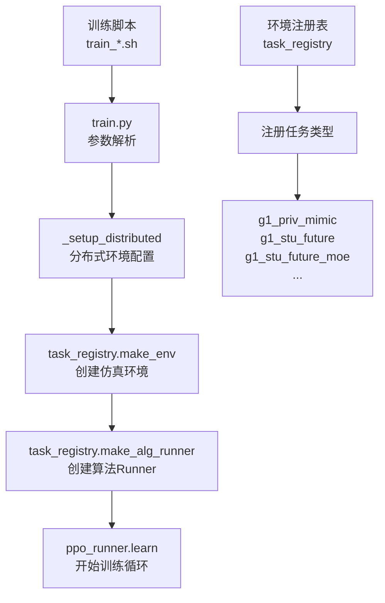

本页面详细介绍 TWIST2 项目中的各类训练脚本，包括脚本架构、参数配置、使用方法和训练流程。通过本指南，初学者可以快速理解如何启动不同类型的训练任务。

## 训练脚本架构概述

TWIST2 采用模块化的训练脚本设计，所有训练入口脚本均位于项目根目录，核心训练逻辑集中在 `legged_gym` 子模块中。

### 核心目录结构

```
TWIST2/
├── train.sh                    # 学生策略训练脚本（支持蒸馏）
├── train_teacher.sh            # 教师策略训练脚本
├── train_diffusion.sh          # 扩散模型学生训练脚本
├── train_moe.sh                # MoE学生训练脚本
├── train_transformer.sh        # Transformer学生训练脚本
└── legged_gym/legged_gym/
    └── scripts/
        └── train.py            # 核心训练入口
```

### 训练类型对照表

| 训练类型 | 脚本文件 | 任务名称 | 适用场景 |
|---------|---------|---------|---------|
| 教师策略 | `train_teacher.sh` | `g1_priv_mimic` | 模仿学习教师 |
| 学生策略（MLP） | `train.sh` | `g1_stu_future` | 纯RL或蒸馏学生 |
| 学生策略（扩散） | `train_diffusion.sh` | `g1_stu_future_diff2x/diff4x` | 扩散模型架构 |
| 学生策略（MoE） | `train_moe.sh` | `g1_stu_future_moe` | 混合专家架构 |
| 学生策略（Transformer） | `train_transformer.sh` | `g1_stu_future_trans2x/trans4x` | Transformer架构 |

Sources: [train.sh](../train.sh#L1-L70), [train_teacher.sh](../train_teacher.sh#L1-L46), [train_diffusion.sh](../train_diffusion.sh#L1-L70)

## 核心训练流程

所有训练脚本最终都调用 `legged_gym/legged_gym/scripts/train.py` 作为统一入口点。训练流程遵循以下步骤：



### 关键组件说明

**1. 参数解析与分布式配置**

`train.py` 中的 `_setup_distributed()` 函数负责检测分布式训练环境。当检测到 `WORLD_SIZE > 1` 时，自动配置 NCCL 后端进行多 GPU 梯度同步：

```python
def _get_distributed_env():
    world_size = _get_int("WORLD_SIZE", 1)  # 默认单卡
    rank = _get_int("RANK", 0)
    local_rank = _get_int("LOCAL_RANK", 0)
    return world_size > 1, rank, local_rank, world_size
```

**2. 任务注册机制**

通过 `task_registry.register()` 将任务名称、环境类、环境配置和训练配置进行绑定：

```python
# Sources: legged_gym/legged_gym/envs/__init__.py#L55-L90
task_registry.register("g1_stu_future", G1MimicFuture, G1MimicStuFutureCfg(), G1MimicStuFutureCfgDAgger())
task_registry.register("g1_priv_mimic", G1MimicDistill, G1MimicPrivCfg(), G1MimicPrivCfgPPO())
task_registry.register("g1_stu_future_moe", G1MimicFuture, G1MimicStuFutureMoECfg(), G1MimicStuFutureMoECfgDAgger())
```

Sources: [train.py](../legged_gym/legged_gym/scripts/train.py#L1-L175)

## 教师策略训练

教师策略使用纯模仿学习方式训练，不依赖强化学习。教师网络可以访问 privileged information（如未来帧信息），从而学习到更精确的运动策略。

### 使用方法

```bash
bash train_teacher.sh <experiment_id> <device> [enable_anti_shuffle] [step_switch_scale] [stance_foot_speed_scale]

# 示例：使用 Anti-Shuffle 抑制小碎步
bash train_teacher.sh 0201_teacher cuda:0 true -0.20 -0.05
```

### 关键参数说明

| 参数 | 说明 | 默认值 |
|------|------|--------|
| `experiment_id` | 实验名称，用于日志保存 | 必填 |
| `device` | GPU设备，如 `cuda:0` | 必填 |
| `enable_anti_shuffle` | 启用Anti-Shuffle奖励 | `false` |
| `step_switch_scale` | 步态切换奖励权重 | `-0.20` |
| `stance_foot_speed_scale` | 支撑脚速度惩罚权重 | `-0.05` |

### 训练配置要点

教师策略使用的 `g1_priv_mimic` 任务配置包含以下关键设置：

```python
# Sources: legged_gym/legged_gym/envs/g1/g1_mimic_distill_config.py#L8-L35
class env(HumanoidMimicCfg.env):
    tar_motion_steps_priv = [1, 5, 10, 15, 20, 25, 30, 35, 40, 45,
                             50, 55, 60, 65, 70, 75, 80, 85, 90, 95]
    num_envs = 4096
    obs_type = 'priv'  # 使用特权信息
    n_priv_latent = 4 + 1 + 2*num_actions
```

Sources: [train_teacher.sh](../train_teacher.sh#L1-L46)

## 学生策略训练

学生策略可以通过纯强化学习（无教师）或蒸馏方式训练。蒸馏训练允许学生从教师策略中学习。

### 纯RL训练（无蒸馏）

```bash
bash train.sh <experiment_id> <device> <enable_anti_shuffle> <step_switch_scale> <stance_foot_speed_scale> <motion_yaml>

# 示例：纯RL训练
bash train.sh 1103_twist2 cuda:0 false -0.20 -0.05

# 示例：指定运动数据集
bash train.sh 1103_twist2 cuda:0 true -0.20 -0.05 \
    /home/huanghao/source/code/TWIST2/legged_gym/motion_data_configs/AMASS_numpy123_w1_total17029.yaml
```

### 蒸馏训练（Teacher → Student）

```bash
# 使用已训练教师进行蒸馏
bash train.sh <student_id> <device> true -0.20 -0.05 <motion_yaml> <teacher_exptid> <teacher_checkpoint>

# 示例：使用教师 0106_teacher 进行蒸馏
bash train.sh 0213_student_single cuda:7 true -0.20 -0.05 \
    /path/to/dataset.yaml \
    0106_teacher \
    -1
```

### 蒸馏参数解析

| 参数 | 说明 | 纯RL | 蒸馏 |
|------|------|------|------|
| `teacher_exptid` | 教师实验ID | `"None"` | 教师实验名 |
| `teacher_checkpoint` | 教师检查点 | `-1` | 检查点编号 |

> **注意**：蒸馏训练时，任务名称保持为 `g1_stu_future`，系统会自动加载教师策略并进行DAgger风格的蒸馏训练。

Sources: [train.sh](../train.sh#L1-L70)

## 替代架构训练

### 扩散模型训练

扩散模型使用去噪扩散概率模型作为策略网络架构：

```bash
bash train_diffusion.sh <exptid> <dataset_type> <scale> <device>

# 示例：训练2x规模扩散模型，使用17k数据集
bash train_diffusion.sh AMASS_diff2x 17k 2x cuda:0

# 示例：训练4x规模扩散模型，使用35k数据集
bash train_diffusion.sh TWIST2_diff4x 35k 4x cuda:1
```

**扩散模型规模对比**：

| 规模 | 任务名称 | 参数量 | MLP基准倍数 |
|------|---------|--------|------------|
| 2x | `g1_stu_future_diff2x` | ~5.24M | 2.25x |
| 4x | `g1_stu_future_diff4x` | ~9.44M | 4.05x |

Sources: [train_diffusion.sh](../train_diffusion.sh#L1-L70)

### MoE（混合专家）训练

混合专家架构使用门控网络动态选择不同的专家子网络：

```bash
bash train_moe.sh <exptid> <dataset_type> <device>

# 示例：使用35k数据集训练MoE模型
bash train_moe.sh TWIST2_35k_moe 35k cuda:0
```

Sources: [train_moe.sh](../train_moe.sh#L1-L67)

### Transformer训练

Transformer架构使用自注意力机制处理时序信息：

```bash
bash train_transformer.sh <exptid> <dataset_type> <scale> <device>

# 示例：训练4x规模Transformer模型
bash train_transformer.sh TWIST2_trans4x 35k 4x cuda:0
```

**Transformer规模对比**：

| 规模 | 任务名称 | d_model | nhead | layers | 参数量 |
|------|---------|---------|-------|--------|--------|
| 2x | `g1_stu_future_trans2x` | 232 | 4 | 2 | ~1.44M |
| 4x | `g1_stu_future_trans4x` | 280 | 4 | 3 | ~3.01M |

Sources: [train_transformer.sh](../train_transformer.sh#L1-L80)

## 通用命令行参数

所有训练脚本支持以下通用参数（通过 `train.py` 解析）：

| 参数 | 说明 | 默认值 |
|------|------|--------|
| `--task` | 任务名称 | 必填 |
| `--proj_name` | wandb项目名 | 同task |
| `--exptid` | 实验ID | 必填 |
| `--device` | 计算设备 | `cuda:0` |
| `--num_envs` | 并行环境数 | 4096 |
| `--max_iterations` | 最大迭代次数 | 150000 |
| `--motion.motion_file` | 运动数据集yaml | - |
| `--gpu_cache` | GPU缓存大小(GB) | - |
| `--enable_anti_shuffle_reward` | 启用Anti-Shuffle | false |

Sources: [train.py#L150-L175](../legged_gym/legged_gym/scripts/train.py#L150-L175)

## Anti-Shuffle 抑制小碎步

Anti-Shuffle 是一种辅助奖励机制，用于抑制训练过程中出现的小碎步现象。当机器人行走时出现步态切换过于频繁的问题，可以通过调整奖励参数来改善。

### 参数配置

| 参数 | 物理意义 | 推荐值 |
|------|---------|--------|
| `--enable_anti_shuffle_reward` | 启用/禁用Anti-Shuffle | `true` |
| `--anti_shuffle_step_switch_scale` | 步态切换频率惩罚 | `-0.20` |
| `--anti_shuffle_stance_foot_speed_scale` | 支撑脚速度惩罚 | `-0.05` |

### 启用方法

在任何训练脚本中添加相关参数：

```bash
# 教师训练启用
bash train_teacher.sh my_teacher cuda:0 true -0.20 -0.05

# 学生训练启用
bash train.sh my_student cuda:0 true -0.20 -0.05
```

> 有关Anti-Shuffle的详细原理和调参指南，请参考 [Anti-Shuffle抑制小碎步](13-anti-shuffleyi-zhi-xiao-sui-bu) 页面。

## 下一步学习

- 了解分布式多GPU训练：[多GPU分布式训练](9-duo-gpufen-bu-shi-xun-lian)
- 学习训练背后的算法原理：[Actor-Critic网络架构](21-actor-criticwang-luo-jia-gou)
- 理解训练中的奖励设计：[观察空间与奖励设计](20-guan-cha-kong-jian-yu-jiang-li-she-ji)