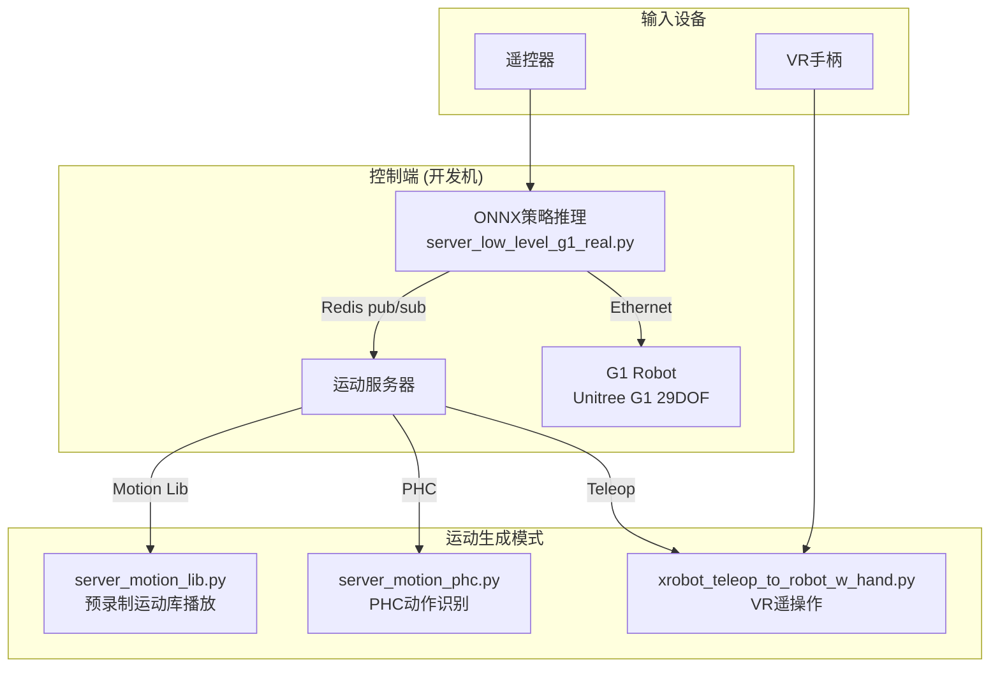

Sim2Real（Simulation to Reality）是将训练好的策略从仿真环境迁移到真实物理机器人的过程。TWIST2项目通过分层架构实现了从仿真训练到实物G1机器人部署的完整流程，支持远程控制信号输入、运动库驱动和遥操作三种模式。

## 系统架构概览

TWIST2的Sim2Real部署采用**多进程+Redis通信**的分布式架构，将策略推理、运动生成和机器人控制解耦为独立模块，通过Redis消息队列实现进程间数据交换。



Sources: [sim2real.sh](sim2real.sh#L1-L21), [server_low_level_g1_real.py](deploy_real/server_low_level_g1_real.py#L1-L100)

## 硬件准备与网络配置

### 网络连接要求

实物部署需要通过以太网连接开发机与G1机器人。配置步骤如下：

1. 使用网线直连开发机与机器人控制箱网口
2. 配置静态IP地址（机器人默认IP通常为`192.168.1.x`网段）

```bash
# 查看当前网络接口
ifconfig

# 配置机器人连接网卡的静态IP（以eno1为例）
# 在NetworkManager中设置：192.168.1.100/24
```

Sources: [doc/unitree_g1.zh.md](doc/unitree_g1.zh.md#L23-L40)

### 启动顺序

| 步骤 | 操作 | 说明 |
|------|------|------|
| 1 | 启动G1机器人进入零力矩模式 | 吊装状态下启动，等待进入零力矩模式 |
| 2 | 按下L2+R2组合键 | 进入调试模式，关节处于阻尼状态 |
| 3 | 启动低层控制器 | 执行`sim2real.sh`脚本 |
| 4 | 按下START键 | 机器人运动到默认关节位置 |
| 5 | 缓慢下放机器人 | 脚部接触地面后按下A键开始控制 |

Sources: [doc/unitree_g1.zh.md](doc/unitree_g1.zh.md#L14-L60)

## 策略推理控制器

### RealTimePolicyController核心组件

控制器负责ONNX策略的实时推理和机器人关节控制。主要包含：

```python
# 初始化关键参数
self.n_mimic_obs = 35      # 模仿观察维度
self.n_proprio = 92        # 本体感觉维度  
self.history_len = 10      # 历史观察长度
self.total_obs_size = 127 * 11 + 35  # 总观察维度: 1402
```

Sources: [server_low_level_g1_real.py](deploy_real/server_low_level_g1_real.py#L80-L90)

### 观察空间构建

观察向量由两部分组成：**模仿观察（mimic_obs）** 和 **本体感觉（proprio）**。

```python
# 模仿观察（35维）：来自运动库/遥操作
# 6 + 29 = 35 dims
mimic_obs = concat([
    root_vel_local[:2],      # XY速度 (2)
    root_pos_z,              # Z位置 (1) 
    roll, pitch,             # 横滚/俯仰 (2)
    yaw_rate,                # 偏航角速度 (1)
    dof_pos[29],             # 关节位置 (29)
])

# 本体感觉（92维）：来自机器人传感器
# ang_vel + rpy[:2] + dof_pos + dof_vel + last_action
proprio = concat([
    ang_vel * 0.25,          # 角速度 (3)
    rpy[:2],                 # 横滚/俯仰 (2)
    (dof_pos - default) * 1.0,  # 关节位置 (29)
    dof_vel * 0.05,          # 关节速度 (29)
    last_action              # 上一步动作 (29)
])
```

Sources: [server_low_level_g1_real.py](deploy_real/server_low_level_g1_real.py#L203-L230)

### 动作生成与平滑

```python
# 策略推理
obs_tensor = torch.from_numpy(obs_buf).float().unsqueeze(0).to(device)
raw_action = policy(obs_tensor)  # shape: (29,)

# 动作裁剪与缩放
raw_action = np.clip(raw_action, -10.0, 10.0)
target_dof_pos = default_dof_pos + raw_action * action_scale

# 可选的EMA平滑处理
if smooth_body > 0.0:
    action_mimic = 0.5 * new_action + 0.5 * smoothed_action
```

Sources: [server_low_level_g1_real.py](deploy_real/server_low_level_g1_real.py#L270-L300)

## 机器人配置参数

### G1关节配置

```yaml
# deploy_real/robot_control/configs/g1.yaml
control_dt: 0.02          # 控制周期: 50Hz

num_actions: 29           # 29个控制自由度

# 关节到电机索引映射
joint2motor_idx: [0, 1, 2, 3, 4, 5,       # 左腿 (6)
                  6, 7, 8, 9, 10, 11,     # 右腿 (6)
                  12, 13, 14,             # 腰部 (3)
                  15, 16, 17, 18, 19, 20, 21,  # 左臂 (7)
                  22, 23, 24, 25, 26, 27, 28] # 右臂 (7)

# PD控制增益
kps: [100, 100, 100, 150, 40, 40,        # 腿部
      100, 100, 100, 150, 40, 40,
      150, 150, 150,                       # 腰部
      40, 40, 40, 40, 20, 20, 20,         # 手臂
      40, 40, 40, 40, 20, 20, 20]

kds: [2, 2, 2, 4, 2, 2,
      2, 2, 2, 4, 2, 2,
      4, 4, 4,
      5, 5, 5, 5, 1, 1, 1,
      5, 5, 5, 5, 1, 1, 1]

# 默认关节角度 (rad)
default_angles: [-0.2, 0.0, 0.0, 0.4, -0.2, 0.0,   # 左腿
                 -0.2, 0.0, 0.0, 0.4, -0.2, 0.0,   # 右腿
                 0, 0, 0,                           # 腰部
                 0, 0.4, 0, 1.2, 0.0, 0.0, 0.0,    # 左臂
                 0, -0.4, 0, 1.2, 0.0, 0.0, 0.0]   # 右臂
```

Sources: [g1.yaml](deploy_real/robot_control/configs/g1.yaml#L1-L56)

### 观察/动作缩放因子

```yaml
# 观察缩放
ang_vel_scale: 0.25       # 角速度缩放
dof_pos_scale: 1.0        # 关节位置缩放
dof_vel_scale: 0.05       # 关节速度缩放

# 动作输出缩放
action_scale: 0.5         # 动作幅度限制
```

Sources: [g1.yaml](deploy_real/robot_control/configs/g1.yaml#L52-L56)

## Redis通信协议

控制器与运动服务器通过Redis进行进程间通信，使用固定的键名约定：

```python
# 控制器发布 (robot controller → motion server)
REDIS_KEYS = {
    "state_body": "state_body_unitree_g1_with_hands",      # 机器人状态
    "state_hand_left": "state_hand_left_unitree_g1_with_hands",
    "state_hand_right": "state_hand_right_unitree_g1_with_hands",
    "motion_start_signal": "1" or "0",                     # B键信号
    "motion_exit_signal": "1" or "0",                      # Select键退出
}

# 控制器订阅 (robot controller ← motion server)
REDIS_KEYS = {
    "action_body": "action_body_unitree_g1_with_hands",    # 模仿观察 (35D)
    "action_hand_left": "action_hand_left_unitree_g1_with_hands",
    "action_hand_right": "action_hand_right_unitree_g1_with_hands",
    "action_neck": "action_neck_unitree_g1_with_hands",
}
```

Sources: [server_low_level_g1_real.py](deploy_real/server_low_level_g1_real.py#L230-L260)

## 部署启动脚本

### sim2real.sh 主启动脚本

```bash
#!/bin/bash
source ~/miniconda3/bin/activate twist2

SCRIPT_DIR=$(dirname $(realpath $0))
ckpt_path=${SCRIPT_DIR}/assets/ckpts/twist2_1017_20k.onnx

# 网络接口名称（根据实际连接修改）
net=eno1

cd deploy_real

python server_low_level_g1_real.py \
    --policy ${ckpt_path} \
    --net ${net} \
    --device cuda \
    --use_hand \
    # --smooth_body 0.5
    # --record_proprio
```

Sources: [sim2real.sh](sim2real.sh#L1-L21)

### 命令行参数说明

| 参数 | 类型 | 默认值 | 说明 |
|------|------|--------|------|
| `--policy` | str | 必填 | ONNX策略文件路径 |
| `--config` | str | g1.yaml | 机器人配置文件 |
| `--device` | str | cuda | 推理设备 (cuda/cpu) |
| `--net` | str | - | 机器人连接的网络接口 |
| `--use_hand` | flag | False | 是否启用灵巧手控制 |
| `--smooth_body` | float | 0.0 | 动作平滑系数 (0.0-1.0) |
| `--record_proprio` | flag | False | 记录本体感觉数据 |

Sources: [server_low_level_g1_real.py](deploy_real/server_low_level_g1_real.py#L340-L380)

## 灵巧手控制

TWIST2支持Dex3.1灵巧手的协同控制，通过`Dex3_1_Controller`实现：

```python
# 初始化
if use_hand:
    self.hand_ctrl = Dex3_1_Controller(net, re_init=False)

# 关节控制（每手7自由度）
# thumb, index, middle
QPOS_LEFT_MAX = [1.0472, 1.0472, 1.74533, 0, 0, 0, 0]
QPOS_RIGHT_MAX = [1.0472, 0.724312, 0, 1.5708, 1.74533, 1.5708, 1.74533]

# 控制调用
self.hand_ctrl.ctrl_dual_hand(action_hand_left, action_hand_right)
```

Sources: [dex_hand_wrapper.py](deploy_real/robot_control/dex_hand_wrapper.py#L1-L170)

## 遥控器按键映射

| 按键 | 功能 |
|------|------|
| **START** | 机器人移动到默认位置 |
| **A** | 开始运动控制模式（原地踏步） |
| **B** | 发送运动开始信号到运动服务器 |
| **SELECT** | 退出控制，机器人进入阻尼模式 |
| **左手柄** | 控制机器人XY方向运动 |
| **右手柄** | 控制偏航角速度 |

Sources: [server_low_level_g1_real.py](deploy_real/server_low_level_g1_real.py#L120-L140)

## 常见问题排查

| 问题 | 可能原因 | 解决方案 |
|------|----------|----------|
| 无法连接机器人 | 网络接口配置错误 | 检查`--net`参数是否正确 |
| 关节抖动严重 | PD增益过大 | 减小`kps`/`kds`参数 |
| 动作响应迟缓 | 控制周期不匹配 | 确认`control_dt=0.02` |
| 手部无响应 | 未使用`--use_hand` | 添加命令行参数 |
| 策略推理卡顿 | GPU内存不足 | 使用较小batch或CPU推理 |

## 安全注意事项

> **警告**：本部署示例并非稳定的控制程序，仅用于研究验证。请确保：
> - 机器人在吊装状态下完成初始化
> - 控制过程中保持足够的安全距离
> - 随时准备使用`SELECT`键或`Ctrl+C`紧急停止

Sources: [server_low_level_g1_real.py](deploy_real/server_low_level_g1_real.py#L360-L380)

## 下一步

完成Sim2Real部署后，可以继续探索以下内容：

- [VR遥操作](16-vryao-cao-zuo) - 使用VR设备进行实时遥操作
- [低层控制器](17-di-ceng-kong-zhi-qi) - 深入了解关节PD控制实现
- [运动服务器](18-yun-dong-fu-wu-qi) - 配置运动库播放和PHC动作识别
- [ONNX模型导出](23-onnxmo-xing-dao-chu) - 了解策略导出流程