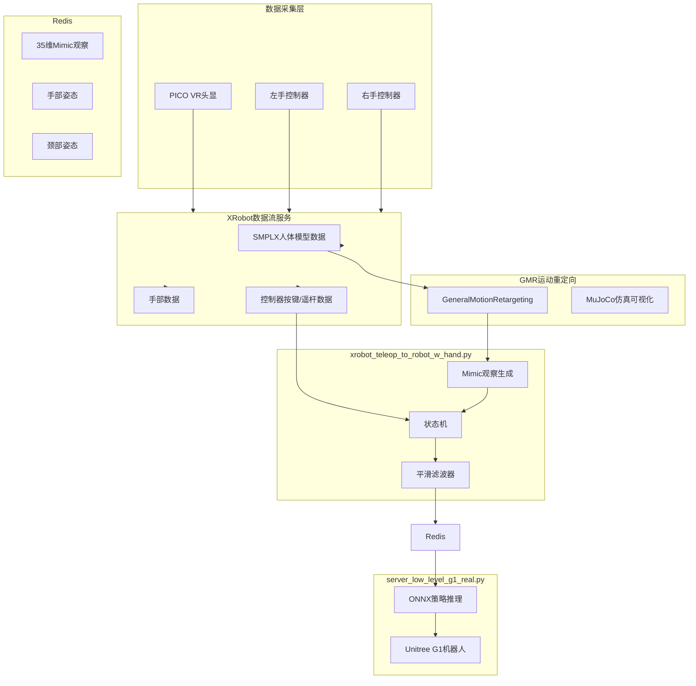
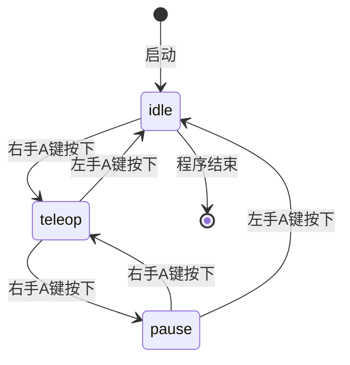

VR遥操作是TWIST2系统中用于真人动捕数据采集和实时机器人控制的核心模块。通过PICO VR头显配合XRobot遥操作软件，系统将操作员的全身运动实时重定向到Unitree G1人形机器人，并支持将采集的运动数据用于策略训练。

## 系统架构概述

TWIST2的VR遥操作采用分层架构设计，包含数据采集层、运动重定向层和控制执行层三个主要部分。数据采集层通过VR头显和手柄捕获操作员的身体姿态数据；运动重定向层使用GMR（General Motion Retargeting）模块将人体运动映射到机器人关节空间；控制执行层通过Redis消息队列将控制指令传递给低层控制器。



Sources: [vr_motion_recorder.py](deploy_real/vr_motion_recorder.py#L1-L60)
Sources: [xrobot_teleop_to_robot_w_hand.py](deploy_real/xrobot_teleop_to_robot_w_hand.py#L1-L80)

## 核心组件详解

### XRobot遥操作数据流

XRobot数据流服务负责从VR系统获取实时运动数据。该服务通过`XRobotStreamer`类实现，提供`get_current_frame()`方法返回当前帧的完整数据，包括SMPLX人体模型参数、左右手部姿态、控制器按键状态和头显位置信息。

数据流服务需要与XRobot应用配合使用，操作员需在VR中进入XRobot应用并连接到运行遥操作主机的IP地址。连接建立后，系统以约100Hz的频率接收VR姿态数据。

Sources: [xrobot_teleop_to_robot_w_hand.py](deploy_real/xrobot_teleop_to_robot_w_hand.py#L450-L470)

### GMR运动重定向模块

GMR（General Motion Retargeting）是连接人体运动与机器人运动的核心模块。在TWIST2系统中，使用`GeneralMotionRetargeting`类实现从XRobot格式的人体数据到Unitree G1机器人关节空间的映射。

```python
self.retarget = GMR(
    src_human="xrobot",
    tgt_robot="unitree_g1",
    actual_human_height=self.args.actual_human_height,
)
```

重定向过程首先获取操作员的实际身高参数（通常设为1.5-1.6米，略低于估算值以补偿PICO身高估计的误差），然后根据人体骨骼与机器人骨骼的对应关系，通过逆运动学计算得到机器人各关节的目标角度。GMR模块内部维护了一个`ik_match_table1`映射表，定义了人体骨骼节点与机器人刚体之间的对应关系。

Sources: [xrobot_teleop_to_robot_w_hand.py](deploy_real/xrobot_teleop_to_robot_w_hand.py#L447-L450)
Sources: [vr_motion_recorder.py](deploy_real/vr_motion_recorder.py#L330-L360)

### Mimic观察空间设计

TWIST2定义的Mimic观察空间是一个35维向量，用于向策略网络描述机器人当前状态和目标姿态。该观察空间的设计考虑了强化学习策略的可学习性，包含了机器人运动的本质特征。

| 维度范围 | 物理含义 | 维度数 |
|---------|---------|-------|
| 0-1 | 根节点XY方向线速度（局部坐标系） | 2 |
| 2 | 根节点高度Z | 1 |
| 3-4 | 根节点Roll和Pitch角 | 2 |
| 5 | 偏航角角速度 | 1 |
| 6-34 | 29个关节位置 | 29 |

```python
DEFAULT_MIMIC_OBS_G1 = np.concatenate([
    np.array([0, 0]),  # xy velocity
    np.array([0.8]),   # z position
    np.array([0, 0]),  # roll/pitch
    np.array([0]),     # yaw angular velocity
    np.array([
        # left leg (6): hip_yaw, hip_roll, hip_pitch, knee, ankle_pitch, ankle_roll
        -0.2, 0.0, 0.0, 0.4, -0.2, 0.0,
        # right leg (6)
        -0.2, 0.0, 0.0, 0.4, -0.2, 0.0,
        # torso (1)
        0.0, 0.0, 0.0,
        # left arm (7): shoulder_roll, shoulder_pitch, elbow, wrist_roll, wrist_pitch, wrist_yaw
        0.0, 0.4, 0.0, 1.2, 0.0, 0.0, 0.0,
        # right arm (7)
        0.0, -0.4, 0.0, 1.2, 0.0, 0.0, 0.0,
    ])
])
```

观察空间中线速度和角速度均转换到机器人局部坐标系，以增强策略对不同朝向运动的泛化能力。线速度通过`quat_rotate_inverse_np`函数将全局速度旋转到根节点局部坐标系。

Sources: [data_utils/params.py](deploy_real/data_utils/params.py#L1-L40)
Sources: [xrobot_teleop_to_robot_w_hand.py](deploy_real/xrobot_teleop_to_robot_w_hand.py#L60-L90)

### 状态机控制逻辑

遥操作控制器实现了有限状态机来管理不同的运行模式。状态机定义了四种工作状态：`idle`（待机）、`teleop`（遥操作）、`pause`（暂停）和`exit`（退出）。



状态机支持按键事件检测和状态转换。当从`idle`切换到`teleop`时，系统执行从默认姿态到当前重定向姿态的平滑插值过渡，避免机器人动作突变。插值持续时间默认为2秒。

Sources: [xrobot_teleop_to_robot_w_hand.py](deploy_real/xrobot_teleop_to_robot_w_hand.py#L100-L170)

### 手部控制系统

手部控制通过VR控制器的trigger和grip按键实现。开合操作采用连续插值方式，按住trigger逐渐闭合手部，按住grip逐渐张开手部。系统定义了默认手部开闭姿态，包括7自由度Dex3.1灵巧手的控制参数。

```python
DEFAULT_HAND_POSE = {
    "unitree_g1": {
        "left": {
            "open": np.array([0, 0, 0, 0, 0, 0, 0]),
            "close": np.array([0, 1.0, 1.74, -1.57, -1.74, -1.57, -1.74]),
        },
        "right": {
            "open": np.array([0, 0, 0, 0, 0, 0, 0]),
            "close": np.array([0, -1.0, -1.74, 1.57, 1.74, 1.57, 1.74]),
        }
    }
}
```

手部位置的更新步长为0.05（5%），确保动作平滑且可控。对于捏取模式（pinch mode），系统使用预定义的中间姿态来缩短开闭操作的距离。

Sources: [data_utils/params.py](deploy_real/data_utils/params.py#L60-L120)
Sources: [xrobot_teleop_to_robot_w_hand.py](deploy_real/xrobot_teleop_to_robot_w_hand.py#L200-L240)

## VR动捕数据录制

除了实时遥操作控制外，TWIST2还提供了`vr_motion_recorder.py`工具用于采集高质量的运动数据。该工具将VR采集的人体运动数据保存为PKL文件，可用于后续的训练数据处理。

### 录制数据结构

录制数据分为两部分存储：重定向后的机器人数据（retargeted目录）和原始VR数据（raw目录）。重定向数据格式如下：

```python
{
    'fps': float64,                    # 录制帧率
    'root_pos': (N, 3) float64,        # 根节点位置XYZ
    'root_rot': (N, 4) float64,       # 根节点旋转四元数(x,y,z,w)
    'dof_pos': (N, 29) float64,       # 关节位置（29个自由度）
    'local_body_pos': (N, 38, 3) float32,  # 局部刚体位置
    'link_body_list': list[str]       # 刚体名称列表（38个）
}
```

### 录制控制

系统支持两种工作模式：单人模式和双人模式。单人模式下，停止录制后自动保存文件；双人模式下，保存后询问是否保留，允许删除不满意的录制。控制按键映射：

| 按键 | 功能 |
|-----|------|
| 右手B键 | 开始/停止录制 |
| 左手A键 | 退出程序 |

Sources: [vr_motion_recorder.py](deploy_real/vr_motion_recorder.py#L80-L180)

## 快速启动指南

### 环境准备

确保已激活正确的conda环境并启动Redis服务：

```bash
# 激活遥操作环境
conda activate gmr

# 启动Redis服务（如未运行）
sudo ufw disable
redis-server --daemonize yes
```

### 启动遥操作流程

```bash
# 步骤1：启动G1机器人并建立连接

# 步骤2：启动颈部服务器
bash docker_neck.sh

# 步骤3：重新插拔ZED MINI摄像头确保连接
# （仅首次使用或连接异常时）

# 步骤4：启动Orin ZED发送端
bash docker_zed.sh

# 步骤5：在VR中监听ZED MINI摄像头
# 此时应能在VR中看到摄像头画面

# 步骤6：穿戴动捕设备，安装手柄

# 步骤7：启动VR并校准全身运动

# 步骤8：进入XRobot应用并连接到Ubuntu主机IP

# 步骤9：启动遥操作程序
cd /home/huanghao/source/code/TWIST2
bash teleop.sh

# 步骤10：验证Sim2Sim
bash sim2sim.sh

# 步骤11：启动数据录制（可选）
bash data_record.sh

# 步骤12：启动Sim2Real实物控制
bash sim2real.sh
```

Sources: [teleop.sh](teleop.sh#L1-L21)
Sources: [doc/TELEOP.md](doc/TELEOP.md#L1-L40)

### 命令行参数配置

遥操作主程序支持丰富的命令行参数：

| 参数 | 默认值 | 说明 |
|-----|-------|------|
| `--robot` | unitree_g1 | 目标机器人类型 |
| `--redis_ip` | localhost | Redis服务器地址 |
| `--actual_human_height` | 1.5 | 操作员实际身高（米） |
| `--neck_retarget_scale` | 1.5 | 颈部重定向缩放因子 |
| `--target_fps` | 100 | 遥操作目标帧率 |
| `--smooth` | False | 启用滑动窗口平滑 |
| `--smooth_window_size` | 5 | 平滑窗口大小（帧数） |
| `--pinch_mode` | False | 启用捏取模式 |
| `--measure_fps` | 0 | FPS统计开关 |
| `--record_video` | False | 录制视频 |

```bash
# 推荐配置示例
python xrobot_teleop_to_robot_w_hand.py \
    --robot unitree_g1 \
    --actual_human_height 1.6 \
    --redis_ip 192.168.110.24 \
    --target_fps 100 \
    --measure_fps 1
```

Sources: [xrobot_teleop_to_robot_w_hand.py](deploy_real/xrobot_teleop_to_robot_w_hand.py#L800-L840)

## 控制器按键映射表

### 遥操作控制

| 控制器 | 按键/输入 | 功能 |
|-------|----------|------|
| 右手 | A键 | 循环切换：待机→遥操作→暂停→遥操作 |
| 左手 | A键 | 退出程序 |
| 左手 | Axis Click | 紧急停止（终止sim2real.sh进程） |
| 左手 | Axis X/Y | 控制机器人XY方向移动速度 |
| 右手 | Axis X | 控制机器人偏航角速度 |
| 右手 | Index Trigger | 闭合右手 |
| 右手 | Grip | 张开右手 |
| 左手 | Index Trigger | 闭合左手 |
| 左手 | Grip | 张开左手 |
| 右手 | B键 | 缩小VR中RGB图像显示 |

Sources: [doc/TELEOP.md](doc/TELEOP.md#L43-L70)

### 动捕录制控制

| 控制器 | 按键/输入 | 功能 |
|-------|----------|------|
| 右手 | B键 | 开始/停止录制 |
| 左手 | A键 | 退出程序 |

Sources: [vr_motion_recorder.py](deploy_real/vr_motion_recorder.py#L115-L135)

## 实时数据流与Redis通信

遥操作控制器与低层控制器之间通过Redis进行进程间通信。Mimic观察数据以JSON格式发送到Redis，供策略推理模块读取。

```python
# 发送35维Mimic观察
self.redis_pipeline.set(
    "action_body_unitree_g1_with_hands", 
    json.dumps(mimic_obs.tolist())
)

# 发送左右手部姿态
self.redis_pipeline.set(
    "action_hand_left_unitree_g1_with_hands", 
    json.dumps(hand_left_pose.tolist())
)
self.redis_pipeline.set(
    "action_hand_right_unitree_g1_with_hands", 
    json.dumps(hand_right_pose.tolist())
)

# 发送颈部姿态
self.redis_pipeline.set(
    "action_neck_unitree_g1_with_hands", 
    json.dumps(neck_data)
)

# 发送时间戳
t_action = int(time.time() * 1000)
self.redis_pipeline.set("t_action", t_action)

# 批量执行
self.redis_pipeline.execute()
```

低层控制器（`server_low_level_g1_real.py`）订阅这些Redis键，执行ONNX策略推理后生成最终的控制指令发送给机器人。

Sources: [xrobot_teleop_to_robot_w_hand.py](deploy_real/xrobot_teleop_to_robot_w_hand.py#L600-L640)

## 性能监控与调试

系统集成了FPS监控功能，可实时追踪遥操作循环的执行频率。使用`--measure_fps 1`参数启用详细统计，程序会定期输出性能报告。

```bash
# 启用性能监控
python xrobot_teleop_to_robot_w_hand.py \
    --robot unitree_g1 \
    --target_fps 100 \
    --measure_fps 1
```

平滑滤波器对于提升遥操作稳定性至关重要。开启`--smooth`选项后，系统使用滑动窗口对观察进行均值滤波，有效抑制VR数据抖动。

Sources: [data_utils/fps_monitor.py](deploy_real/data_utils/fps_monitor.py#L1-L50)
Sources: [xrobot_teleop_to_robot_w_hand.py](deploy_real/xrobot_teleop_to_robot_w_hand.py#L280-L330)

## 故障排查指南

| 问题 | 可能原因 | 解决方案 |
|-----|---------|---------|
| VR数据无法获取 | XRobot应用未连接 | 检查网络连接，确认VR端已连接到主机IP |
| 机器人响应延迟 | 目标帧率过高 | 降低`--target_fps`，建议从30开始测试 |
| 姿态抖动 | VR追踪噪声 | 启用`--smooth`选项增加平滑窗口大小 |
| 紧急停止无响应 | 权限不足 | 确保有权限执行pkill命令 |
| Redis连接失败 | Redis服务未启动 | 执行`redis-server --daemonize yes` |

Sources: [doc/TELEOP.md](doc/TELEOP.md#L75-L84)

## 下一步

完成VR遥操作配置后，建议按以下顺序继续学习：

- 了解[Sim2Real实物部署](15-sim2realshi-wu-bu-shu)的详细流程
- 学习[低层控制器](17-di-ceng-kong-zhi-qi)的实现原理
- 掌握[运动服务器](18-yun-dong-fu-wu-qi)的架构设计