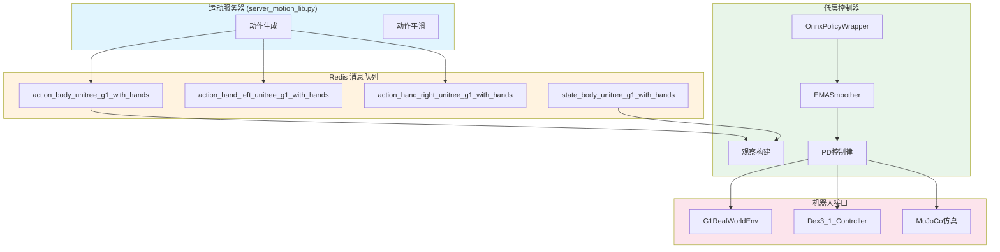

低层控制器是TWIST2系统中连接策略网络与机器人执行器之间的关键桥梁，负责将ONNX策略推理产生的标准化动作指令转换为针对G1机器人的实际关节控制命令。本模块同时支持仿真环境和真实机器人部署，通过统一的设计架构确保Sim2Sim/Sim2Real的一致性。

## 系统架构概述

TWIST2的低层控制系统采用分层架构设计，包含两个核心控制器实现。**仿真控制器** (`server_low_level_g1_sim.py`) 用于在MuJoCo物理引擎中进行策略验证，而**真机控制器** (`server_low_level_g1_real.py`) 负责将训练好的策略部署到实际的Unitree G1机器人上。两者共享相同的ONNX策略推理接口和观察数据结构，仅在底层执行层面存在差异。



Sources: [server_low_level_g1_real.py](deploy_real/server_low_level_g1_real.py#L92-L165), [server_low_level_g1_sim.py](deploy_real/server_low_level_g1_sim.py#L84-L217)

## ONNX策略包装器

策略推理模块通过 `OnnxPolicyWrapper` 类实现，该类的核心设计目标是使ONNX Runtime推理接口与PyTorch张量接口保持一致，从而实现策略格式的无缝切换。类初始化时接收ONNX会话对象和输入张量名称，调用时自动处理张量与NumPy数组之间的格式转换。

```python
class OnnxPolicyWrapper:
    def __init__(self, session, input_name, output_index=0):
        self.session = session
        self.input_name = input_name
        self.output_index = output_index

    def __call__(self, obs_tensor: torch.Tensor) -> torch.Tensor:
        obs_np = obs_tensor.detach().cpu().numpy()
        outputs = self.session.run(None, {self.input_name: obs_np})
        return torch.from_numpy(outputs[self.output_index].astype(np.float32))
```

加载ONNX策略时会自动检测可用的执行提供者（Provider），优先使用CUDA加速，在CUDA不可用时自动回退到CPU执行。策略文件路径通过命令行参数指定，实机部署时通常使用预训练的 `twist2_1017_20k.onnx` 或 `twist2_1017_25k.onnx` 检查点。

Sources: [server_low_level_g1_real.py](deploy_real/server_low_level_g1_real.py#L25-L89), [server_low_level_g1_sim.py](deploy_real/server_low_level_g1_sim.py#L21-L59)

## 观察空间构建

TWIST2的观察空间采用时序扩展设计，融合当前本体感知数据、历史观测序列以及来自运动服务器的模仿动作目标。这种多源融合的观察结构使策略能够同时利用机器人的即时状态和环境时序上下文进行决策。

观察空间的完整维度计算如下：`n_mimic_obs`（35维）包含根节点速度xy、根节点位置z、翻滚/俯仰角、偏航角速度以及29个关节位置；`n_proprio`（92维）包括角速度（缩放0.25）、Roll/Pitch角、关节位置偏移、关节速度（踝关节清零）以及上一帧动作；`n_obs_single` = 127 = 35 + 92。通过 `deque` 数据结构维护10帧历史观测，最终输入维度为 127 × 11 + 35 = 1402。

```python
obs_proprio = np.concatenate([
    ang_vel * self.ang_vel_scale,      # 3维，角速度缩放
    rpy[:2],                            # 2维，仅使用Roll和Pitch
    (dof_pos - self.default_dof_pos),   # 29维，关节位置偏移
    obs_dof_vel * self.dof_vel_scale,   # 29维，踝关节清零的速度
    self.last_action                    # 29维，上一帧动作
])

obs_full = np.concatenate([action_mimic, obs_proprio])  # 35 + 92 = 127
obs_hist = np.array(self.proprio_history_buf).flatten()  # 127 * 10 = 1270
obs_buf = np.concatenate([obs_full, obs_hist, action_mimic])  # 127 + 1270 + 35 = 1432
```

Sources: [server_low_level_g1_real.py](deploy_real/server_low_level_g1_real.py#L131-L148), [server_low_level_g1_sim.py](deploy_real/server_low_level_g1_sim.py#L187-L199)

## EMA动作平滑

`EMASmoother` 类实现指数移动平均平滑算法，用于抑制策略输出的高频抖动。平滑公式为 `smoothed = α × new + (1 - α) × previous`，其中 `α` 为平滑因子，取值范围0到1。该机制在真机部署时尤为重要，能够有效减少电机响应延迟和机械振动带来的不稳定性。

平滑处理默认关闭（`smooth_body=0.0`），推荐在需要时设置 `α ∈ [0.05, 0.2]` 范围以在响应速度与运动平滑性之间取得平衡。踝关节索引 `[4, 5, 10, 11]` 对应的速度在构建观察时被清零，这是考虑到站立平衡控制中踝关节高频速度测量噪声较大的特点。

Sources: [server_low_level_g1_real.py](deploy_real/server_low_level_g1_real.py#L45-L72), [server_low_level_g1_sim.py](deploy_real/server_low_level_g1_sim.py#L62-L81)

## 关节PD控制律

控制器输出的原始动作经过缩放后与默认关节角度相加，得到目标关节位置。对于真实机器人，控制律采用位置-速度（Position-Velocity, PR）模式，通过 `G1RealWorldEnv` 的 `send_robot_action` 方法将目标位置和PD增益下发至底层控制器。

```python
raw_action = np.clip(raw_action, -10.0, 10.0)  # 动作裁剪
target_dof_pos = self.default_dof_pos + raw_action * self.action_scale  # 动作缩放
self.env.send_robot_action(target_dof_pos, kp_scale, kd_scale)
```

仿真环境则直接在MuJoCo中计算PD控制力矩并施加到关节：torque = Kp × (target - current) - Kd × velocity。G1的29个关节配置覆盖双腿（各6自由度）、腰部（3自由度）和双臂（各7自由度），PD参数针对不同身体部位进行了差异化设置——腿部采用较高刚度（Kp=100-150）以保证行走稳定性，手臂则使用较低刚度（Kp=40）以适应灵活操作需求。

Sources: [server_low_level_g1_real.py](deploy_real/server_low_level_g1_real.py#L271-L278), [server_low_level_g1_sim.py](deploy_real/server_low_level_g1_sim.py#L380-L404)

## G1机器人配置

机器人配置通过 `robot_control/configs/g1.yaml` 文件集中管理，包含以下核心参数：

| 参数类别 | 参数名称 | 典型值 | 说明 |
|---------|---------|--------|------|
| 时序控制 | `control_dt` | 0.02s | 控制周期（50Hz） |
| 关节映射 | `joint2motor_idx` | [0-28] | 关节到电机索引映射 |
| 位置刚度 | `kps` | 100-150 | 各关节比例增益 |
| 速度阻尼 | `kds` | 2-5 | 各关节微分增益 |
| 默认姿态 | `default_angles` | 29维向量 | 站立参考姿态 |
| 动作缩放 | `action_scale` | 0.5 | 动作输出缩放因子 |

关节映射遵循固定顺序：左腿6自由度、右腿6自由度、腰部3自由度、左臂7自由度、右臂7自由度，合计29个可控关节。

Sources: [robot_control/configs/g1.yaml](deploy_real/robot_control/configs/g1.yaml#L1-L55), [robot_control/config.py](deploy_real/robot_control/config.py#L1-L37)

## 灵巧手控制

当启用 `--use_hand` 参数时，系统会同时初始化 `Dex3_1_Controller` 来控制Unitree Dex3-1灵巧手。每只手拥有7个电机，对应拇指、中指和食指的关节控制。灵巧手的动作目标同样从Redis消息队列获取，格式为每手7维的关节角度目标值。

```python
if self.use_hand:
    self.hand_ctrl = Dex3_1_Controller(net, re_init=False)
    left_hand_state, right_hand_state = self.hand_ctrl.get_hand_state()
    self.hand_ctrl.ctrl_dual_hand(action_hand_left, action_hand_right)
```

Dex3-1控制器通过 `unitree_interface` 的统一API与机器人通信，支持温度监测、力矩估计和关节状态反馈，为精细手部操作提供完整的传感与控制能力。

Sources: [robot_control/dex_hand_wrapper.py](deploy_real/robot_control/dex_hand_wrapper.py#L36-L122)

## 仿真控制器特性

仿真控制器基于MuJoCo物理引擎实现，提供以下专业功能：

**策略执行频率控制**：通过 `sim_decimation` 参数将仿真步长（1ms）与策略执行频率解耦，默认配置下策略以100Hz运行，而仿真引擎以1000Hz进行物理计算。

**实时可视化**：集成MuJoCo被动查看器，可配置刷新频率（`viewer_decimation`），支持自动跟随骨盆位置，并可录制视频输出。

**FPS性能监测**：启用 `--measure_fps 1` 后，每1000步输出策略执行的平均/最大/最小帧率统计，便于评估部署性能瓶颈。

Sources: [server_low_level_g1_sim.py](deploy_real/server_low_level_g1_sim.py#L109-L130), [server_low_level_g1_sim.py](deploy_real/server_low_level_g1_sim.py#L359-L378)

## Redis消息交互

低层控制器与运动服务器之间通过Redis实现进程间通信。控制器从Redis读取模仿动作目标，同时向Redis写入当前机器人状态供运动服务器使用。这种松耦合设计允许控制器和运动服务器独立运行，通过统一的键名约定进行数据交换。

| Redis键名 | 方向 | 维度 | 说明 |
|----------|------|------|------|
| `action_body_unitree_g1_with_hands` | 读取 | 29 | 身体关节动作目标 |
| `action_hand_left_unitree_g1_with_hands` | 读取 | 7 | 左手关节动作目标 |
| `action_hand_right_unitree_g1_with_hands` | 读取 | 7 | 右手关节动作目标 |
| `action_neck_unitree_g1_with_hands` | 读取 | 2 | 颈部动作目标 |
| `state_body_unitree_g1_with_hands` | 写入 | 34 | 当前身体状态（角速度、姿态、关节位置） |
| `motion_start_signal` | 写入 | 1 | 运动启动信号（B按钮状态） |

Sources: [server_low_level_g1_real.py](deploy_real/server_low_level_g1_real.py#L186-L239), [server_low_level_g1_sim.py](deploy_real/server_low_level_g1_sim.py#L299-L316)

## 启动与运行

### Sim2Sim仿真验证

```bash
# 方式一：直接执行脚本
cd deploy_real
python server_low_level_g1_sim.py \
    --xml ../assets/g1/g1_sim2sim_29dof.xml \
    --policy ../assets/ckpts/twist2_1017_20k.onnx \
    --device cuda \
    --measure_fps 1 \
    --policy_frequency 100

# 方式二：使用封装脚本
./sim2sim.sh
```

### 真机部署

```bash
cd deploy_real
python server_low_level_g1_real.py \
    --policy ../assets/ckpts/twist2_1017_20k.onnx \
    --config robot_control/configs/g1.yaml \
    --device cuda \
    --net wlp0s20f3 \
    --use_hand \
    --smooth_body 0.1 \
    --record_proprio
```

真机启动流程包含三个阶段：首先按下遥控器START按钮使机器人移动到默认姿态；然后按下A按钮确认进入待机状态；运行过程中按SELECT按钮可安全退出控制循环。

Sources: [server_low_level_g1_real.py](deploy_real/server_low_level_g1_real.py#L325-L382), [server_low_level_g1_sim.py](deploy_real/server_low_level_g1_sim.py#L444-L504), [sim2sim.sh](sim2sim.sh#L1-L15)

## 本征感知数据记录

启用 `--record_proprio` 参数后，控制器会在运行过程中记录详细的本体感知数据，退出时自动保存为JSON或Pickle文件。记录内容包括关节位置、目标位置、电机温度、估计力矩和驱动电压，这些数据对于分析策略执行效果和诊断机器人状态具有重要价值。

```python
proprio_data = {
    'timestamp': time.time(),
    'dof_pos': dof_pos.tolist(),
    'target_dof_pos': action_mimic.tolist()[-29:],
    'temperature': dof_temp.tolist(),
    'tau': dof_tau.tolist(),
    'voltage': dof_vol.tolist(),
}
```

Sources: [server_low_level_g1_real.py](deploy_real/server_low_level_g1_real.py#L155-L156), [server_low_level_g1_real.py](deploy_real/server_low_level_g1_real.py#L287-L304)

---

本低层控制器作为TWIST2架构的执行终端，通过标准化的ONNX接口、统一的观察结构和灵活的PD控制配置，实现了从仿真训练到真机部署的完整技术栈。建议在开发新策略时首先通过仿真控制器进行验证，确认行为符合预期后再切换至真机控制器进行部署测试。

**相关文档**：[Sim2Sim仿真验证](14-sim2simfang-zhen-yan-zheng) | [Sim2Real实物部署](15-sim2realshi-wu-bu-shu) | [运动服务器](18-yun-dong-fu-wu-qi)