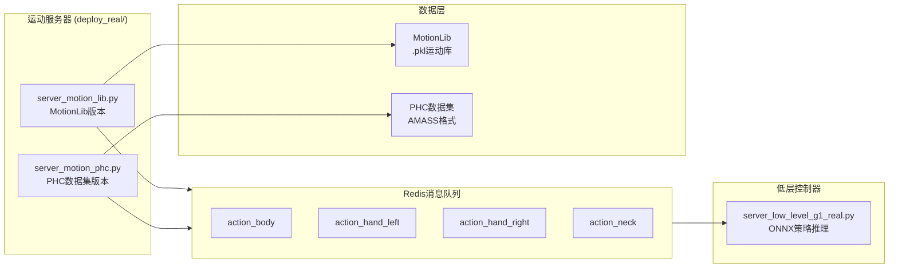
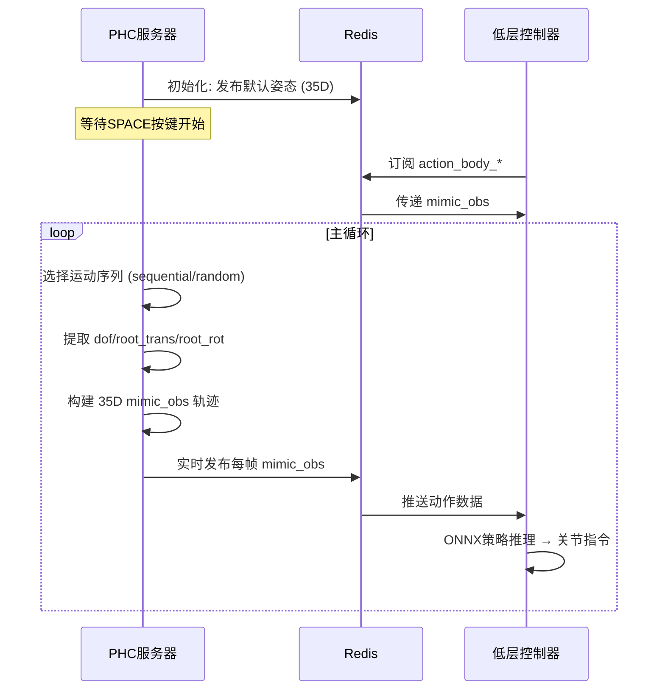

运动服务器是TWIST2系统架构中负责提供目标运动参考的核心组件。它与[低层控制器](17-di-ceng-kong-zhi-qi)协同工作，通过Redis消息队列实现进程间通信，构成两层级控制架构的执行端。

## 系统架构

运动服务器在整个控制链路中扮演"运动指挥官"的角色。其核心职责是从运动数据库中检索目标姿态序列，将这些姿态转换为策略网络可读的mimic_obs格式，并通过Redis实时推送给低层控制器执行。



Sources: [run_motion_server.sh](run_motion_server.sh#L1-L25), [run_motion_server_phc_version.sh](run_motion_server_phc_version.sh#L1-L27), [server_motion_lib.py](deploy_real/server_motion_lib.py#L1-L200)

## 核心组件

### MotionLib版本

`server_motion_lib.py`基于MotionLib类实现，支持加载.pkl格式的运动数据文件。其工作流程如下：

**初始化阶段**：连接到Redis服务器，加载指定运动文件，配置控制参数（默认50Hz，即`control_dt=0.02`秒）。

**数据发布循环**：持续从运动库中提取当前帧数据，构建mimic_obs后通过Redis发布。关键函数`build_mimic_obs()`负责将原始运动数据转换为策略网络所需的观察向量格式。

Sources: [server_motion_lib.py](deploy_real/server_motion_lib.py#L25-L65)

### PHC版本

`server_motion_phc.py`专门用于处理AMASS/PHC格式的大规模运动数据集，提供更灵活的运动序列选择机制。



该版本支持的功能包括：顺序/随机播放模式、运动序列循环、按键暂停/恢复、以及帧间平滑过渡插值。

Sources: [server_motion_phc.py](deploy_real/server_motion_phc.py#L1-L200)

## mimic_obs数据结构

mimic_obs是运动服务器向策略网络传递的核心数据载体，采用35维向量编码：

| 维度范围 | 字段名称 | 物理含义 | 维度 |
|---------|---------|---------|-----|
| 0-1 | root_vel_xy | 质心世界坐标系XY速度 | 2 |
| 2 | root_pos_z | 质心高度 | 1 |
| 3 | roll | 翻滚角（Roll） | 1 |
| 4 | pitch | 俯仰角（Pitch） | 1 |
| 5 | yaw_ang_vel | 偏航角速度 | 1 |
| 6-34 | dof_pos | 29个关节位置 | 29 |

**设计考量**：相比传统的根位置绝对坐标，本系统采用根速度+高度的形式以增强策略对不同起始位置的适应性。roll/pitch仅保留姿态角而非完整四元数，减少观测维度并降低旋转表示的歧义性。

Sources: [server_motion_lib.py](deploy_real/server_motion_lib.py#L40-L65), [server_motion_phc.py](deploy_real/server_motion_phc.py#L160-L190)

## Redis通信协议

运动服务器与低层控制器之间通过预定义的Redis键进行双向通信：

```python
# 运动服务器发布 (action)
action_body_{robot}      # 35维身体姿态目标
action_hand_left_{robot} # 7维左手关节 (含手部)
action_hand_right_{robot}# 7维右手关节
action_neck_{robot}      # 2维颈部姿态

# 控制器反馈 (state)
state_body_{robot}       # 当前身体状态
state_hand_left_{robot}  # 左手状态
state_hand_right_{robot} # 右手状态

# 流程控制信号
motion_start_signal      # B按钮触发，运动开始
motion_exit_signal       # Select按钮触发，运动退出
```

Sources: [server_motion_lib.py](deploy_real/server_motion_lib.py#L155-L175), [server_low_level_g1_real.py](deploy_real/server_low_level_g1_real.py#L185-L240)

## 启动与配置

### MotionLib版本启动

```bash
# run_motion_server.sh
python server_motion_lib.py \
    --motion_file ${motion_file} \
    --robot unitree_g1_with_hands \
    --vis \
    --redis_ip localhost
```

支持的参数：

| 参数 | 默认值 | 说明 |
|-----|-------|------|
| `--motion_file` | 必选 | .pkl运动文件路径 |
| `--robot` | unitree_g1_with_hands | 机器人类型 |
| `--steps` | 1 | 未来帧步数（目标观察前瞻） |
| `--vis` | False | 启用MuJoCo可视化 |
| `--redis_ip` | localhost | Redis服务器地址 |
| `--use_remote_control` | False | 启用远程控制器信号 |

Sources: [run_motion_server.sh](run_motion_server.sh#L1-L25), [server_motion_lib.py](deploy_real/server_motion_lib.py#L270-L295)

### PHC版本启动

```bash
# run_motion_server_phc_version.sh
python server_motion_phc.py \
    --dataset_path "${DATASET_PATH}" \
    --redis_ip "localhost" \
    --robot "unitree_g1_with_hands" \
    --rate_hz 50 \
    --sample_mode "sequential" \
    --loop
```

PHC版本独有参数：

| 参数 | 默认值 | 说明 |
|-----|-------|------|
| `--rate_hz` | 50 | 发布频率 |
| `--sample_mode` | sequential | 播放模式：sequential/random |
| `--start_interp_seconds` | 2 | 进入动画的插值时间 |
| `--exit_interp_seconds` | 2 | 退出时的插值时间 |
| `--wait_for_space` | True | 启动时等待空格键 |
| `--loop` | False | 循环播放 |

Sources: [run_motion_server_phc_version.sh](run_motion_server_phc_version.sh#L1-L27), [server_motion_phc.py](deploy_real/server_motion_phc.py#L270-L310)

## 默认姿态

系统定义了机器人静止时的默认姿态，存储在`data_utils/params.py`中：

```python
DEFAULT_MIMIC_OBS_G1 = np.concatenate([
    np.array([0, 0]),          # xy velocity
    np.array([0.8]),           # z position (身高约0.8m)
    np.array([0, 0]),          # roll/pitch
    np.array([0]),             # yaw angular velocity
    # 29 dof关节位置
    np.array([-0.2, 0.0, 0.0, 0.4, -0.2, 0.0,   # 左腿
              -0.2, 0.0, 0.0, 0.4, -0.2, 0.0,   # 右腿
              0.0, 0.0, 0.0,                      # 躯干
              0.0, 0.4, 0.0, 1.2, 0.0, 0.0, 0.0, # 左臂
              0.0, -0.4, 0.0, 1.2, 0.0, 0.0, 0.0 # 右臂
             ])
])
```

该默认姿态用于：启动时的安全保持、运动结束时的平滑过渡、以及异常时的紧急回退。

Sources: [data_utils/params.py](deploy_real/data_utils/params.py#L1-L50)

## 安全机制

运动服务器实现了多层安全保护：

**平滑退出**：接收到KeyboardInterrupt或exit信号时，执行2秒线性插值回默认姿态，避免关节突变。

**远程控制联动**：支持通过机器人手柄的B按钮触发运动开始，Select按钮触发退出，实现操作员安全控制。

**异常恢复**：当进程异常终止时，finally块确保最终发布默认姿态，防止机器人保持最后错误姿态。

Sources: [server_motion_lib.py](deploy_real/server_motion_lib.py#L205-L240), [server_motion_phc.py](deploy_real/server_motion_phc.py#L500-L560)

## 视觉调试

启用`--vis`参数后，服务器将启动MuJoCo被动 viewer，实时渲染当前发布的运动帧：

```python
if args.vis:
    sim_model = mujoco.MjModel.from_xml_path(xml_file)
    sim_data = mujoco.MjData(sim_model)
    viewer = launch_passive(model=sim_model, data=sim_data)
    
# 每帧同步
sim_data.qpos[:3] = root_pos
sim_data.qpos[3:7] = root_rot
sim_data.qpos[7:] = dof_pos
mujoco.mj_forward(sim_model, sim_data)
viewer.sync()
```

此功能用于验证运动数据质量和观察生成的正确性。

Sources: [server_motion_lib.py](deploy_real/server_motion_lib.py#L110-L130)

## 后续学习路径

- 继续了解：[低层控制器](17-di-ceng-kong-zhi-qi) - 了解ONNX策略推理与关节控制
- 深入研究：[Sim2Real实物部署](15-sim2realshi-wu-bu-shu) - 掌握完整部署流程
- 扩展阅读：[两层级控制架构](5-liang-ceng-ji-kong-zhi-jia-gou) - 理解系统整体设计