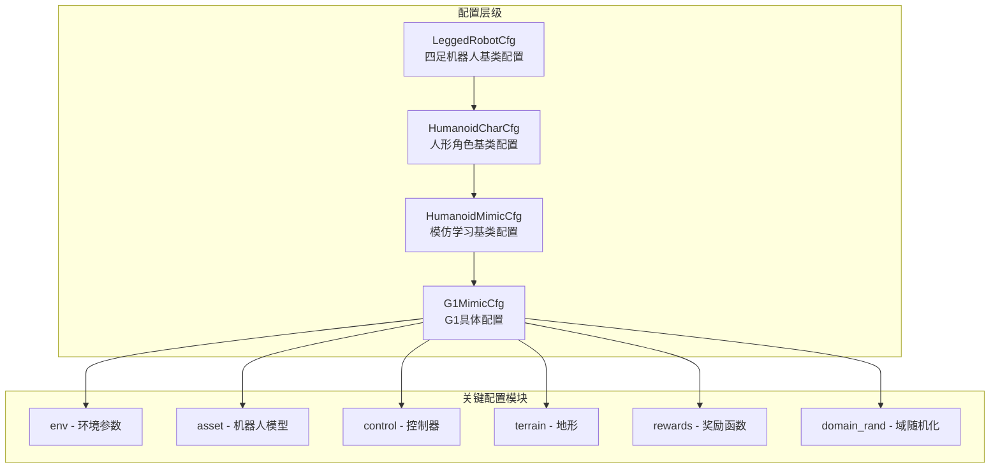
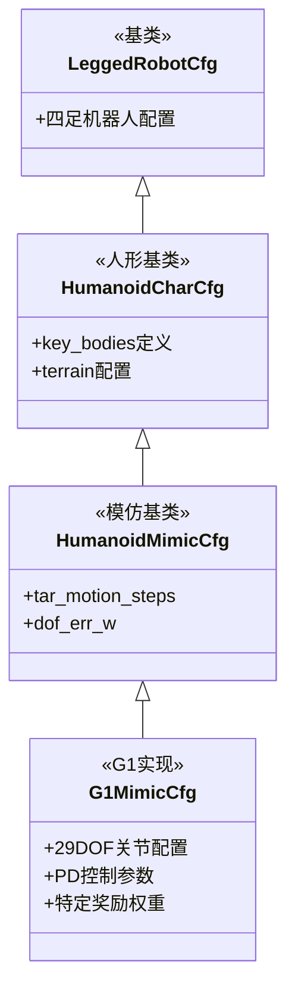

本文档详细阐述TWIST2项目中G1人形机器人模仿学习环境的配置体系。该环境基于Isaac Gym物理引擎构建，支持29自由度G1机器人的运动模仿训练。

## 配置架构概览

G1模仿环境采用**三层继承配置架构**，从基类到具体实现依次为：`LeggedRobotCfg` → `HumanoidCharCfg` → `HumanoidMimicCfg` → `G1MimicCfg`。这种设计确保了配置的模块化复用，下层配置可选择性覆盖上层参数。



Sources: [g1_mimic_config.py](legged_gym/legged_gym/envs/g1/g1_mimic_config.py#L1-L100)

## 机器人资产配置

### URDF模型选择

TWIST2支持多种G1变体模型，当前训练默认使用`g1_custom_collision_29dof.urdf`。该模型具有29个自由度，包括：

| 身体部位 | 自由度数量 | 关节列表 |
|---------|-----------|----------|
| 左腿 | 6 | hip_pitch, hip_roll, hip_yaw, knee, ankle_pitch, ankle_roll |
| 右腿 | 6 | hip_pitch, hip_roll, hip_yaw, knee, ankle_pitch, ankle_roll |
| 腰部 | 3 | waist_yaw, waist_roll, waist_pitch |
| 左臂 | 7 | shoulder_pitch, shoulder_roll, shoulder_yaw, elbow, wrist_roll, wrist_pitch, wrist_yaw |
| 右臂 | 7 | shoulder_pitch, shoulder_roll, shoulder_yaw, elbow, wrist_roll, wrist_pitch, wrist_yaw |

Sources: [g1_mimic_config.py](legged_gym/legged_gym/envs/g1/g1_mimic_config.py#L256-L260)
Sources: [g1_custom_collision_29dof.urdf](assets/g1/g1_custom_collision_29dof.urdf#L1-L400)

### 关键刚体名称映射

环境通过字符串匹配方式定位机器人关键刚体，用于奖励计算和终止条件判断：

```python
torso_name: str = 'pelvis'      # 人形骨盆部位
chest_name: str = 'imu_in_torso'  # 人形胸部IMU位置
thigh_name: str = 'hip'         # 大腿连杆名称
shank_name: str = 'knee'        # 小腿连杆名称
foot_name: str = 'ankle_roll_link'  # 足部连杆
waist_name: list = ['torso_link', 'waist_roll_link', 'waist_yaw_link']  # 腰部链
upper_arm_name: str = 'shoulder_roll_link'  # 上臂
lower_arm_name: str = 'elbow_link'  # 前臂
hand_name: str = 'hand'          # 手部
feet_bodies = ['left_ankle_roll_link', 'right_ankle_roll_link']  # 足部刚体列表
```

Sources: [g1_mimic_config.py](legged_gym/legged_gym/envs/g1/g1_mimic_config.py#L262-L277)

### 关节惯性参数

关节惯性(dof_armature)直接影响电机响应特性，G1MimicCfg中配置了精确的惯性值：

```python
dof_armature = [
    0.0103, 0.0251, 0.0103, 0.0251, 0.003597, 0.003597  # 左腿x6
] * 2 + [  # 右腿x6
    0.0103  # 腰部x3
] * 3 + [0.003597] * 14  # 双臂共14个关节
```

Sources: [g1_mimic_config.py](legged_gym/legged_gym/envs/g1/g1_mimic_config.py#L289-L293)

## 环境参数配置

### 观察空间设计

G1MimicCfg中观察空间由多个观测分量拼接而成：

| 观测分量 | 维度 | 描述 |
|---------|------|------|
| 目标运动观测 | 随时间步变化 | 包含root_pos、欧拉角、root_vel、ang_vel、dof_pos |
| 本体感觉 | 3+2+29 | base_ang_vel、roll/pitch、dof_pos、dof_vel、action_history |
| 历史观测 | history_len × n_proprio | 过去N帧的本体感觉观测 |
| 隐私隐变量 | n_priv_latent | 物理参数估计(质量、摩擦、电机强度) |

关键参数配置：
```python
tar_motion_steps_priv = [1, 5, 10, 15, 20, 25, 30, 35, 40, 45,
                         50, 55, 60, 65, 70, 75, 80, 85, 90, 95]  # 未来20个时间步预测
n_mimic_obs = 3*4 + 29  # 41维: 3*4表示root的pos+rot+vel+ang_vel, 29为关节位置
history_len = 10  # 历史观测帧数
```

Sources: [g1_mimic_config.py](legged_gym/legged_gym/envs/g1/g1_mimic_config.py#L10-L40)

### 终止条件配置

```python
enable_early_termination = True   # 启用提前终止
pose_termination = True          # 姿态终止
pose_termination_dist = 0.7      # 姿态误差阈值(米)
root_tracking_termination_dist = 0.8  # 根部跟踪误差阈值
termination_roll = 1.5           # 翻滚角限制(弧度)
termination_pitch = 1.5          # 俯仰角限制(弧度)
root_height_diff_threshold = 0.3  # 根部高度差阈值(米)
```

Sources: [g1_mimic_config.py](legged_gym/legged_gym/envs/g1/g1_mimic_config.py#L40-L48)

## 控制器配置

### PD控制参数

G1采用分层PD控制器，关节级别的刚度和阻尼系数：

```python
stiffness = {
    'hip_yaw': 100, 'hip_roll': 100, 'hip_pitch': 100,
    'knee': 150, 'ankle': 40, 'waist': 150,
    'shoulder': 40, 'elbow': 40, 'wrist': 40,
}  # [N*m/rad]

damping = {
    'hip_yaw': 2, 'hip_roll': 2, 'hip_pitch': 2,
    'knee': 4, 'ankle': 2, 'waist': 4,
    'shoulder': 5, 'elbow': 5, 'wrist': 5,
}  # [N*m*s/rad]
```

Sources: [g1_mimic_config.py](legged_gym/legged_gym/envs/g1/g1_mimic_config.py#L97-L114)

### 动作空间参数

```python
action_scale = 0.5   # 动作缩放因子: target_angle = actionScale * action + defaultAngle
decimation = 10      # 控制频率分频: 仿真DT=0.002s, 策略DT=0.02s(10次仿真步执行1次策略)
dt = 0.002           # 物理仿真时间步长
```

Sources: [g1_mimic_config.py](legged_gym/legged_gym/envs/g1/g1_mimic_config.py#L115-L120)

## 地形配置

G1模仿环境当前使用简化平面地形以聚焦于运动模仿任务：

```python
class terrain:
    mesh_type = 'trimesh'    # 三角形网格地形
    height = [0, 0.00]       # 高度范围(平面)
    horizontal_scale = 0.1   # 水平分辨率
```

Sources: [g1_mimic_config.py](legged_gym/legged_gym/envs/g1/g1_mimic_config.py#L50-L54)

## 奖励函数配置

### 跟踪奖励权重

```python
class scales:
    tracking_joint_dof = 0.6       # 关节位置跟踪
    tracking_joint_vel = 0.2       # 关节速度跟踪
    tracking_root_translation = 0.6 # 根部位置跟踪
    tracking_root_rotation = 0.6    # 根部旋转跟踪
    tracking_root_vel = 1.0         # 根部速度跟踪
    tracking_keybody_pos = 2.0     # 关键刚体位置跟踪(最高权重)
```

Sources: [g1_mimic_config.py](legged_gym/legged_gym/envs/g1/g1_mimic_config.py#L194-L203)

### 正则化惩罚项

```python
regularization_names = [
    "feet_stumble", "feet_contact_forces", "lin_vel_z", "ang_vel_xy",
    "orientation", "dof_pos_limits", "dof_torque_limits", "collision",
    "torque_penalty", "thigh_torque_roll_yaw", "thigh_roll_yaw_acc",
    "dof_acc", "dof_vel", "action_rate",
]
regularization_scale = 1.0  # 正则化整体缩放
```

Sources: [g1_mimic_config.py](legged_gym/legged_gym/envs/g1/g1_mimic_config.py#L166-L178)

## 域随机化配置

G1MimicCfg实现了全面的物理参数随机化以增强策略泛化能力：

| 参数 | 配置 | 说明 |
|-----|------|------|
| 重力随机化 | interval=4s, range=±0.1 | 每4秒随机扰动重力方向 |
| 摩擦系数 | range=[0.1, 2.0] | 地面摩擦系数随机化 |
| 质量扰动 | range=[-3, 3] kg | 机器人质量偏移 |
| 质心偏移 | range=[-0.05, 0.05] m | 质心位置扰动 |
| 电机强度 | range=[0.8, 1.2] | 电机输出力矩缩放 |
| 动作延迟 | buf_len=8, prob随训练增加 | 模拟通信延迟 |
| 外部推力 | interval=4s, max_vel=1.0 | 周期性施加随机推力 |

Sources: [g1_mimic_config.py](legged_gym/legged_gym/envs/g1/g1_mimic_config.py#L220-L250)

## 关键刚体定义

关键刚体用于计算位置跟踪奖励，是模仿任务的核心监督目标：

```python
key_bodies = [
    "left_rubber_hand",    # 左手橡胶垫
    "right_rubber_hand",   # 右手橡胶垫
    "left_ankle_roll_link", # 左踝关节
    "right_ankle_roll_link", # 右踝关节
    "left_knee_link",       # 左膝关节
    "right_knee_link",      # 右膝关节
    "left_elbow_link",      # 左肘关节
    "right_elbow_link",     # 右肘关节
    "head_mocap"            # 头部Mocap标记
]
```

Sources: [g1_mimic_config.py](legged_gym/legged_gym/envs/g1/g1_mimic_config.py#L306-L311)

## 初始化状态配置

```python
class init_state:
    pos = [0, 0, 1.0]  # 初始根部位置(高度1米)
    
    default_joint_angles = {
        # 左腿站立姿态
        'left_hip_pitch_joint': -0.2,
        'left_hip_roll_joint': 0.0,
        'left_hip_yaw_joint': 0.0,
        'left_knee_joint': 0.4,
        'left_ankle_pitch_joint': -0.2,
        'left_ankle_roll_joint': 0.0,
        # 右腿站立姿态(镜像)
        'right_hip_pitch_joint': -0.2,
        'right_hip_roll_joint': 0.0,
        'right_hip_yaw_joint': 0.0,
        'right_knee_joint': 0.4,
        'right_ankle_pitch_joint': -0.2,
        'right_ankle_roll_joint': 0.0,
        # 腰部
        'waist_yaw_joint': 0.0,
        'waist_roll_joint': 0.0,
        'waist_pitch_joint': 0.0,
        # 双臂自然下垂姿态
        'left_shoulder_pitch_joint': 0.0,
        'left_shoulder_roll_joint': 0.4,
        'left_shoulder_yaw_joint': 0.0,
        'left_elbow_joint': 1.2,
        ...
    }
```

Sources: [g1_mimic_config.py](legged_gym/legged_gym/envs/g1/g1_mimic_config.py#L56-L90)

## 观察空间计算公式

G1模仿环境的观测向量按以下顺序拼接：

```
obs = [mimic_obs | base_ang_vel | imu_obs | dof_pos_err | dof_vel | action_history | priv_latent | obs_history]
```

其中：
- `mimic_obs`: 目标运动在未来20个时间步的(root_pos, euler, root_vel, ang_vel, dof_pos)，共(3+3+3+3+29)×20=820维
- `base_ang_vel`: 3维角速度
- `imu_obs`: 2维(roll, pitch)
- `dof_pos_err`: 29维关节位置误差
- `dof_vel`: 29维关节速度
- `action_history`: 29维上一时刻动作
- `priv_latent`: 36维隐私隐变量
- `obs_history`: history_len×n_proprio=10×68=680维历史观测

Sources: [g1_mimic.py](legged_gym/legged_gym/envs/g1/g1_mimic.py#L124-L155)

## 环境注册机制

G1Mimic环境通过任务注册器注册到系统中，可通过任务名`g1_mimic`创建：

```python
# legged_gym/legged_gym/envs/__init__.py
task_registry.register("g1_mimic", G1Mimic, G1MimicCfg(), G1MimicCfgPPO())

# 训练脚本中创建环境
env, _ = task_registry.make_env(name="g1_mimic", args=args)
```

Sources: [__init__.py](legged_gym/legged_gym/envs/__init__.py#L57)
Sources: [task_registry.py](legged_gym/legged_gym/gym_utils/task_registry.py#L80-L110)

## 继承关系详解



Sources: [humanoid_config.py](legged_gym/legged_gym/envs/base/humanoid_config.py#L1-L50)
Sources: [humanoid_char_config.py](legged_gym/legged_gym/envs/base/humanoid_char_config.py#L1-L100)
Sources: [humanoid_mimic_config.py](legged_gym/legged_gym/envs/base/humanoid_mimic_config.py#L1-L69)

## 下一步

完成G1模仿环境配置学习后，建议继续阅读：

- [观察空间与奖励设计](20-guan-cha-kong-jian-yu-jiang-li-she-ji) - 深入理解观测构建和奖励函数设计
- [Actor-Critic网络架构](21-actor-criticwang-luo-jia-gou) - 了解策略网络结构
- [Sim2Sim仿真验证](14-sim2simfang-zhen-yan-zheng) - 验证训练策略的仿真效果