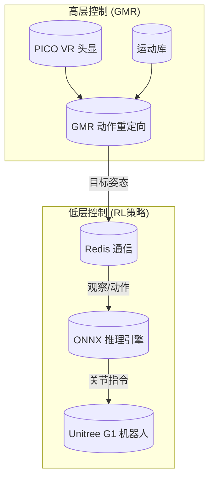
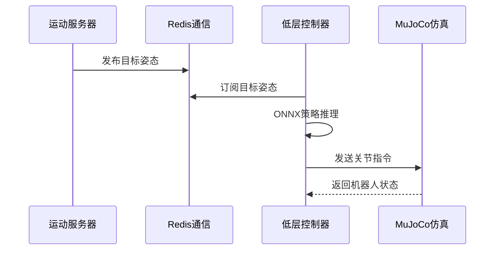

本文档帮助您快速上手 TWIST2 人形机器人遥操作系统。只需 10 分钟，您就可以在仿真环境中运行预训练策略，体验完整的两层级控制架构。

## 系统概览

TWIST2 是一个基于 NVIDIA Isaac Gym 的人形机器人遥操作与运动数据采集系统，支持使用 PICO VR 头显进行实时动作捕捉与控制。

### 核心技术架构



### 关键组件说明

| 组件 | 功能 | 位置 |
|------|------|------|
| **GMR 动作重定向** | 将人体动作映射到 G1 机器人 | `pose/` |
| **运动库** | 管理参考运动数据 | `assets/example_motions/` |
| **Redis 通信** | 高层与低层之间传递目标姿态 | 系统级消息队列 |
| **ONNX 推理** | 低层策略执行 | `deploy_real/server_low_level_*.py` |

Sources: [CLAUDE.md](CLAUDE.md#L1-L20)
Sources: [README.md](README.md#L1-L30)

## 环境准备

TWIST2 使用两个独立的 conda 环境，这是因为 Isaac Gym 需要 Python 3.8，而部分依赖需要更高版本。

### 环境配置速查表

| 环境名称 | Python 版本 | 用途 |
|----------|-------------|------|
| `twist2` | 3.8 | 训练、仿真部署、遥操作 |
| `gmr` | 3.10 | 在线动作重定向、VR 遥操作 |

### 快速安装步骤

```bash
# 1. 创建主环境
conda create -n twist2 python=3.8
conda activate twist2

# 2. 安装 Isaac Gym (从 NVIDIA 官网下载后)
cd isaacgym/python && pip install -e .

# 3. 安装核心依赖
cd rsl_rl && pip install -e . && cd ..
cd legged_gym && pip install -e . && cd ..
cd pose && pip install -e . && cd ..

pip install "numpy==1.23.0" pydelatin wandb tqdm opencv-python
pip install redis[hiredis] mujoco onnxruntime-gpu customtkinter
```

Sources: [README.md](README.md#L30-L60)
Sources: [train.sh](train.sh#L1-L20)

## 快速验证：使用预训练模型

项目提供了预训练的 ONNX 模型，您可以跳过训练直接体验仿真效果。

### 方式一：使用 GUI 图形界面（推荐新手）

GUI 界面集成了所有常用功能，是最简便的启动方式：

```bash
bash gui.sh
```

启动后，您将看到一个带有多种主题的图形界面，包括 Sim2Sim 部署、VR 遥操作等多个面板。点击对应面板的 **START** 按钮即可启动。

Sources: [gui.sh](gui.sh#L1-L5)
Sources: [gui.py](gui.py#L1-L50)

### 方式二：命令行启动 Sim2Sim 仿真

如果您偏好命令行操作，可以分两步启动仿真系统：

**终端 1 - 启动运动服务器（提供参考动作）：**
```bash
bash run_motion_server.sh
```

**终端 2 - 启动低层控制器（执行 RL 策略）：**
```bash
bash sim2sim.sh
```

这两个脚本的工作流程如下：



Sources: [run_motion_server.sh](run_motion_server.sh#L1-L25)
Sources: [sim2sim.sh](sim2sim.sh#L1-L15)

## 训练您自己的策略

如果您想训练自定义运动策略，可以按照以下步骤操作。

### 单 GPU 训练（默认方式）

```bash
bash train.sh <实验ID> cuda:0
```

**参数说明：**

| 参数 | 说明 | 示例 |
|------|------|------|
| 实验ID | 训练实验的唯一标识 | `my_first_twist2` |
| CUDA设备 | GPU 设备编号 | `cuda:0` |

**示例：**
```bash
bash train.sh 1021_twist2 cuda:0
```

Sources: [train.sh](train.sh#L45-L70)
Sources: [CLAUDE.md](CLAUDE.md#L30-L45)

### 带蒸馏的训练（使用教师策略）

TWIST2 采用师生蒸馏架构，如果您已经训练好教师策略，可以进行蒸馏训练：

```bash
bash train.sh <学生实验ID> cuda:0 \
    <motion_yaml> \
    <教师实验ID> \
    <教师checkpoint编号>
```

Sources: [CLAUDE.md](CLAUDE.md#L45-L55)

## 模型导出与部署

训练完成后，将 PyTorch 模型导出为 ONNX 格式进行部署：

```bash
bash to_onnx.sh legged_gym/logs/g1_stu_future/<实验ID>/model_<迭代次数>.pt
```

导出的 ONNX 文件位于：
```
legged_gym/logs/g1_stu_future/<实验ID>/exported/
```

Sources: [to_onnx.sh](to_onnx.sh#L1-L12)
Sources: [save_onnx.py](legged_gym/legged_gym/scripts/save_onnx.py#L1-L50)

## 常见问题速查

| 问题 | 解决方案 |
|------|----------|
| Isaac Gym 导入错误 | 确保 `twist2` 环境已激活 |
| Redis 连接失败 | 运行 `sudo systemctl start redis-server` |
| GPU 内存不足 | 减少 `--num_envs` 或使用 `--motion.storage_dtype float16` |
| 仿真窗口黑屏 | 检查显卡驱动和 MuJoCo 许可证 |

Sources: [CLAUDE.md](CLAUDE.md#L140-L150)

## 下一步学习路径

完成快速启动后，建议按以下顺序深入学习：

| 顺序 | 文档 | 内容 |
|------|------|------|
| 1 | [项目概述](1-xiang-mu-gai-shu) | 深入了解 TWIST2 的设计理念与应用场景 |
| 2 | [conda环境配置](3-condahuan-jing-pei-zhi) | 完整的环境配置指南 |
| 3 | [两层级控制架构](5-liang-ceng-ji-kong-zhi-jia-gou) | 理解高层 GMR 与低层 RL 的协同工作原理 |
| 4 | [Sim2Sim仿真验证](14-sim2simfang-zhen-yan-zheng) | 完整的仿真测试流程 |
| 5 | [Sim2Real实物部署](15-sim2realshi-wu-bu-shu) | 将策略部署到真实机器人 |

## 目录结构速览

```
TWIST2/
├── legged_gym/          # RL训练框架 (Isaac Gym)
│   ├── envs/           # 环境定义
│   └── scripts/        # 训练/评估脚本
├── rsl_rl/             # PPO算法实现
├── pose/               # GMR动作重定向
├── deploy_real/        # 部署与遥操作脚本
├── assets/
│   ├── ckpts/          # 预训练ONNX模型
│   └── example_motions/ # 示例运动数据
└── gui.py              # 图形界面入口
```

Sources: [get_dir_structure output](.LEGGED_GYM_STRUCTURE)
Sources: [CLAUDE.md](CLAUDE.md#L20-L30)

---

**提示**：项目提供了 10 个示例运动文件（`assets/example_motions/0807_yanjie_walk_*.pkl`）用于测试，无需下载完整数据集即可体验基本功能。