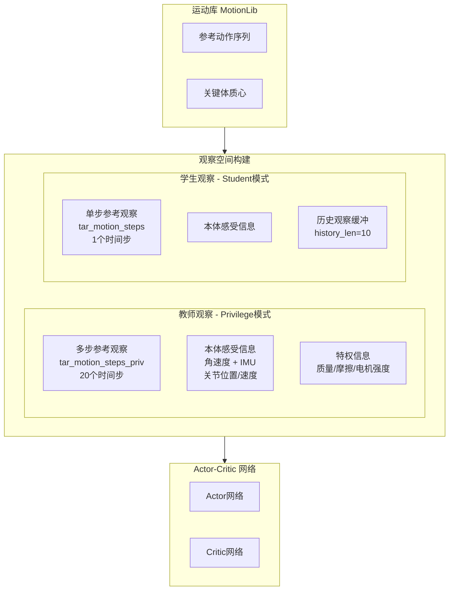
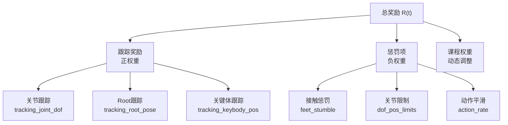

本文档详细介绍 TWIST2 项目中 G1 模仿学习环境的观察空间（Observation Space）构建机制与奖励函数（Reward Function）设计原理。理解这两个核心组件对于调优策略性能、调试训练过程以及进行二次开发至关重要。

## 1. 架构概览

TWIST2 采用师生蒸馏架构，观察空间设计遵循分层信息流原则：教师策略（Privilege Policy）使用完整的多步未来参考信息，而学生策略（Student Policy）仅使用单步预测目标以实现 sim2sim 部署。



Sources: [g1_mimic_distill_config.py](legged_gym/legged_gym/envs/g1/g1_mimic_distill_config.py#L29-L42), [g1_mimic_config.py](legged_gym/legged_gym/envs/g1/g1_mimic_config.py#L10-L25)

## 2. 观察空间维度详解

### 2.1 教师观察空间（Privilege Observation）

教师策略配置为 `obs_type = 'priv'`，其观察空间包含完整的多模态信息：

| 组件 | 维度 | 数据来源 | 说明 |
|------|------|----------|------|
| **多步 Mimic 观察** | 20步 × 41维 | `_get_mimic_obs()` | 未来20个时间步的参考运动状态 |
| **本体感受** | 3 + 2 + 58维 | 计算得到 | 角速度、IMU、关节位置/速度 |
| **特权信息** | 变量 | 仿真器 | 质量参数、摩擦系数、电机强度 |

```python
# g1_mimic_distill_config.py 关键配置
tar_motion_steps_priv = [1, 5, 10, 15, 20, 25, 30, 35, 40, 45,
                         50, 55, 60, 65, 70, 75, 80, 85, 90, 95,]
n_priv_mimic_obs = len(tar_motion_steps_priv) * (21 + num_actions + 3*9)
# 21 = root(12) + keybody(9); 9 = 关键体质心数量
```

Sources: [g1_mimic_distill.py](legged_gym/legged_gym/envs/g1/g1_mimic_distill.py#L233-L310)

### 2.2 学生观察空间（Student Observation）

学生策略用于实际部署，仅包含单步预测目标：

```python
# 核心差异：学生使用1步观察
tar_motion_steps = [1]
n_mimic_obs_single = 6 + 29  # root_vel_xy(2) + root_pos_z(1) + roll_pitch(2) + yaw_ang_vel(1) + dof_pos(29)
```

观察组成：
- **参考 Mimic 观察**：root_vel_local(xy) + root_pos(z) + roll/pitch + yaw_ang_vel + dof_pos
- **本体感受**：base_ang_vel + imu + dof_pos + dof_vel + action_history
- **历史缓冲**：10帧历史观察（用于时序建模）

Sources: [g1_mimic_distill_config.py](legged_gym/legged_gym/envs/g1/g1_mimic_distill_config.py#L380-L388), [g1_mimic_distill.py](legged_gym/legged_gym/envs/g1/g1_mimic_distill.py#L313-L355)

### 2.3 观察空间维度计算

```python
# G1MimicPrivCfg 完整观察维度
n_proprio = 3 + 2 + 3*num_actions  # 角速度 + IMU + 关节*3
n_priv_mimic_obs = len(tar_motion_steps_priv) * (21 + num_actions + 3*9)  # 多步参考
n_priv_info = 3 + 3 + 4 + 3*9 + 2 + 4 + 1 + 2*num_actions  # 速度+位置+四元数+关键体+接触+特权
num_observations = n_priv_mimic_obs + n_proprio + n_priv_info  # ~3000+ 维
```

Sources: [g1_mimic_distill_config.py](legged_gym/legged_gym/envs/g1/g1_mimic_distill_config.py#L29-L42)

## 3. Mimic 观察构建流程

### 3.1 参考运动查询

`_get_mimic_obs()` 方法从运动库查询目标时刻的参考状态：

```python
def _get_mimic_obs(self):
    # 计算观察时间点：当前时间 + 步长间隔
    motion_times = self._get_motion_times().unsqueeze(-1)
    obs_motion_times = self._tar_motion_steps_priv * self.dt + motion_times
    
    # 从MotionLib批量查询
    root_pos, root_rot, root_vel, root_ang_vel, dof_pos, dof_vel, body_pos, ...
        = self._motion_lib.calc_motion_frame(motion_ids_tiled, obs_motion_times)
```

Sources: [humanoid_mimic.py](legged_gym/legged_gym/envs/base/humanoid_mimic.py#L770-L820)

### 3.2 坐标变换处理

观察空间支持两种坐标系模式：

| 模式 | 配置 | 说明 |
|------|------|------|
| **全局观察** | `global_obs = True` | 使用世界坐标系，跟踪 root 绝对位置 |
| **局部观察** | `global_obs = False` | 使用 yaw 对齐局部坐标系，仅跟踪相对运动 |

```python
# 局部坐标系转换
base_yaw_quat = quat_from_euler_xyz(0*self.yaw, 0*self.yaw, self.yaw)
key_body_pos = convert_to_local_root_body_pos(base_yaw_quat, key_body_pos)
```

Sources: [humanoid_mimic.py](legged_gym/legged_gym/envs/base/humanoid_mimic.py#L1050-L1080)

## 4. 奖励函数体系

### 4.1 奖励结构概览



Sources: [humanoid_mimic.py](legged_gym/legged_gym/envs/base/humanoid_mimic.py#L1060-L1400)

### 4.2 跟踪奖励（正权重）

#### 4.2.1 关节位置跟踪

```python
def _reward_tracking_joint_dof(self):
    """关节角度跟踪奖励 - 加权平方误差"""
    dof_diff = self._ref_dof_pos - self.dof_pos
    dof_err = torch.sum(self._dof_err_w * dof_diff * dof_diff, dim=-1)
    pos_scale = 0.15
    return torch.exp(-pos_scale * dof_err)
```

**数学形式**：
$$r_{joint} = \exp\left(-0.15 \sum_j w_j (q_j^* - q_j)^2\right)$$

权重配置示例：
```python
dof_err_w = [1.0, 1.0, 1.0, 1.0, 0.1, 0.1,  # 左腿 - 膝踝低权重
             1.0, 1.0, 1.0, 1.0, 0.1, 0.1,  # 右腿
             1.0, 1.0, 1.0,                 # 腰部
             1.0, ...]                      # 手臂
```

Sources: [humanoid_mimic.py](legged_gym/legged_gym/envs/base/humanoid_mimic.py#L1060-L1070), [g1_mimic_config.py](legged_gym/legged_gym/envs/g1/g1_mimic_config.py#L50-L65)

#### 4.2.2 Root 位姿跟踪

```python
def _reward_tracking_root_pose(self):
    """Root 平移+旋转联合跟踪"""
    root_pos_diff = self._ref_root_pos - self.root_states[:, 0:3]
    root_pos_err = torch.sum(root_pos_diff * root_pos_diff, dim=-1)
    
    root_rot_err = torch_utils.quat_diff_angle(self.root_states[:, 3:7], self._ref_root_rot)
    root_rot_err *= root_rot_err
    
    root_pose_scale = 1.0
    return torch.exp(-root_pose_scale * (root_pos_err + 0.1 * root_rot_err))
```

**数学形式**：
$$r_{pose} = \exp\left(-( \|p^* - p\|^2 + 0.1 \cdot \theta_{error}^2 )\right)$$

Sources: [humanoid_mimic.py](legged_gym/legged_gym/envs/base/humanoid_mimic.py#L1082-L1095)

#### 4.2.3 关键体质心跟踪

```python
def _reward_tracking_keybody_pos(self):
    """关键体位置跟踪 - Yaw对齐局部坐标系"""
    key_body_pos = self.rigid_body_states[:, self._key_body_ids, 0:3]
    key_body_pos = key_body_pos - self.root_states[:, 0:3].unsqueeze(1)
    key_body_pos = convert_to_local_root_body_pos(base_yaw_quat, key_body_pos)
    
    # ... 误差计算 ...
    key_body_pos_scale = 10.0
    return torch.exp(-key_body_pos_scale * key_body_pos_err)
```

默认关键体质心：
```python
key_bodies = ["left_rubber_hand", "right_rubber_hand", 
              "left_ankle_roll_link", "right_ankle_roll_link", 
              "left_knee_link", "right_knee_link", 
              "left_elbow_link", "right_elbow_link", "head_mocap"]
```

Sources: [humanoid_mimic.py](legged_gym/legged_gym/envs/base/humanoid_mimic.py#L1120-L1160), [g1_mimic_config.py](legged_gym/legged_gym/envs/g1/g1_mimic_config.py#L285-L286)

### 4.3 惩罚项（负权重）

| 惩罚项 | 公式 | 权重范围 | 用途 |
|--------|------|----------|------|
| `feet_stumble` | 水平力 > 4×垂直力 | -1.25 | 防止脚绊倒 |
| `feet_contact_forces` | max(0, F_z - F_max) | -5e-4 | 限制接触力 |
| `dof_pos_limits` | 越限距离累加 | -5.0 | 关节限位保护 |
| `dof_vel` | Σ(�q²) | -1e-4 | 抑制高速运动 |
| `action_rate` | ‖a_t - a_{t-1}‖ | -0.01 | 动作平滑 |
| `ang_vel_xy` | ω_x² + ω_y² | -0.01 | 防止剧烈倾斜 |

Sources: [g1_mimic_config.py](legged_gym/legged_gym/envs/g1/g1_mimic_config.py#L202-L218), [g1_mimic_distill_config.py](legged_gym/legged_gym/envs/g1/g1_mimic_distill_config.py#L210-L240)

### 4.4 Anti-Shuffle 抑制小碎步

Anti-Shuffle 机制专门用于抑制"小碎步"现象——机器人在原地快速切换支撑脚而非正常行走。

```python
def _anti_shuffle_stable_gate(self):
    """门控条件：低参考速度 + 低倾斜"""
    ref_speed = torch.norm(self._ref_root_vel[:, :2], dim=1)
    tilt = torch.norm(self.projected_gravity[:, :2], dim=1)
    return ((ref_speed < 0.12) & (tilt < 0.25)).float()

def _reward_step_switch_rate(self):
    """惩罚频繁的接触状态切换"""
    contact = self.contact_forces[:, self.feet_indices, 2] > 5.
    switch_cnt = torch.logical_xor(contact, self._anti_shuffle_last_contact).float().sum(dim=1)
    return switch_cnt * self._anti_shuffle_stable_gate()

def _reward_stance_foot_speed(self):
    """惩罚支撑脚滑动速度"""
    contact = (self.contact_forces[:, self.feet_indices, 2] > 5.).float()
    foot_speed_xy = torch.norm(self.rigid_body_states[:, self.feet_indices, 7:9], dim=2)
    stance_speed = (foot_speed_xy * contact).sum(dim=1)
    return stance_speed * self._anti_shuffle_stable_gate()
```

**门控逻辑**：仅当参考运动低速且机器人姿态稳定时才激活惩罚，避免干扰正常运动模式。

Sources: [humanoid_mimic.py](legged_gym/legged_gym/envs/base/humanoid_mimic.py#L1340-L1380), [g1_mimic_distill_config.py](legged_gym/legged_gym/envs/g1/g1_mimic_distill_config.py#L195-L205)

## 5. 奖励组装与缩放

### 5.1 奖励函数注册

```python
def _prepare_reward_function(self):
    """将配置中的奖励项注册为可调用函数"""
    self.reward_functions = []
    self.reward_names = []
    for name, scale in self.reward_scales.items():
        if name == "termination":
            continue
        self.reward_names.append(name)
        name = '_reward_' + name
        self.reward_functions.append(getattr(self, name))
```

### 5.2 总奖励计算

```python
def compute_reward(self):
    """组装所有奖励项"""
    self.rew_buf[:] = 0.
    for i in range(len(self.reward_functions)):
        name = self.reward_names[i]
        rew = self.reward_functions[i]() * self.reward_scales[name]
        self.rew_buf += rew
        self.episode_sums[name] += rew
    
    # 可选：仅保留正值
    if self.cfg.rewards.only_positive_rewards:
        self.rew_buf[:] = torch.clip(self.rew_buf[:], min=0.)
```

**数学形式**：
$$R(t) = \sum_{k} w_k \cdot r_k(t) + \alpha_{reg} \sum_{k \in \mathcal{K}_{reg}} w_k \cdot r_k(t)$$

Sources: [legged_robot.py](legged_gym/legged_gym/envs/base/legged_robot.py#L280-L300)

### 5.3 默认奖励权重配置

```python
class G1MimicDistillCfg:
    class scales:
        # 跟踪奖励（核心）
        tracking_joint_dof = 2.0      # 关节跟踪
        tracking_joint_vel = 0.3      # 关节速度跟踪
        tracking_keybody_pos = 2.0    # 关键体跟踪
        tracking_root_translation_z = 1.0
        tracking_root_rotation = 1.0
        tracking_root_linear_vel = 1.0
        tracking_root_angular_vel = 1.0
        
        # 惩罚项
        feet_slip = -0.1
        feet_contact_forces = -5e-4
        feet_stumble = -1.25
        dof_pos_limits = -5.0
        action_rate = -0.01
        
        # Anti-Shuffle
        step_switch_rate = -0.20
        stance_foot_speed = -0.05
```

Sources: [g1_mimic_distill_config.py](legged_gym/legged_gym/envs/g1/g1_mimic_distill_config.py#L210-L240)

## 6. 终止条件

```python
def check_termination(self):
    """组合多种终止条件"""
    # 1. 接触力过大
    contact_force_termination = torch.any(
        torch.norm(self.contact_forces[:, self.termination_contact_indices, :], dim=-1) > 1., dim=1)
    
    # 2. 高度偏差
    root_height_diff = torch.abs(self.root_states[:, 2] - self._ref_root_pos[:, 2])
    height_cutoff = root_height_diff > self.cfg.rewards.root_height_diff_threshold  # 0.3m
    
    # 3. 姿态限制
    roll_cut = torch.abs(self.roll) > self.cfg.rewards.termination_roll   # 4.0 rad
    pitch_cut = torch.abs(self.pitch) > self.cfg.rewards.termination_pitch # 4.0 rad
    
    # 4. 速度限制
    vel_too_large = torch.norm(self.root_states[:, 7:10], dim=-1) > 6.5
    
    # 5. 姿态跟踪失败
    if self._pose_termination:
        body_pos_dist > self._pose_termination_dist ** 2  # 0.7m
    
    self.reset_buf = contact_force_termination | height_cutoff | roll_cut | pitch_cut | vel_too_large | pose_fail
```

Sources: [humanoid_mimic.py](legged_gym/legged_gym/envs/base/humanoid_mimic.py#L630-L700)

## 7. 配置参考表

### 7.1 观察空间关键参数

| 参数 | 默认值 | 说明 |
|------|--------|------|
| `tar_motion_steps_priv` | [1,5,10,...,95] | 教师多步观察时间点 |
| `tar_motion_steps` | [1] | 学生单步观察时间点 |
| `history_len` | 10 | 历史观察缓冲长度 |
| `global_obs` | False | 是否使用全局坐标系 |

### 7.2 奖励关键参数

| 参数 | 默认值 | 说明 |
|------|--------|------|
| `tracking_sigma` | 0.2 | 跟踪奖励误差sigma |
| `max_contact_force` | 500N | 接触力惩罚阈值 |
| `enable_anti_shuffle_reward` | False | 启用Anti-Shuffle |

### 7.3 终止条件参数

| 参数 | 默认值 | 说明 |
|------|--------|------|
| `root_height_diff_threshold` | 0.3m | 高度偏差终止阈值 |
| `termination_roll/pitch` | 4.0 rad | 姿态角终止阈值 |
| `pose_termination_dist` | 0.7m | 姿态跟踪失败阈值 |

Sources: [humanoid_mimic_config.py](legged_gym/legged_gym/envs/base/humanoid_mimic_config.py#L1-L70), [g1_mimic_distill_config.py](legged_gym/legged_gym/envs/g1/g1_mimic_distill_config.py#L280-L300)

## 8. 延伸阅读

- [G1模仿环境配置](19-g1mo-fang-huan-jing-pei-zhi)：环境配置完整指南
- [Actor-Critic网络架构](21-actor-criticwang-luo-jia-gou)：观察如何进入策略网络
- [Anti-Shuffle抑制小碎步](13-anti-shuffleyi-zhi-xiao-sui-bu)：小碎步问题的详细分析与解决方案
- [两层级控制架构](5-liang-ceng-ji-kong-zhi-jia-gou)：师生蒸馏的完整架构设计