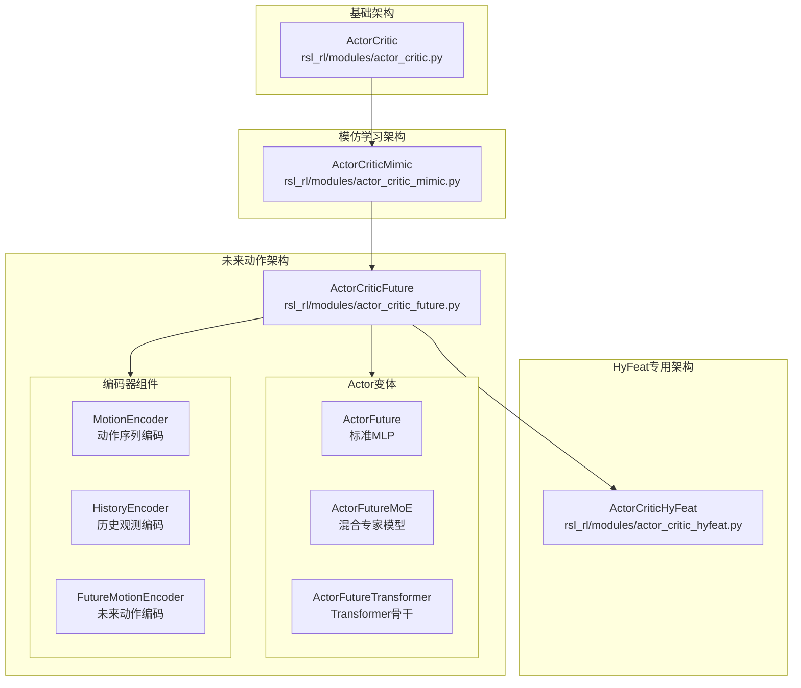
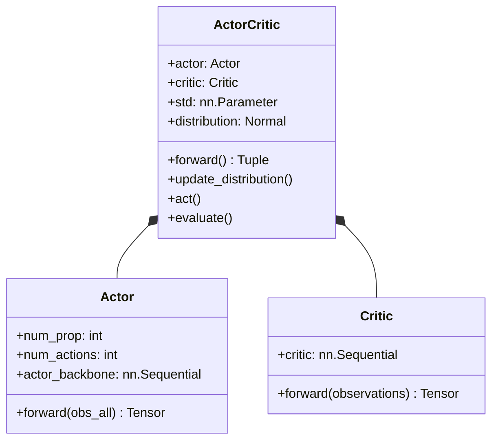
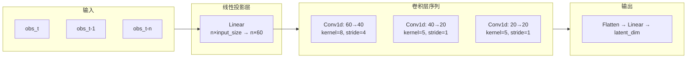
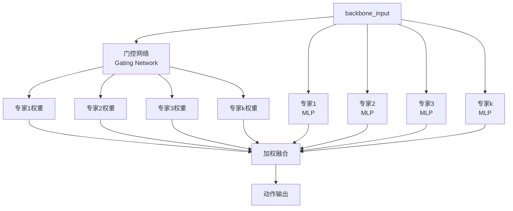

TWIST2采用Actor-Critic架构作为强化学习策略网络的核心，实现了策略（Actor）与价值评估（Critic）的解耦设计。该项目提供了多种网络变体以适应不同训练阶段和推理需求，从基础的模仿学习到复杂的多模态动作预测，形成了一套完整的策略网络体系。

## 架构总览

TWIST2的Actor-Critic网络体系由四个主要变体构成，分别对应不同的训练场景与模型复杂度的递进关系：



**源码位置**: [rsl_rl/rsl_rl/modules/__init__.py](rsl_rl/rsl_rl/modules/__init__.py#L1-L40)

## 基础Actor-Critic实现

基础架构采用标准的策略-价值双网络设计，Actor负责从观测输出动作分布的均值，Critic负责评估状态价值。网络采用多层感知机（MLP）结构，支持ELU、ReLU、SiLU等多种激活函数选择。



### Actor网络结构

Actor网络接收观测向量，通过多层全连接网络输出动作均值。默认配置采用 `[256, 256, 256]` 三层隐藏层结构，输出层直接输出动作维度大小的均值向量。

```python
# 源码: rsl_rl/rsl_rl/modules/actor_critic.py#L33-L55
class Actor(nn.Module):
    def __init__(self, num_prop,
                 num_actions,
                 actor_hidden_dims, 
                 activation, 
                 tanh_encoder_output=False, **kwargs) -> None:
        actor_layers = []
        actor_layers.append(nn.Linear(num_prop, actor_hidden_dims[0]))
        actor_layers.append(activation)
        for l in range(len(actor_hidden_dims)):
            if l == len(actor_hidden_dims) - 1:
                actor_layers.append(nn.Linear(actor_hidden_dims[l], num_actions))
            else:
                actor_layers.append(nn.Linear(actor_hidden_dims[l], actor_hidden_dims[l + 1]))
                actor_layers.append(activation)
```

Actor的核心前向传播将观测通过多层网络变换得到动作均值，该均值与全局可学习的标准差参数共同构成对角高斯策略分布。这种设计允许策略在训练初期具有较大探索范围（大方差），随着训练进行可逐渐收缩探索程度。

### Critic网络结构

Critic网络采用与Actor相似的MLP结构，但输出层仅包含单个神经元，直接输出状态价值标量。Critic使用特权观测（privileged observations）作为输入，这部分信息在推理阶段不可用，仅用于训练时的价值估计。

```python
# 源码: rsl_rl/rsl_rl/modules/actor_critic.py#L67-L83
critic_layers = []
critic_layers.append(nn.Linear(num_critic_obs, critic_hidden_dims[0]))
critic_layers.append(activation)
for l in range(len(critic_hidden_dims)):
    if l == len(critic_hidden_dims) - 1:
        critic_layers.append(nn.Linear(critic_hidden_dims[l], 1))
    else:
        critic_layers.append(nn.Linear(critic_hidden_dims[l], critic_hidden_dims[l + 1]))
        critic_layers.append(activation)
self.critic = nn.Sequential(*critic_layers)
```

**源码位置**: [rsl_rl/rsl_rl/modules/actor_critic.py](rsl_rl/rsl_rl/modules/actor_critic.py#L33-L83)

## 时序编码器组件

为了处理机器人控制中的时序依赖信息，TWIST2引入了专门的时序编码器模块。这些编码器将多帧观测序列压缩为固定维度的隐向量，为后续策略网络提供丰富的时序上下文表示。

### MotionEncoder动作序列编码器

MotionEncoder使用一维卷积神经网络对时序动作观测进行特征提取，支持 1、10、20、50 步不同时序长度的输入。编码器首先通过线性投影将单步观测扩展到更高维度（60维），然后通过精心设计的卷积结构进行时序特征提取。



对于50步输入，编码器采用三层卷积结构逐步压缩时序长度：第一层卷积将序列从50步降至约11步，第二层降至7步，第三层降至3步，最终展平并通过线性层映射到目标隐向量维度。

```python
# 源码: rsl_rl/rsl_rl/modules/actor_critic_future.py#L59-L88
if tsteps == 50:
    self.conv_layers = nn.Sequential(
        nn.Conv1d(in_channels=3*channel_size, out_channels=2*channel_size, kernel_size=8, stride=4),
        self.activation_fn,
        nn.Conv1d(in_channels=2*channel_size, out_channels=channel_size, kernel_size=5, stride=1),
        self.activation_fn,
        nn.Conv1d(in_channels=channel_size, out_channels=channel_size, kernel_size=5, stride=1),
        self.activation_fn, nn.Flatten())
```

**源码位置**: [rsl_rl/rsl_rl/modules/actor_critic_future.py](rsl_rl/rsl_rl/modules/actor_critic_future.py#L37-L130)

### HistoryEncoder历史观测编码器

HistoryEncoder与MotionEncoder结构完全一致，但专门用于编码历史时刻的完整观测信息（包括动作和本体感知）。这种设计使得网络能够感知机器人的历史状态轨迹，从而做出更连贯的决策。

### FutureMotionEncoder未来动作编码器

FutureMotionEncoder是TWIST2的核心创新之一，它将未来时刻的动作观测通过MLP编码器压缩为固定维度特征。这种设计允许学生策略学习预测未来运动的能力，与教师策略形成更好的蒸馏匹配。

```python
# 源码: rsl_rl/rsl_rl/modules/actor_critic_future.py#L276-L305
class FutureMotionEncoder(nn.Module):
    def __init__(self, activation_fn, input_size, tsteps, output_size, ...):
        total_input_size = input_size * tsteps
        self.encoder = nn.Sequential(
            nn.Linear(total_input_size, 256),
            activation_fn,
            nn.Dropout(dropout),
            nn.Linear(256, 128),
            activation_fn,
            nn.Dropout(dropout),
            nn.Linear(128, output_size)
        )
```

编码器输入包含未来观测和mask指示器，mask用于标记无效的未来帧（超出运动库范围时）。这种设计确保了编码器能够优雅地处理可变长度的未来预测。

**源码位置**: [rsl_rl/rsl_rl/modules/actor_critic_future.py](rsl_rl/rsl_rl/modules/actor_critic_future.py#L264-L340)

## ActorCriticFuture完整架构

ActorCriticFuture是TWIST2的核心网络架构，集成了所有时序编码器组件。该网络支持三种不同的Actor骨干网络变体，通过配置参数灵活切换。

### 观测结构解析

网络接收的完整观测向量按照以下顺序组织：

```
[动作观测 (motion_obs)] → [本体感知观测 (priop_obs)] → [历史观测 (history_obs)] → [未来观测 (future_obs)]
```

每个部分的维度计算如下：

| 观测组件 | 维度计算 | 说明 |
|---------|---------|------|
| 当前动作 | `single_motion_obs × 1` | 单步动作观测 |
| 本体感知 | `num_priop_observations` | 当前时刻的机器人状态 |
| 历史动作 | `single_obs × num_history_steps` | 历史n帧的完整观测 |
| 历史本体 | `num_history_steps` 帧 | 历史本体感知序列 |
| 未来观测 | `single_future_obs × num_future_steps` | 未来预测帧 |

```python
# 源码: rsl_rl/rsl_rl/modules/actor_critic_future.py#L485-L530
def forward(self, obs, hist_encoding: bool = False):
    current_size = self.num_motion_observations + self.num_priop_observations
    
    # 提取当前观测
    motion_obs = obs[:, :self.num_motion_observations]
    single_motion_obs = obs[:, :self.num_single_motion_observations]
    priop_obs = obs[:, self.num_motion_observations:current_size]
    
    # 提取历史观测
    history_start = current_size
    history_size = self.num_history_steps * current_size
    history_end = history_start + history_size
    history_obs = obs[:, history_start:history_end]
    
    # 提取未来观测
    future_start = history_end
    future_end = future_start + self.num_future_observations
    future_obs = obs[:, future_start:future_end]
```

**源码位置**: [rsl_rl/rsl_rl/modules/actor_critic_future.py](rsl_rl/rsl_rl/modules/actor_critic_future.py#L480-L530)

### 特征融合策略

各编码器的输出被拼接为统一的特征向量，送入主策略网络：

```python
# 源码: rsl_rl/rsl_rl/modules/actor_critic_future.py#L532-L550
# 编码所有组件
motion_latent = self.motion_encoder(motion_obs)
history_latent = self.history_encoder(history_obs)

if self.future_encoder is not None:
    future_obs_reshaped = future_obs.reshape(-1, self.num_future_steps, self.num_single_future_observations)
    future_latent = self.future_encoder(future_obs_reshaped)
else:
    future_latent = torch.zeros(obs.shape[0], self.future_latent_dim, device=obs.device)

# 组合所有特征
backbone_input = torch.cat([
    single_motion_obs,     # 单步动作观测
    priop_obs,             # 本体感知观测
    motion_latent,         # 动作编码特征
    history_latent,        # 历史编码特征
    future_latent          # 未来编码特征
], dim=1)
```

### Actor前向与高斯策略

Actor网络输出动作均值，与可学习的标准差参数共同构成对角高斯策略：

```python
# 源码: rsl_rl/rsl_rl/modules/actor_critic_future.py#L845-L855
def update_distribution(self, observations):
    mean = self.actor(observations)
    self.distribution = Normal(mean, mean*0. + self.std)
```

数学上，策略分布表示为：

$$
\pi_\theta(a \mid o) = \prod_{i=1}^{d_a} \mathcal{N}(a_i; \mu_i(o), \sigma_i^2)
$$

其中 $\mu_\theta(o)$ 是Actor输出的均值向量，$\sigma$ 是全局可学习的标准差向量。

**源码位置**: [rsl_rl/rsl_rl/modules/actor_critic_future.py](rsl_rl/rsl_rl/modules/actor_critic_future.py#L840-L880)

## Actor骨干网络变体

### 标准MLP (ActorFuture)

基础Actor采用标准的多层感知机结构，输入维度为各编码器输出维度的总和，隐藏层维度可配置（默认 `[256, 256, 256]`），激活函数默认使用SiLU。

```python
# 源码: rsl_rl/rsl_rl/modules/actor_critic_future.py#L337-L420
actor_layers = []
first_layer = nn.Linear(input_dim, actor_hidden_dims[0])
nn.init.xavier_uniform_(first_layer.weight, gain=0.5)  # 小增益初始化增强稳定性
nn.init.zeros_(first_layer.bias)
actor_layers.append(first_layer)
actor_layers.append(activation)

for l in range(len(actor_hidden_dims)):
    if l == len(actor_hidden_dims) - 1:
        final_layer = nn.Linear(actor_hidden_dims[l], num_actions)
        nn.init.xavier_uniform_(final_layer.weight, gain=0.1)  # 输出层更小增益
        nn.init.zeros_(final_layer.bias)
        actor_layers.append(final_layer)
    else:
        layer = nn.Linear(actor_hidden_dims[l], actor_hidden_dims[l + 1])
        nn.init.xavier_uniform_(layer.weight)
        nn.init.zeros_(layer.bias)
        actor_layers.append(layer)
        if layer_norm and l == len(actor_hidden_dims) - 2:
            actor_layers.append(nn.LayerNorm(actor_hidden_dims[l + 1]))
        actor_layers.append(activation)
```

### 混合专家模型 (ActorFutureMoE)

MoE架构通过门控网络动态选择多个专家网络的输出，实现模型容量的扩展而无需增加推理计算量。



门控网络计算各专家的权重，选择top-k个专家参与计算，并引入负载均衡辅助损失防止单个专家被过度使用：

```python
# 源码: rsl_rl/rsl_rl/modules/actor_critic_future.py#L970-L1010
def forward(self, x):
    gating_logits = self.gating(x)
    gating_weights = F.softmax(gating_logits, dim=-1)
    
    # Top-k选择
    top_k_weights, top_k_indices = torch.topk(gating_weights, self.top_k, dim=-1)
    top_k_weights = top_k_weights / top_k_weights.sum(dim=-1, keepdim=True)
    
    # 各专家输出
    expert_outputs = [expert(x) for expert in self.experts]
    expert_outputs = torch.stack(expert_outputs, dim=1)
    
    # 加权求和
    batch_size = x.shape[0]
    output = torch.zeros(batch_size, self.output_dim, device=x.device)
    for i in range(self.top_k):
        expert_idx = top_k_indices[:, i]
        weight = top_k_weights[:, i].unsqueeze(-1)
        output.scatter_add_(1, expert_idx.unsqueeze(-1).expand_as(weight * expert_outputs[:, i]), 
                           weight * expert_outputs.gather(1, expert_idx.unsqueeze(-1).expand_as(expert_outputs[:, 0])))
```

**源码位置**: [rsl_rl/rsl_rl/modules/actor_critic_future.py](rsl_rl/rsl_rl/modules/actor_critic_future.py#L910-L1010)

### Transformer骨干 (ActorFutureTransformer)

Transformer变体使用自注意力机制替代标准MLP作为策略网络的主干，能够更好地捕捉时序特征间的依赖关系。

```python
# 源码: rsl_rl/rsl_rl/modules/actor_critic_future.py#L1300-L1360
class TransformerBackbone(nn.Module):
    def __init__(self, input_dim, output_dim, d_model=256, nhead=8, num_layers=2, ...):
        self.input_embedding = nn.Linear(input_dim, d_model)
        self.pos_encoding = nn.Parameter(torch.randn(1, 1, d_model) * 0.02)
        
        encoder_layer = nn.TransformerEncoderLayer(
            d_model=d_model, nhead=nhead,
            dim_feedforward=dim_feedforward, dropout=dropout,
            activation='gelu', batch_first=True
        )
        self.transformer = nn.TransformerEncoder(encoder_layer, num_layers=num_layers)
```

**源码位置**: [rsl_rl/rsl_rl/modules/actor_critic_future.py](rsl_rl/rsl_rl/modules/actor_critic_future.py#L1290-L1390)

## Critic网络设计

Critic网络使用特权观测（privileged observations）评估状态价值，这部分信息包含物理仿真器中的完整状态，在实际机器人上不可用。Critic的结构与Actor类似，但输入输出维度不同：

| 组件 | Actor | Critic |
|-----|-------|--------|
| 输入 | 完整观测 | 特权观测（无未来帧） |
| 编码器 | 动作+历史+未来 | 仅动作编码 |
| 输出 | 动作均值 | 状态价值标量 |

```python
# 源码: rsl_rl/rsl_rl/modules/actor_critic_future.py#L710-L745
def evaluate(self, critic_observations, **kwargs):
    motion_obs = critic_observations[:, :self.num_motion_observations]
    motion_single_obs = critic_observations[:, :self.num_single_motion_obs]
    motion_latent = self.critic_motion_encoder(motion_obs)
    
    backbone_input = torch.cat([
        critic_observations[:, self.num_motion_observations:],
        motion_single_obs,
        motion_latent
    ], dim=1)
    
    value = self.critic(backbone_input)
    return value
```

**源码位置**: [rsl_rl/rsl_rl/modules/actor_critic_future.py](rsl_rl/rsl_rl/modules/actor_critic_future.py#L900-L925)

## 网络配置参考

不同训练阶段使用不同的Actor-Critic变体和配置：

```python
# 源码: legged_gym/legged_gym/envs/g1/g1_mimic_config.py#L334-L340
class policy(HumanoidMimicCfgPPO.policy):
    action_std = [0.7] * 12 + [0.4] * 3 + [0.5] * 14
    init_noise_std = 0.8
    obs_context_len = 11
    actor_hidden_dims = [512, 512, 256, 128]
    critic_hidden_dims = [512, 512, 256, 128]
    activation = 'silu'
```

```python
# 源码: legged_gym/legged_gym/envs/g1/g1_mimic_future_config.py#L187-L240
class policy:
    actor_hidden_dims = [1024, 1024, 512, 256]  # 更大容量
    critic_hidden_dims = [1024, 1024, 512, 256]
    motion_latent_dim = 128
    future_latent_dim = 128
    num_future_steps = len(TAR_MOTION_STEPS_FUTURE)
    # MoE配置
    num_experts = 4
    expert_hidden_dims = [256, 128]
    gating_hidden_dim = 128
```

**源码位置**: [legged_gym/legged_gym/envs/g1/g1_mimic_future_config.py](legged_gym/legged_gym/envs/g1/g1_mimic_future_config.py#L187-L240)

## 核心方法接口

ActorCriticFuture提供以下核心接口供训练算法调用：

```python
# 完整前向 - DDP友好
def forward(self, observations, critic_observations=None, actions=None, **kwargs):
    self.update_distribution(observations)
    if actions is None:
        actions = self.distribution.sample()
    actions_log_prob = self.get_actions_log_prob(actions)
    entropy = self.entropy
    mu = self.action_mean
    sigma = self.action_std
    value = None
    if critic_observations is not None:
        value = self.evaluate(critic_observations)
    return actions, actions_log_prob, value, mu, sigma, entropy

# 推理模式（确定性动作）
def act_inference(self, observations, eval=False, **kwargs):
    return self.actor(observations)  # 直接返回均值

# 获取MoE辅助损失
def get_moe_aux_loss(self):
    if self.use_moe:
        return self.actor.get_moe_aux_loss()
    return torch.tensor(0.0)
```

**源码位置**: [rsl_rl/rsl_rl/modules/actor_critic_future.py](rsl_rl/rsl_rl/modules/actor_critic_future.py#L795-L895)

## 架构选择指南

TWIST2提供了四种主要的Actor-Critic变体，适用于不同的训练阶段和任务需求：

| 变体 | 使用场景 | 特点 | 参数量 |
|-----|---------|------|--------|
| `ActorCritic` | 基线对比 | 简单MLP，无时序编码 | ~1M |
| `ActorCriticMimic` | 模仿学习基础 | 增加MotionEncoder | ~2M |
| `ActorCriticFuture` (MLP) | 学生策略主训练 | 时序+未来预测 | ~5M |
| `ActorCriticFuture` (MoE) | 高容量需求 | 动态专家路由 | ~8M |
| `ActorCriticFuture` (Transformer) | 长程依赖 | 自注意力机制 | ~10M |
| `ActorCriticHyFeat` | 特征蒸馏 | HY专用编码 | ~3M |

对于大多数训练场景，推荐使用标准MLP的 `ActorCriticFuture`，它在性能和计算效率之间取得了良好平衡。当需要处理更复杂的运动模式时，可考虑MoE或Transformer变体。

## 相关文档

- [PPO算法与记忆存储](22-pposuan-fa-yu-ji-yi-cun-chu) - 了解如何利用Actor-Critic网络进行策略更新
- [观察空间与奖励设计](20-guan-cha-kong-jian-yu-jiang-li-she-ji) - 理解观测向量的构成与设计原则
- [学生策略蒸馏](11-xue-sheng-ce-lue-zheng-liu) - 掌握如何使用Actor-Critic进行知识蒸馏