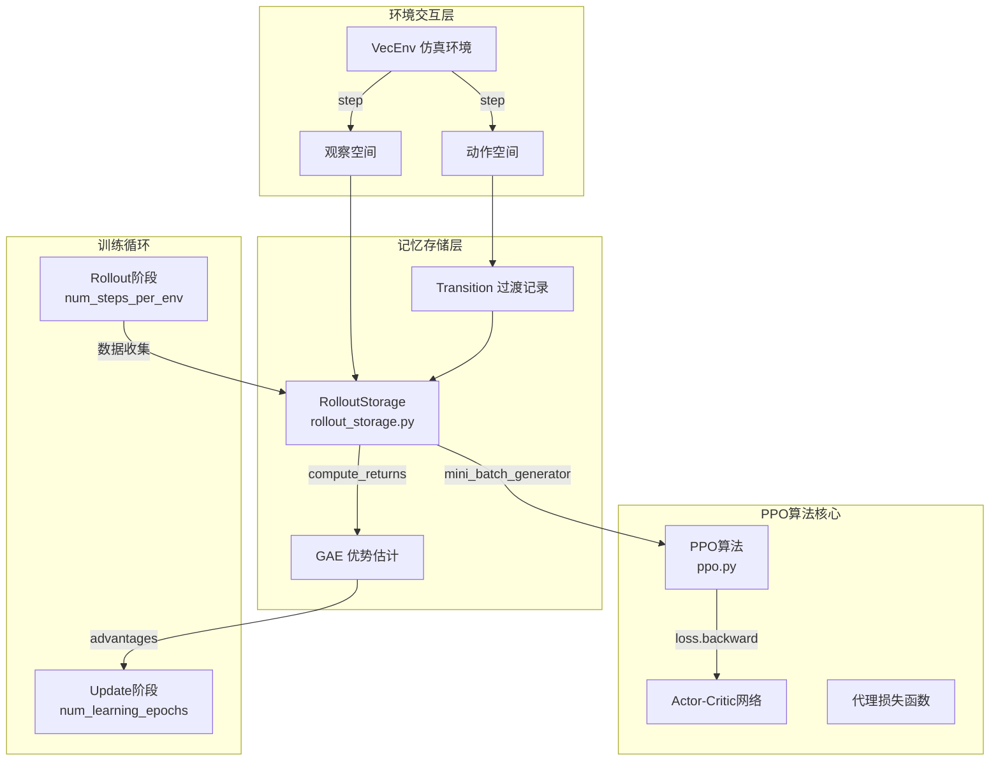
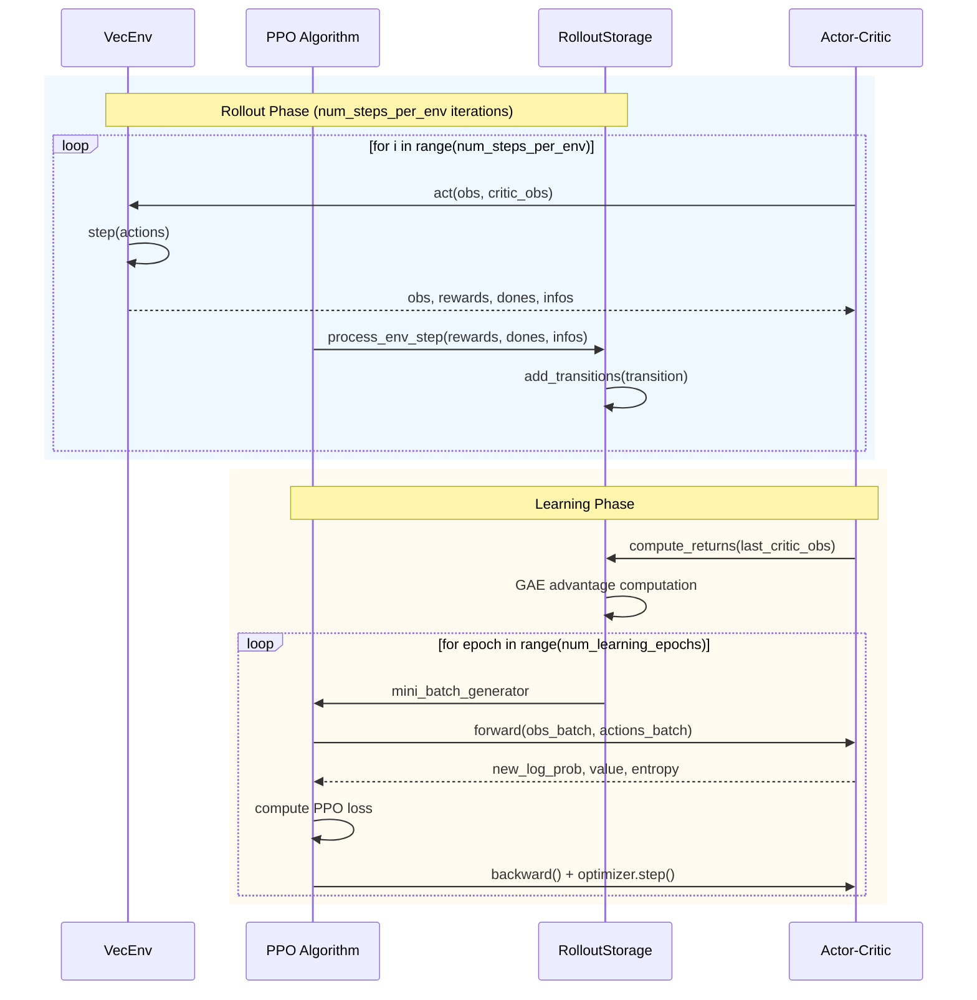

本文档深入剖析TWIST2项目中PPO（Proximal Policy Optimization）近端策略优化算法的核心实现机制与其配套的记忆存储系统。理解这两个组件的协同工作原理是掌握该框架训练流程的关键所在。

## 架构概览与核心组件关系

TWIST2采用RSL-RL框架作为强化学习训练基础，PPO算法实现与记忆存储系统形成紧密耦合的数据循环。整体架构遵循"环境交互→数据收集→策略更新"的经典on-policy范式。



如上所示，环境与策略之间的交互产生的经验数据首先被存储在RolloutStorage中，随后在更新阶段通过GAE（Generalized Advantage Estimation）计算优势函数，最后由PPO算法利用这些优势估计进行策略优化。

Sources: [ppo.py](rsl_rl/rsl_rl/algorithms/ppo.py#L43-L106)
Sources: [rollout_storage.py](rsl_rl/rsl_rl/storage/rollout_storage.py#L36-L86)

## PPO算法核心实现

### 算法类初始化与参数配置

PPO类的初始化定义了所有学习相关的超参数，这些参数共同决定了策略更新的行为和稳定性。

```python
class PPO:
    def __init__(self,
                 env,
                 actor_critic,
                 num_learning_epochs=1,
                 num_mini_batches=1,
                 clip_param=0.2,
                 gamma=0.998,
                 lam=0.95,
                 value_loss_coef=1.0,
                 entropy_coef=0.0,
                 learning_rate=1e-3,
                 max_grad_norm=1.0,
                 use_clipped_value_loss=True,
                 schedule="fixed",
                 desired_kl=0.01,
                 device='cpu',
                 ...):
```

| 参数 | 默认值 | 说明 | 对训练的影响 |
|------|--------|------|-------------|
| `clip_param` | 0.2 | PPO裁剪系数ε | 控制策略更新幅度，防止过激更新 |
| `gamma` | 0.998 | 折扣因子 | 平衡即时与远期奖励的权重 |
| `lam` | 0.95 | GAE衰减因子 | 权衡优势估计的方差与偏差 |
| `num_learning_epochs` | 1 | 每次rollout后的学习轮数 | 增加可提高数据利用效率 |
| `num_mini_batches` | 1 | Mini-batch分割数量 | 影响梯度估计的稳定性 |
| `entropy_coef` | 0.0 | 熵正则化系数 | 促进策略探索 |
| `max_grad_norm` | 1.0 | 梯度裁剪阈值 | 防止梯度爆炸 |

Sources: [ppo.py](rsl_rl/rsl_rl/algorithms/ppo.py#L43-L95)

### 代理损失函数与裁剪机制

PPO的核心创新在于其代理损失函数的设计，通过裁剪机制限制策略更新的幅度，避免因过大更新导致的性能崩溃。

```python
# Surrogate loss - PPO核心损失计算
ratio = torch.exp(actions_log_prob_batch - torch.squeeze(old_actions_log_prob_batch))
surrogate = -torch.squeeze(advantages_batch) * ratio
surrogate_clipped = -torch.squeeze(advantages_batch) * torch.clamp(
    ratio, 
    1.0 - self.clip_param,
    1.0 + self.clip_param
)
surrogate_loss = torch.max(surrogate, surrogate_clipped).mean()
```

这一设计的数学原理在于：当ratio超出 `[1-ε, 1+ε]` 区间时，代理损失被裁剪到固定边界，从而限制策略朝单一方向过度更新。`torch.max()` 操作确保我们始终选择损失值更大的（未裁剪或裁剪后）版本进行优化。

Sources: [ppo.py](rsl_rl/rsl_rl/algorithms/ppo.py#L187-L192)

### 值函数裁剪与双Critic结构

为增强值函数学习的稳定性，TWIST2实现了值函数裁剪机制，该机制与策略裁剪形成对称设计。

```python
# Value function loss with clipping
if self.use_clipped_value_loss:
    value_clipped = target_values_batch + (value_batch - target_values_batch).clamp(
        -self.clip_param,
        self.clip_param
    )
    value_losses = (value_batch - returns_batch).pow(2)
    value_losses_clipped = (value_clipped - returns_batch).pow(2)
    value_loss = torch.max(value_losses, value_losses_clipped).mean()
else:
    value_loss = (returns_batch - value_batch).pow(2).mean()

loss = surrogate_loss + \
       self.value_loss_coef * value_loss - \
       self.entropy_coef * entropy_batch.mean()
```

这种设计的直觉是：当值函数预测值被裁剪后，其对应的损失也被限制，从而防止值函数过度更新导致的策略误导。

Sources: [ppo.py](rsl_rl/rsl_rl/algorithms/ppo.py#L194-L206)

### 自适应学习率调度

TWIST2实现了基于KL散度的自适应学习率调整机制，当策略变化过快时自动降低学习率以维持稳定性。

```python
if self.desired_kl != None and self.schedule == 'adaptive':
    kl = torch.sum(
        torch.log(sigma_batch / old_sigma_batch + 1e-5) + 
        (torch.square(old_sigma_batch) + torch.square(old_mu_batch - mu_batch)) / 
        (2.0 * torch.square(sigma_batch)) - 0.5, 
        axis=-1
    )
    kl_mean = torch.mean(kl)
    
    if kl_mean > self.desired_kl * 2.0:
        self.learning_rate = max(1e-5, self.learning_rate / 1.5)
    elif kl_mean < self.desired_kl / 2.0 and kl_mean > 0.0:
        self.learning_rate = min(1e-2, self.learning_rate * 1.5)
```

当实际KL散度超过目标值的两倍时，学习率降低33%；当KL散度低于目标值的一半时，学习率提高50%。这种机制确保策略更新的稳定性在长时间训练中得以维持。

Sources: [ppo.py](rsl_rl/rsl_rl/algorithms/ppo.py#L171-L184)

## RolloutStorage记忆存储系统

### 存储架构设计

RolloutStorage是on-policy算法的核心数据结构，负责管理环境交互产生的时序数据。其内部维护了完整轨迹所需的全部信息。

```python
class RolloutStorage:
    def __init__(self, num_envs, num_transitions_per_env, 
                 obs_shape, privileged_obs_shape, actions_shape, device='cpu'):
        # 核心数据缓冲区 - 时间步优先维度顺序
        self.observations = torch.zeros(num_transitions_per_env, num_envs, *obs_shape, device=self.device)
        self.privileged_observations = torch.zeros(...)
        self.rewards = torch.zeros(num_transitions_per_env, num_envs, 1, device=self.device)
        self.actions = torch.zeros(num_transitions_per_env, num_envs, *actions_shape, device=self.device)
        self.dones = torch.zeros(num_transitions_per_env, num_envs, 1, device=self.device).byte()
        
        # PPO专用缓冲区
        self.actions_log_prob = torch.zeros(num_transitions_per_env, num_envs, 1, device=self.device)
        self.values = torch.zeros(num_transitions_per_env, num_envs, 1, device=self.device)
        self.returns = torch.zeros(num_transitions_per_env, num_envs, 1, device=self.device)
        self.advantages = torch.zeros(num_transitions_per_env, num_envs, 1, device=self.device)
        self.mu = torch.zeros(num_transitions_per_env, num_envs, *actions_shape, device=self.device)
        self.sigma = torch.zeros(num_transitions_per_env, num_envs, *actions_shape, device=self.device)
```

维度设计采用时间优先策略 `[num_transitions_per_env, num_envs, ...]`，这种设计便于后续按时间维度进行批处理和优势函数计算。

Sources: [rollout_storage.py](rsl_rl/rsl_rl/storage/rollout_storage.py#L52-L77)

### Transition过渡记录机制

Transition类用于封装单步交互产生的所有信息，作为环境与存储系统之间的数据传输单元。

```python
class Transition:
    def __init__(self):
        self.observations = None      # Actor观察
        self.critic_observations = None  # Critic观察（特权信息）
        self.actions = None           # 采样动作
        self.rewards = None           # 即时奖励
        self.dones = None             # 终止标志
        self.values = None           # 价值估计
        self.actions_log_prob = None # 动作对数概率
        self.action_mean = None       # 动作均值
        self.action_sigma = None      # 动作标准差
        self.hidden_states = None     # RNN隐藏状态
```

这一设计将数据收集过程与存储过程解耦，使得`process_env_step`方法能够以统一接口处理来自不同环境的交互信息。

Sources: [rollout_storage.py](rsl_rl/rsl_rl/storage/rollout_storage.py#L37-L50)
Sources: [ppo.py](rsl_rl/rsl_rl/algorithms/ppo.py#L129-L141)

### RNN隐藏状态管理

对于使用RNN（如GRU/LSTM）的Actor-Critic网络，RolloutStorage专门设计了隐藏状态的保存和恢复机制。

```python
def _save_hidden_states(self, hidden_states):
    if hidden_states is None or hidden_states==(None, None):
        return
    # 将GRU状态转换为LSTM格式元组以统一处理
    hid_a = hidden_states[0] if isinstance(hidden_states[0], tuple) else (hidden_states[0],)
    hid_c = hidden_states[1] if isinstance(hidden_states[1], tuple) else (hidden_states[1],)
    
    # 惰性初始化
    if self.saved_hidden_states_a is None:
        self.saved_hidden_states_a = [
            torch.zeros(self.observations.shape[0], *hid_a[i].shape, device=self.device) 
            for i in range(len(hid_a))
        ]
        self.saved_hidden_states_c = [
            torch.zeros(self.observations.shape[0], *hid_c[i].shape, device=self.device) 
            for i in range(len(hid_c))
        ]
    # 复制当前隐藏状态
    for i in range(len(hid_a)):
        self.saved_hidden_states_a[i][self.step].copy_(hid_a[i])
        self.saved_hidden_states_c[i][self.step].copy_(hid_c[i])
```

这一机制确保RNN在训练时能够沿真实的时间步序列展开，而不是被错误地重置。

Sources: [rollout_storage.py](rsl_rl/rsl_rl/storage/rollout_storage.py#L104-L118)

## GAE优势估计与回报计算

### 广义优势估计（GAE）

TWIST2采用GAE(λ)算法计算优势函数，该方法在TD(λ)的基础上进行扩展，提供偏差-方差权衡的连续控制。

```python
def compute_returns(self, last_values, gamma, lam):
    advantage = 0
    for step in reversed(range(self.num_transitions_per_env)):
        if step == self.num_transitions_per_env - 1:
            next_values = last_values
        else:
            next_values = self.values[step + 1]
        
        next_is_not_terminal = 1.0 - self.dones[step].float()
        delta = self.rewards[step] + next_is_not_terminal * gamma * next_values - self.values[step]
        advantage = delta + next_is_not_terminal * gamma * lam * advantage
        self.returns[step] = advantage + self.values[step]
    
    # 优势归一化
    self.advantages = self.returns - self.values
    self.advantages = (self.advantages - self.advantages.mean()) / (self.advantages.std() + 1e-8)
```

GAE的递推公式为：$\hat{A}_t = \delta_t + \gamma\lambda\hat{A}_{t+1}$，其中 $\delta_t = r_t + \gamma V(s_{t+1}) - V(s_t)$。当 λ=1 时对应低偏差高方差的多步Bootstrap估计，λ=0 时对应单步TD估计。

Sources: [rollout_storage.py](rsl_rl/rsl_rl/storage/rollout_storage.py#L124-L138)

### Bootstrap与超时处理

对于因超时而非终止的回合，系统通过奖励调整实现Bootstrap处理。

```python
# Bootstrapping on time outs
if 'time_outs' in infos:
    self.transition.rewards += self.gamma * torch.squeeze(
        self.transition.values * infos['time_outs'].unsqueeze(1).to(self.device), 
        1
    )
```

这种设计确保了即使环境因超时而重置，未完成回合的价值估计仍然基于真实的值函数预测而非零值。

Sources: [ppo.py](rsl_rl/rsl_rl/algorithms/ppo.py#L132-L134)

## Mini-Batch采样策略

### MLP架构的扁平化采样

对于全连接网络架构，TWIST2采用简单的随机打乱和分割策略生成mini-batch。

```python
def mini_batch_generator(self, num_mini_batches, num_epochs=8):
    batch_size = self.num_envs * self.num_transitions_per_env
    mini_batch_size = batch_size // num_mini_batches
    indices = torch.randperm(num_mini_batches*mini_batch_size, requires_grad=False, device=self.device)
    
    # 扁平化所有数据
    observations = self.observations.flatten(0, 1)
    actions = self.actions.flatten(0, 1)
    returns = self.returns.flatten(0, 1)
    advantages = self.advantages.flatten(0, 1)
    ...
    
    for epoch in range(num_epochs):
        for i in range(num_mini_batches):
            start = i*mini_batch_size
            end = (i+1)*mini_batch_size
            batch_idx = indices[start:end]
            # 索引提取mini-batch
            yield obs_batch, critic_observations_batch, actions_batch, ...
```

该方法将所有 `(num_envs × num_transitions_per_env)` 个样本视为独立样本进行随机采样，适用于MLP等无状态网络。

Sources: [rollout_storage.py](rsl_rl/rsl_rl/storage/rollout_storage.py#L148-L193)

### RNN架构的轨迹感知采样

对于RNN架构，必须保持时序完整性。TWIST2通过轨迹分割和填充机制实现这一需求。

```python
def reccurent_mini_batch_generator(self, num_mini_batches, num_epochs=8):
    # 分割轨迹并填充
    padded_obs_trajectories, trajectory_masks = split_and_pad_trajectories(
        self.observations, self.dones
    )
    
    mini_batch_size = self.num_envs // num_mini_batches
    for ep in range(num_epochs):
        first_traj = 0
        for i in range(num_mini_batches):
            start = i*mini_batch_size
            stop = (i+1)*mini_batch_size
            
            # 提取当前mini-batch对应的轨迹片段
            masks_batch = trajectory_masks[:, first_traj:last_traj]
            obs_batch = padded_obs_trajectories[:, first_traj:last_traj]
            ...
            
            yield obs_batch, critic_observations_batch, actions_batch, \
                  values_batch, advantages_batch, returns_batch, ...
```

`split_and_pad_trajectories`函数将原始数据按终止标志分割为独立轨迹，并填充到最大长度以支持批处理。

Sources: [rollout_storage.py](rsl_rl/rsl_rl/storage/rollout_storage.py#L196-L243)
Sources: [utils.py](rsl_rl/rsl_rl/utils/utils.py#L38-L70)

### 轨迹分割与填充算法

`split_and_pad_trajectories`函数是RNN训练的关键辅助函数，其设计处理了变长序列的批处理需求。

```python
def split_and_pad_trajectories(tensor, dones):
    """将轨迹在终止索引处分割，然后填充到最大长度"""
    dones = dones.clone()
    dones[-1] = 1  # 确保最后一步被识别为终止
    
    flat_dones = dones.transpose(1, 0).reshape(-1, 1)
    
    # 计算各轨迹长度
    done_indices = torch.cat((flat_dones.new_tensor([-1], dtype=torch.int64), 
                              flat_dones.nonzero()[:, 0]))
    trajectory_lengths = done_indices[1:] - done_indices[:-1]
    
    # 分割为独立轨迹
    trajectories = torch.split(tensor.transpose(1, 0).flatten(0, 1), 
                                trajectory_lengths_list)
    
    # 填充到最大长度
    padded_trajectories = torch.nn.utils.rnn.pad_sequence(trajectories)
    
    # 生成有效位置掩码
    trajectory_masks = trajectory_lengths > torch.arange(0, tensor.shape[0], 
                                                          device=tensor.device).unsqueeze(1)
    return padded_trajectories, trajectory_masks
```

该函数的核心思想是将变长轨迹转换为等长填充序列，并生成对应的有效性掩码，使RNN能够正确处理填充位置。

Sources: [utils.py](rsl_rl/rsl_rl/utils/utils.py#L38-L70)

## 训练循环与数据流

### OnPolicyRunner完整训练流程

OnPolicyRunner封装了从环境交互到策略更新的完整流程，其核心循环由Rollout阶段和学习阶段交替组成。



Sources: [on_policy_runner.py](rsl_rl/rsl_rl/runners/on_policy_runner.py#L159-L286)

### Rollout阶段数据收集

Rollout阶段的核心目标是将环境的交互经验积累到RolloutStorage中，为后续学习提供数据基础。

```python
# Rollout阶段
for i in range(self.num_steps_per_env):
    # 1. 策略决策
    actions = self.alg.act(obs, critic_obs, infos, hist_encoding)
    
    # 2. 环境交互
    obs, privileged_obs, rewards, dones, infos = self.env.step(actions)
    critic_obs = privileged_obs if privileged_obs is not None else obs
    
    # 3. 观察归一化
    if self.normalize_obs:
        obs = self.normalizer.normalize(obs)
        critic_obs = self.critic_normalizer.normalize(critic_obs) if self.critic_normalizer else obs
    
    # 4. 存储过渡
    self.alg.process_env_step(rewards, dones, infos)
```

每步交互后立即调用`process_env_step`，将当前过渡添加到存储缓冲区。当缓冲区收集满后，调用`compute_returns`计算优势函数和回报，然后进入学习阶段。

Sources: [on_policy_runner.py](rsl_rl/rsl_rl/runners/on_policy_runner.py#L203-L253)

### 学习阶段策略更新

学习阶段遍历存储中的所有样本，计算PPO损失并更新策略网络参数。

```python
# Learning step
self.alg.compute_returns(critic_obs)
mean_value_loss, mean_surrogate_loss, mean_priv_reg_loss, ... = self.alg.update()
```

update方法内部遍历所有epoch和mini-batch，执行完整的梯度下降更新：

```python
def update(self):
    for sample in generator:  # 来自mini_batch_generator
        # 前向传播
        _, actions_log_prob_batch, value_batch, mu_batch, sigma_batch, entropy_batch = \
            self.actor_critic(obs_batch, critic_obs_batch, actions_batch, ...)
        
        # 计算PPO损失
        ratio = torch.exp(actions_log_prob_batch - old_actions_log_prob_batch)
        surrogate_loss = ...
        value_loss = ...
        
        loss = surrogate_loss + self.value_loss_coef * value_loss - \
               self.entropy_coef * entropy_batch.mean()
        
        # 梯度更新
        self.optimizer.zero_grad()
        loss.backward()
        nn.utils.clip_grad_norm_(self.actor_critic.parameters(), self.max_grad_norm)
        self.optimizer.step()
    
    self.storage.clear()  # 清空缓冲区准备下一轮rollout
```

Sources: [ppo.py](rsl_rl/rsl_rl/algorithms/ppo.py#L147-L232)

## DaggerPPO扩展实现

TWIST2还实现了DaggerPPO扩展，在标准PPO基础上集成了DAgger（Dataset Aggregation）知识蒸馏机制。

### 师生KL散度损失

DaggerPPO通过计算学生策略与教师策略之间的KL散度，实现知识蒸馏。

```python
def kl_divergence(mu_s, sigma_s, mu_t, sigma_t):
    return torch.log(sigma_t / sigma_s) + (sigma_s**2 + (mu_s - mu_t)**2) / 
           (2 * sigma_t**2) - 0.5

# 在update方法中
if self.dagger_coef > 0 and self.teacher_loaded:
    with torch.no_grad():
        self.teacher_actor_critic.act(critic_obs_batch)
        mu_batch_teacher = self.teacher_actor_critic.action_mean
        sigma_batch_teacher = self.teacher_actor_critic.action_std
    
    kl_teacher_student_loss = kl_divergence(
        mu_batch_student, sigma_batch_student, 
        mu_batch_teacher, sigma_batch_teacher
    ).mean() * self.dagger_coef
    
    loss += kl_teacher_student_loss
```

通过余弦退火调度器，`dagger_coef`随训练进程逐渐降低，实现从强模仿到自主探索的平滑过渡。

Sources: [dagger_ppo.py](rsl_rl/rsl_rl/algorithms/dagger_ppo.py#L45-L269)

### 混合精度训练支持

DaggerPPO实现了自动混合精度（AMP）训练支持，显著提升训练效率。

```python
self.precision = precision  # "float32", "float16", "bfloat16"
self.use_amp = precision in ("float16", "bfloat16")
self.scaler = GradScaler('cuda', enabled=(self.use_amp and precision == "float16"))

# 前向传播使用autocast
with autocast('cuda', enabled=self.use_amp, dtype=self.amp_dtype):
    _, actions_log_prob_batch, value_batch, ... = self.actor_critic(...)

# 梯度更新使用GradScaler
if self.use_amp and self.precision == "float16":
    self.scaler.scale(loss).backward()
    self.scaler.unscale_(self.optimizer)
    nn.utils.clip_grad_norm_(...)
    self.scaler.step(self.optimizer)
    self.scaler.update()
```

float16训练需要GradScaler防止梯度下溢，而bfloat16因动态范围更大则不需要。

Sources: [dagger_ppo.py](rsl_rl/rsl_rl/algorithms/dagger_ppo.py#L89-L293)

## 配置参数参考

以下是TWIST2中常用的PPO和存储相关配置参数及其典型取值。

| 配置路径 | 参数名 | 典型值 | 说明 |
|---------|--------|--------|------|
| `algorithm.clip_param` | 裁剪系数 | 0.2 | PPO代理损失裁剪边界 |
| `algorithm.gamma` | 折扣因子 | 0.998 | 长期奖励衰减率 |
| `algorithm.lam` | GAE λ | 0.95 | 优势估计偏差-方差权衡 |
| `algorithm.num_learning_epochs` | 学习轮数 | 5 | 每次rollout后的更新轮数 |
| `algorithm.num_mini_batches` | Mini-batch数 | 4 | 梯度估计的分割数 |
| `algorithm.std_schedule` | 动作方差调度 | [1.0, 0.4, 4000, 1500] | 动作标准差的退火计划 |
| `algorithm.entropy_coef` | 熵系数 | 0.005 | 探索激励权重 |
| `runner.num_steps_per_env` | 步数/环境 | 24 | 每次rollout收集的步数 |

Sources: [g1_mimic_distill_config.py](legged_gym/legged_gym/envs/g1/g1_mimic_distill_config.py#L395-L410)

## 进阶主题与实践建议

### 内存占用优化

RolloutStorage的内存占用约为 `O(num_envs × num_steps_per_env × obs_dim)`。对于4096个环境和24步展开，单精度浮点下观察空间占用的典型值为：

```python
# 典型内存计算
num_envs = 4096
num_steps = 24
obs_dim = 2000  # G1环境的典型观察维度
memory_bytes = num_envs * num_steps * obs_dim * 4  # float32 = 4 bytes
memory_gb = memory_bytes / (1024**3)  # ≈ 0.75 GB
```

通过调整`num_steps_per_env`可以平衡内存占用与数据利用效率。

### 训练稳定性检查点

TWIST2实现了自适应保存间隔策略：

```python
if it <= 2500:
    if it % self.save_interval == 0:
        self.save(...)
elif it <= 10000:
    if it % (2*self.save_interval) == 0:
        self.save(...)
else:
    if it % (5*self.save_interval) == 0:
        self.save(...)
```

早期训练采用较短的保存间隔以防止意外中断丢失大量进度，后期则逐步降低保存频率以减少I/O开销。

Sources: [on_policy_runner.py](rsl_rl/rsl_rl/runners/on_policy_runner.py#L268-L277)

## 总结

TWIST2的PPO实现遵循RSL-RL框架的经典设计，通过RolloutStorage实现环境交互数据的高效管理，GAE优势估计提供稳定的梯度信号，裁剪代理损失确保策略更新的安全性。对于人形机器人控制任务，关键在于平衡模仿奖励与强化学习的探索，以及通过适当的观察归一化和值函数裁剪维持训练稳定性。

---

## 相关文档

- [Actor-Critic网络架构](21-actor-criticwang-luo-jia-gou) - 深入理解策略和值函数网络的结构设计
- [观察空间与奖励设计](20-guan-cha-kong-jian-yu-jiang-li-she-ji) - 了解PPO算法处理的环境信息
- [学生策略蒸馏](11-xue-sheng-ce-lue-zheng-liu) - DaggerPPO蒸馏训练的完整流程