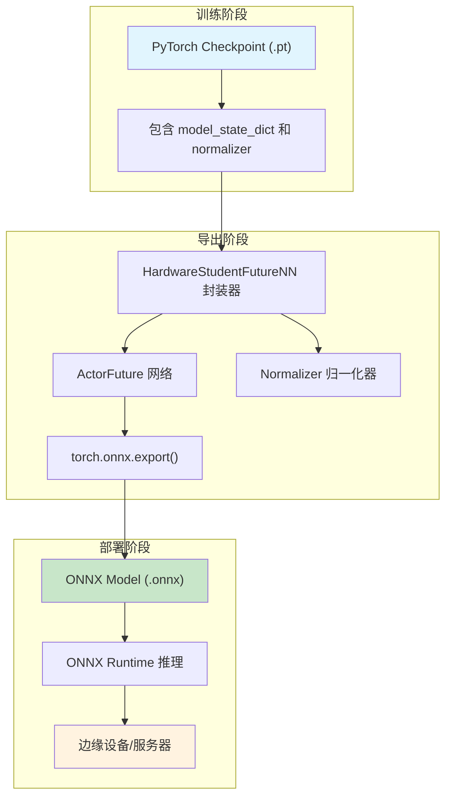
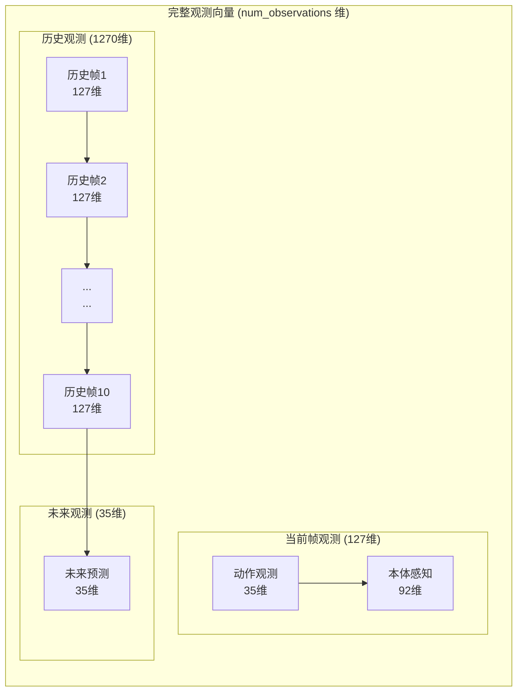
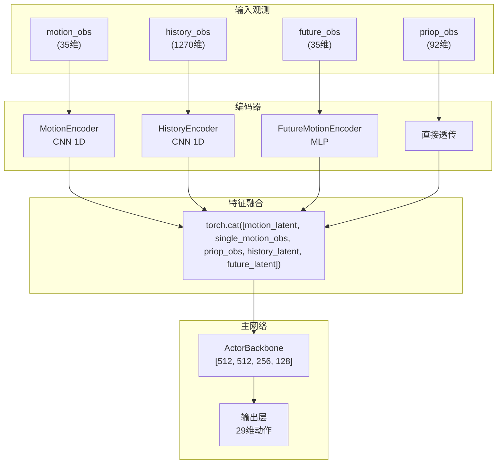
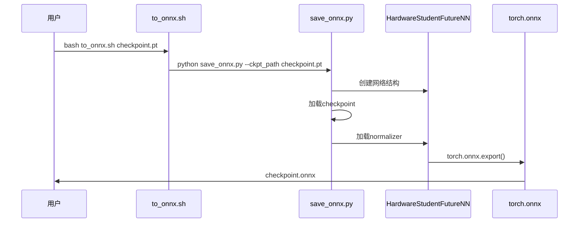
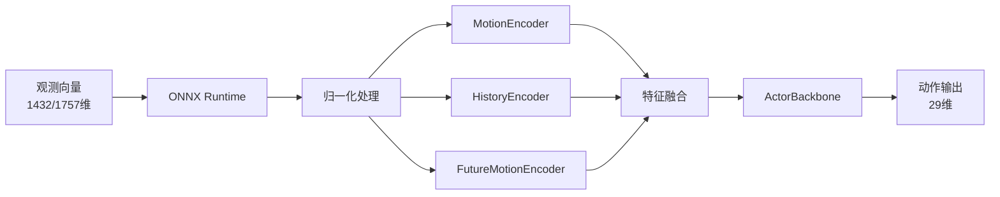

本页面详细说明TWIST2项目中如何将训练好的PyTorch策略模型导出为ONNX（Open Neural Network Exchange）格式，以便于在边缘设备或生产环境中进行高效推理部署。ONNX格式的模型可以被ONNX Runtime等高性能推理引擎加载执行，相比PyTorch原生推理具有更好的跨平台兼容性和推理性能。

## 导出架构概览

TWIST2的ONNX导出系统包含三个核心组件：策略网络封装、观测归一化器和导出脚本。整个导出流程遵循"加载→封装→转换"的三阶段模式，确保模型权重、归一化参数和网络结构完整迁移到ONNX格式中。



### 核心组件说明

| 组件 | 文件位置 | 功能描述 |
|------|----------|----------|
| HardwareStudentFutureNN | `legged_gym/legged_gym/scripts/save_onnx.py` | 部署封装器，整合归一化器与Actor网络 |
| ActorFuture | `rsl_rl/rsl_rl/modules/actor_critic_future.py` | 支持未来动作观测的策略网络 |
| Normalizer | `rsl_rl/rsl_rl/utils/normalizer.py` | 观测归一化器，存储均值和标准差 |
| 导出脚本 | `to_onnx.sh` | 一键导出Shell脚本 |

Sources: [save_onnx.py#L1-L192](legged_gym/legged_gym/scripts/save_onnx.py#L1-L192)
Sources: [actor_critic_future.py#L1-L200](rsl_rl/rsl_rl/modules/actor_critic_future.py#L1-L200)
Sources: [normalizer.py#L1-L119](rsl_rl/rsl_rl/utils/normalizer.py#L1-L119)

## 观测空间结构

导出的ONNX模型接收包含多模态信息的观测向量。理解观测空间结构对于正确准备模型输入至关重要。TWIST2的G1学生策略采用混合观测架构，融合动作参考、本体感知、历史记忆和未来预测信息。

### 观测向量维度配置

```python
# G1学生策略的标准观测维度配置
num_actions = 29                    # 机器人关节数量
history_len = 10                    # 历史帧长度
num_motion_steps = 1               # 动作观测时间步
num_motion_observations = 35        # 单帧动作观测维度
num_priop_observations = 92        # 本体感知观测维度
num_future_steps = 1               # 未来观测时间步
num_future_observations = 35        # 未来观测维度

# 单帧观测维度
n_obs_single = num_motion_observations + num_priop_observations  # 35 + 92 = 127

# 总观测维度
num_observations = n_obs_single * (history_len + 1) + num_future_observations  # 127 * 11 + 35 = 1432
```

上述计算结果1432维是模型的输入维度，但实际训练配置中观测维度可能为1757维（包含额外的未来预测信息）。建议从checkpoint文件中直接读取准确的观测维度配置。

Sources: [save_onnx.py#L73-L97](legged_gym/legged_gym/scripts/save_onnx.py#L73-L97)

### 观测向量布局



## ActorFuture网络架构

ActorFuture是TWIST2中支持未来动作观测的核心策略网络，采用多编码器架构处理不同类型的观测输入。每个编码器将高维时序数据压缩为固定维度的潜在表示，最后通过主MLP网络输出动作。



### 编码器详细规格

**MotionEncoder** 使用1D卷积网络编码动作观测，支持不同时间步长配置：
- tsteps=50：3层卷积，逐步降采样
- tsteps=10：2层卷积
- tsteps=1：直接展平，无卷积

**HistoryEncoder** 与MotionEncoder结构对称，用于提取历史观测的时序特征。

**FutureMotionEncoder** 是简化的MLP编码器，将未来观测展平后通过3层全连接网络编码：
```python
self.encoder = nn.Sequential(
    nn.Linear(total_input_size, 256),
    activation_fn,
    nn.Dropout(dropout),
    nn.Linear(256, 128),
    activation_fn,
    nn.Dropout(dropout),
    nn.Linear(128, output_size)
)
```

Sources: [actor_critic_future.py#L50-L180](rsl_rl/rsl_rl/modules/actor_critic_future.py#L50-L180)
Sources: [actor_critic_future.py#L300-L480](rsl_rl/rsl_rl/modules/actor_critic_future.py#L300-L480)

## 导出脚本使用指南

### 快速开始

使用项目提供的一键导出脚本是最简便的方式：

```bash
# 基本用法
bash to_onnx.sh /path/to/your/checkpoint.pt

# 示例：导出20k步数的检查点
bash to_onnx.sh /home/huanghao/source/code/TWIST2/logs/g1_stu_future/exp_001/model_20000.pt
```

脚本会自动将`.pt`文件转换为同目录下的`.onnx`文件。

Sources: [to_onnx.sh#L1-L12](to_onnx.sh#L1-L12)

### 导出参数详解

导出脚本内部调用的核心参数如下表所示：

| 参数 | 值 | 说明 |
|------|-----|------|
| batch_size | 1 | 推理批次大小 |
| opset_version | 11 | ONNX算子集版本 |
| export_params | True | 导出模型参数 |
| do_constant_folding | True | 常量折叠优化 |
| input_names | ['input'] | 输入张量名称 |
| output_names | ['output'] | 输出张量名称 |
| dynamic_axes | batch维度 | 支持动态批次 |

Sources: [save_onnx.py#L170-L185](legged_gym/legged_gym/scripts/save_onnx.py#L170-L185)

### 导出流程详解



## ONNX模型推理

### 评估脚本加载ONNX

TWIST2提供了统一的模型评估脚本，支持自动检测模型格式并加载：

```bash
# 评估ONNX模型
python evaluate_model.py \
    --model_path /path/to/model.onnx \
    --motion_config /path/to/motion_config.yaml \
    --task g1_stu_future \
    --device cuda:0 \
    --num_envs 256
```

评估脚本内部通过`OnnxPolicyWrapper`类封装ONNX Runtime会话，实现与PyTorch模型统一的调用接口：

Sources: [evaluate_model.py#L73-L95](evaluate_model.py#L73-L95)
Sources: [evaluate_model.py#L600-L700](evaluate_model.py#L600-L700)

### ONNX Runtime加载代码

```python
import onnxruntime as ort

# 配置执行提供者
providers = []
if device.startswith('cuda'):
    providers.append('CUDAExecutionProvider')
providers.append('CPUExecutionProvider')

# 创建推理会话
session = ort.InferenceSession(model_path, providers=providers)
input_name = session.get_inputs()[0].name

# 执行推理
def infer(obs):
    obs_np = obs.astype(np.float32)
    outputs = session.run(None, {input_name: obs_np})
    return outputs[0]
```

Sources: [evaluate_model.py#L73-L90](evaluate_model.py#L73-L90)

### ONNX模型推理流程



## 预训练ONNX模型

项目在`assets/ckpts/`目录下提供了预训练的ONNX模型供直接使用：

| 模型文件 | 大小 | 训练步数 | 说明 |
|----------|------|----------|------|
| twist2_1017_20k.onnx | 3.1MB | 20,000 | 早期版本 |
| twist2_1017_25k.onnx | 3.1MB | 25,000 | 推荐使用 |

Sources: [目录结构](assets/ckpts/)

## 常见问题与解决方案

### 问题1：观测维度不匹配

**症状**：导出或推理时出现维度错误。

**解决方案**：检查checkpoint中的观测维度配置，或通过评估脚本的自动推断功能：

```python
# 从checkpoint推断观测维度
loaded_dict = torch.load(ckpt_path, map_location='cuda', weights_only=False)
state_dict = loaded_dict.get('model_state_dict', loaded_dict)
num_observations = state_dict['actor.actor_backbone.0.weight'].shape[1]
```

### 问题2：归一化器未正确加载

**症状**：推理输出异常或精度下降。

**解决方案**：确保`load_normalizer`方法被正确调用，且归一化参数（均值和标准差）与训练时一致。ONNX模型导出时会将归一化逻辑嵌入模型中。

### 问题3：ONNX Runtime版本兼容性

**症状**：无法加载导出的ONNX模型。

**解决方案**：安装与opset_version匹配的ONNX Runtime版本：

```bash
# GPU版本
pip install onnxruntime-gpu

# CPU版本
pip install onnxruntime
```

## 进阶：自定义导出配置

如需导出不同配置的模型，可修改`save_onnx.py`中的参数：

```python
# 自定义网络架构参数
actor_hidden_dims = [512, 512, 256, 128]  # 主网络隐藏层
motion_latent_dim = 128                     # 动作编码维度
history_latent_dim = 128                    # 历史编码维度
future_latent_dim = 128                     # 未来编码维度
activation = 'silu'                         # 激活函数

# 自定义观测配置
num_motion_steps = 1                        # 动作时间步
num_history_steps = 10                     # 历史帧数
num_future_steps = 1                        # 未来时间步
```

## 下一步学习路径

完成ONNX模型导出后，建议继续阅读以下文档：

- [评估与可视化](24-ping-gu-yu-ke-shi-hua) — 了解如何使用导出的模型进行仿真评估
- [Sim2Sim仿真验证](14-sim2simfang-zhen-yan-zheng) — 在仿真环境中验证模型性能
- [Sim2Real实物部署](15-sim2realshi-wu-bu-shu) — 将模型部署到真实机器人