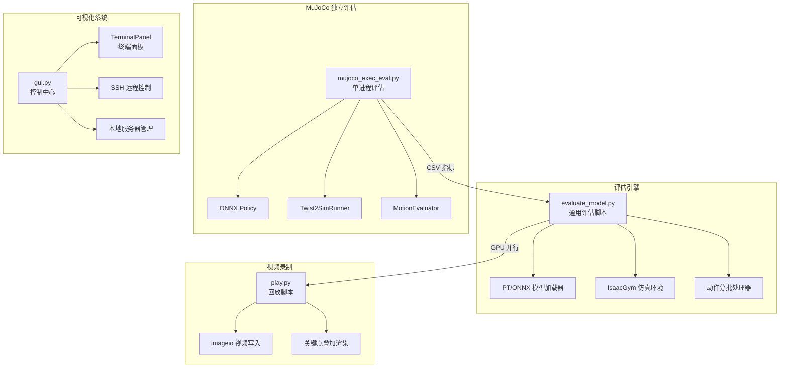
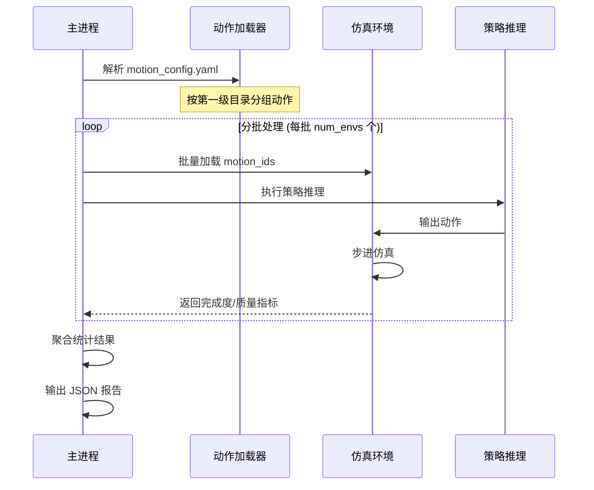
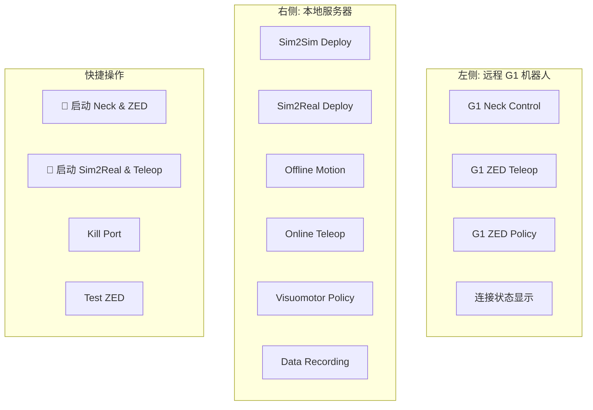

TWIST2 提供了一套完整的模型评估与可视化工具链，支持多格式模型（PT/ONNX）、多种架构（MLP/MoE/Transformer）的统一评估，并配备交互式图形界面进行实时监控与控制。

## 系统架构总览

TWIST2 评估与可视化系统由四个核心组件构成，分别负责模型加载、仿真执行、指标计算和结果展示。



Sources: [evaluate_model.py](evaluate_model.py#L1-L100), [tools/mujoco_exec_eval.py](tools/mujoco_exec_eval.py#L1-L100), [gui.py](gui.py#L1-L100)

## 核心评估指标体系

TWIST2 采用多维度评分体系，综合评估策略的动作完成度与运动质量。

### 完成度评分

**评分公式**：`得分 = (实际执行时间 / 动作总时长) × 100`

该指标衡量策略完成指定动作的能力，满分100分表示动作完整执行，低于100分表示中途失败。

| 失败类型 | 触发条件 | 说明 |
|---------|---------|------|
| 非法接触 | 膝盖触地检测 | 机器人与地面发生非预期接触 |
| 高度偏差 | pelvis_z < 0.55m | 机器人重心过低 |
| 姿态失控 | roll/pitch > 60° | 身体倾斜角度过大 |
| 跟踪失败 | 关键点误差超限 | 姿态跟踪误差过大 |

Sources: [evaluate_model.py](evaluate_model.py#L850-L950), [tools/mujoco_exec_eval.py](tools/mujoco_exec_eval.py#L1800-L1900)

### 质量评分

质量评分通过加权组合多个跟踪误差指标计算：

| 误差类型 | 阈值 | 权重 | 计算方式 |
|---------|------|------|---------|
| 关键点位置 | 0.35m | 30% | 标准化误差 × 权重 |
| 根节点平移 | 0.30m | 20% | 标准化误差 × 权重 |
| 根节点旋转 | 1.00rad | 15% | 标准化误差 × 权重 |
| 关节位置 | 0.35rad | 15% | 标准化误差 × 权重 |
| 根节点速度 | 1.50m/s | 10% | 标准化误差 × 权重 |
| 关节速度 | 2.50rad/s | 5% | 标准化误差 × 权重 |
| 角速度 | 3.00rad/s | 5% | 标准化误差 × 权重 |

Sources: [evaluate_model.py](evaluate_model.py#L808-L850)

### 综合排序分

最终排序得分按 70% 完成度 + 30% 质量评分加权计算：

```python
ranking_score = 0.70 × completion_score + 0.30 × quality_score
```

## 通用评估脚本

`evaluate_model.py` 是 TWIST2 的核心评估脚本，支持多种模型架构的统一评测。

### 基本用法

```bash
# 评估 PyTorch 模型
python evaluate_model.py \
    --model_path /path/to/model.pt \
    --motion_config /path/to/motion_config.yaml \
    --task g1_stu_future \
    --device cuda:0

# 评估 ONNX 模型
python evaluate_model.py \
    --model_path /path/to/model.onnx \
    --motion_config /path/to/motion_config.yaml \
    --task g1_stu_future
```

Sources: [evaluate_model.py](evaluate_model.py#L1-L50)

### 关键参数说明

| 参数 | 默认值 | 说明 |
|------|--------|------|
| `--model_path` | 必需 | 模型文件路径，支持 .pt 和 .onnx 格式 |
| `--motion_config` | 必需 | 动作配置文件（YAML格式） |
| `--task` | g1_stu_future | 任务名称，自动从模型路径推断 |
| `--device` | cuda:0 | 计算设备 |
| `--num_envs` | 256 | 并行环境数量，显存不足时可降低 |
| `--max_steps` | 5000 | 最大模拟步数 |
| `--output_dir` | ./eval_results | 结果输出目录 |
| `--headless` | False | 无头模式运行 |

Sources: [evaluate_model.py](evaluate_model.py#L600-L700)

### 模型架构自动检测

脚本能够自动从 checkpoint 权重中推断模型架构类型：

```python
# 检测逻辑
has_transformer = 'transformer' in state_dict_keys
has_moe = 'experts' in state_dict_keys or 'gating' in state_dict_keys
is_mlp = not has_transformer and not has_moe and 'actor_backbone.0.weight' in state_dict_keys
```

支持的架构类型：

| 架构 | 策略类 | 特征检测 |
|------|--------|---------|
| MLP | ActorCritic / ActorCriticMimic | 无 transformer/moe 关键字 |
| MoE | ActorCriticFuture (use_moe=True) | 包含 experts/gating 层 |
| Transformer | ActorCriticFuture (use_transformer=True) | 包含 transformer 关键字 |

Sources: [evaluate_model.py](evaluate_model.py#L270-L350)

## 批量动作评估流程

评估脚本采用分批处理策略，高效评估大量动作数据。



Sources: [evaluate_model.py](evaluate_model.py#L600-L800)

### 评估结果输出格式

```json
{
  "model_info": {
    "path": "/path/to/model.pt",
    "name": "model_15000",
    "type": "pt",
    "steps": 15000
  },
  "overall": {
    "completion_score": {
      "mean": 85.3,
      "std": 12.1,
      "min": 20.0,
      "max": 100.0,
      "count": 49706
    }
  },
  "motion_groups": {
    "AMASS_numpy123": {
      "count": 12345,
      "completion_score": {"mean": 87.2, "std": 10.5}
    }
  }
}
```

Sources: [evaluate_model.py](evaluate_model.py#L900-L1000)

## MuJoCo 独立评估工具

`tools/mujoco_exec_eval.py` 提供基于 MuJoCo 的轻量级评估，无需 IsaacGym 环境即可评测模型。

### 使用示例

```bash
python tools/mujoco_exec_eval.py \
    --motion_yaml legged_gym/motion_data_configs/humanoid_wbc_gmr_30fps_mix.yaml \
    --out_csv ./outputs/twist2_exec_metrics.csv \
    --policy_path assets/ckpts/twist2_1017_20k.onnx \
    --xml_path assets/g1/g1_sim2sim_29dof.xml \
    --device cpu \
    --workers 16
```

Sources: [tools/mujoco_exec_eval.py](tools/mujoco_exec_eval.py#L1-L60)

### 关键组件

| 组件 | 职责 |
|------|------|
| `Twist2SimRunner` | MuJoCo 仿真运行器，管理模型加载和仿真步进 |
| `MotionEvaluator` | 动作评估器，计算跟踪误差指标 |
| `OnnxPolicy` / `TorchPolicy` | 策略推理封装，统一模型调用接口 |

Sources: [tools/mujoco_exec_eval.py](tools/mujoco_exec_eval.py#L1100-L1300)

### CSV 输出指标

| 字段 | 说明 |
|------|------|
| `status` | ok / too_short / error |
| `core_coverage` | 核心段覆盖比例 |
| `core_progress_to_fail` | 到失败位置的进度 |
| `root_pos_mean_l2_m` | 根节点位置 L2 误差 |
| `root_rot_mean_deg` | 根节点旋转角度误差 |
| `joint_dof_mean_l1` | 关节位置 L1 误差 |
| `fk_rel_mean_l2_m` | 前向运动学相对误差 |

Sources: [tools/mujoco_exec_eval.py](tools/mujoco_exec_eval.py#L1850-L1950)

## Shell 评估脚本

TWIST2 提供三个便捷的 Shell 包装脚本，简化常见评估场景。

### eval_model.sh

通用模型测评脚本，自动推断任务类型：

```bash
# 基本用法
bash eval_model.sh /path/to/model.pt

# 指定 GPU
bash eval_model.sh /path/to/model.pt 1
```

Sources: [eval_model.sh](eval_model.sh#L1-L73)

### eval_motions.sh

动作库批量评估脚本：

```bash
# 使用默认配置
bash eval_motions.sh assets/ckpts/twist2_1017_25k.onnx

# 自定义配置
bash eval_motions.sh \
    assets/ckpts/twist2_policy.onnx \
    ./legged_gym/motion_data_configs/custom.yaml \
    512 \
    cuda:1
```

Sources: [eval_motions.sh](eval_motions.sh#L1-L61)

### eval.sh

快速动作验证脚本：

```bash
bash eval.sh 1002_twist2 cuda:1
```

Sources: [eval.sh](eval.sh#L1-L34)

## IsaacGym 回放与视频录制

`legged_gym/legged_gym/scripts/play.py` 提供 IsaacGym 环境下的策略回放和视频录制功能。

### 基本用法

```bash
cd legged_gym/legged_gym/scripts

python play.py \
    --task g1_stu_future \
    --proj_name g1_stu_future \
    --exptid 1002_twist2 \
    --num_envs 1 \
    --record_video \
    --device cuda:0
```

Sources: [legged_gym/legged_gym/scripts/play.py](legged_gym/legged_gym/scripts/play.py#L1-L50)

### 视频录制参数

| 参数 | 说明 |
|------|------|
| `--record_video` | 启用视频录制 |
| `--record_motion_ids` | 指定录制动作ID（如 "0,3,10-20"） |
| `--record_num_motions` | 随机录制动作数量 |
| `--random` | 随机打乱动作顺序 |
| `--record_video_name` | 输出视频文件名 |
| `--split_videos` | 每个环境单独输出视频 |

Sources: [legged_gym/legged_gym/scripts/play.py](legged_gym/legged_gym/scripts/play.py#L400-L550)

### 关键点可视化叠加

视频录制时支持在画面上叠加关键点标记，便于对比策略输出与参考动作：

```python
def _overlay_keypoints(img, env, env_i: int):
    # GT 关键点（红色圆环）
    gt_bgr = (0, 0, 255)
    # 策略关键点（绿色实心圆）
    pol_bgr = (0, 255, 0)
    # 局部坐标系 GT（蓝色实心圆）
    gt_local_bgr = (255, 0, 0)
```

Sources: [legged_gym/legged_gym/scripts/play.py](legged_gym/legged_gym/scripts/play.py#L250-L350)

## 控制中心图形界面

`gui.py` 提供交互式图形界面，集成了远程机器人控制和本地服务器管理功能。

### 界面布局



Sources: [gui.py](gui.py#L400-L600)

### 主题系统

GUI 支持多种视觉主题，包括：

| 主题 | 主色 | 风格 |
|------|------|------|
| Dark Blue | #1f538d | 深色专业 |
| Cyberpunk | #00ffff | 赛博朋克 |
| Neon | #39ff14 | 霓虹风格 |
| EVA Unit-01 | #4A148C | 紫色 EVA |
| NERV | #000000 | 黑红 NERV |

Sources: [gui.py](gui.py#L30-L100)

### 终端面板功能

每个服务面板提供以下控制功能：

- **START**: 启动服务进程
- **KILL**: 终止服务进程
- **CLEAR**: 清空输出日志
- **状态指示**: OFFLINE / ONLINE / ERROR / STARTING
- **实时输出**: 彩色终端输出显示

Sources: [gui.py](gui.py#L150-L250)

### SSH 远程控制

GUI 支持通过 SSH 连接远程 G1 机器人：

```python
def _build_ssh_command(self, remote_command: str) -> list:
    cmd = ["ssh", "-o", "StrictHostKeyChecking=no", "-o", "LogLevel=ERROR", "g1", remote_command]
    return cmd
```

Sources: [gui.py](gui.py#L280-L300)

## 抖动分析工具

`tools/analyze_jitter_log.py` 分析控制输出的平滑性，检测潜在抖动问题。

### 使用方法

```bash
python tools/analyze_jitter_log.py \
    --log /path/to/play_log.json \
    --meta /path/to/play_log_meta.json \
    --out /tmp/twist2_jitter_analysis
```

### 分析指标

| 指标 | 说明 | 典型问题 |
|------|------|---------|
| `delta_action_l2` | 动作变化率 | 高频抖动 |
| `dof_vel_l2` | 关节速度 | 关节震荡 |
| `torque_l2_series` | 关节扭矩 | 力矩波动 |
| 主导频率 | 频谱分析 | 机械共振 |

Sources: [tools/analyze_jitter_log.py](tools/analyze_jitter_log.py#L1-L179)

## 评估结果解读指南

### 结果文件结构

```
eval_results/
├── g1_stu_future_run_model_15000.json    # 通用评估结果
├── twist2_exec_metrics.csv               # MuJoCo 评估结果
└── twist2_jitter_analysis/               # 抖动分析结果
    ├── summary.json
    └── summary.txt
```

### 关键性能指标判断

| 完成度均值 | 质量评估 | 建议 |
|-----------|---------|------|
| > 90% | > 85% | 优秀，可部署测试 |
| 80-90% | 75-85% | 良好，需针对性优化 |
| 70-80% | 65-75% | 一般，需改进训练 |
| < 70% | < 65% | 较差，检查模型/配置 |

### 常见失败模式分析

| 失败类型 | 可能原因 | 解决方向 |
|---------|---------|---------|
| fell_pelvis_z | 平衡控制不足 | 增加平衡奖励权重 |
| fell_angle | 姿态跟踪偏差大 | 检查参考动作质量 |
| nan_or_inf | 数值不稳定 | 检查归一化配置 |

Sources: [tools/mujoco_exec_eval.py](tools/mujoco_exec_eval.py#L1800-L1850)

## 下一步

完成模型评估后，建议继续阅读以下章节：

- [ONNX模型导出](23-onnxmo-xing-dao-chu) - 了解如何将训练好的模型导出为 ONNX 格式进行部署
- [Sim2Sim仿真验证](14-sim2simfang-zhen-yan-zheng) - 在仿真环境中验证模型效果
- [GUI图形界面](25-guitu-xing-jie-mian) - 深入了解 GUI 的完整功能