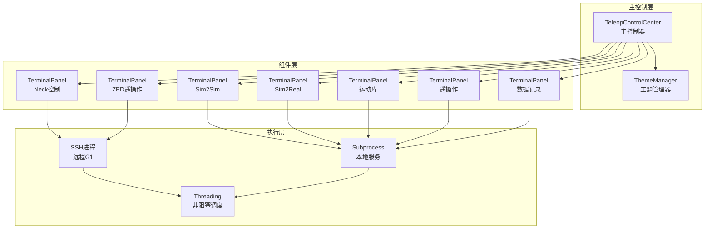

TWIST2提供了一个功能完整的遥操作控制中心（Teleop Control Center），基于CustomTkinter构建现代化图形界面，实现对G1机器人远程控制与本地服务的统一管理。该界面采用双栏布局，左侧面板通过SSH管理远程G1机器人，右侧面板则控制本地部署服务器，两侧均使用统一的`TerminalPanel`组件实现进程管理与实时输出监控。

## 系统架构设计

GUI采用三层架构模式：最顶层为`TeleopControlCenter`主控制器，负责整体布局协调与跨组件状态同步；中间层包含`ThemeManager`主题管理器和`TerminalPanel`终端面板组件，分别处理界面样式和进程生命周期；底层则是subprocess进程管理与threading线程调度系统，确保UI保持响应性的同时完成后台命令执行。



主控制器在初始化阶段创建双栏网格布局（1800x1100像素），左侧栏权重为1，右侧栏权重为2，体现远程控制优先的设计理念。每个TerminalPanel实例独立管理其进程状态，通过队列机制将子进程输出安全地传递回主线程进行UI更新。

Sources: [gui.py](gui.py#L406-L438)

## 主题系统

`ThemeManager`类实现了多主题支持架构，当前版本内置10种预定义主题：Dark Blue、Blue、Green等基础配色，以及Cyberpunk、Neon、Professional等特殊风格。主题系统定义了颜色配置结构，包含primary（主色）、success（成功）、danger（危险）、warning（警告）、accent（强调）和emergency（紧急）六个颜色通道。

EVA系列主题采用标志性的视觉语言：EVA Unit-01使用深紫色（#4A148C）作为主色配合绿色（#00E676）成功状态；EVA Unit-02以红色（#D32F2F）为主；NERV主题则采用全黑背景配红色警告的系统风格。主题切换时自动应用CustomTkinter的appearance模式和color_theme，同时返回自定义色彩配置供各组件使用。

| 主题名称 | 主色 | 成功色 | 危险色 | 紧急色 |
|---------|------|--------|--------|--------|
| Dark Blue | #1f538d | #4CAF50 | #f44336 | #ff1744 |
| Cyberpunk | #00ffff | #00ff41 | #ff0080 | #ff0040 |
| EVA Unit-01 | #4A148C | #00E676 | #FF1744 | #B71C1C |
| NERV | #000000 | #4CAF50 | #FF0000 | #FF0000 |

主题选择器位于界面顶部标题栏右侧，支持运行时切换但需重启应用以完全应用样式变更。主控制器的默认主题设置为EVA Unit-01，体现项目视觉识别的科幻美学取向。

Sources: [gui.py](gui.py#L16-L131)

## 终端面板组件

`TerminalPanel`是核心可复用组件，封装了进程启动、监控、终止的完整生命周期管理。每个面板实例维护独立的状态：进程对象`self.process`、运行标志`self.is_running`、输出队列`self.output_queue`以及进程组ID管理。

面板初始化时创建带圆角边框的CTkFrame容器，内部包含三区域结构：标题头区（显示面板名称和ONLINE/OFFLINE状态指示器）、控制按钮区（START/KILL/CLEAR三按钮）、命令显示区（展示实际执行的完整命令字符串）、以及输出文本区（实时显示进程stdout/stderr）。

进程启动逻辑区分本地与远程两种模式。本地启动通过`subprocess.Popen`执行命令，设置`preexec_fn=os.setsid`创建独立进程组便于后续管理；远程启动则构建SSH命令链，使用`-o StrictHostKeyChecking=no`跳过主机密钥验证。输出监控在独立线程中运行，通过`readline()`逐行读取进程输出并放入队列，主线程使用`after_idle`回调安全地插入文本控件。

进程终止采用两级信号策略：首先发送SIGTERM信号，若进程在1秒内未退出则升级为SIGKILL强制终止。面板支持自定义清理命令（`custom_kill_cmd`），在主进程终止后执行用于清理相关联的子进程或资源。

Sources: [gui.py](gui.py#L132-L404)

## 左侧面板：远程G1控制

左侧面板专注于通过SSH管理远程G1机器人上的服务组件，采用垂直堆叠布局包含三个主要终端面板以及快捷操作按钮区。面板设计强调连接状态的可视化反馈，底部集成G1连接状态指示器和SSH测试按钮。

Neck Control面板执行`bash ~/g1-onboard/docker_neck.sh`启动头部控制服务，关联的清理命令为`pkill -f neck_teleop.py`用于终止相关进程。ZED Teleop面板运行`bash ~/g1-onboard/docker_zed.sh`启动立体视觉遥操作，清理命令`pkill -9 OrinVideoSender`强制终止视频发送器。ZED Policy面板执行`bash ~/g1-onboard/docker_zed_policy.sh`部署视觉策略模型。

快捷操作区包含三个功能按钮：Kill Port按钮通过SSH执行`~/g1-onboard/kill_port.sh`脚本清理端口占用；Test ZED按钮执行`~/g1-onboard/test_zed.sh`验证ZED相机连接状态；Start Neck & ZED Teleop按钮实现一键启动功能，依次启动Neck和ZED两个服务并间隔1秒顺序执行避免资源竞争。

G1连接状态通过异步线程执行SSH测试命令实现实时检测，测试超时设置为5秒，连接成功时状态标签显示"G1 ONLINE"（绿色），失败时显示"G1 OFFLINE"（红色）。

Sources: [gui.py](gui.py#L500-L600)

## 右侧面板：本地服务器管理

右侧面板采用三列网格布局组织本地部署服务，按功能分为Low Level（低层控制）、High Level（高层规划）和Record（数据记录）三个分类区域，每列使用彩色标题栏标识功能域。

**Low Level列**包含Sim2Sim Deploy和Sim2Real Deploy两个面板。Sim2Sim执行`bash sim2sim.sh`，该脚本加载Mujoco仿真环境（g1_sim2sim_29dof.xml）配合ONNX策略模型（twist2_1017_20k.onnx），以100Hz策略频率运行并通过viewer_decimation=100降低渲染开销用于快速验证。Sim2Real执行`bash sim2real.sh`，启动`server_low_level_g1_real.py`连接实际G1机器人，通过`--device cuda`指定GPU推理，`--use_hand`启用灵巧手控制。

**High Level列**包含三个面板。Offline Motion运行`bash run_motion_server.sh`启动运动库服务器，加载示例运动文件通过Redis共享运动轨迹数据，默认监听localhost。Online Teleop执行`bash teleop.sh`启动遥操作客户端，通过Redis接收人体动作数据并转换为机器人关节指令，默认配置actual_human_height=1.6m以补偿深度估计误差。Visuomotor Policy Deploy运行视觉运动策略部署脚本。

**Record列**包含Data Recording面板，执行`bash data_record.sh`启动数据记录服务，以30Hz频率采集机器人状态数据并存储用于后续训练。

一键启动按钮"Start Sim2Real Deploy & Teleop & Record"顺序激活这三个高层服务，服务间同样采用1秒间隔确保依赖关系正确建立。

Sources: [gui.py](gui.py#L602-L713)

## 紧急停止与系统控制

界面顶栏右侧集成了Disable Firewall和Emergency Stop两个关键控制按钮。Emergency Stop按钮采用紧急色（emergency color）突出显示，尺寸明显大于常规按钮（250x55像素），触发时弹出确认对话框。

紧急停止逻辑遍历`self.all_panels`列表中的所有TerminalPanel实例，对每个处于运行状态（`is_running=True`）的面板调用`kill()`方法。该方法通过`os.killpg(os.getpgid(self.process.pid), signal.SIGTERM)`向整个进程组发送终止信号，确保不仅终止主进程，其派生出的所有子进程也会被一并清理。

Disable Firewall按钮执行`ufw disable`命令，需要sudo权限。GUI实现中硬编码了密码字符串（已做混淆处理），通过管道方式传递给sudo命令执行。该功能设计用于遥操作场景下确保网络通信畅通，属于便利性而非安全性最佳实践。

Sources: [gui.py](gui.py#L482-L498)
Sources: [gui.py](gui.py#L854-L859)
Sources: [gui.py](gui.py#L790-L813)

## 启动方式

GUI应用通过`gui.sh`启动脚本执行，激活conda环境后运行`gui.py`主模块。启动流程会依次创建界面组件、测试G1机器人连接状态，然后进入事件循环等待用户交互。

```bash
# gui.sh
source ~/miniconda3/bin/activate twist2
python gui.py
```

应用程序入口创建`TeleopControlCenter`实例并调用`run()`方法进入Tkinter主循环。推荐在具有图形显示的环境中运行，窗口尺寸1800x1100针对宽屏显示器优化。

## 后续步骤

- 深入了解[Sim2Real实物部署](15-sim2realshi-wu-bu-shu)流程，理解低层控制器与GUI的交互机制
- 参考[低层控制器](17-di-ceng-kong-zhi-qi)文档，了解`server_low_level_g1_real.py`的具体实现
- 查看[VR遥操作](16-vryao-cao-zuo)了解ZED视觉遥操作的技术细节