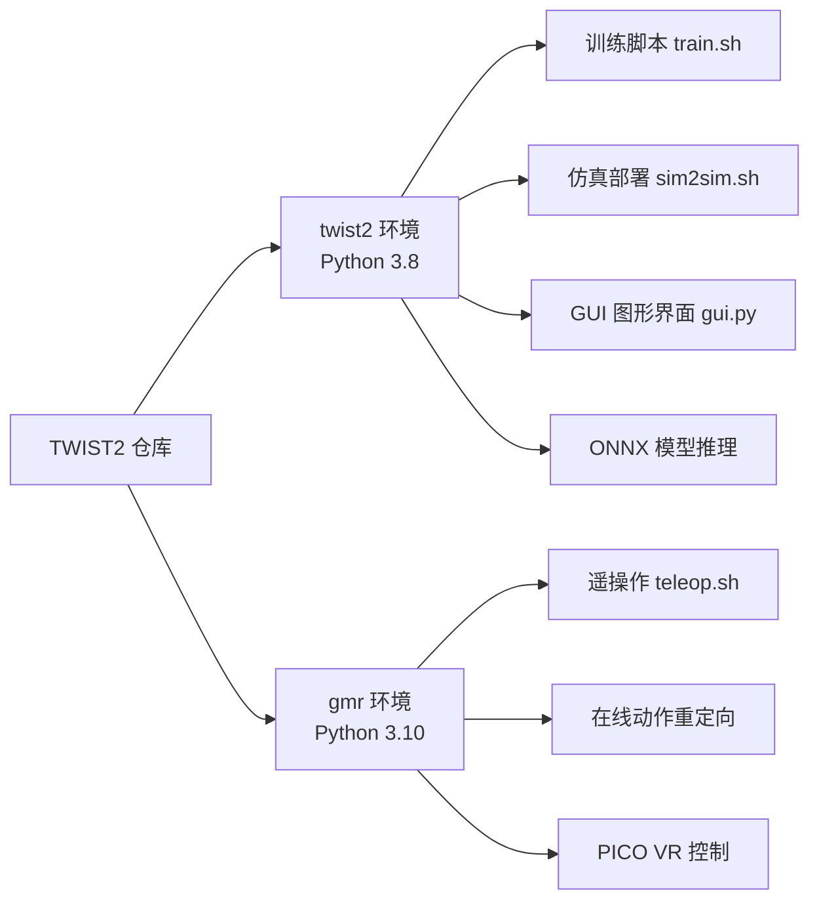
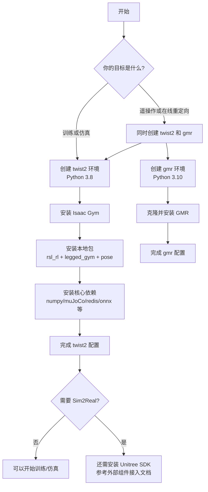

本文档为初学者详细介绍 TWIST2 项目的 Conda 环境配置方案。TWIST2 采用**双环境架构**设计，这种设计不是随意为之，而是基于 Isaac Gym（需要 Python 3.8）与在线动作重定向（需要 Python 3.10+）之间的版本兼容性要求。

Sources: [README.md](README.md#L31-L56), [CLAUDE.md](CLAUDE.md#L16-L23)

## 为什么需要两个 Conda 环境

理解"双环境"的设计意图是避免初学者踩坑的第一步。仓库明确将 `twist2` 环境用于控制器训练与部署，将 `gmr` 环境用于在线动作重定向。这个划分不仅写在 README 中，也能从训练脚本和遥操作脚本的激活命令得到印证。

Isaac Gym 是 NVIDIA 开发的物理仿真平台，它要求特定的 Python 版本（3.8）和 CUDA 环境。而 MuJoCo 等其他组件则支持更新的 Python 版本。为了同时满足训练需求和在线重定向需求，TWIST2 选择用两个独立环境来隔离不同组件的版本要求。



Sources: [README.md](README.md#L31-L56), [train.sh](train.sh#L12-L16), [teleop.sh](teleop.sh#L3-L4)

## 两个环境的职责划分

| 环境名 | Python 版本 | 主要职责 | 关联脚本 |
|--------|-------------|----------|----------|
| `twist2` | 3.8 | 控制器训练、仿真部署、ONNX 导出、GUI 运行 | `train.sh`, `sim2sim.sh`, `gui.sh` |
| `gmr` | 3.10 | 在线动作重定向、遥操作数据采集、PICO VR 遥操作 | `teleop.sh` |

Sources: [README.md](README.md#L31-L39), [train.sh](train.sh#L12-L16), [teleop.sh](teleop.sh#L1-L4), [gui.sh](gui.sh#L1-L2)

## 创建 twist2 环境

### 环境创建步骤

在终端执行以下命令创建 `twist2` 环境。Python 版本固定为 3.8 是因为 Isaac Gym 对 Python 版本有明确要求。

```bash
# 删除已存在的同名环境（如有）
conda env remove -n twist2

# 创建 Python 3.8 环境
conda create -n twist2 python=3.8

# 激活环境
conda activate twist2
```

创建完成后，使用 `python -V` 验证 Python 版本应为 `Python 3.8.x`。

Sources: [README.md](README.md#L34-L39), [train.sh](train.sh#L12-L16)

### 安装 Isaac Gym

Isaac Gym 是 TWIST2 的仿真基础平台。需要从 [NVIDIA 官方网站](https://developer.nvidia.com/isaac-gym) 下载 Isaac Gym 后安装。

```bash
# 进入 Isaac Gym 的 Python 目录
cd isaacgym/python && pip install -e .
```

Sources: [README.md](README.md#L42-L44)

### 安装本地可编辑包

TWIST2 包含三个核心本地 Python 包，它们使用 editable 安装模式，便于开发调试。这些包在 `setup.py` 中声明了各自依赖。

```bash
# 返回仓库根目录
cd /home/huanghao/source/code/TWIST2

# 依次安装三个核心包
cd rsl_rl && pip install -e . && cd ..
cd legged_gym && pip install -e . && cd ..
cd pose && pip install -e . && cd ..
```

`rsl_rl` 提供强化学习算法实现，`legged_gym` 定义仿真环境和训练脚本，`pose` 处理姿态与动作相关功能。每个包都可以独立开发修改，editable 安装确保修改即时生效。

Sources: [README.md](README.md#L46-L50), [rsl_rl/setup.py](rsl_rl/setup.py#L1-L17), [pose/setup.py](pose/setup.py#L1-L11)

### 安装核心依赖包

安装通用 Python 依赖。注意 `numpy` 版本被 README 明确固定为 1.23.0，这是为了确保数值计算的稳定性。

```bash
pip install "numpy==1.23.0" \
  pydelatin wandb tqdm opencv-python ipdb pyfqmr flask dill gdown \
  hydra-core imageio[ffmpeg] mujoco mujoco-python-viewer isaacgym-stubs \
  pytorch-kinematics rich termcolor zmq
```

各依赖的作用如下表所示：

| 依赖包 | 主要用途 |
|--------|----------|
| `numpy==1.23.0` | 数值计算（版本锁定确保稳定性） |
| `mujoco` + `mujoco-python-viewer` | MuJoCo 物理仿真与可视化 |
| `wandb` | 训练过程可视化与实验追踪 |
| `opencv-python` | 图像处理 |
| `rich` + `termcolor` | 命令行彩色输出 |
| `zmq` | 进程间通信 |

Sources: [README.md](README.md#L50-L52), [legged_gym/requirements.txt](legged_gym/requirements.txt#L1-L7)

### 安装部署相关依赖

对于模型部署和 GUI 使用，还需要安装以下依赖：

```bash
# Redis 通信（用于高低层控制器之间的数据传递）
pip install redis[hiredis]

# 语音播报（用于状态提示）
pip install pyttsx3

# ONNX 模型推理（用于部署已训练策略）
pip install onnx onnxruntime-gpu

# GUI 图形界面
pip install customtkinter
```

Sources: [README.md](README.md#L54-L56), [gui.py](gui.py#L1-L8), [deploy_real/robot_control/speaker.py](deploy_real/robot_control/speaker.py#L1-L10)

## 创建 gmr 环境

### 适用场景

当你准备进行以下操作时，需要创建 `gmr` 环境：
- 使用 PICO VR 头显进行遥操作
- 执行在线动作重定向
- 采集遥操作数据

如果仅进行离线训练或仿真验证，`twist2` 环境已足够使用。

Sources: [README.md](README.md#L129-L144), [teleop.sh](teleop.sh#L1-L4)

### 环境创建步骤

```bash
# 创建 Python 3.10 环境
conda create -n gmr python=3.10 -y

# 激活环境
conda activate gmr
```

Sources: [README.md](README.md#L129-L132)

### 安装 GMR

GMR（高斯混合回归）是动作重定向的核心模块，需要从外部仓库克隆安装：

```bash
# 克隆 GMR 仓库
git clone https://github.com/YanjieZe/GMR.git
cd GMR

# 以 editable 模式安装
pip install -e .
cd ..

# 安装 C++ 标准库
conda install -c conda-forge libstdcxx-ng -y
```

Sources: [README.md](README.md#L133-L144)

## 环境安装流程图



## 常见错误与排查

| 错误现象 | 可能原因 | 解决方案 |
|----------|----------|----------|
| `conda: command not found` | Miniconda 未安装或未配置 PATH | 安装 [Miniconda](https://docs.conda.io/en/latest/miniconda.html) 并重启终端 |
| 训练脚本报 `ModuleNotFoundError` | 未在正确环境中运行 | 确认已 `conda activate twist2`，检查脚本内的环境激活命令 |
| `teleop.sh` 启动失败 | 在 `twist2` 中运行了遥操作脚本 | 使用 `teleop.sh`，它会自动切换到 `gmr` 环境 |
| `libpython3.8.so.1.0` 找不到 | 动态库路径未配置 | 在 `train.sh` 中设置 `export LD_LIBRARY_PATH=$CONDA_PREFIX/lib` |

Sources: [train.sh](train.sh#L17-L18), [CLAUDE.md](CLAUDE.md#L155-L169)

## 验证安装是否成功

完成环境配置后，可通过以下命令验证：

```bash
# 验证 twist2 环境
conda activate twist2
python -c "import rsl_rl, legged_gym, pose; print('核心包导入成功')"
python -c "import customtkinter; print('GUI 依赖正常')"

# 验证 gmr 环境
conda activate gmr
python -c "import general_motion_retargeting; print('GMR 导入成功')"
```

Sources: [CLAUDE.md](CLAUDE.md#L155-L169)

## 下一步操作

环境配置完成后，你可以继续进行以下步骤：

| 目标 | 推荐页面 |
|------|----------|
| 验证安装是否正常工作 | [快速启动](2-kuai-su-qi-dong) |
| 了解 Isaac Gym、MuJoCo 等详细配置 | [依赖安装](4-yi-lai-an-zhuang) |
| 开始训练你的第一个策略 | [单GPU训练](8-dan-gpuxun-lian) |
| 了解系统整体架构 | [两层级控制架构](5-liang-ceng-ji-kong-zhi-jia-gou) |