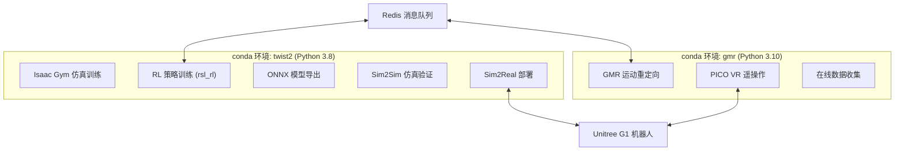

本页面详细介绍 TWIST2 项目所需的全部依赖安装步骤。该项目采用**双 conda 环境架构**，分别针对 Isaac Gym（需要 Python 3.8）和 MuJoCo/在线推理（需要 Python 3.10+）进行了优化。本指南面向初级开发者，每一步都包含详细说明和预期结果。

## 环境架构概览

TWIST2 是一个分层控制系统，包含运动重定向（GMR）、强化学习策略训练和实物机器人部署等多个组件。由于不同组件对 Python 版本有不同要求，项目维护两个独立的 conda 环境：



Sources: [README.md](README.md#L40-L120), [CLAUDE.md](CLAUDE.md#L12-L30)

## 前置条件

在开始安装之前，请确保系统满足以下要求：

| 要求项 | 最低版本 | 说明 |
|--------|----------|------|
| 操作系统 | Ubuntu 20.04+ | 推荐 22.04 |
| CUDA | 11.3+ | 用于 GPU 训练 |
| GPU 显存 | 8GB+ | 训练需要较大的显存 |
| 磁盘空间 | 50GB+ | Isaac Gym 和数据集较大 |
| 网络 | 稳定连接 | 下载 Isaac Gym 和数据集 |

Sources: [CLAUDE.md](CLAUDE.md#L1-L15)

---

## 第一步：创建 twist2 主环境

twist2 环境是项目的主要工作环境，用于策略训练、仿真和部署。

### 1.1 创建 conda 环境

```bash
# 删除已存在的同名环境（如果存在）
conda env remove -n twist2

# 创建新的 Python 3.8 环境
conda create -n twist2 python=3.8 -y

# 激活环境
conda activate twist2
```

**预期结果**：终端提示符前应显示 `(twist2)` 前缀，表示环境已激活。

### 1.2 安装 Isaac Gym

Isaac Gym 是 NVIDIA 提供的高性能物理仿真环境，用于训练人形机器人策略。

1. **下载 Isaac Gym**：访问 [NVIDIA Isaac Gym 官方下载页面](https://developer.nvidia.com/isaac-gym)，注册账号并下载 Isaac Gym for Linux

2. **解压并安装**：
```bash
# 解压下载的文件
cd ~/Downloads  # 或你下载的目录
tar -xzf isaacgym.tar.gz
cd isaacgym/python

# 安装为 Python 包
pip install -e .
```

**预期结果**：运行 `python -c "import isaacgym"` 无报错。

Sources: [README.md](README.md#L45-L52)

---

## 第二步：安装核心 Python 包

### 2.1 安装自定义包（Editable 模式）

TWIST2 包含三个核心自定义包，必须以 editable 模式安装以确保开发时修改即时生效：

```bash
# 安装 rsl_rl（强化学习算法库）
cd rsl_rl && pip install -e . && cd ..

# 安装 legged_gym（Isaac Gym 环境）
cd legged_gym && pip install -e . && cd ..

# 安装 pose（运动重定向库）
cd pose && pip install -e . && cd ..
```

**说明**：
- `rsl_rl` 包含 PPO 算法实现和 Actor-Critic 网络模块
- `legged_gym` 定义了 G1 机器人的仿真环境和奖励函数
- `pose` 提供从人体动作到机器人动作的重定向功能

Sources: [AGENTS.md](AGENTS.md#L8-L12)

### 2.2 安装第三方依赖包

```bash
pip install "numpy==1.23.0" pydelatin wandb tqdm opencv-python \
    ipdb pyfqmr flask dill gdown hydra-core imageio[ffmpeg] \
    mujoco mujoco-python-viewer isaacgym-stubs pytorch-kinematics \
    rich termcolor zmq
```

**关键依赖说明**：

| 包名 | 用途 |
|------|------|
| `numpy==1.23.0` | 数值计算，固定版本避免兼容性问题 |
| `wandb` | 实验跟踪和可视化 |
| `mujoco` | 备选物理引擎（用于可视化） |
| `mujoco-python-viewer` | MuJoCo 仿真可视化查看器 |
| `pytorch-kinematics` | 机器人运动学计算 |
| `hydra-core` | 配置管理系统 |

Sources: [README.md](README.md#L55-L62)

### 2.3 安装可选功能包

根据你的使用场景，选择性安装以下包：

```bash
# Redis 通信（Sim2Sim/Sim2Real 必需）
pip install redis[hiredis]

# 语音控制（可选）
pip install pyttsx3

# ONNX 推理（模型部署必需）
pip install onnx onnxruntime-gpu

# GUI 界面
pip install customtkinter
```

Sources: [README.md](README.md#L64-L68)

---

## 第三步：配置 Redis 服务器

Redis 是 TWIST2 分层控制系统中的消息中枢，负责高层运动服务器与低层控制器之间的通信。

### 3.1 安装 Redis

```bash
sudo apt update
sudo apt install -y redis-server

# 启用并启动服务
sudo systemctl enable redis-server
sudo systemctl start redis-server
```

### 3.2 配置 Redis 允许远程连接

```bash
# 编辑 Redis 配置文件
sudo nano /etc/redis/redis.conf
```

找到并修改以下配置项：

```ini
# 允许所有网络接口连接
bind 0.0.0.0

# 关闭保护模式
protected-mode no
```

保存文件后重启服务：

```bash
sudo systemctl restart redis-server
```

### 3.3 验证安装

```bash
# 测试 Redis 连接
redis-cli ping

# 预期输出：PONG
```

**注意**：如果你的计算机不需要与其他机器通信，可以跳过此步骤。但对于 Sim2Sim 仿真验证，Redis 是必需的。

Sources: [README.md](README.md#L70-L88)

---

## 第四步：安装 Unitree SDK（Sim2Real 可选）

如果你需要在真实机器人上部署策略，需要安装 Unitree SDK。

### 4.1 克隆 SDK 仓库

```bash
cd ..  # 返回到 TWIST2 的父目录
git clone https://github.com/YanjieZe/unitree_sdk2.git
cd unitree_sdk2
```

### 4.2 安装系统依赖

```bash
sudo apt-get update
sudo apt-get install build-essential cmake python3-dev python3-pip pybind11-dev
```

### 4.3 安装 Python 依赖并编译

```bash
# 安装 Python 依赖
pip install pybind11 pybind11-stubgen numpy

# 编译 Python 绑定
cd python_binding
export UNITREE_SDK2_PATH=$(pwd)/..
bash build.sh --sdk-path $UNITREE_SDK2_PATH
```

### 4.4 安装编译后的模块

```bash
# 获取 conda 环境的 site-packages 路径
SITE_PACKAGES=$(python -c "import site; print(site.getsitepackages()[0])")
echo "Installing to: $SITE_PACKAGES"

# 复制编译好的模块
sudo cp build/lib/unitree_interface.cpython-*-linux-gnu.so \
    $SITE_PACKAGES/unitree_interface.so

# 验证安装
python -c "import unitree_interface; print('✓ Unitree SDK 安装成功')"
```

**说明**：此 SDK 仅在使用笔记本电脑连接机器人时需要。如果使用机器人机载电脑直接部署，则不需要在笔记本电脑上安装此 SDK。

Sources: [README.md](README.md#L90-L115)

---

## 第五步：创建 GMR 环境（VR 遥操作可选）

GMR（General Motion Retargeting）环境用于在线运动重定向和 PICO VR 遥操作。由于 GMR 需要 Python 3.10+，我们使用独立的 conda 环境。

### 5.1 创建独立环境

```bash
# 创建 Python 3.10 环境
conda create -n gmr python=3.10 -y
conda activate gmr
```

### 5.2 安装 GMR 包

```bash
# 克隆 GMR 仓库
git clone https://github.com/YanjieZe/GMR.git
cd GMR

# 安装 GMR
pip install -e .
cd ..

# 安装 C++ 标准库（人形运动重定向需要）
conda install -c conda-forge libstdcxx-ng -y
```

Sources: [README.md](README.md#L117-L130)

### 5.3 安装 PICO SDK（如需 VR 遥操作）

PICO SDK 用于连接 PICO VR 头显进行遥操作。

**在 PICO 头显上**：
1. 安装 PICO SDK：参考 [XRoboToolkit-Unity-Client](https://github.com/XR-Robotics/XRoboToolkit-Unity-Client/releases/)

**在你的 PC 上**：
1. 下载 [Ubuntu 22.04 的 deb 包](https://github.com/XR-Robotics/XRoboToolkit-PC-Service/releases/download/v1.0.0/XRoboToolkit_PC_Service_1.0.0_ubuntu_22.04_amd64.deb)

2. 安装 deb 包：
```bash
sudo dpkg -i XRoboToolkit_PC_Service_1.0.0_ubuntu_22.04_amd64.deb
```

3. 启动 PC Service 应用（在应用列表中找到 `xrobotoolkit-pc-service` 并启动）

4. 编译 Python SDK：
```bash
conda activate gmr

git clone https://github.com/YanjieZe/XRoboToolkit-PC-Service-Pybind.git
cd XRoboToolkit-PC-Service-Pybind

mkdir -p tmp
cd tmp
git clone https://github.com/XR-Robotics/XRoboToolkit-PC-Service.git
cd XRoboToolkit-PC-Service/RoboticsService/PXREARobotSDK 
bash build.sh
cd ../../../../..

mkdir -p lib include
cp tmp/XRoboToolkit-PC-Service/RoboticsService/PXREARobotSDK/PXREARobotSDK.h include/
cp -r tmp/XRoboToolkit-PC-Service/RoboticsService/PXREARobotSDK/nlohmann include/nlohmann/
cp tmp/XRoboToolkit-PC-Service/RoboticsService/PXREARobotSDK/build/libPXREARobotSDK.so lib/

conda install -c conda-forge pybind11
pip uninstall -y xrobotoolkit_sdk
python setup.py install
```

Sources: [README.md](README.md#L132-L165)

---

## 验证安装

完成所有安装步骤后，运行以下命令验证环境是否正确配置：

```bash
# 激活 twist2 环境
conda activate twist2

# 验证核心导入
python -c "
import isaacgym
import mujoco
import torch
import redis
import onnxruntime
print('✓ Isaac Gym:', isaacgym.__version__)
print('✓ MuJoCo:', mujoco.__version__)
print('✓ PyTorch:', torch.__version__)
print('✓ CUDA available:', torch.cuda.is_available())
print('✓ Redis: OK')
print('✓ ONNX Runtime: OK')
"

# 验证自定义包
python -c "
import rsl_rl
import legged_gym
import pose
print('✓ rsl_rl: OK')
print('✓ legged_gym: OK')
print('✓ pose: OK')
"
```

**预期输出**：所有模块应显示 `OK` 或版本号，CUDA 应显示可用。

---

## 常见问题排查

| 问题 | 可能原因 | 解决方案 |
|------|----------|----------|
| `import isaacgym` 报错 | Isaac Gym 未正确安装 | 重新运行 `pip install -e .` 在 `isaacgym/python` 目录 |
| Redis 连接失败 | Redis 服务未启动或配置错误 | 检查 `redis-cli ping` 响应，确保 `protected-mode no` |
| CUDA 不可用 | PyTorch 未安装 CUDA 版本 | `pip install torch torchvision --index-url https://download.pytorch.org/whl/cu118` |
| ONNX 推理报错 | onnxruntime-gpu 未安装 | 确认 GPU 架构与 ONNX Runtime 版本兼容 |
| 环境导入冲突 | 两个 conda 环境同时激活 | 确保 `conda deactivate` 其他环境后再激活目标环境 |

Sources: [CLAUDE.md](CLAUDE.md#L185-L200)

---

## 环境快速参考表

| 任务 | 所需环境 | 关键依赖 |
|------|----------|----------|
| RL 策略训练 | twist2 | Isaac Gym, rsl_rl, legged_gym |
| Sim2Sim 仿真 | twist2 | Redis, mujoco-python-viewer |
| Sim2Real 部署 | twist2 | Unitree SDK, ONNX Runtime |
| ONNX 模型导出 | twist2 | onnx, onnxruntime-gpu |
| GMR 运动重定向 | gmr | GMR, pytorch-kinematics |
| PICO VR 遥操作 | gmr | XRoboToolkit SDK |

---

## 下一步

完成依赖安装后，建议按以下顺序继续学习：

1. [快速启动](2-kuai-su-qi-dong) - 了解项目的基本使用流程
2. [Sim2Sim仿真验证](14-sim2simfang-zhen-yan-zheng) - 在仿真环境中验证安装
3. [单GPU训练](8-dan-gpuxun-lian) - 开始训练你的第一个策略

如需详细了解训练脚本的使用方法，请参考 [训练脚本详解](12-xun-lian-jiao-ben-xiang-jie)。