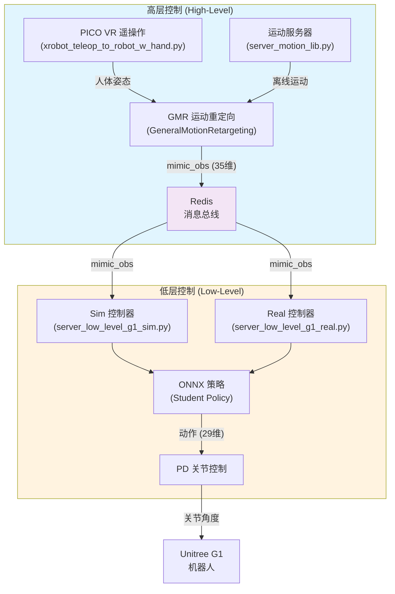
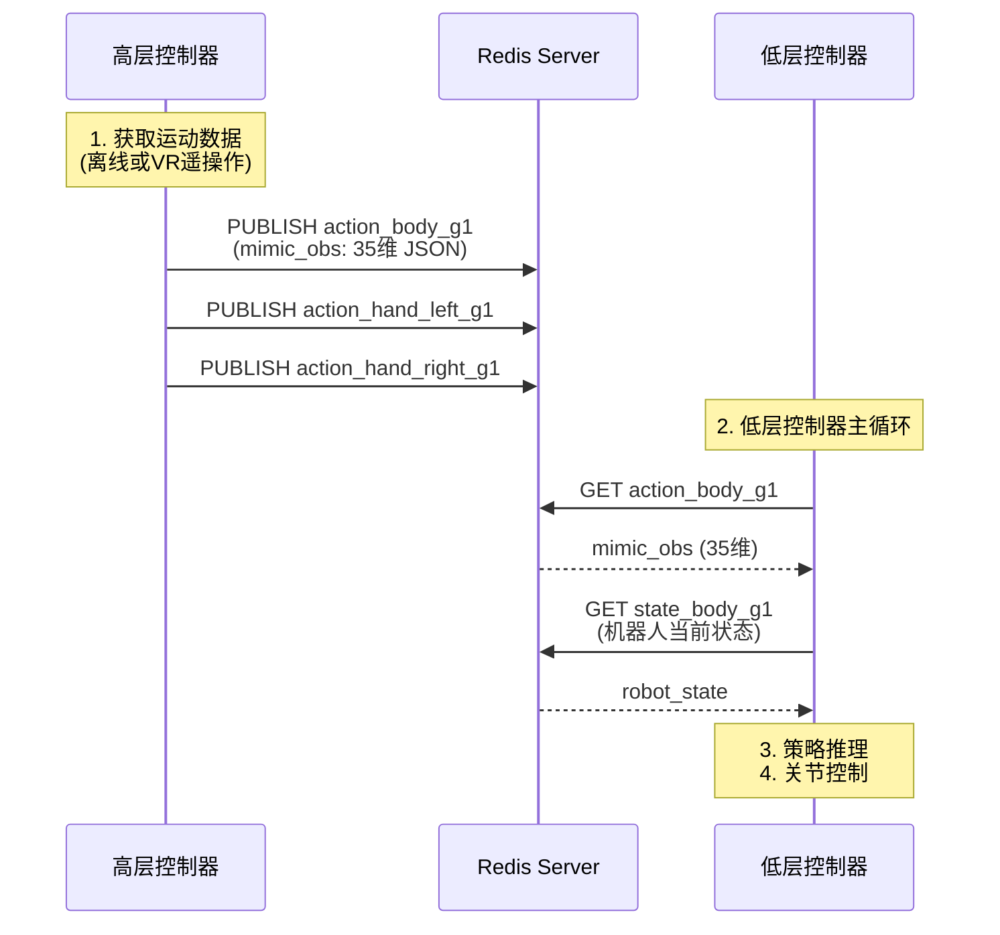
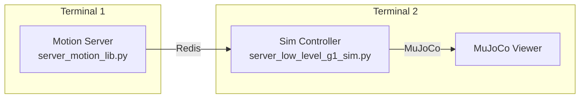
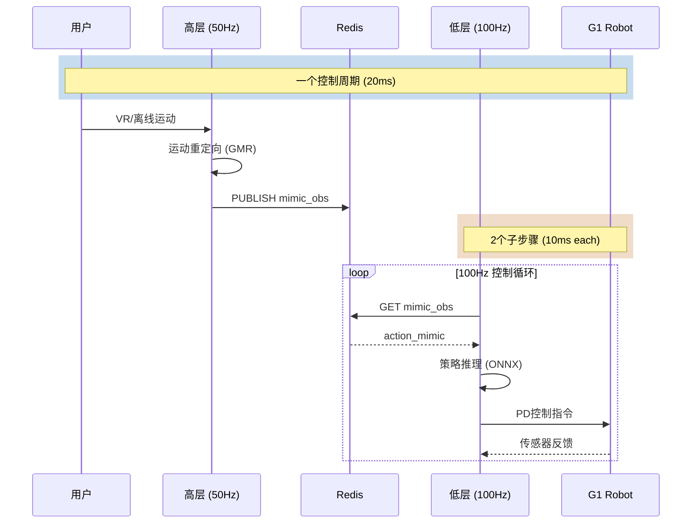

TWIST2 采用了经典的**高层-低层两级控制架构**（High-Level/Low-Level Hierarchical Control），将复杂的全身运动控制问题分解为两个相对独立的子系统。这种架构兼顾了**运动多样性**（高层）与**实时响应性**（低层），是当前人形机器人控制领域的主流范式。

## 架构概览



**设计理念**：高层控制器运行在**较慢的控制频率**（10-50Hz），负责"做什么"（运动目标）；低层控制器运行在**较快的控制频率**（100Hz+），负责"怎么做"（关节控制）。

Sources: [server_low_level_g1_sim.py](deploy_real/server_low_level_g1_sim.py#L82-L88), [server_motion_lib.py](deploy_real/server_motion_lib.py#L1-L50)

## 高层控制详解

高层控制的核心职责是**生成目标运动状态**（mimic_obs），通过两种方式获取：

### 运动服务器模式

运动服务器（`server_motion_lib.py`）从离线运动库中读取预录制的动作数据，经过**运动重定向**后发送给低层控制器。这种模式主要用于**仿真验证**和**批量数据采集**。

```python
# deploy_real/server_motion_lib.py
def build_mimic_obs(motion_lib, t_step, control_dt, tar_motion_steps, robot_type):
    """从 MotionLib 构建 mimic 观察"""
    motion_times = torch.tensor([t_step * control_dt], device=device).unsqueeze(-1)
    obs_motion_times = tar_motion_steps * control_dt + motion_times
    
    # 获取运动帧数据
    root_pos, root_rot, root_vel, root_ang_vel, dof_pos, dof_vel, body_pos = \
        motion_lib.calc_motion_frame(motion_ids, obs_motion_times)
    
    # 转换为局部坐标系
    root_vel_local = quat_rotate_inverse_torch(root_rot, root_vel)
    root_ang_vel_local = quat_rotate_inverse_torch(root_rot, root_ang_vel)
    
    # 构建 35 维 mimic_obs
    mimic_obs_buf = torch.cat((
        root_vel_local[..., :2],  # 2维: xy速度
        root_pos[..., 2:3],       # 1维: z高度
        roll, pitch,               # 2维: roll/pitch
        root_ang_vel_local[..., 2:3],  # 1维: yaw角速度
        dof_pos,                   # 29维: 关节位置
    ), dim=-1)
    return mimic_obs_buf
```

Sources: [server_motion_lib.py](deploy_real/server_motion_lib.py#L18-L65)

### VR 遥操作模式

遥操作模式使用 PICO VR 头显和手柄实现**实时人体运动捕捉与重定向**，支持整身控制（躯干+手臂+腿部）和灵巧手控制。

```python
# deploy_real/xrobot_teleop_to_robot_w_hand.py
class StateMachine:
    """状态机管理遥操作流程"""
    def __init__(self):
        self.state = "idle"  # idle -> teleop -> pause -> teleop ... -> exit
        self.velocity_commands = np.array([0.0, 0.0, 0.0])  # [vx, vy, vyaw]
        
def extract_mimic_obs_whole_body(qpos, last_qpos, dt=1/30):
    """从机器人关节位置提取 35 维 mimic 观察"""
    mimic_obs = np.concatenate([
        base_vel_local[:2],        # xy 速度
        root_pos[2:3],             # z 高度
        roll, pitch,               # roll/pitch
        base_ang_vel_local[2:3],   # yaw 角速度
        robot_joints              # 29 关节位置
    ])
    return mimic_obs
```

Sources: [xrobot_teleop_to_robot_w_hand.py](deploy_real/xrobot_teleop_to_robot_w_hand.py#L1-L120)

### Mimic Observation 结构

mimic_obs 是连接高层与低层的**核心数据接口**，共 35 维：

| 维度范围 | 物理含义 | 用途 |
|---------|---------|------|
| 0-1 | root_vel_local_xy | 基座 XY 速度（局部坐标系） |
| 2 | root_pos_z | 基座 Z 高度 |
| 3-4 | roll, pitch | 基座横滚/俯仰角 |
| 5 | yaw_ang_vel | 偏航角速度 |
| 6-34 | dof_pos (29) | 29 个关节目标位置 |

这种设计确保低层控制器能够**精确跟踪**参考运动的**根状态和关节姿态**，同时保持计算高效。

Sources: [params.py](deploy_real/data_utils/params.py#L1-L50)

## 低层控制详解

低层控制器负责**策略推理**和**关节闭环控制**，是真正部署到机器人上的执行器。

### 控制器类型

| 类型 | 文件 | 运行环境 | 主要差异 |
|------|------|---------|----------|
| Sim | `server_low_level_g1_sim.py` | MuJoCo 仿真 | 使用仿真器获取机器人状态 |
| Real | `server_low_level_g1_real.py` | 真机 | 通过 Unitree SDK 获取传感器数据 |

两种控制器共享相同的**ONNX策略推理逻辑**和**观察空间构建**代码。

Sources: [server_low_level_g1_sim.py](deploy_real/server_low_level_g1_sim.py#L1-L100), [server_low_level_g1_real.py](deploy_real/server_low_level_g1_real.py#L1-L100)

### 观察空间构建

低层控制器接收的完整观察空间包含多个组成部分：

```python
# server_low_level_g1_sim.py
class RealTimePolicyController:
    def __init__(self, ...):
        # Mimic 观察: 35 维 (高层提供)
        self.n_mimic_obs = 35
        
        # 本体感觉: 92 维
        # - ang_vel (3) + roll_pitch (2) + dof_pos_err (29) 
        # - dof_vel (29) + last_action (29)
        self.n_proprio = 92
        
        # 单帧观察: 127 维
        self.n_obs_single = 35 + 92
        
        # 历史窗口: 10 帧
        self.history_len = 10
        
        # 完整观察: 1402 维
        # = n_obs_single * (history_len + 1) + n_mimic_obs
        # = 127 * 11 + 35 = 1402
        self.total_obs_size = 1402
```

Sources: [server_low_level_g1_sim.py](deploy_real/server_low_level_g1_sim.py#L135-L152)

### 策略推理流程

```python
# server_low_level_g1_sim.py - run() 方法
def run(self):
    for i in range(steps):
        # 1. 从仿真器获取机器人状态
        dof_pos, dof_vel, quat, ang_vel = self.extract_data()
        
        # 2. 构建本体感觉观察
        rpy = quatToEuler(quat)
        obs_dof_vel = dof_vel.copy()
        obs_dof_vel[self.ankle_idx] = 0.0  # 脚踝速度置零
        
        obs_proprio = np.concatenate([
            ang_vel * 0.25,           # 角速度 (尺度化)
            rpy[:2],                   # roll/pitch
            dof_pos - self.default_dof_pos,  # 关节位置误差
            obs_dof_vel * 0.05,       # 关节速度 (尺度化)
            self.last_action          # 上一步动作
        ])
        
        # 3. 从 Redis 获取高层 mimic_obs
        action_mimic = json.loads(
            self.redis_client.get("action_body_unitree_g1_with_hands")
        )
        
        # 4. 组装完整观察
        obs_full = np.concatenate([action_mimic, obs_proprio])
        obs_hist = np.array(self.proprio_history_buf).flatten()
        self.proprio_history_buf.append(obs_full)
        obs_buf = np.concatenate([obs_full, obs_hist, action_mimic])
        
        # 5. 策略推理
        obs_tensor = torch.from_numpy(obs_buf).float().unsqueeze(0).to(self.device)
        with torch.no_grad():
            raw_action = self.policy(obs_tensor).cpu().numpy().squeeze()
        
        # 6. 动作后处理与 PD 控制
        self.last_action = raw_action
        scaled_actions = np.clip(raw_action, -10., 10.) * self.action_scale
        pd_target = scaled_actions + self.default_dof_pos
```

Sources: [server_low_level_g1_sim.py](deploy_real/server_low_level_g1_sim.py#L270-L360)

### PD 关节控制

策略输出的 raw_action 经过**动作尺度变换**和**默认姿态偏移**后，作为 PD 控制器的**目标关节角度**：

```python
# PD 控制器参数 (G1 29DOF)
self.stiffness = np.array([
    100, 100, 100, 150, 40, 40,   # 左腿
    100, 100, 100, 150, 40, 40,   # 右腿
    150, 150, 150,                 # 躯干
    40, 40, 40, 40, 4.0, 4.0, 4.0,  # 左臂
    40, 40, 40, 40, 4.0, 4.0, 4.0,  # 右臂
])

self.damping = np.array([
    2, 2, 2, 4, 2, 2,             # 左腿
    2, 2, 2, 4, 2, 2,             # 右腿
    4, 4, 4,                       # 躯干
    5, 5, 5, 5, 0.2, 0.2, 0.2,   # 左臂
    5, 5, 5, 5, 0.2, 0.2, 0.2,   # 右臂
])

# 力矩 = Kp * (target - current) - Kd * velocity
torque = self.stiffness * (pd_target - dof_pos) - self.damping * dof_vel
```

Sources: [server_low_level_g1_sim.py](deploy_real/server_low_level_g1_sim.py#L105-L130)

## Redis 通信机制

高层与低层之间通过 **Redis pub/sub** 进行**异步解耦通信**，这是两层级架构的关键设计：



### Redis 消息通道

| 通道名 | 方向 | 数据类型 | 频率 | 用途 |
|--------|------|---------|------|------|
| `action_body_*` | 高→低 | JSON (35维) | 50Hz | 身体目标姿态 |
| `action_hand_left_*` | 高→低 | JSON (7维) | 50Hz | 左手目标 |
| `action_hand_right_*` | 高→低 | JSON (7维) | 50Hz | 右手目标 |
| `state_body_*` | 低→高 | JSON (34维) | 50Hz | 机器人当前状态 |
| `motion_start_signal` | 低→高 | "0"/"1" | 按需 | 遥控启动信号 |
| `motion_exit_signal` | 低→高 | "0"/"1" | 按需 | 遥控退出信号 |

Sources: [server_motion_lib.py](deploy_real/server_motion_lib.py#L95-L115), [server_low_level_g1_real.py](deploy_real/server_low_level_g1_real.py#L200-L240)

## 部署模式

TWIST2 支持三种部署模式，适用于不同的使用场景：

### Sim2Sim 仿真验证

用于在仿真环境中验证策略效果，是开发调试的首选：

```bash
# Terminal 1: 启动高层运动服务器
bash run_motion_server.sh

# Terminal 2: 启动低层控制器 (仿真)
bash sim2sim.sh
```



Sources: [sim2sim.sh](sim2sim.sh#L1-L15), [run_motion_server.sh](run_motion_server.sh#L1-L25)

### Sim2Real 真机部署

用于将训练好的策略部署到真实 Unitree G1 机器人：

```bash
# Terminal 1: 启动低层控制器 (真机)
bash sim2real.sh

# Terminal 2: 启动高层运动服务器 (离线)
bash run_motion_server.sh
# 或启动 VR 遥操作
bash teleop.sh
```

Sources: [sim2real.sh](sim2real.sh#L1-L21), [teleop.sh](teleop.sh#L1-L21)

### VR 遥操作采集

用于采集人类演示数据以扩展训练集：

```bash
# 激活 gmr 环境 (Python 3.10+)
conda activate gmr

# 启动 VR 遥操作
bash teleop.sh
```

遥操作模式支持：
- **整身跟踪**：头显+手柄捕捉人体运动
- **手部控制**：独立控制灵巧手开合
- **速度叠加**：手柄遥杆叠加足部速度
- **状态机**：idle → teleop → pause → exit

Sources: [xrobot_teleop_to_robot_w_hand.py](deploy_real/xrobot_teleop_to_robot_w_hand.py#L1-L100)

## 时序与同步



低层控制器以 **100Hz** 运行，每 2 步执行一次策略推理（decimation=2），确保响应延迟最小化。

Sources: [server_low_level_g1_sim.py](deploy_real/server_low_level_g1_sim.py#L82-L88)

## 架构优势

| 特性 | 说明 |
|------|------|
| **模块解耦** | 高层与低层独立开发、调试、部署 |
| **实时性** | 低层 100Hz 控制，保证关节响应 |
| **灵活性** | 高层可切换 VR遥操作/离线运动/学习策略 |
| **可扩展性** | 新增机器人仅需适配 GMR 重定向 |
| **数据驱动** | 通过 VR 采集可低成本扩展训练数据 |

Sources: [CLAUDE.md](CLAUDE.md#L1-L50)

## 后续阅读

- [师生蒸馏训练](6-shi-sheng-zheng-liu-xun-lian) - 了解高层策略如何通过蒸馏训练低层 Student 策略
- [Sim2Sim仿真验证](14-sim2simfang-zhen-yan-zheng) - 学习如何在仿真中验证策略
- [Sim2Real实物部署](15-sim2realshi-wu-bu-shu) - 掌握真机部署的完整流程