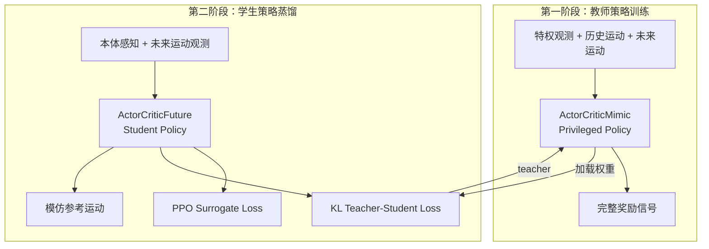
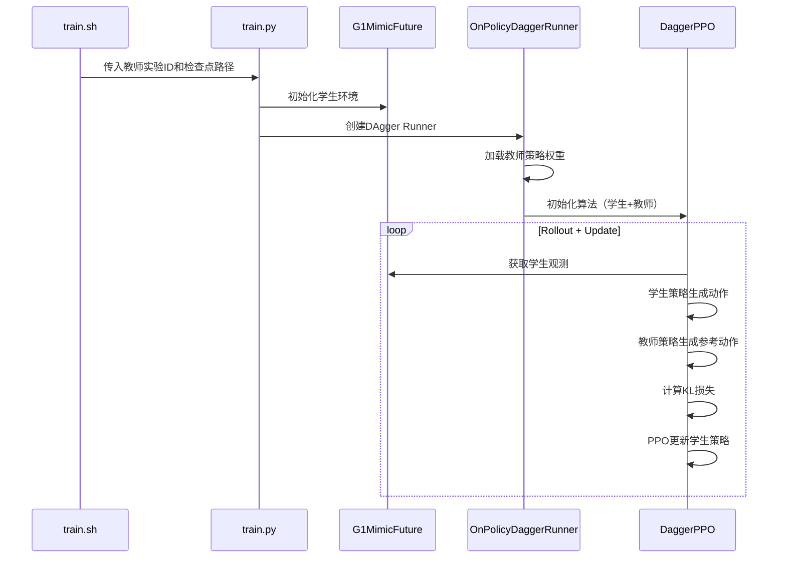

TWIST2 采用师生蒸馏（Teacher-Student Distillation）架构，将拥有privileged信息的教师策略中的知识迁移到轻量化的学生策略中。本文档详细阐述这一两阶段训练范式的设计原理、算法实现和配置参数。

## 1. 蒸馏架构总览

TWIST2 的师生蒸馏基于 DAgger（Dataset Aggregation）思想与 PPO 算法的融合，核心目标是让学生策略在仅有本体感知观测的情况下，习得教师策略基于privileged信息的决策能力。



**核心设计原则**：学生策略不直接访问 privileged 信息（接触力、摩擦系数等），而是通过 KL 散度损失约束其动作分布逼近教师策略，从而间接获取privileged知识。

Sources: [g1_mimic_distill_config.py](legged_gym/legged_gym/envs/g1/g1_mimic_distill_config.py#L1-L549), [on_policy_dagger_runner.py](rsl_rl/rsl_rl/runners/on_policy_dagger_runner.py#L1-L701)

## 2. 观察空间设计

师生策略使用差异化的观察空间，这是蒸馏训练的前提条件。

### 2.1 教师策略观测（Privileged Observations）

教师策略 `ActorCriticMimic` 的观测包含完整的 privileged 信息，支持长时间跨度的未来运动预测：

```python
# g1_mimic_distill_config.py 第 8-10 行
tar_motion_steps_priv = [1, 5, 10, 15, 20, 25, 30, 35, 40, 45,
                         50, 55, 60, 65, 70, 75, 80, 85, 90, 95,]

# 教师特权信息构成
n_priv_info = 3 + 3 + 4 + 3*9 + 2 + 4 + 1 + 2*num_actions
# = 基座线速度(3) + 根高度(3) + 四元数(4) + 关键部位位置(27) + 接触掩码(2) + ...
```

Sources: [g1_mimic_distill_config.py](legged_gym/legged_gym/envs/g1/g1_mimic_distill_config.py#L8-L30)

### 2.2 学生策略观测（Student Observations）

学生策略 `ActorCriticFuture` 的观测结构经过精心设计，移除了 privileged 信息但保留了关键的运动预测能力：

```python
# g1_mimic_future_config.py 第 9-15 行
obs_type = 'student_future'
tar_motion_steps = [0]  # 当前帧
tar_motion_steps_future = [0]  # 未来帧

# 学生观测维度构成
n_mimic_obs_single = 6 + 29  # 根速度xy(2) + 根高度z(1) + roll/pitch(2) + yaw角速度(1) + 关节位置(29)
n_future_obs = len(tar_motion_steps_future) * n_future_obs_single  # 未来运动观测
```

Sources: [g1_mimic_future_config.py](legged_gym/legged_gym/envs/g1/g1_mimic_future_config.py#L9-L30)

### 2.3 观测空间对比

| 观测组件 | 教师策略 | 学生策略 | 差异说明 |
|---------|---------|---------|---------|
| **特权信息** | 完整 privileged info | 无 | 学生无法访问接触力等privileged数据 |
| **未来运动帧** | 95帧跨度 | 可配置 | 学生使用更少未来帧减少信息量 |
| **历史编码** | MotionEncoder CNN | HistoryEncoder | 结构相似，训练数据不同 |
| **本体感知** | 相同 | 相同 | 根速度、关节位置等 |

Sources: [actor_critic_mimic.py](rsl_rl/rsl_rl/modules/actor_critic_mimic.py#L1-L290), [actor_critic_future.py](rsl_rl/rsl_rl/modules/actor_critic_future.py#L1-L499)

## 3. DAgger-PPO 算法实现

### 3.1 损失函数数学形式

TWIST2 的蒸馏算法不是经典的 DAgger 监督学习，而是 PPO 主损失与 KL 正则的混合形式：

$$
L_{\text{total}} = \underbrace{L_{\text{surrogate}}}_{\text{PPO clip}} + \underbrace{c_v L_{\text{value}}}_{\text{Value loss}} - \underbrace{c_e H}_{\text{Entropy}} + \underbrace{\lambda_{\text{dagger}} D_{\text{KL}}(\pi_{\text{student}} \| \pi_{\text{teacher}})}_{\text{Distillation}}
$$

**代码实现关键片段**：

```python
# dagger_ppo.py 第 230-250 行
# KL 散度计算
if self.dagger_coef > 0 and self.teacher_loaded:
    mu_batch_student = mu_batch
    sigma_batch_student = sigma_batch
    with torch.no_grad():
        self.teacher_actor_critic.act(critic_obs_batch)
        mu_batch_teacher = self.teacher_actor_critic.action_mean
        sigma_batch_teacher = self.teacher_actor_critic.action_std
    
    # 高斯分布间的 KL 散度
    kl_teacher_student_loss = kl_divergence(
        mu_batch_student, sigma_batch_student, 
        mu_batch_teacher, sigma_batch_teacher
    )
    kl_teacher_student_loss = kl_teacher_student_loss.mean() * self.dagger_coef
```

其中 KL 散度的计算为：

$$
D_{\text{KL}}(\pi_s \| \pi_t) = \log\left(\frac{\sigma_t}{\sigma_s}\right) + \frac{\sigma_s^2 + (\mu_s - \mu_t)^2}{2\sigma_t^2} - \frac{1}{2}
$$

Sources: [dagger_ppo.py](rsl_rl/rsl_rl/algorithms/dagger_ppo.py#L230-L260)

### 3.2 DAgger 系数退火策略

为防止蒸馏初期学生策略能力不足导致训练不稳定，系统支持 KL 损失系数的退火：

```python
# dagger_ppo.py 第 55-60 行
self.dagger_coef = dagger_coef  # 初始系数
self.dagger_coef_anneal_steps = dagger_coef_anneal_steps  # 退火步数
self.dagger_coef_min = dagger_coef_min  # 最小系数
```

**典型配置**：初始 `dagger_coef=0.1`，在 30000 步内线性退火至 `dagger_coef_min=0.0`，使学生策略逐渐独立。

Sources: [dagger_ppo.py](rsl_rl/rsl_rl/algorithms/dagger_ppo.py#L50-L70)

## 4. 训练流程

### 4.1 训练链路



**关键训练脚本**：

```bash
# train.sh 第 55-70 行
python train.py --task "${task_name}" \
    --teacher_exptid "${teacher_exptid}" \
    --teacher_checkpoint "${teacher_checkpoint}"
```

Sources: [train.sh](train.sh#L55-L70), [on_policy_dagger_runner.py](rsl_rl/rsl_rl/runners/on_policy_dagger_runner.py#L60-L130)

### 4.2 Rollout 阶段

在每个训练迭代中，Runner 执行以下步骤：

1. **动作采样**：学生策略基于当前观测采样动作
2. **环境交互**：执行动作获取奖励和下一个观测
3. **数据存储**：将 (obs, action, reward, value, log_prob, mu, sigma) 存入 RolloutStorage
4. **教师参考**：教师策略在相同 critic_obs 下评估获取参考动作分布

```python
# on_policy_dagger_runner.py 第 420-450 行
for i in range(self.num_steps_per_env):
    # 学生策略产生动作
    actions = self.alg.act(obs, critic_obs, infos, hist_encoding)
    
    # 环境交互
    obs, privileged_obs, rewards, dones, infos = self.env.step(actions)
    critic_obs = privileged_obs if privileged_obs is not None else obs
    
    # 存储转换
    self.alg.process_env_step(rewards, dones, infos)
```

Sources: [on_policy_dagger_runner.py](rsl_rl/rsl_rl/runners/on_policy_dagger_runner.py#L420-L470)

### 4.3 Update 阶段

```python
# dagger_ppo.py 第 155-280 行
def update(self):
    for sample in generator:  # 遍历 mini-batches
        obs_batch, critic_obs_batch, actions_batch, ...
        
        # 前向传播（学生策略）
        _, actions_log_prob_batch, value_batch, mu_batch, sigma_batch, _ = \
            self.actor_critic(obs_batch, critic_obs_batch, actions_batch)
        
        # 前向传播（教师策略，仅评估）
        with torch.no_grad():
            self.teacher_actor_critic.act(critic_obs_batch)
            mu_batch_teacher = self.teacher_actor_critic.action_mean
            sigma_batch_teacher = self.teacher_actor_critic.action_std
        
        # 计算总损失
        loss = surrogate_loss + value_loss_coef * value_loss
        loss += kl_teacher_student_loss * dagger_coef
        
        # 反向传播更新学生策略
        self.optimizer.zero_grad()
        loss.backward()
```

Sources: [dagger_ppo.py](rsl_rl/rsl_rl/algorithms/dagger_ppo.py#L155-L280)

## 5. 网络架构

### 5.1 教师网络：ActorCriticMimic

教师网络使用 MotionEncoder 对多时间步的运动观测进行编码：

```python
# actor_critic_mimic.py 第 55-85 行
class MotionEncoder(nn.Module):
    def __init__(self, activation_fn, input_size, tsteps, output_size):
        # CNN 时序编码器
        if tsteps == 50:
            self.conv_layers = nn.Sequential(
                nn.Conv1d(60, 40, kernel_size=8, stride=4),  # 50→11
                nn.Conv1d(40, 20, kernel_size=5, stride=1),  # 11→7
                nn.Conv1d(20, 20, kernel_size=5, stride=1),  # 7→3
                nn.Flatten()  # 输出 60 维
            )
```

Sources: [actor_critic_mimic.py](rsl_rl/rsl_rl/modules/actor_critic_mimic.py#L55-L100)

### 5.2 学生网络：ActorCriticFuture

学生网络额外包含 FutureMotionEncoder 处理未来运动观测：

```python
# actor_critic_future.py 第 260-350 行
class ActorFuture(nn.Module):
    def __init__(self, ..., num_future_observations, num_future_steps, ...):
        # 未来运动编码器（可选）
        if self.num_single_future_observations > 0:
            self.future_encoder = FutureMotionEncoder(
                activation,
                self.num_single_future_observations - 1,  # -1 扣掉 mask 通道
                self.num_future_steps,
                future_latent_dim,
                attention_heads=future_attention_heads,
                dropout=future_dropout
            )
```

Sources: [actor_critic_future.py](rsl_rl/rsl_rl/modules/actor_critic_future.py#L260-L350)

### 5.3 架构对比

| 组件 | 教师网络 | 学生网络 | 备注 |
|-----|---------|---------|-----|
| **MotionEncoder** | ✓ (tsteps=50) | ✓ (tsteps=1) | 学生仅用当前帧 |
| **HistoryEncoder** | ✓ | ✓ | 结构相同 |
| **FutureMotionEncoder** | ✗ | ✓ (可选) | 学生独有 |
| **Actor Backbone** | MLP | MLP/MoE/Transformer | 可选择不同变体 |
| **Critic Backbone** | MLP | MLP | 价值估计 |

Sources: [actor_critic_future.py](rsl_rl/rsl_rl/modules/actor_critic_future.py#L1300-L1592)

## 6. 配置参数

### 6.1 训练配置 (G1MimicStuFutureCfgDAgger)

```python
# g1_mimic_future_config.py 第 120-180 行
class G1MimicStuFutureCfgDAgger(G1MimicStuFutureCfg):
    class runner:
        policy_class_name = 'ActorCriticFuture'
        algorithm_class_name = 'DaggerPPO'
        runner_class_name = 'OnPolicyDaggerRunner'
        max_iterations = 30_001
        save_interval = 500
        
        teacher_experiment_name = 'test'
        teacher_proj_name = 'g1_priv_mimic'
        teacher_checkpoint = -1
        eval_student = False  # 是否单独评估学生策略

    class algorithm:
        grad_penalty_coef_schedule = [0.00, 0.00, 700, 1000]
        std_schedule = [1.0, 0.4, 4000, 1500]
        entropy_coef = 0.005
```

Sources: [g1_mimic_future_config.py](legged_gym/legged_gym/envs/g1/g1_mimic_future_config.py#L120-L180)

### 6.2 DAgger 算法参数

| 参数 | 默认值 | 说明 |
|-----|-------|------|
| `dagger_coef` | 0.1 | KL 损失系数 |
| `dagger_coef_anneal_steps` | 30000 | 退火步数 |
| `dagger_coef_min` | 0.0 | 最小系数 |
| `desired_kl` | 0.01 | 自适应学习率调整阈值 |
| `grad_penalty_coef_schedule` | [0, 0, 700, 1000] | 梯度惩罚系数调度 |
| `std_schedule` | [1.0, 0.4, 4000, 1500] | 动作标准差退火 |

Sources: [dagger_ppo.py](rsl_rl/rsl_rl/algorithms/dagger_ppo.py#L40-L70)

## 7. 日志与监控

### 7.1 WandB 记录指标

```python
# on_policy_dagger_runner.py 第 520-560 行
wandb_dict = {
    'Loss/value_func': locs['mean_value_loss'],
    'Loss/surrogate': locs['mean_surrogate_loss'],
    'Loss/kl_teacher_student': locs['kl_teacher_student_loss'],
    'Loss/grad_penalty_loss': locs['mean_grad_penalty_loss'],
    'Policy/mean_noise_std': mean_std.item(),
    'Scale/motion_difficulty': locs['mean_motion_difficulty'],
    'Train/mean_reward': statistics.mean(locs['rewbuffer']),
}
```

Sources: [on_policy_dagger_runner.py](rsl_rl/rsl_rl/runners/on_policy_dagger_runner.py#L520-L560)

### 7.2 关键监控指标

| 指标 | 正常范围 | 异常诊断 |
|-----|---------|---------|
| `kl_teacher_student` | 0.01~0.1 | >0.5 表示学生偏离教师过远 |
| `mean_noise_std` | 0.1~0.5 | 过高表示探索过多 |
| `mean_reward` | 随训练递增 | 停滞可能需要调整系数 |

## 8. 启动蒸馏训练

### 8.1 基本命令

```bash
# 训练学生策略，加载教师检查点
bash train.sh \
    1103_student_run \
    cuda:0 \
    false \
    -0.20 \
    -0.05 \
    /path/to/motion.yaml \
    1103_teacher_run \
    -1
```

参数说明：
- `1103_student_run`: 学生实验 ID
- `cuda:0`: GPU 设备
- `1103_teacher_run`: 教师实验 ID（从该实验加载权重）
- `-1`: 使用教师最新检查点

Sources: [train.sh](train.sh#L1-L70)

### 8.2 仅训练学生（无蒸馏）

```bash
# 设置 teacher_exptid 为 "None" 跳过蒸馏
bash train.sh \
    1103_student_rl_only \
    cuda:0 \
    false \
    -0.20 \
    -0.05 \
    /path/to/motion.yaml \
    None \
    -1
```

## 9. 扩展：MoE/Transformer 学生网络

TWIST2 支持多种学生网络架构，通过配置切换：

```python
# g1_mimic_future_config.py
# MoE 版本
class G1MimicStuFutureMoECfg(...)

# Transformer 版本  
class G1MimicStuFutureTrans2xCfg(...)
```

**注册的任务名**：

| 任务名 | 网络架构 | 参数量级 |
|-------|---------|---------|
| `g1_stu_future` | MLP | ~1x |
| `g1_stu_future_moe` | MoE | ~1x |
| `g1_stu_future_trans2x` | Transformer | ~2x |
| `g1_stu_future_trans4x` | Transformer | ~4x |

Sources: [__init__.py](legged_gym/legged_gym/envs/__init__.py#L80-L119), [actor_critic_future.py](rsl_rl/rsl_rl/modules/actor_critic_future.py#L1300-L1592)

---

## 延伸阅读

- [教师策略训练](10-jiao-shi-ce-lue-xun-lian)：了解教师策略如何先于蒸馏阶段独立训练
- [单GPU训练](8-dan-gpuxun-lian)：蒸馏训练的硬件配置建议
- [多GPU分布式训练](9-duo-gpufen-bu-shi-xun-lian)：DDP 模式下的蒸馏训练
- [ONNX模型导出](23-onnxmo-xing-dao-chu)：将训练好的学生策略导出部署