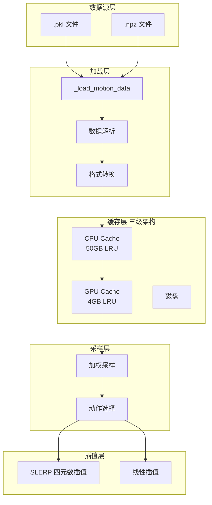

本页面详细介绍 TWIST2 系统中运动数据集的组织格式、存储规范，以及核心组件 MotionLib 动作库的设计架构与实现细节。理解运动数据的结构是掌握整个模仿学习训练流程的基础。

## 1. 运动数据格式规范

TWIST2 的运动数据采用标准化 pickle 格式存储，每个动作文件包含人形机器人完整的状态轨迹信息。

### 1.1 数据结构定义

动作文件以 `.pkl` 或 `.npz` 格式保存，核心数据结构如下：

```python
{
    'fps': float,                    # 帧率，通常为 30 或 60
    'root_pos': np.ndarray,          # 根节点位置 (T, 3)，世界坐标系
    'root_rot': np.ndarray,          # 根节点旋转 (T, 4)，xyzw 格式四元数
    'dof_pos': np.ndarray,           # 关节角度 (T, 29)，G1 机器人 29 自由度
    'local_body_pos': np.ndarray,    # 局部身体位置 (T, 38, 3)，38 个关键点
    'link_body_list': list           # 身体部位名称列表
}
```

**G1 机器人自由度分配**：

| 部位 | 关节数 | 索引范围 | 说明 |
|------|--------|----------|------|
| 左腿 | 6 | 0-5 | hip_pitch/roll/yaw, knee, ankle_pitch/roll |
| 右腿 | 6 | 6-11 | 同左腿镜像 |
| 腰部 | 3 | 12-14 | yaw, roll, pitch |
| 左臂 | 7 | 15-21 | shoulder_pitch/roll/yaw, elbow, wrist_roll/pitch/yaw |
| 右臂 | 7 | 22-28 | 同左臂镜像 |

Sources: [g1_mimic_config.py](legged_gym/legged_gym/envs/g1/g1_mimic_config.py#L45-L65)

**38 个关键点列表**包括头部、颈部、脊柱、髋部、肩部、肘部、手腕、髋关节、膝关节、踝关节等全身部位，用于计算姿态跟踪奖励。

Sources: [g1_mimic.py](legged_gym/legged_gym/envs/g1/g1_mimic.py#L11-L15)

### 1.2 数据验证示例

```python
import pickle
import numpy as np

# 加载并验证动作数据
with open('motion.pkl', 'rb') as f:
    data = pickle.load(f)

print(f"帧率: {data['fps']} fps")
print(f"时长: {data['root_pos'].shape[0] / data['fps']:.2f} 秒")
print(f"帧数: {data['root_pos'].shape[0]}")
print(f"关节维度: {data['dof_pos'].shape[1]}")
print(f"关键点数量: {data['local_body_pos'].shape[1]}")
```

Sources: [example_motions/0807_yanjie_walk_001.pkl](assets/example_motions/0807_yanjie_walk_001.pkl)

## 2. 数据集配置系统

TWIST2 通过 YAML 配置文件管理大规模运动数据集，支持多源数据混合、权重采样和灵活的子集选择。

### 2.1 配置文件格式

```yaml
root_path: /home/huanghao/source/datasets/gmr_retarget_x
motions:
  - file: AMASS_numpy123/ACCAD/A1_Stand_stageii.pkl
    weight: 1
    description: general movement
  - file: v1_v2_v3_g1_numpy123/0807_yanjie_walk_001.pkl
    weight: 10
    description: high quality motion
  - file: pico_numpy123/xxx.pkl
    weight: 30
    description: pico real robot data
```

**核心字段**：

| 字段 | 类型 | 说明 |
|------|------|------|
| `root_path` | string | 数据集根目录 |
| `motions[].file` | string | 相对于 root_path 的文件路径 |
| `motions[].weight` | float | 采样权重，影响被选中的概率 |
| `motions[].description` | string | 动作描述标签 |

Sources: [AMASS_numpy123_w1_OMOMO_numpy123_w1_lafan1_numpy123_w1_twist1_to_twist2_numpy123_w1_v1_v2_v3_g1_numpy123_w20_total35849.yaml](legged_gym/motion_data_configs/AMASS_numpy123_w1_OMOMO_numpy123_w1_lafan1_numpy123_w1_twist1_to_twist2_numpy123_w1_v1_v2_v3_g1_numpy123_w20_total35849.yaml#L1-L15)

### 2.2 数据集生成工具

系统提供自动化工具扫描目录生成配置：

```bash
# 基础用法
python tools/write_motion_data_config.py \
    --dataset-root /path/to/dataset \
    --out legged_gym/motion_data_configs/my_dataset.yaml

# 高级选项：指定子目录、加权、采样
python tools/write_motion_data_config.py \
    --dataset-root /path/to/dataset \
    --subdirs AMASS_numpy123 OMOMO_numpy123 \
    --weight 1.0 \
    --max-files 50000 \
    --shuffle --seed 42 \
    --out legged_gym/motion_data_configs/filtered.yaml
```

Sources: [write_motion_data_config.py](tools/write_motion_data_config.py#L1-L60)

对于混合数据集，系统提供专门脚本支持多源加权配置：

```python
SELECTED_FOLDERS = [
    "AMASS_numpy123",                # AMASS 标准数据集
    "EgoBody_g1_GMR_30fps_numpy123", # EgoBody 数据
    "OMOMO_numpy123",                # OMOMO 数据集
    "interhuman_numpy123",           # InterHuman 数据
    "lafan1_numpy123",               # LaFAN1 数据集
    "pico_numpy123",                 # TWIST2 Pico 真实机器人数据
    "twist1_to_twist2_numpy123",    # TWIST1 迁移数据
    "v1_v2_v3_g1_numpy123",          # V1/V2/V3 G1 内部数据
]

SPECIAL_WEIGHTS = {
    "pico_numpy123": 30,            # 真实机器人数据高权重
    "v1_v2_v3_g1_numpy123": 20,     # 内部高质量数据
}
```

Sources: [gen_twist2_dataset_gmr.py](legged_gym/motion_data_configs/gen_twist2_dataset_gmr.py#L30-L50)

### 2.3 训练配置中的数据集指定

在环境配置类中通过 `motion_file` 字段指定数据集：

```python
class G1MimicDistillCfg(HumanoidMimicCfg):
    class motion:
        motion_file = "legged_gym/motion_data_configs/dataset_mix_8203b425_total328739.yaml"
        max_motions = -1  # -1 表示加载全部
        shuffle_motions = True
        shuffle_seed = 0
```

Sources: [g1_mimic_distill_config.py](legged_gym/legged_gym/envs/g1/g1_mimic_distill_config.py#L1-L20)

## 3. MotionLib 核心架构

MotionLib 是 TWIST2 的核心运动数据管理组件，负责加载、缓存、采样和插值运动数据。

### 3.1 架构设计概览



Sources: [motion_lib_pkl.py](pose/pose/utils/motion_lib_pkl.py#L1-L100)

### 3.2 初始化与加载流程

```python
class MotionLib:
    def __init__(self, motion_file, device,
                 lazy_load=False,
                 cpu_cache_gib=50.0,
                 gpu_cache_gib=4.0,
                 storage_dtype="float32",
                 ...):
        self._device = torch.device(device)
        self._lazy_load = bool(lazy_load)
        self._cpu_cache_gib = float(cpu_cache_gib)
        self._gpu_cache_gib = float(gpu_cache_gib)
        
        # 初始化缓存
        self._init_gpu_cache()
        
        # 加载运动数据
        self._load_motions(motion_file)
```

Sources: [motion_lib_pkl.py](pose/pose/utils/motion_lib_pkl.py#L30-L75)

**加载模式选择**：

| 模式 | `lazy_load` | 启动速度 | 内存占用 | 适用场景 |
|------|-------------|----------|----------|----------|
| 标准模式 | `False` | 慢 | 高 | 小于 50GB 数据集 |
| 延迟加载 | `True` | 快 | 低 | 超大规模数据集 |

Sources: [humanoid_char_config.py](legged_gym/legged_gym/envs/base/humanoid_char_config.py#L280-L290)

### 3.3 帧插值算法

运动数据通过时间戳查询，支持亚帧精度插值：

```python
def _calc_motion_frame(self, motion_id, time):
    """计算指定时间点的运动帧数据"""
    motion_fps = self._motion_fps[motion_id].item()
    num_frames = self._motion_num_frames[motion_id].item()
    
    # 时间边界处理
    time = torch.clamp(time, 0, motion_lengths[motion_id])
    
    # 计算帧索引和插值权重
    frame_idx = (time * motion_fps).long()
    blend = (time * motion_fps) - frame_idx.float()
    
    # 双帧采样
    frame_0 = self._sample_frame(motion_id, frame_idx)
    frame_1 = self._sample_frame(motion_id, frame_idx + 1)
    
    # 插值
    result = lerp(frame_0, frame_1, blend.unsqueeze(-1))
    
    return result
```

Sources: [motion_lib_pkl.py](pose/pose/utils/motion_lib_pkl.py#L700-L800)

**四元数旋转插值**：根节点旋转使用球面线性插值 (SLERP) 避免欧拉角插值的万向锁问题：

```python
from scipy.spatial.transform import Rotation, Slerp
import torch

def slerp(quat0, quat1, blend):
    """四元数球面线性插值"""
    # quat 格式: xyzw
    r0 = Rotation.from_quat(quat0.numpy())
    r1 = Rotation.from_quat(quat1.numpy())
    slerp = Slerp([0, 1], Rotation, [r0, r1])
    return torch.from_numpy(slerp([blend]).as_quat())
```

Sources: [upsample_motion.py](deploy_real/upsample_motion.py#L55-L70)

## 4. 三级缓存系统

MotionLib 实现了 Disk → CPU → GPU 的三级缓存架构，优化大规模运动数据的访问性能。

### 4.1 缓存层次结构

```
┌─────────────────────────────────────────────────────────────────┐
│                     GPU Cache (最快层)                           │
│  ┌─────────────────────────────────────────────────────────┐   │
│  │ 容量: gpu_cache_gib (默认 4GB)                          │   │
│  │ 策略: LRU 驱逐                                           │   │
│  │ 存储: float32 活跃帧数据                                  │   │
│  │ 特点: 非阻塞 CUDA 拷贝                                    │   │
│  └─────────────────────────────────────────────────────────┘   │
└─────────────────────────────────────────────────────────────────┘
                              ▲
                              │ 非阻塞拷贝
                              ▼
┌─────────────────────────────────────────────────────────────────┐
│                     CPU Cache (中间层)                           │
│  ┌─────────────────────────────────────────────────────────┐   │
│  │ 容量: cpu_cache_gib (默认 50GB) 或全量                   │   │
│  │ 策略: LRU 驱逐 (lazy_load 模式)                          │   │
│  │ 存储: float32 或 float16                                │   │
│  └─────────────────────────────────────────────────────────┘   │
└─────────────────────────────────────────────────────────────────┘
                              ▲
                              │ 按需加载
                              ▼
┌─────────────────────────────────────────────────────────────────┐
│                     Disk (最慢层)                                │
│  ┌─────────────────────────────────────────────────────────┐   │
│  │ 格式: .pkl / .npz 文件                                   │   │
│  │ 特点: 容量无限，延迟最高                                  │   │
│  └─────────────────────────────────────────────────────────┘   │
└─────────────────────────────────────────────────────────────────┘
```

Sources: [motion_cache_system.md](note/motion_cache_system.md#L1-L50)

### 4.2 GPU 缓存实现

```python
def _init_gpu_cache(self) -> None:
    """初始化 GPU 缓存"""
    self._gpu_cache_enabled = (
        self._device.type == "cuda"
        and self._store_on_cpu
        and self._gpu_cache_gib > 0.0
    )
    
    if not self._gpu_cache_enabled:
        return
    
    # 计算可缓存帧数
    max_bytes = int(self._gpu_cache_gib * (1024 ** 3))
    bytes_per_frame = self._cache_bytes_per_frame()
    self._cache_max_frames = max(1, max_bytes // bytes_per_frame)
    
    # 预分配 GPU 内存
    self._cache_root_pos = torch.empty(
        (self._cache_max_frames, 3), device=self._device, dtype=torch.float32
    )
    self._cache_root_rot = torch.empty(
        (self._cache_max_frames, 4), device=self._device, dtype=torch.float32
    )
    # ... 其他张量
```

Sources: [motion_cache_system.md](note/motion_cache_system.md#L80-L110)

**单帧内存占用估算**：

| 数据项 | 维度 | float32 字节 | float16 字节 |
|--------|------|--------------|--------------|
| root_pos | (3,) | 12 | 6 |
| root_rot | (4,) | 16 | 8 |
| root_vel | (3,) | 12 | 6 |
| root_ang_vel | (3,) | 12 | 6 |
| dof_pos | (29,) | 116 | 58 |
| dof_vel | (29,) | 116 | 58 |
| local_body_pos | (38, 3) | 456 | 228 |
| root_pos_delta | (3,) | 12 | 6 |
| root_rot_delta | (3,) | 12 | 6 |
| **总计** | | **~764** | **~382** |

Sources: [motion_cache_system.md](note/motion_cache_system.md#L320-L360)

### 4.3 CPU LRU 缓存实现

```python
from collections import OrderedDict

class MotionLib:
    def _ensure_motion_loaded(self, motion_id: int):
        """确保运动数据已加载到 CPU 缓存"""
        if motion_id in self._cpu_motion_cache:
            # 标记为最近使用
            self._cpu_motion_cache.move_to_end(motion_id, last=True)
            return
        
        # 从磁盘加载
        data = self._load_motion_on_demand(motion_id)
        
        # 计算大小
        size_bytes = sum(
            t.element_size() * t.numel()
            for t in data.values() if isinstance(t, torch.Tensor)
        )
        
        # LRU 驱逐
        while (self._cpu_cache_bytes_used + size_bytes > self._cpu_cache_max_bytes
               and self._cpu_motion_cache):
            evict_id, _ = self._cpu_motion_cache.popitem(last=False)
            self._cpu_cache_bytes_used -= self._motion_sizes[evict_id]
        
        # 添加到缓存
        self._cpu_motion_cache[motion_id] = data
        self._cpu_cache_bytes_used += size_bytes
```

Sources: [motion_lib_pkl.py](pose/pose/utils/motion_lib_pkl.py#L350-L400)

### 4.4 缓存配置建议

| 数据集规模 | lazy_load | gpu_cache_gib | cpu_cache_gib | storage_dtype |
|-----------|-----------|---------------|---------------|---------------|
| 小于 50GB | `False` | 4.0 | - | `float32` |
| 50-200GB | `False` | 8.0 | - | `float16` |
| 超大 200GB+ | `True` | 8.0 | 100.0 | `float16` |

Sources: [motion_cache_system.md](note/motion_cache_system.md#L380-L410)

## 5. 周期重采样模式

对于超大规模数据集，系统支持周期性重采样模式，只在 GPU 上保留部分动作的活跃数据。

### 5.1 重采样模式架构

```python
class MotionLib:
    def enable_resample_mode(self, num_motions: int, resample_interval: int):
        """启用周期重采样模式"""
        self._resample_mode = True
        self._resample_interval = resample_interval
        
        # 随机采样子集
        sampled_ids = self._sample_motion_subset(num_motions)
        self._load_subset_to_gpu(sampled_ids)
```

Sources: [motion_lib_pkl.py](pose/pose/utils/motion_lib_pkl.py#L2300-L2350)

### 5.2 异步重采样

```python
def check_and_resample_async(self, current_iteration: int):
    """异步重采样检查"""
    if current_iteration > 0 and current_iteration % self._async_resample_interval == 0:
        if self._async_resample_ready_event.is_set():
            # 使用预加载数据快速切换
            self._switch_to_next_subset_async()
            return True
    return False
```

Sources: [motion_lib_pkl.py](pose/pose/utils/motion_lib_pkl.py#L2580-L2610)

## 6. 数据预处理工具

### 6.1 帧率上采样

将 30fps 动作数据插值到 60fps：

```bash
python deploy_real/upsample_motion.py \
    --input motion_001.pkl \
    --output motion_001_60fps.pkl \
    --target_fps 60
```

```python
# 插值策略
def upsample_motion(pkl_path, output_path, target_fps=60):
    # root_pos: 三次样条插值
    interp_func = interp1d(t_src, root_pos, kind='cubic')
    root_pos_new = interp_func(t_tgt)
    
    # root_rot: 球面线性插值 (SLERP)
    rotations = R.from_quat(root_rot)  # xyzw
    slerp = Slerp(t_src, rotations)
    root_rot_new = slerp(t_tgt).as_quat()
    
    # dof_pos: 三次样条插值
    # local_body_pos: 三次样条插值
```

Sources: [upsample_motion.py](deploy_real/upsample_motion.py#L1-L80)

### 6.2 NumPy 版本兼容转换

解决 NumPy 2.x 生成的数据与 NumPy 1.x 环境的兼容问题：

```bash
# 转换为 .npz 格式
python convert_pkl_to_npz.py /path/to/motion/folder
```

Sources: [convert_pkl_to_npz.py](convert_pkl_to_npz.py#L1-L60)

### 6.3 跨格式数据迁移

支持从 PHC 格式数据集提取缺失的 AMASS 数据：

```python
# 将 BioMotionLab、BMLhandball、TCD_handMocap 转换为 TWIST2 格式
python tools/extract_phc_missing_amass_to_twist2_stageii.py \
    --phc-dataset /path/to/phc/data.joblib \
    --output-dir /path/to/twist2/stageii/ \
    --source BMLrub  # 指定数据源
```

Sources: [extract_phc_missing_amass_to_twist2_stageii.py](tools/extract_phc_missing_amass_to_twist2_stageii.py#L1-L100)

## 7. 动作难度评估系统

系统提供基于教师模型的动作难度评估工具，用于筛选和清理数据集。

### 7.1 难度评估指标

| 指标 | 说明 | 权重影响 |
|------|------|----------|
| `completion_rate` | 完成率 | 越高越简单 |
| `avg_joint_error` | 平均关节误差 | 越大越难 |
| `avg_pose_error` | 平均姿态误差 | 越大越难 |
| `difficulty_score` | 综合难度分数 | 无硬上限 |

Sources: [dataset_difficulty_evaluation_guide.md](note/dataset_difficulty_evaluation_guide.md#L40-L80)

### 7.2 难度分数计算

```python
def calculate_difficulty_score(metrics):
    # 基础分数：完成率越低，分数越高
    base_score = (1 - metrics.completion_rate) * 100
    
    # 关节误差惩罚
    joint_penalty = np.sqrt(metrics.avg_joint_error) * 15
    
    # 姿态误差惩罚
    pose_penalty = np.sqrt(metrics.avg_pose_error) * 10
    
    # 稳定性惩罚
    stability_penalty = 0
    if metrics.max_roll > 10:
        stability_penalty += (metrics.max_roll - 10) ** 1.5 * 0.5
    if metrics.max_pitch > 10:
        stability_penalty += (metrics.max_pitch - 10) ** 1.5 * 0.5
    
    # 综合分数
    difficulty_score = base_score + joint_penalty + pose_penalty + stability_penalty
    return difficulty_score
```

Sources: [dataset_difficulty_evaluation_guide.md](note/dataset_difficulty_evaluation_guide.md#L80-L120)

### 7.3 评估工具使用

```bash
python legged_gym/legged_gym/scripts/evaluate_motion_difficulty.py \
    --task g1_priv_mimic \
    --checkpoint /path/to/model.pt \
    --motion_config legged_gym/motion_data_configs/my_dataset.yaml \
    --output difficulty_scores.csv \
    --device cuda:0 \
    --num_envs 4096
```

Sources: [dataset_difficulty_evaluation_guide.md](note/dataset_difficulty_evaluation_guide.md#L150-L180)

## 8. 环境集成

### 8.1 环境配置中的运动数据

```python
class G1MimicCfg(HumanoidMimicCfg):
    class motion:
        # 数据集配置
        motion_file = "legged_gym/motion_data_configs/my_dataset.yaml"
        max_motions = -1
        shuffle_motions = True
        shuffle_seed = 0
        
        # 关键身体部位
        key_bodies = ['torso', 'head', 'upper_arm', 'lower_arm', 
                      'thigh', 'shank', 'foot']
        
        # 内存优化
        lazy_load = False
        gpu_cache_gib = 4.0
        cpu_cache_gib = 50.0
        storage_dtype = "float32"
```

Sources: [g1_mimic_config.py](legged_gym/legged_gym/envs/g1/g1_mimic_config.py#L1-L50)

### 8.2 观察空间构建

```python
def _get_mimic_obs(self):
    """构建模仿学习观察"""
    num_steps = self._tar_motion_steps_priv.shape[0]
    
    # 获取目标时间点
    motion_times = self._get_motion_times().unsqueeze(-1)
    obs_times = self._tar_motion_steps_priv * self.dt + motion_times
    
    # 从 MotionLib 获取运动帧
    root_pos, root_rot, root_vel, root_ang_vel, dof_pos, dof_vel, body_pos, \
        root_pos_delta, root_rot_delta = self._motion_lib.calc_motion_frame(
            motion_ids_tiled, obs_motion_times
        )
    
    # 组合观察
    mimic_obs = torch.cat([
        root_pos[..., 0:3],  # 3维
        roll, pitch, yaw,    # 3维
        root_vel,            # 3维
        root_ang_vel,        # 3维
        dof_pos,             # 29维
    ], dim=-1)
    
    return mimic_obs
```

Sources: [g1_mimic.py](legged_gym/legged_gym/envs/g1/g1_mimic.py#L45-L80)

## 9. 下一步学习

完成本页面后，建议继续学习以下内容：

- **[两层级控制架构](5-liang-ceng-ji-kong-zhi-jia-gou)**：理解运动库如何与策略网络协作
- **[G1模仿环境配置](19-g1mo-fang-huan-jing-pei-zhi)**：深入配置运动相关的环境参数
- **[观察空间与奖励设计](20-guan-cha-kong-jian-yu-jiang-li-she-ji)**：了解运动数据如何转化为 RL 观察
- **[单GPU训练](8-dan-gpuxun-lian)**：开始使用运动数据进行训练