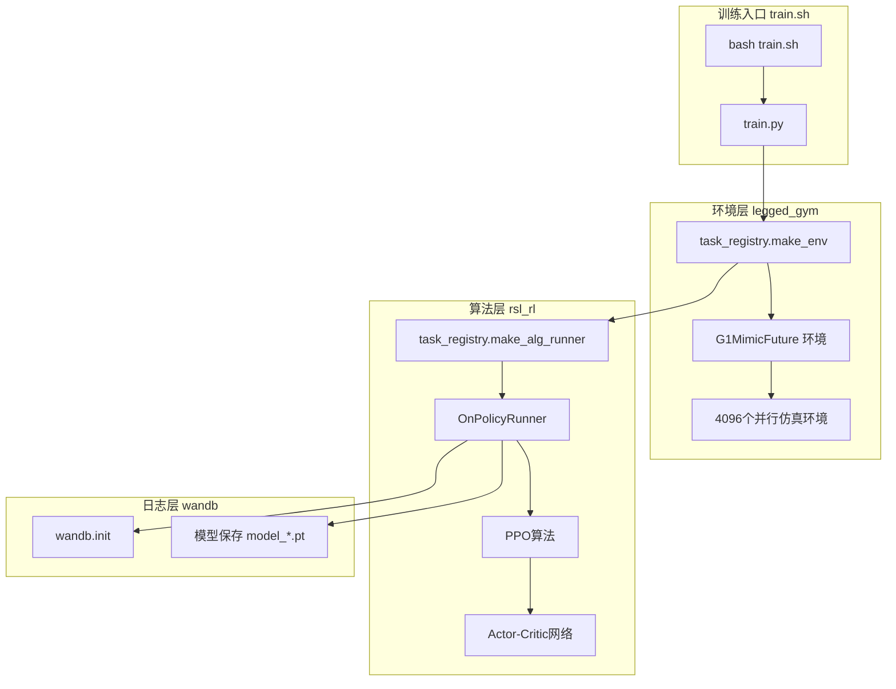
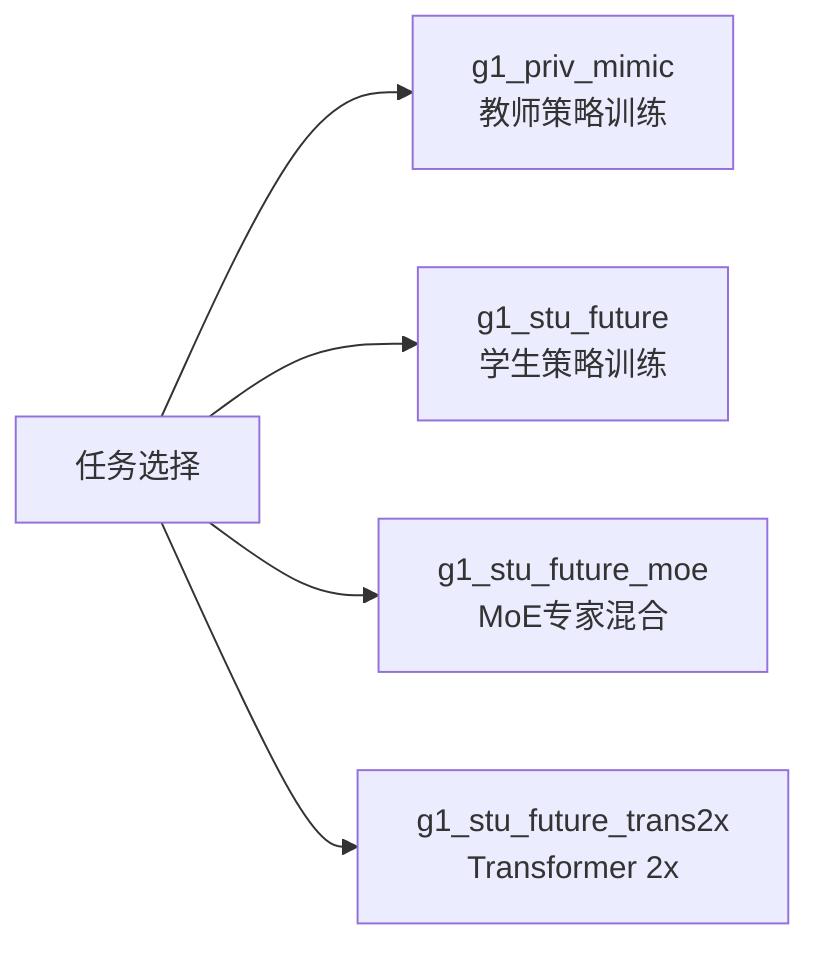

本文档介绍如何在TWIST2项目中进行单GPU训练。单GPU训练是入门级开发者最常用的训练方式，适合模型开发、快速迭代和算法验证阶段。

## 训练架构概述

TWIST2的单GPU训练基于Isaac Gym仿真环境与PPO强化学习算法的结合。整个训练流程包含三个核心组件：环境仿真、策略网络训练和实验日志管理。



训练脚本通过`task_registry`统一管理环境和算法注册，根据传入的任务名称动态创建对应的训练环境与PPO runner实例。 Sources: [train.sh](train.sh#L1-L70), [task_registry.py](legged_gym/legged_gym/gym_utils/task_registry.py#L1-L100)

## 快速启动

### 基本命令

单GPU训练的最简启动命令如下：

```bash
bash train.sh <实验ID> <设备> [选项...]
```

**示例**：使用第一块GPU训练学生策略，实验ID为`1103_twist2`：

```bash
bash train.sh 1103_twist2 cuda:0
```

该命令将使用默认配置启动训练，包括150000次迭代、无Anti-Shuffle奖励机制。

### 完整参数说明

| 参数 | 说明 | 默认值 |
|------|------|--------|
| `实验ID` | 实验唯一标识，用于日志和模型保存 | 必填 |
| `设备` | CUDA设备，如`cuda:0`、`cuda:7` | 必填 |
| `--enable_anti_shuffle_reward` | 启用Anti-Shuffle奖励（抑制小碎步） | false |
| `--motion_yaml` | 自定义数据集配置文件路径 | 内置默认 |
| `--teacher_exptid` | 教师策略实验ID（用于蒸馏） | None |
| `--teacher_checkpoint` | 教师策略检查点编号 | -1（最新） |

Sources: [train.sh](train.sh#L20-L70), [helpers.py](legged_gym/legged_gym/gym_utils/helpers.py#L366-L450)

## 训练任务类型

TWIST2支持多种训练任务，通过`--task`参数指定：



| 任务名称 | 用途 | 观测类型 |
|----------|------|----------|
| `g1_priv_mimic` | 教师策略训练 | 私有privileged观测 |
| `g1_stu_future` | 学生策略基础训练 | 公开可观测 |
| `g1_stu_future_moe` | 专家混合学生策略 | 公开可观测 |
| `g1_stu_future_trans2x` | 2倍参数Transformer | 公开可观测 |
| `g1_stu_future_diffusion` | 扩散模型学生策略 | 公开可观测 |

Sources: [__init__.py](legged_gym/legged_gym/envs/__init__.py#L50-L119)

## 训练流程详解

### 初始化阶段

训练启动后，`train.py`依次执行以下初始化操作：

```python
# 1. 解析命令行参数
args = get_args()

# 2. 设置分布式环境（单GPU时跳过）
_setup_distributed(args)  # 返回 (False, 0, 0, 1)

# 3. 创建日志目录
log_pth = LEGGED_GYM_ROOT_DIR + "/logs/{project}/{exptid}"

# 4. 初始化wandb
wandb.init(entity="far-wandb", project="twist", name=exptid)

# 5. 创建仿真环境
env, _ = task_registry.make_env(name=args.task, args=args)

# 6. 创建PPO训练器
ppo_runner, train_cfg = task_registry.make_alg_runner(...)
```

单GPU训练时，`_setup_distributed`函数检测到`WORLD_SIZE=1`后直接返回，不进行任何分布式相关设置。 Sources: [train.py](legged_gym/legged_gym/scripts/train.py#L35-L175)

### 并行环境配置

G1人形机器人的训练使用4096个并行仿真环境，充分利用单GPU的计算能力：

```python
class G1MimicStuFutureCfg:
    class env:
        num_envs = 4096          # 并行环境数量
        num_actions = 29          # 关节动作维度
        decimation = 10           # 控制频率降采样
        episode_length_s = 10    # 回合时长（秒）
```

观测空间包含多层特征：

```python
n_proprio = 3 + 2 + 3*num_actions        # 本体感觉特征
n_mimic_obs = len(tar_motion_steps) * 35 # 模仿观测特征
n_priv_info = 47                         # 私有信息特征
num_observations = n_priv_obs_single     # 总观测维度
```

Sources: [g1_mimic_distill_config.py](legged_gym/legged_gym/envs/g1/g1_mimic_distill_config.py#L1-L150)

### PPO训练循环

核心训练逻辑在`OnPolicyRunner.learn_RL`中实现：

```python
# 每个迭代包含两个阶段：
# 1. 数据采集（Rollout）
for i in range(num_steps_per_env):
    actions = self.alg.act(obs, critic_obs, infos, hist_encoding)
    obs, rewards, dones, infos = self.env.step(actions)
    self.alg.process_env_step(rewards, dones, infos)

# 2. 策略更新（Learning）
mean_value_loss, mean_surrogate_loss = self.alg.update()
```

关键超参数：

```python
class LeggedRobotCfgPPO:
    class algorithm:
        learning_rate = 2.e-4
        num_learning_epochs = 5
        num_mini_batches = 4
        gamma = 0.99
        lam = 0.95
        clip_param = 0.2
        entropy_coef = 0.01
```

Sources: [on_policy_runner.py](rsl_rl/rsl_rl/runners/on_policy_runner.py#L150-L250), [legged_robot_config.py](legged_gym/legged_gym/envs/base/legged_robot_config.py#L320-L380)

### 模型保存策略

训练过程中模型按照迭代次数动态保存：

```python
if it <= 2500:
    save_interval = 1   # 保存间隔：1次
elif it <= 10000:
    save_interval = 2   # 保存间隔：2次
else:
    save_interval = 5   # 保存间隔：5次

if it % save_interval == 0:
    self.save(os.path.join(log_dir, f'model_{it}.pt'))
```

模型保存路径：`logs/{project}/{exptid}/model_{iteration}.pt`

Sources: [on_policy_runner.py](rsl_rl/rsl_rl/runners/on_policy_runner.py#L280-L290)

## 实战示例

### 示例1：基础学生策略训练

```bash
# 激活环境
source ~/miniconda3/etc/profile.d/conda.sh
conda activate twist2
export LD_LIBRARY_PATH=$LD_LIBRARY_PATH:$CONDA_PREFIX/lib

# 启动训练
bash train.sh 1103_twist2 cuda:0
```

### 示例2：启用Anti-Shuffle奖励

当检测到机器人出现小碎步（step shuffle）问题时，启用Anti-Shuffle奖励机制：

```bash
bash train.sh 1103_twist2_as cuda:0 true -0.20 -0.05
```

参数说明：
- `true`：启用Anti-Shuffle奖励
- `-0.20`：步态切换率奖励权重（负值抑制频繁切换）
- `-0.05`：支撑脚速度奖励权重（负值抑制支撑脚移动）

### 示例3：教师-学生蒸馏训练

```bash
# 1. 首先训练教师策略
bash train_teacher.sh 1103_teacher cuda:0

# 2. 然后用教师指导学生训练
bash train.sh 1103_student cuda:0 false -0.20 -0.05 \
    "" \
    1103_teacher -1
```

Sources: [train.sh](train.sh#L1-L70), [train_teacher.sh](train_teacher.sh#L1-L46)

## 调试模式

开发阶段可使用调试模式快速验证代码：

```bash
bash train.sh debug_test cuda:0 --debug
```

调试模式特性：

| 配置项 | 正常模式 | 调试模式 |
|--------|----------|----------|
| 并行环境数 | 4096 | 4 |
| 环境网格 | 自动计算 | rows=10, cols=5 |
| Wandb日志 | 在线记录 | 禁用 |
| 可视化 | 无头模式 | 启用GUI |

Sources: [train.py](train.py#L122-L128)

## 常见问题排查

| 问题现象 | 可能原因 | 解决方案 |
|----------|----------|----------|
| 训练卡在环境创建 | 运动数据文件缺失 | 检查`motion.motion_file`配置 |
| CUDA out of memory | 并行环境数过多 | 减少`num_envs`或增大GPU |
| Wandb连接失败 | 网络问题 | 使用`--no_wandb`禁用日志 |
| 奖励异常下降 | 学习率过高 | 降低`learning_rate` |
| 关节抖动 | 动作幅度过大 | 调整`action_scale` |

## 输出产物

训练完成后，`logs/{project}/{exptid}/`目录下包含：

```
logs/
├── g1_stu_future/
│   └── 1103_twist2/
│       ├── model_0.pt       # 第0次迭代模型
│       ├── model_500.pt     # 第500次迭代模型
│       ├── ...
│       ├── model_150000.pt  # 最终模型
│       └── wandb/           # Wandb缓存目录
```

## 下一步学习

完成单GPU训练后，可以继续探索：

- **[多GPU分布式训练](9-duo-gpufen-bu-shi-xun-lian)**：利用多卡加速大规模训练
- **[教师策略训练](10-jiao-shi-ce-lue-xun-lian)**：学习如何训练教师专家策略
- **[学生策略蒸馏](11-xue-sheng-ce-lue-zheng-liu)**：掌握知识蒸馏技术
- **[训练脚本与参数](12-xun-lian-jiao-ben-xiang-jie)**：深入理解训练配置细节