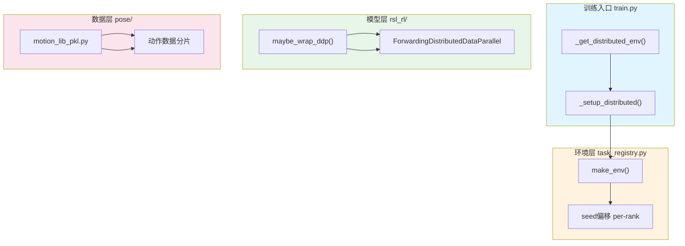

TWIST2项目基于RSL-RL框架实现了完整的多GPU分布式训练支持，采用PyTorch原生的**DistributedDataParallel (DDP)** 方案实现数据并行训练。本文档详细介绍分布式训练的架构设计、启动方式、关键实现机制以及常见问题排查。

## 架构总览

TWIST2的分布式训练架构分为四个层次，协同完成多GPU训练任务：



### DDP核心概念

| 概念 | 含义 | 在TWIST2中的作用 |
|------|------|------------------|
| **World Size** | 总进程数 | 通常等于GPU数量 |
| **Rank** | 全局进程ID | 0~world_size-1 |
| **Local Rank** | 单机内进程ID | 用于GPU绑定 |
| **Master (Rank 0)** | 主进程 | 负责日志记录和模型保存 |
| **Process Group** | 通信组 | NCCL backend实现梯度同步 |

Sources: [train.py](legged_gym/legged_gym/scripts/train.py#L38-L56), [note/ddp_tutorial.md](note/ddp_tutorial.md#L29-L40)

## 启动方式

### 单机多卡训练

使用`torchrun`命令启动分布式训练，TWIST2自动通过环境变量读取分布式配置：

```bash
# 2卡训练
torchrun --nproc_per_node=2 \
    legged_gym/legged_gym/scripts/train.py \
    --task g1_stu_future \
    --num_envs 4096 \
    --exptid ddp_2gpu_test

# 4卡训练
torchrun --nproc_per_node=4 \
    --master_port=29501 \
    legged_gym/legged_gym/scripts/train.py \
    --task g1_stu_future \
    --num_envs 4096 \
    --exptid ddp_4gpu_test
```

### torchrun自动设置的变量

```bash
# 进程0: RANK=0, LOCAL_RANK=0, WORLD_SIZE=4
# 进程1: RANK=1, LOCAL_RANK=1, WORLD_SIZE=4
# 进程2: RANK=2, LOCAL_RANK=2, WORLD_SIZE=4
# 进程3: RANK=3, LOCAL_RANK=3, WORLD_SIZE=4
```

### 多机训练配置

对于多台机器的集群训练，需要指定主节点地址和端口：

```bash
# 主节点 (192.168.1.100)
torchrun --nnodes=2 --nproc_per_node=4 \
    --node_rank=0 \
    --master_addr=192.168.1.100 \
    --master_port=29500 \
    legged_gym/legged_gym/scripts/train.py \
    --task g1_stu_future \
    --num_envs 8192

# 从节点 (192.168.1.101)
torchrun --nnodes=2 --nproc_per_node=4 \
    --node_rank=1 \
    --master_addr=192.168.1.100 \
    --master_port=29500 \
    legged_gym/legged_gym/scripts/train.py \
    --task g1_stu_future \
    --num_envs 8192
```

Sources: [note/ddp_tutorial.md](note/ddp_tutorial.md#L480-L520)

## 核心实现机制

### 1. 环境变量检测

在`train.py`中，`_get_distributed_env()`函数负责从`torchrun`设置的环境变量读取分布式信息：

```python
def _get_distributed_env():
    """从 torchrun 设置的环境变量中读取分布式信息"""
    def _get_int(name: str, default: int) -> int:
        val = os.environ.get(name, None)
        if val is None:
            return default
        try:
            return int(val)
        except ValueError:
            return default
    
    world_size = _get_int("WORLD_SIZE", 1)  # 总进程数
    rank = _get_int("RANK", 0)              # 全局进程ID
    local_rank = _get_int("LOCAL_RANK", 0)  # 本地进程ID
    
    enabled = world_size > 1
    return enabled, rank, local_rank, world_size
```

Sources: [train.py](legged_gym/legged_gym/scripts/train.py#L38-L56)

### 2. 进程组初始化

`_setup_distributed()`函数负责初始化PyTorch分布式进程组：

```python
def _setup_distributed(args):
    enabled, rank, local_rank, world_size = _get_distributed_env()
    if not enabled:
        return False, 0, 0, 1  # 单卡模式
    
    # GPU绑定
    torch.cuda.set_device(local_rank)
    device = f"cuda:{local_rank}"
    args.device = device
    args.sim_device = device
    args.rl_device = device
    
    # 初始化进程组 (NCCL后端)
    if not torch.distributed.is_initialized():
        torch.distributed.init_process_group(
            backend="nccl",           # GPU通信后端
            init_method="env://",     # 从环境变量读取配置
            rank=rank,
            world_size=world_size
        )
    
    # 配置辅助工具
    from rsl_rl.utils import utils as rsl_dist_utils
    rsl_dist_utils.global_mp_device = device
```

Sources: [train.py](legged_gym/legged_gym/scripts/train.py#L60-L95)

### 3. 模型DDP包装

TWIST2实现了自定义的`ForwardingDistributedDataParallel`包装器，解决标准DDP的属性转发问题：

```python
class ForwardingDistributedDataParallel(torch.nn.parallel.DistributedDataParallel):
    """自定义DDP包装器，转发未定义的属性到内部模型"""
    
    def __getattr__(self, name):
        try:
            return super().__getattr__(name)
        except AttributeError:
            return getattr(self.module, name)

def maybe_wrap_ddp(model, device, find_unused_parameters=True):
    if not (torch.distributed.is_available() and 
            torch.distributed.is_initialized()):
        return model  # 单卡模式
    
    if torch.distributed.get_world_size() <= 1:
        return model
    
    return ForwardingDistributedDataParallel(
        model,
        device_ids=[local_rank],
        output_device=local_rank,
        find_unused_parameters=find_unused_parameters,
    )
```

Sources: [utils.py](rsl_rl/rsl_rl/utils/utils.py#L129-L158)

### 4. 随机种子偏移

每个Rank使用不同的随机种子，保证数据多样性：

```python
# task_registry.py
try:
    import torch.distributed as dist
    if dist.is_available() and dist.is_initialized():
        env_cfg.seed = int(env_cfg.seed) + int(dist.get_rank())
except Exception:
    pass
set_seed(env_cfg.seed)
```

- **Rank 0**: seed = 42 + 0 = 42
- **Rank 1**: seed = 42 + 1 = 43
- **Rank 2**: seed = 42 + 2 = 44
- **Rank 3**: seed = 42 + 3 = 45

Sources: [task_registry.py](legged_gym/legged_gym/gym_utils/task_registry.py#L105-L112)

### 5. 动作数据分片

在多GPU训练时，动作库数据采用Stride分片策略：

```python
# pose/utils/motion_lib_pkl.py
if world_size > 1 and not self._skip_ddp_sharding:
    rank = dist.get_rank()
    
    # 确保每个rank至少有1个动作
    if len(motion_list) < world_size:
        repeats = (world_size + len(motion_list) - 1) // len(motion_list)
        motion_list = (motion_list * repeats)[:world_size]
    
    # Strided sharding: rank, rank+W, rank+2W, ...
    motion_list = motion_list[rank::world_size]
```

**分片示例** (10个动作，4个Rank)：

```
动作列表:    [m0, m1, m2, m3, m4, m5, m6, m7, m8, m9]
Strided分片:
  Rank 0:   [m0, m4, m8]
  Rank 1:   [m1, m5, m9]
  Rank 2:   [m2, m6]      (仅2个)
  Rank 3:   [m3, m7]      (仅2个)
```

Sources: [motion_lib_pkl.py](pose/pose/utils/motion_lib_pkl.py#L1895-L1922)

### 6. 梯度同步工具

TWIST2在`rsl_rl/utils/utils.py`中实现了完整的分布式规约工具：

```python
def reduce_sum(x):
    return reduce_all(x, torch.distributed.ReduceOp.SUM)

def reduce_mean(x):
    n = get_num_procs()
    sum_x = reduce_sum(x)
    return sum_x / n

def reduce_all(x, op):
    if not enable_mp():
        return x
    
    is_tensor = torch.is_tensor(x)
    if is_tensor:
        buffer = x.clone()
    else:
        buffer = torch.tensor(x, device=get_device())
    
    torch.distributed.all_reduce(buffer, op=op)
    
    if not is_tensor:
        buffer = buffer.item()
    return buffer
```

Sources: [utils.py](rsl_rl/rsl_rl/utils/utils.py#L220-L270)

## 训练流程与日志管理

### 主进程日志控制

只有Rank 0进程执行日志记录，避免重复输出：

```python
is_dist, rank, _, _ = _get_distributed_env()
is_root = (not is_dist) or rank == 0

if is_root:
    wandb.init(project="twist", name=args.exptid, mode=mode)

if root_only and self.log_dir is not None:
    self.log(locals())
    if it % self.save_interval == 0:
        self.save(os.path.join(self.log_dir, 'model_{}.pt'.format(it)))
```

Sources: [train.py](legged_gym/legged_gym/scripts/train.py#L116-L125), [on_policy_runner.py](rsl_rl/rsl_rl/runners/on_policy_runner.py#L269-L277)

### 检查点保存

模型保存仅在主进程执行：

```python
if root_only and self.log_dir is not None:
    if it <= 2500:
        if it % self.save_interval == 0:
            self.save(...)
    elif it <= 10000:
        if it % (2*self.save_interval) == 0:
            self.save(...)
    else:
        if it % (5*self.save_interval) == 0:
            self.save(...)
```

Sources: [on_policy_runner.py](rsl_rl/rsl_rl/runners/on_policy_runner.py#L278-L290)

## 环境变量调优

针对NCCL后端的性能优化：

```bash
# 单机多卡优化
export NCCL_P2P_DISABLE=0     # 启用GPU直连
export NCCL_IB_DISABLE=1      # 禁用InfiniBand(单机不需要)
export NCCL_TIMEOUT=2400      # 通信超时时间(秒)

# 完整启动示例
NCCL_TIMEOUT=2400 torchrun --nproc_per_node=4 \
    --master_port=29501 \
    legged_gym/legged_gym/scripts/train.py \
    --task g1_stu_future \
    --num_envs 4096 \
    --exptid ddp_4gpu_optimized
```

Sources: [train_moe.sh](train_moe.sh#L54), [note/ddp_tutorial.md](note/ddp_tutorial.md#L700-L720)

## 常见问题排查

### 问题诊断表

| 现象 | 可能原因 | 解决方案 |
|------|----------|----------|
| 进程卡住不动 | 集体通信操作未在所有rank执行 | 检查所有rank是否都执行`all_reduce`等操作 |
| 梯度不同步 | 未使用`DistributedSampler` | 检查数据加载器配置 |
| OOM错误 | 每个GPU加载完整数据集 | 减小`num_envs`，或检查数据分片 |
| 速度无提升 | 通信开销大于计算 | 使用更大`num_envs`，启用梯度累积 |
| WandB重复记录 | 所有rank都在记录 | 使用`if rank == 0`条件判断 |

### 验证DDP生效

```bash
# 查看GPU利用率
watch -n 1 nvidia-smi

# 期望输出(4卡训练):
# GPU 0: 95% memory, 90% utilization
# GPU 1: 95% memory, 90% utilization  
# GPU 2: 95% memory, 90% utilization
# GPU 3: 95% memory, 90% utilization

# 如果只有GPU 0在工作 → DDP未启用!
```

Sources: [note/ddp_tutorial.md](note/ddp_tutorial.md#L860-L880)

## 性能基准

### 扩展性参考

| GPU数量 | 典型FPS提升 | 备注 |
|---------|-------------|------|
| 1→2 | ~1.8x | 通信开销约10% |
| 1→4 | ~3.5x | 需要足够大的`num_envs` |
| 1→8 | ~6.5x | 多机需要网络优化 |

### 推荐配置

```bash
# 小规模实验 (调试)
torchrun --nproc_per_node=2 legged_gym/legged_gym/scripts/train.py \
    --task g1_stu_future --num_envs 2048 --exptid debug_2gpu

# 正式训练 (4卡)
torchrun --nproc_per_node=4 legged_gym/legged_gym/scripts/train.py \
    --task g1_stu_future --num_envs 4096 --exptid train_4gpu

# 大规模训练 (8卡，多机)
torchrun --nnodes=2 --nproc_per_node=4 \
    --master_addr=192.168.1.100 --master_port=29500 \
    legged_gym/legged_gym/scripts/train.py \
    --task g1_stu_future --num_envs 8192 --exptid train_8gpu
```

Sources: [note/ddp_tutorial.md](note/ddp_tutorial.md#L800-L860)

## 后续学习路径

完成多GPU分布式训练配置后，建议继续学习：

- **[单GPU训练](8-dan-gpuxun-lian)** - 了解基础训练流程和参数配置
- **[教师策略训练](10-jiao-shi-ce-lue-xun-lian)** - 掌握教师模型的分布式训练
- **[训练脚本详解](12-xun-lian-jiao-ben-xiang-jie)** - 深入理解训练参数和配置选项